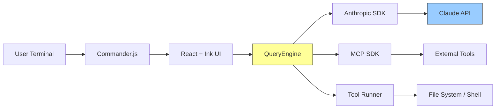
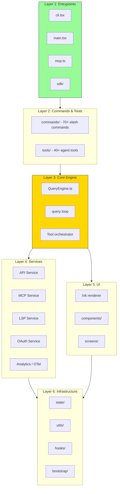
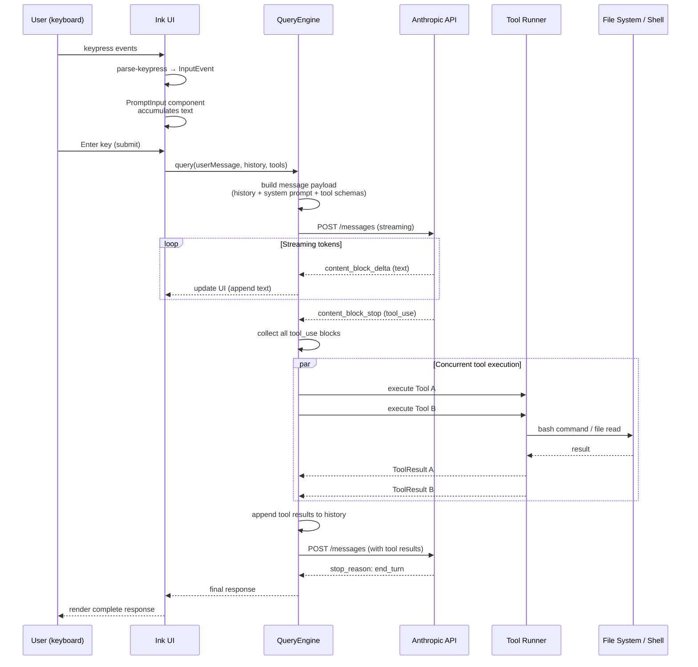

# Chapter 1: Project Overview & Architecture

> **Difficulty:** Beginner | **Reading time:** ~45 minutes

---

## Table of Contents

1. [What is Claude Code?](#1-what-is-claude-code)
2. [Tech Stack Deep Dive](#2-tech-stack-deep-dive)
3. [Architecture Overview](#3-architecture-overview)
4. [Directory Structure Walkthrough](#4-directory-structure-walkthrough)
5. [Key Design Patterns](#5-key-design-patterns)
6. [Data Flow: From User Input to Response](#6-data-flow-from-user-input-to-response)
7. [Hands-on Build: mini-claude Scaffolding](#7-hands-on-build-mini-claude-scaffolding)
8. [Source Code Exercises](#8-source-code-exercises)
9. [What's Next](#9-whats-next)

---

## 1. What is Claude Code?

Claude Code is Anthropic's official AI-powered CLI assistant for software engineering. It runs in your terminal, reads your codebase, edits files, executes shell commands, and coordinates multiple sub-agents to tackle complex tasks — all through a conversational interface.

### Core Capabilities

| Capability | Description |
|---|---|
| File editing | Read, write, and patch files using tree-sitter-aware diffing |
| Command execution | Run shell commands, test suites, build pipelines |
| Code search | Semantic and regex search via ripgrep integration |
| Multi-agent coordination | Spawn and orchestrate parallel sub-agent sessions |
| IDE integration | Bridge protocol connecting to VS Code and JetBrains |
| MCP tools | Extensible tool system via Model Context Protocol |

### Why Study Its Source Code?

Claude Code is one of the most sophisticated production CLI tools built on AI infrastructure. Studying it teaches you:

- **Real-world AI agent architecture** — how a production system manages conversation state, tool calls, and streaming responses
- **Large TypeScript codebase organization** — ~512K lines across ~1900 files, with strict module boundaries enforced by ESLint
- **Terminal UI engineering** — how React's component model maps to terminal rendering via Ink
- **Performance engineering for CLI tools** — parallel prefetch, lazy loading, dead code elimination through feature flags
- **Authentication and security** — OAuth 2.0, JWT, macOS Keychain integration in a CLI context

---

## 2. Tech Stack Deep Dive

Understanding *why* each technology was chosen is as important as knowing *what* was chosen.

### 2.1 Bun — Runtime & Bundler

[Bun](https://bun.sh) replaces both Node.js and webpack/esbuild in this project.

**Why Bun over Node.js?**

```
Node.js startup: ~50-80ms cold start
Bun startup:     ~5-10ms cold start
```

For a CLI tool invoked hundreds of times a day, this matters enormously. But the more critical benefit is the **`feature()` macro** — a compile-time dead code elimination mechanism:

```typescript
// In source code
if (feature('ENABLE_VOICE_INPUT')) {
  // This entire branch is removed at build time if flag is false
  await loadVoiceModule()
}
```

At bundle time, Bun replaces `feature('ENABLE_VOICE_INPUT')` with `true` or `false` based on build configuration, and then standard minification eliminates the dead branch. This keeps the production binary lean while allowing feature-gated development.

**Key Bun APIs used:**
- `Bun.file()` — zero-copy file reading
- `bun:bundle` — production bundling with macro support
- `Bun.serve()` — local HTTP server for OAuth callbacks

### 2.2 TypeScript — Strict Mode Throughout

The entire codebase runs with `strict: true` in `tsconfig.json`. This means:

- No implicit `any`
- Strict null checks (every nullable value must be handled)
- Strict function types

This discipline across 512K lines is what makes the codebase navigable — you can trust that types are accurate.

### 2.3 React + Ink — Terminal UI

This is the most unusual tech choice. React renders to the DOM in a browser — but here it renders to the terminal.

[Ink](https://github.com/vadimdemedes/ink) intercepts React's reconciler and instead of creating DOM nodes, it writes ANSI escape codes to stdout. Claude Code goes further: it ships a **custom Ink renderer** in `src/ink/` to handle:

- Streaming text output (tokens arriving continuously from the API)
- Dynamic layout recalculation as content grows
- Efficient diffing to minimize terminal redraws

The key insight: React's component model — state, effects, hooks, memoization — is just as useful for building terminal UIs as web UIs. You get the same declarative patterns:

```tsx
// A simplified example of how a tool result is rendered
function ToolResultMessage({ result }: { result: ToolResult }) {
  if (result.type === 'error') {
    return <Text color="red">{result.error}</Text>
  }
  return <Text color="green">{result.output}</Text>
}
```

### 2.4 Commander.js — CLI Argument Parsing

[Commander.js](https://github.com/tj/commander.js) handles the initial CLI interface — parsing `--flags`, positional arguments, and routing to subcommands. It's the entry point before the interactive session begins.

```
claude --model claude-opus-4-5 --resume <session-id> "explain this codebase"
       ─────────────────────── ─────────────────────── ──────────────────────
       Commander flag           Commander option         Positional arg
```

### 2.5 Zod v4 — Schema Validation

[Zod](https://zod.dev) is used pervasively for validating:

- Tool input/output schemas (the JSON schemas Claude uses to call tools)
- API response shapes
- Configuration file contents
- User settings

The v4 migration brought performance improvements critical for a tool that validates many schemas on startup.

```typescript
// Tool input schema defined with Zod
const BashToolInput = z.object({
  command: z.string().describe('The shell command to execute'),
  timeout: z.number().optional().describe('Timeout in milliseconds'),
  workingDir: z.string().optional(),
})
```

### 2.6 MCP SDK — Model Context Protocol

[MCP](https://modelcontextprotocol.io) is Anthropic's open protocol for connecting AI models to external tools and data sources. Claude Code acts as both:

- An **MCP client** — connecting to external MCP servers (databases, APIs, custom tools)
- An **MCP server** — exposing its own tools to other systems

The SDK handles the JSON-RPC 2.0 communication layer, capability negotiation, and tool schema exchange.

### 2.7 Anthropic SDK — API Communication

The [`@anthropic-ai/sdk`](https://github.com/anthropic/anthropic-sdk-node) handles:

- Streaming message responses (critical for real-time token display)
- Automatic retries with exponential backoff
- Request/response type safety

```typescript
// Simplified streaming interaction
const stream = await anthropic.messages.stream({
  model: 'claude-opus-4-5',
  messages: conversationHistory,
  tools: availableTools,
})

for await (const chunk of stream) {
  // Each chunk updates the terminal UI in real time
  handleStreamChunk(chunk)
}
```

### Tech Stack Summary



---

## 3. Architecture Overview

Claude Code is organized into six conceptual layers. Understanding these layers is the mental model you'll use throughout this series.



### Layer 1: Entrypoints

The application has multiple entry points for different modes of operation:

| File | Purpose |
|---|---|
| `src/main.tsx` | Primary interactive CLI entry point |
| `src/entrypoints/cli.tsx` | Commander.js setup, argument parsing |
| `src/entrypoints/mcp.ts` | Run as an MCP server (for IDE integration) |
| `src/entrypoints/sdk/` | Programmatic API for embedding Claude Code |

### Layer 2: Commands & Tools

Two distinct concepts that beginners often conflate:

- **Commands** (`src/commands/`) — slash commands typed by the *user* in the chat interface (e.g., `/help`, `/clear`, `/compact`). These are 70+ user-facing interactions.
- **Tools** (`src/tools/`) — functions that *Claude* (the AI) can invoke autonomously during a task (e.g., `BashTool`, `ReadFileTool`, `GlobTool`). These are the "hands" of the agent.

### Layer 3: Core Engine

The heart of the system. `QueryEngine.ts` manages:

1. Building the message payload (conversation history + system prompt + tool schemas)
2. Calling the Anthropic API (streaming)
3. Processing `tool_use` blocks in responses
4. Executing tools concurrently
5. Feeding tool results back to the API
6. Looping until `stop_reason === 'end_turn'`

### Layer 4: Services

External integrations, each isolated behind a clean interface:

- **API Service** — Anthropic API client management, rate limiting, model selection
- **MCP Service** — connects to user-configured MCP servers
- **LSP Service** — Language Server Protocol for IDE-quality code navigation
- **OAuth Service** — user authentication flow
- **Analytics** — OpenTelemetry spans + gRPC export for internal telemetry

### Layer 5: UI

Everything the user sees. The custom Ink renderer in `src/ink/` provides the rendering pipeline. Components in `src/components/` build the chat interface, tool output display, and status indicators.

### Layer 6: Infrastructure

Foundational utilities that all layers depend on:

- **`src/state/`** — Global application state (singleton pattern)
- **`src/utils/`** — Pure utility functions
- **`src/hooks/`** — React hooks wrapping state and services
- **`src/bootstrap/`** — Initialization sequence (critically: this module has strict import constraints)

---

## 4. Directory Structure Walkthrough

Here is the full `src/` directory with importance ratings. Start with ⭐⭐⭐ files when exploring.

```
src/
├── main.tsx               ⭐⭐⭐  CLI primary entry — bootstrap + React render root
├── commands.ts            ⭐⭐⭐  Slash command registry
├── tools.ts               ⭐⭐⭐  Agent tool registry
├── Tool.ts                ⭐⭐⭐  Tool type definitions (the "contract" for all tools)
├── QueryEngine.ts         ⭐⭐⭐  LLM query loop — the core agent loop
│
├── entrypoints/           ⭐⭐⭐  Multiple entry points
│   ├── cli.tsx            Commander.js setup
│   ├── mcp.ts             MCP server mode
│   └── sdk/               Programmatic embedding API
│
├── commands/              ⭐⭐⭐  70+ slash commands
│   ├── help.ts
│   ├── clear.ts
│   ├── compact.ts
│   ├── config.ts
│   └── ... (70+ more)
│
├── tools/                 ⭐⭐⭐  40+ agent tools
│   ├── BashTool/
│   │   ├── index.ts       Tool implementation
│   │   └── prompt.md      Tool description for the AI
│   ├── ReadFileTool/
│   ├── WriteFileTool/
│   ├── GlobTool/
│   ├── GrepTool/
│   └── ... (35+ more)
│
├── components/            ⭐⭐   140+ React components for terminal UI
│   ├── Chat/              Main chat interface
│   ├── ToolResult/        Tool output rendering
│   ├── StatusBar/         Bottom status line
│   └── ...
│
├── services/              ⭐⭐   External service integrations
│   ├── api.ts             Anthropic API client
│   ├── mcp.ts             MCP client manager
│   ├── lsp.ts             Language server protocol
│   └── oauth.ts           Authentication service
│
├── ink/                   ⭐⭐   Custom Ink terminal renderer
│   ├── renderer.ts        Core rendering pipeline
│   └── ...
│
├── hooks/                 ⭐⭐   React hooks
│   ├── useQuery.ts        Main query hook
│   ├── useTools.ts        Tool management
│   └── ...
│
├── state/                 ⭐⭐   Global state management
│   └── index.ts           Singleton state store
│
├── types/                 ⭐⭐   TypeScript type definitions
│   ├── message.ts         Message types
│   ├── tool.ts            Tool result types
│   └── ...
│
├── utils/                 ⭐⭐   Utility functions
│   ├── fs.ts              File system helpers
│   ├── terminal.ts        Terminal size / capabilities
│   └── ...
│
├── bootstrap/             ⭐    Application initialization
│   └── state.ts           Global singleton setup
│
├── coordinator/           ⭐    Multi-agent orchestration
│   └── index.ts           Sub-agent spawning + communication
│
├── plugins/               ⭐    Plugin system
│   └── loader.ts          Dynamic plugin loading
│
├── skills/                ⭐    Skill system (reusable prompt templates)
│   └── index.ts
│
├── tasks/                 ⭐    Task management (TodoWrite/TodoRead)
│   └── index.ts
│
├── remote/                ⭐    Remote execution support
│   └── index.ts
│
├── bridge/                ⭐    IDE bridge (VS Code / JetBrains)
│   └── index.ts
│
├── voice/                 ⭐    Voice input (feature-flagged)
│   └── index.ts
│
└── vim/                   ⭐    Vim keybinding mode
    └── index.ts
```

### Key Takeaways — Directory Structure

- The ⭐⭐⭐ files form the "critical path" — master these first
- Each tool lives in its own directory with both code and its AI prompt description co-located
- Feature-flagged subsystems (`voice/`, `vim/`) are isolated in their own directories, making them easy to include or exclude at build time

---

## 5. Key Design Patterns

Five patterns appear repeatedly throughout the codebase. Understanding them early will make reading any file much easier.

### 5.1 Parallel Prefetch

**Problem:** CLI tools feel slow when they do initialization work serially.

**Solution:** Start expensive async operations the moment the module is imported — before any code has explicitly requested the result.

```typescript
// src/main.tsx — top-level module scope (not inside a function!)
import { startMdmRawRead } from './utils/mdm'
import { startKeychainPrefetch } from './services/keychain'
import { preconnectAnthropicApi } from './services/api'

// These fire immediately when the module loads
startMdmRawRead()          // Reads MDM config from macOS system
startKeychainPrefetch()    // Warms up Keychain access
preconnectAnthropicApi()   // Establishes TCP+TLS to api.anthropic.com
```

By the time the user finishes typing their first prompt, the TCP handshake with the API is already complete. This shaves ~200-400ms off first-response latency.

**Key insight:** ES module evaluation is synchronous top-to-bottom, but the *async operations* you fire at module load time run concurrently with subsequent synchronous initialization.

### 5.2 Lazy Loading

**Problem:** Importing everything eagerly makes startup slow.

**Solution:** Use `load()` callbacks and dynamic imports to defer work until it's actually needed.

```typescript
// Command registration — the command module is NOT loaded until first use
registry.register({
  name: 'compact',
  description: 'Compact conversation history',
  load: () => import('./commands/compact'),  // Dynamic import
})

// Tool schema — Zod schema is not constructed until first tool call
const bashTool = buildTool({
  name: 'bash',
  lazySchema: () => z.object({             // Schema built on first access
    command: z.string(),
    timeout: z.number().optional(),
  }),
  call: async (input) => { /* ... */ },
})
```

This means the startup path is lean: Commander.js parses arguments, the essential bootstrap runs, and the React UI renders — all before any command or tool module is loaded.

### 5.3 Dead Code Elimination via Feature Flags

**Problem:** Experimental features should not ship to production users, but maintaining separate builds is complex.

**Solution:** Bun's `feature()` macro combined with standard dead code elimination.

```typescript
import { feature } from 'bun:bundle'

// At bundle time: feature('VOICE_INPUT') → true or false
// If false, the entire if-block is eliminated from the output bundle
if (feature('VOICE_INPUT')) {
  const { VoiceInputModule } = await import('./voice')
  await VoiceInputModule.initialize()
}
```

The production build has zero bytes of voice code if `VOICE_INPUT` is disabled. No runtime overhead, no conditional checks at runtime.

### 5.4 Self-contained Tool Modules

**Problem:** As tools proliferate (40+), how do you keep them organized and ensure each one has accurate AI-facing documentation?

**Solution:** Each tool is a self-contained directory with implementation and description co-located.

```
tools/BashTool/
├── index.ts      ← Tool implementation (Zod schema + call function)
└── prompt.md     ← Natural language description loaded into system prompt
```

```typescript
// The tool factory pattern (simplified)
export const BashTool = buildTool({
  name: 'Bash',
  description: readFileSync('./prompt.md', 'utf8'),  // Description from file
  inputSchema: BashToolInput,                         // Zod schema
  
  call: async ({ command, timeout }) => {
    const result = await executeShellCommand(command, { timeout })
    return formatToolResult(result)
  },
  
  ...TOOL_DEFAULTS,  // Shared defaults (timeout, retries, etc.)
})
```

This pattern means you can add a new tool by:
1. Creating a new directory under `tools/`
2. Writing `index.ts` with the schema and implementation
3. Writing `prompt.md` with the AI-facing description
4. Registering it in `tools.ts`

### 5.5 Bootstrap Isolation

**Problem:** Global singletons (state, config) need to be initialized early, but importing application code creates circular dependencies.

**Solution:** The `bootstrap/` directory is a strictly isolated module. An ESLint rule enforces that nothing in `bootstrap/` can import from application layers.

```typescript
// src/bootstrap/state.ts
// This module ONLY imports from node builtins and third-party packages
// ESLint rule: no-restricted-imports prevents importing from src/

import { EventEmitter } from 'events'
import type { Config } from '../types/config'  // Types only (erased at runtime)

export const globalState = new EventEmitter()
export let config: Config | null = null
export function setConfig(c: Config) { config = c }
```

The dependency graph is strictly one-directional:
```
bootstrap/ → (nothing from src/)
utils/     → bootstrap/
services/  → utils/, bootstrap/
commands/  → services/, utils/
tools/     → services/, utils/
main.tsx   → everything
```

### Key Takeaways — Design Patterns

- Parallel prefetch and lazy loading are complementary: prefetch what you *know* you'll need; lazy-load what you *might* need
- Feature flags via `feature()` macros are a zero-cost abstraction — they disappear entirely at build time
- Self-contained tool modules make the 40+ tools manageable by keeping related code together
- Bootstrap isolation prevents the "everything imports everything" problem that plagues large codebases

---

## 6. Data Flow: From User Input to Response

Let's trace the complete journey of a user message through the system.



### The Query Loop in Detail

The `QueryEngine` runs an **agentic loop** — a pattern at the heart of all modern AI agents:

```
┌─────────────────────────────────────────┐
│           AGENTIC LOOP                  │
│                                         │
│  1. Build payload (messages + tools)    │
│  2. Call API (streaming)                │
│  3. If response has tool_use:           │
│     a. Execute all tools (concurrent)   │
│     b. Append results to history        │
│     c. GOTO 1                           │
│  4. If stop_reason == 'end_turn':       │
│     a. Return final response            │
│     b. EXIT LOOP                        │
└─────────────────────────────────────────┘
```

This loop can run many iterations for complex tasks. For example, "refactor this module" might require:
1. Reading the current file (ReadFile tool)
2. Reading related files (multiple ReadFile calls)
3. Running tests to understand what's passing (Bash tool)
4. Writing the refactored code (WriteFile tool)
5. Running tests again to verify (Bash tool)
6. Returning the summary to the user

Each of those steps is one iteration of the loop.

### Key Takeaways — Data Flow

- The agentic loop is the fundamental pattern: send → receive → act → repeat
- Tool calls are executed *concurrently* (Promise.all), not sequentially
- Streaming is handled throughout — the UI updates token-by-token, not response-by-response
- The entire conversation history is sent on every API call (this is how Claude maintains context)

---

## 7. Hands-on Build: mini-claude Scaffolding

Starting from this chapter, you'll build `mini-claude` — a working AI coding assistant that mirrors the real Claude Code architecture. Each chapter adds a new module. By the end, you'll have a fully functional CLI AI assistant.

**This chapter's goal:** Set up the project scaffolding and define the core type system. The demo should pass TypeScript compilation.

### 7.1 Initialize the Project

```bash
cd demo
bun install
```

Project structure after this chapter:

```
demo/
├── main.ts              # Entry point (currently: type validation)
├── package.json
├── tsconfig.json
└── types/
    ├── index.ts          # Unified type exports
    ├── message.ts        # Message & content block types
    ├── tool.ts           # Tool interface types
    ├── permissions.ts    # Permission types
    └── config.ts         # Configuration types
```

**Key Configuration Choices:**

- `package.json` sets `"type": "module"` to enable ESModules. Bun natively supports ESModules, which is also the future direction of the Node.js ecosystem.
- `tsconfig.json` sets `module` to `"ESNext"` with `moduleResolution: "bundler"`, so TypeScript understands Bun's module resolution strategy.
- `strict: true` enables TypeScript strict mode — matching the real Claude Code configuration. Strict mode eliminates implicit `any` and enforces `null`/`undefined` handling. While it requires more type annotations upfront, it catches a large class of bugs at compile time.
- `target` is set to `"ESNext"` because Bun runs TypeScript directly without downlevel compilation, allowing use of the latest JavaScript syntax features.

### 7.2 Message Types: The Data Foundation

Open `demo/types/message.ts`. This is the data foundation of the entire system.

**Core Design: Discriminated Unions**

Claude Code's message system uses TypeScript discriminated unions — the `type` field distinguishes different message and content block types:

```typescript
// Content blocks: individual "pieces" of an AI response
export type ContentBlock = TextBlock | ToolUseBlock | ToolResultBlock;

// Messages: individual entries in conversation history
export type Message = UserMessage | AssistantMessage | SystemMessage;
```

**StopReason Controls the Agentic Loop**

```typescript
export type StopReason = "end_turn" | "tool_use" | "max_tokens";
```

- `end_turn`: AI considers the task complete → loop exits
- `tool_use`: AI needs a tool → wait for result, continue loop
- `max_tokens`: Output hit length limit → may need to continue

### 7.3 Tool Types: Abstracting Capabilities

Open `demo/types/tool.ts`. The Tool interface is Claude Code's most important abstraction:

```typescript
export interface Tool {
  name: string;            // AI references tools by name
  description: string;     // Tells AI when to use this tool
  inputSchema: JSONSchema; // Parameter format (sent to API)
  call(input): Promise<ToolResult>;  // Execution logic
  isReadOnly?: boolean;    // Affects concurrency strategy
}
```

The `isReadOnly` flag directly affects tool orchestration: read-only tools run concurrently, write tools run serially.

### 7.4 Permission Types: Safety Foundation

Open `demo/types/permissions.ts`. Three core permission behaviors:

```typescript
export type PermissionBehavior = "allow" | "deny" | "ask";
```

Every tool call is checked before execution: allow (proceed), deny (reject with message to AI), or ask (prompt the user).

### 7.5 Verify the Type System

```bash
cd demo
bun run typecheck   # TypeScript type checking
bun run main.ts     # Run entry file to verify at runtime
```

### Common Issues

**Q: `Cannot find module './types/index.js'`**
A: Make sure you ran `bun install` inside the `demo/` directory. Bun runs TypeScript directly — the `.js` extension is the standard ESModule import convention.

**Q: Type checking errors like `Type 'xxx' is not assignable`**
A: Verify that `tsconfig.json` has `strict: true` enabled. In strict mode, TypeScript disallows implicit `any`.

### 7.6 Mapping to Real Claude Code

| Demo File | Real Claude Code | What's Simplified |
|-----------|-----------------|-------------------|
| `types/message.ts` | `src/types/message.ts` | Omits ProgressMessage, AttachmentMessage, TombstoneMessage |
| `types/tool.ts` | `src/Tool.ts` | From 30+ fields to 5 core fields, no Zod validation |
| `types/permissions.ts` | `src/types/permissions.ts` | Omits ML classifier, additional working directories |
| `types/config.ts` | Spread across many files | Unified into a single config object |

---

## 8. Source Code Exercises

The best way to internalize this chapter is to explore the codebase directly.

### Exercise 1: Count Files and Lines by Directory

Write a script that counts files and lines of code in each top-level `src/` subdirectory, sorted by line count. This gives you a data-driven view of where the code complexity lives.

Reference: `examples/01-overview/project-structure.ts`

**Expected output:**
```
Directory          Files    Lines
────────────────────────────────
components/          142    48392
tools/                87    22104
commands/             71    18847
utils/                54    12931
services/             23     8443
...
```

**What to observe:** The `components/` directory is the largest — terminal UI is surprisingly complex. The `tools/` and `commands/` directories together account for the most *logic* files.

### Exercise 2: Build a Module Dependency Graph

Write a script that:
1. Scans all TypeScript files in `src/`
2. Parses their `import` statements
3. Builds a directed graph of module dependencies
4. Outputs the graph as Mermaid or GraphViz DOT format

Reference: `examples/01-overview/dependency-graph.ts`

**What to look for:**
- Does `bootstrap/` have any imports from application modules? (It shouldn't)
- Which modules are most depended-upon? (These are your "core abstractions")
- Are there circular dependencies? (There shouldn't be — the architecture prevents them)

### Exercise 3: Enumerate Feature Flags

Find all uses of `feature('...')` in the codebase and compile:
1. The flag name
2. The file(s) where it appears
3. What functionality it gates

**Hint:** Search for `feature\(` using a regex grep.

**Expected findings:** You should find flags for voice input, experimental UI modes, beta tool behaviors, and platform-specific features. This gives you a map of "what's in development."

---

## 9. What's Next

This chapter accomplished two things:

1. **Understanding the big picture:** Claude Code's tech stack, six-layer architecture, design patterns, and data flow
2. **Building the scaffolding:** Created the mini-claude project with message, tool, and permission type definitions

**Chapter 2: Tool Interface & Tool Registry**

With the type foundation in place, the next step is making tools "come alive":

- Implement the `buildTool()` factory function — define new tools with minimal code
- Create a tool registry — manage all available tools with name-based lookup
- Implement three real tools: **BashTool** (execute shell commands), **FileReadTool** (read files), **GrepTool** (search code)
- Implement `toolToAPIFormat()` to convert tools into Anthropic API format

After completing Chapter 2, run `bun run main.ts` and you'll see tools actually executing commands and returning results.

---

*Chapter 1 of the Learn Claude Code series. Source repository: [anthhub/claude-code](https://github.com/anthhub/claude-code)*

*Demo code for this chapter: `demo/types/` directory*
