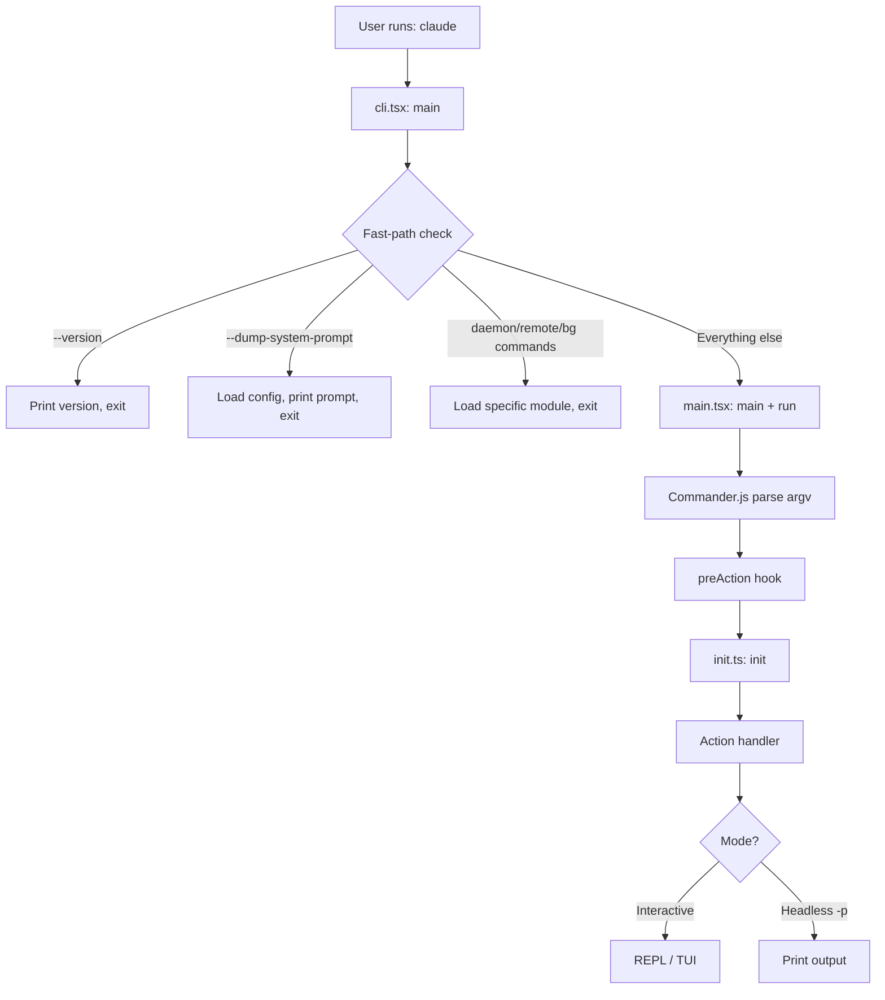
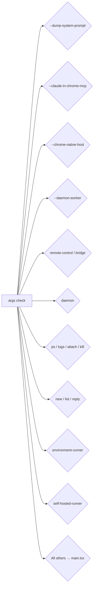
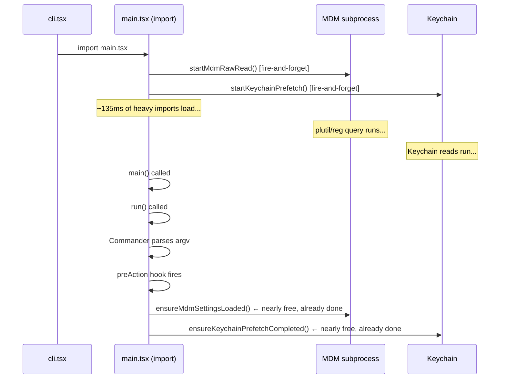
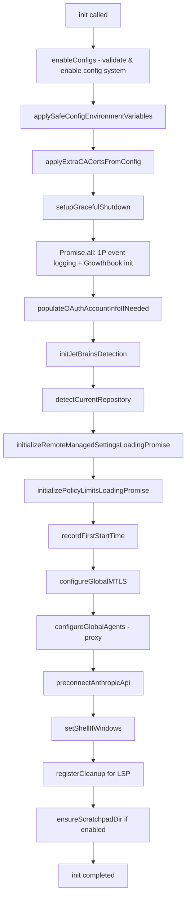
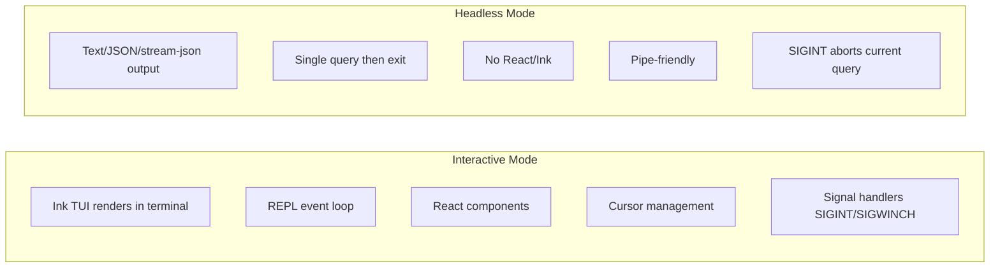

# Chapter 2: CLI Entrypoint & Startup

## Table of Contents

1. [Introduction](#1-introduction)
2. [The Entrypoint Architecture](#2-the-entrypoint-architecture)
3. [Fast-Path Dispatch in cli.tsx](#3-fast-path-dispatch-in-clitsx)
4. [The main.tsx Startup Sequence](#4-the-maintsx-startup-sequence)
5. [Core Initialization (init.ts)](#5-core-initialization-initts)
6. [Bootstrap State Isolation](#6-bootstrap-state-isolation)
7. [Interactive vs Headless Mode](#7-interactive-vs-headless-mode)
8. [Startup Performance Optimization](#8-startup-performance-optimization)
9. [Hands-on: Build a Simple CLI](#9-hands-on-build-a-simple-cli)
10. [Key Takeaways & What's Next](#10-key-takeaways--whats-next)

---

## 1. Introduction

When you type `claude` in your terminal, what happens in the next few hundred milliseconds determines the entire user experience. A slow startup feels sluggish; a fast one feels professional. Claude Code's CLI entrypoint is a carefully engineered piece of software that minimizes time-to-first-output through several key techniques:

- **Fast-path dispatch**: special flags like `--version` return instantly with zero module loading
- **Parallel prefetch**: MDM reads and keychain lookups start before any other imports
- **Memoized initialization**: the `init()` function runs exactly once, no matter how many times it's called
- **Dead code elimination (DCE)**: feature flags like `feature('DUMP_SYSTEM_PROMPT')` are evaluated at build time, so unreleased features add zero cost to external builds

**Learning objectives for this chapter:**

By the end of this chapter, you will understand:
- How Claude Code's multi-entrypoint architecture works
- Why `cli.tsx` exists separately from `main.tsx`
- How the fast-path dispatch pattern avoids loading heavy modules for simple commands
- How `init.ts` uses `memoize` to ensure single-initialization guarantees
- What `bootstrap/state.ts` is and why it enforces strict isolation rules
- The difference between interactive and headless execution modes
- Multiple startup performance optimization techniques

---

## 2. The Entrypoint Architecture

Claude Code is not a simple single-file CLI. It has **multiple entrypoints** serving different use cases:

```
src/
├── entrypoints/
│   ├── cli.tsx        ← Main CLI entrypoint (fast-path dispatcher)
│   ├── init.ts        ← Core initialization logic
│   ├── mcp.ts         ← MCP server entrypoint
│   └── sdk/           ← Agent SDK entrypoints
├── main.tsx           ← Commander.js full CLI definition
└── bootstrap/
    └── state.ts       ← Global singleton state
```

The key insight is that `cli.tsx` is a **lightweight dispatcher** that sits in front of the heavy `main.tsx`. This separation exists for performance: if you just want the version number, there's no reason to load all of Commander.js, React, and dozens of other modules.



### Why not just one file?

The separation of `cli.tsx` and `main.tsx` reflects a fundamental trade-off: **load time vs. feature completeness**.

`main.tsx` is a 4,683-line file that imports Commander.js, React, Ink, and dozens of services at the top level. All those imports take time to evaluate — typically 100-200ms on a cold start.

`cli.tsx`, by contrast, starts with just a handful of lines. The `--version` fast-path (lines 37-42) runs **without importing a single external module**:

```typescript
// src/entrypoints/cli.tsx:37-42
if (args.length === 1 && (args[0] === '--version' || args[0] === '-v' || args[0] === '-V')) {
  // MACRO.VERSION is inlined at build time
  console.log(`${MACRO.VERSION} (Claude Code)`);
  return;
}
```

`MACRO.VERSION` is a build-time constant — it's literally replaced with a string like `"1.2.3"` by the bundler. This is the fastest possible version check.

---

## 3. Fast-Path Dispatch in cli.tsx

The entire purpose of `cli.tsx` is to handle special cases before the expensive `main.tsx` gets loaded. Let's trace each fast-path:

### 3.1 Environment Setup (Lines 1-26)

Before anything else, `cli.tsx` sets up the environment:

```typescript
// src/entrypoints/cli.tsx:5
process.env.COREPACK_ENABLE_AUTO_PIN = '0';
```

This prevents Corepack from adding `yarnpkg` to users' `package.json` files — a real-world bug that affected many users.

```typescript
// src/entrypoints/cli.tsx:9-14
if (process.env.CLAUDE_CODE_REMOTE === 'true') {
  const existing = process.env.NODE_OPTIONS || '';
  process.env.NODE_OPTIONS = existing 
    ? `${existing} --max-old-space-size=8192` 
    : '--max-old-space-size=8192';
}
```

For remote/container environments (CCR), the V8 heap is bumped to 8GB. This must happen before Node.js evaluates any module, because the heap size is fixed at startup.

The `feature('ABLATION_BASELINE')` block (lines 21-26) is particularly interesting:

```typescript
// src/entrypoints/cli.tsx:21-26
if (feature('ABLATION_BASELINE') && process.env.CLAUDE_CODE_ABLATION_BASELINE) {
  for (const k of ['CLAUDE_CODE_SIMPLE', 'CLAUDE_CODE_DISABLE_THINKING', ...]) {
    process.env[k] ??= '1';
  }
}
```

`feature()` is a **build-time DCE gate**: in external builds (the version you download), `feature('ABLATION_BASELINE')` evaluates to `false` at build time, and the entire block is eliminated from the bundle. This block only exists in Anthropic-internal builds used for ML experiments.

The comment at line 16-19 explains why this code is in `cli.tsx` and not `init.ts`:

> BashTool/AgentTool/PowerShellTool capture DISABLE_BACKGROUND_TASKS into module-level consts at import time — init() runs too late.

This is a subtle timing constraint: some modules read environment variables when they're first imported (at module evaluation time, not at call time). If you want to affect their behavior, you must set env vars before they're imported.

### 3.2 The Version Fast-Path (Lines 37-42)

```typescript
// src/entrypoints/cli.tsx:33-42
async function main(): Promise<void> {
  const args = process.argv.slice(2);

  // Fast-path for --version/-v: zero module loading needed
  if (args.length === 1 && (args[0] === '--version' || args[0] === '-v' || args[0] === '-V')) {
    console.log(`${MACRO.VERSION} (Claude Code)`);
    return;
  }
```

Zero imports. Zero module loading. Just a string comparison and a console.log. This runs in under 10ms.

### 3.3 The Startup Profiler (Lines 45-48)

For all non-version paths, the startup profiler is loaded first:

```typescript
// src/entrypoints/cli.tsx:45-48
const { profileCheckpoint } = await import('../utils/startupProfiler.js');
profileCheckpoint('cli_entry');
```

Note the **dynamic import** (`await import(...)`) rather than a static top-level import. This means the profiler module is only loaded when needed, and its loading itself is measured.

### 3.4 Feature-Gated Fast-Paths (Lines 50-245)

The rest of `cli.tsx` is a series of fast-paths, each guarded by either a feature flag or an argument check:



Each fast-path follows the same pattern:

```typescript
// src/entrypoints/cli.tsx:100-106 (daemon-worker fast-path)
if (feature('DAEMON') && args[0] === '--daemon-worker') {
  const { runDaemonWorker } = await import('../daemon/workerRegistry.js');
  await runDaemonWorker(args[1]);
  return;  // ← critical: early return prevents main.tsx from loading
}
```

The `return` after each fast-path is crucial. Without it, execution would fall through to `main.tsx`.

### 3.5 BG Sessions Fast-Path (Lines 185-209)

The background sessions fast-path is more complex, demonstrating pattern matching across multiple commands:

```typescript
// src/entrypoints/cli.tsx:185-209
if (feature('BG_SESSIONS') && (
  args[0] === 'ps' || args[0] === 'logs' || 
  args[0] === 'attach' || args[0] === 'kill' || 
  args.includes('--bg') || args.includes('--background')
)) {
  profileCheckpoint('cli_bg_path');
  const { enableConfigs } = await import('../utils/config.js');
  enableConfigs();
  const bg = await import('../cli/bg.js');
  switch (args[0]) {
    case 'ps':   await bg.psHandler(args.slice(1));   break;
    case 'logs': await bg.logsHandler(args[1]);        break;
    case 'attach': await bg.attachHandler(args[1]);    break;
    case 'kill': await bg.killHandler(args[1]);        break;
    default:     await bg.handleBgFlag(args);
  }
  return;
}
```

Notice that `enableConfigs()` is called here but the full `init()` is not. These session management commands need to read config files, but they don't need the full initialization stack (OAuth, telemetry, proxy configuration, etc.).

---

## 4. The main.tsx Startup Sequence

When no fast-path matches, `cli.tsx` eventually loads `main.tsx`. But `main.tsx` has its own startup optimizations that happen even before the `main()` function is called.

### 4.1 Module-Level Prefetch (Lines 1-20 of main.tsx)

The very top of `main.tsx` (before any `export` or `function` definition) executes three side-effects:

```typescript
// src/main.tsx:1-20 (module-level, runs at import time)
import { profileCheckpoint, profileReport } from './utils/startupProfiler.js';

// Side-effect 1: mark that we've entered main.tsx
profileCheckpoint('main_tsx_entry');

import { startMdmRawRead } from './utils/settings/mdm/rawRead.js';
// Side-effect 2: start reading MDM (Mobile Device Management) policy settings
// This spawns a subprocess (plutil on macOS, reg query on Windows)
startMdmRawRead();

import { ensureKeychainPrefetchCompleted, startKeychainPrefetch } from './utils/secureStorage/keychainPrefetch.js';
// Side-effect 3: start reading OAuth tokens and API keys from keychain
// On macOS, this uses the system Keychain via sync spawn (~65ms otherwise)
startKeychainPrefetch();
```

The comment in the source explains the reasoning:

> startMdmRawRead fires MDM subprocesses (plutil/reg query) so they run in parallel with the remaining ~135ms of imports below. startKeychainPrefetch fires both macOS keychain reads (OAuth + legacy API key) in parallel — isRemoteManagedSettingsEligible() otherwise reads them sequentially via sync spawn inside applySafeConfigEnvironmentVariables() (~65ms on every macOS startup)

These three operations are **fired at module evaluation time** — meaning they start as soon as `import './main.tsx'` begins executing, before any function is called. By the time the ~135ms of heavy imports below them finish loading, the MDM subprocess and keychain reads have already (likely) completed.

This is the **parallel prefetch** pattern: start slow I/O operations early, do useful CPU work in parallel, then collect the results later.



### 4.2 The main() Function (Lines 585-884)

`main()` handles several special cases before deferring to `run()`:

```typescript
// src/main.tsx:585-607
export async function main() {
  profileCheckpoint('main_function_start');

  // Security: prevent Windows PATH hijacking
  process.env.NoDefaultCurrentDirectoryInExePath = '1';

  // Initialize warning handler before anything else
  initializeWarningHandler();
  
  // Register cleanup on exit/SIGINT
  process.on('exit', () => { resetCursor(); });
  process.on('SIGINT', () => {
    if (process.argv.includes('-p') || process.argv.includes('--print')) {
      return; // print mode handles its own SIGINT
    }
    process.exit(0);
  });
```

After setting up signal handlers, `main()` handles several special argument rewrites:

- **cc:// URLs** (lines 612-642): rewrites `claude cc://server/session` to internal `open` subcommand for headless mode
- **Deep link URIs** (lines 644-677): handles `--handle-uri` for macOS URL scheme launches
- **`claude assistant`** (lines 685-700): stashes the session ID and strips the subcommand so the main TUI handles it
- **`claude ssh`** (lines 702+): similar stash-and-strip pattern

Finally, `main()` calls `run()` which defines the full Commander.js program.

### 4.3 The run() Function and preAction Hook (Lines 884-967)

`run()` creates the Commander program and registers the `preAction` hook:

```typescript
// src/main.tsx:884-903
async function run(): Promise<CommanderCommand> {
  const program = new CommanderCommand()
    .configureHelp(createSortedHelpConfig())
    .enablePositionalOptions();

  // preAction runs before every command action, but NOT when displaying help
  program.hook('preAction', async thisCommand => {
    profileCheckpoint('preAction_start');
    
    // Await the prefetches started at module-level (nearly free by now)
    await Promise.all([
      ensureMdmSettingsLoaded(),
      ensureKeychainPrefetchCompleted()
    ]);
    profileCheckpoint('preAction_after_mdm');
    
    // Run the full initialization
    await init();
    profileCheckpoint('preAction_after_init');
    ...
  });
```

The `preAction` hook is a clever design choice. Commander.js allows you to attach a hook that runs before any command action but **not when displaying help**. This means `claude --help` shows help text instantly, without running `init()` at all.

The sequence inside `preAction`:

1. `await Promise.all([ensureMdmSettingsLoaded(), ensureKeychainPrefetchCompleted()])` — collect the prefetch results (nearly instantaneous since they started ~135ms ago)
2. `await init()` — full initialization (memoized, runs exactly once)
3. `initSinks()` — attach analytics/logging sinks
4. Handle `--plugin-dir` flag
5. Run config migrations
6. Start loading remote managed settings (non-blocking)
7. Start uploading user settings (non-blocking, if enabled)

---

## 5. Core Initialization (init.ts)

`init.ts` exports a single memoized function: `init()`. The memoize wrapper is the most important design choice:

```typescript
// src/entrypoints/init.ts:57
export const init = memoize(async (): Promise<void> => {
  // ... initialization logic
})
```

`memoize` from lodash-es ensures that no matter how many times `init()` is called, the initialization logic runs exactly once. Subsequent calls return the cached Promise immediately.

This is critical because multiple code paths might call `init()`:
- The `preAction` hook
- Individual command handlers
- Test setup code

Without memoization, you'd risk running initialization twice, which could cause race conditions, duplicate analytics events, or double-initialization errors.

### 5.1 Initialization Steps

The `init()` function executes the following steps in order:



Let's examine the most important steps:

**Step 1: enableConfigs() (line 65)**
```typescript
// src/entrypoints/init.ts:63-69
try {
  const configsStart = Date.now()
  enableConfigs()
  logForDiagnosticsNoPII('info', 'init_configs_enabled', {
    duration_ms: Date.now() - configsStart,
  })
```

This validates all configuration files (settings.json, .mcp.json, CLAUDE.md) and enables the configuration system. If a config file has a parse error, it throws `ConfigParseError` which is caught at the bottom.

**Step 2: applySafeConfigEnvironmentVariables() (line 74)**

"Safe" environment variables are applied before the trust dialog. "Unsafe" ones (that could affect security) wait until after trust is established.

**Step 3: applyExtraCACertsFromConfig() (line 79)**

This is timing-critical. Bun (the runtime) caches the TLS certificate store at boot via BoringSSL. If you add CA certs after the first TLS connection is made, they won't affect existing connections. The comment explains:

> Apply NODE_EXTRA_CA_CERTS from settings.json to process.env early, before any TLS connections. Bun caches the TLS cert store at boot via BoringSSL, so this must happen before the first TLS handshake.

**Step 4: Parallel analytics init (lines 94-105)**
```typescript
// src/entrypoints/init.ts:94-105
void Promise.all([
  import('../services/analytics/firstPartyEventLogger.js'),
  import('../services/analytics/growthbook.js'),
]).then(([fp, gb]) => {
  fp.initialize1PEventLogging()
  gb.onGrowthBookRefresh(() => {
    void fp.reinitialize1PEventLoggingIfConfigChanged()
  })
})
```

Note `void Promise.all(...)` — the `void` keyword explicitly discards the promise. This is fire-and-forget: the analytics init starts in the background without blocking the rest of init.

**Step 5: preconnectAnthropicApi() (line 159)**
```typescript
// src/entrypoints/init.ts:159
preconnectAnthropicApi()
```

This fires a TCP+TLS handshake to `api.anthropic.com` in the background. By the time the user finishes typing their prompt and hits Enter, the TCP connection is already warm, saving 100-200ms on the first API request.

### 5.2 Error Handling in init()

The entire init body is wrapped in try-catch (lines 62-237):

```typescript
// src/entrypoints/init.ts:215-237
} catch (error) {
  if (error instanceof ConfigParseError) {
    if (getIsNonInteractiveSession()) {
      // Non-interactive mode: write to stderr, exit with code 1
      process.stderr.write(`Configuration error in ${error.filePath}: ${error.message}\n`)
      gracefulShutdownSync(1)
      return
    }
    // Interactive mode: show a visual error dialog via Ink/React
    return import('../components/InvalidConfigDialog.js').then(m =>
      m.showInvalidConfigDialog({ error }),
    )
  } else {
    throw error  // Non-config errors are rethrown
  }
}
```

This shows the interactive/headless split: in headless mode (`-p`), errors go to stderr as plain text. In interactive mode, they trigger a full Ink-rendered dialog.

Note also `import('../components/InvalidConfigDialog.js')` is a dynamic import inside the error handler. The comment at line 30 explains:

> showInvalidConfigDialog is dynamically imported in the error path to avoid loading React at init

Importing React adds significant startup time. By deferring it to the error path (which hopefully never runs), the happy path stays fast.

---

## 6. Bootstrap State Isolation

`src/bootstrap/state.ts` defines the **global singleton state** for a Claude Code session. This is the most restricted file in the entire codebase.

### 6.1 The DO NOT ADD Rule

Line 31 of `state.ts` contains a comment that's enforced by ESLint:

```typescript
// src/bootstrap/state.ts:31
// DO NOT ADD MORE STATE HERE - BE JUDICIOUS WITH GLOBAL STATE
```

This isn't just a comment — there's a custom ESLint rule called `bootstrap-isolation` that prevents other files from importing too much from `state.ts`, keeping the dependency graph clean.

### 6.2 What State Contains

The `State` type (lines 45-200+) is a large record of session-level values:

```typescript
// src/bootstrap/state.ts:45-100 (abbreviated)
type State = {
  originalCwd: string       // Working directory at startup
  projectRoot: string       // Stable root for project identity
  totalCostUSD: number      // Running API cost counter
  totalAPIDuration: number  // Running API time counter
  isInteractive: boolean    // Interactive vs headless mode flag
  sessionId: SessionId      // Unique session identifier
  meter: Meter | null       // OpenTelemetry meter
  inlinePlugins: Array<string>  // --plugin-dir plugins
  // ... 50+ more fields
}
```

### 6.3 Why Isolation Matters

The `state.ts` file is designed to be a **leaf node** in the import dependency graph. It imports from very few other modules (mostly type definitions and crypto for UUID). If `state.ts` imported from `main.tsx` or `init.ts`, you'd have circular dependencies that could cause subtle initialization order bugs.

The `bootstrap-isolation` ESLint rule enforces this:

```typescript
// src/bootstrap/state.ts:15-18
// eslint-disable-next-line custom-rules/bootstrap-isolation
import { randomUUID } from 'src/utils/crypto.js'
```

The `eslint-disable-next-line` comment is notable: even this small import of `randomUUID` needs an explicit override of the isolation rule, with a comment explaining why it's allowed.

### 6.4 The Initial State

The `STATE` object is initialized with defaults at module load time. Here's a sample:

```typescript
// src/bootstrap/state.ts:~295-315 (abbreviated)
const STATE: State = {
  originalCwd: realpathSync(cwd()),
  projectRoot: realpathSync(cwd()),
  isInteractive: false,          // Default: non-interactive
  totalCostUSD: 0,
  totalAPIDuration: 0,
  sessionId: asSessionId(randomUUID()),
  meter: null,
  // ...
}
```

`isInteractive: false` is the default. The value is set to `true` later by `main.tsx` when it detects that stdin is a TTY and no `-p` flag is present.

---

## 7. Interactive vs Headless Mode

The branching point between interactive and headless mode happens in `main.tsx`'s main action handler (around line 968 onwards where `program.name('claude')` is defined and the action is registered).

### 7.1 Detection

Mode detection combines multiple signals:

1. **TTY check**: `process.stdout.isTTY` — is stdout connected to a terminal?
2. **`-p`/`--print` flag**: explicitly requests non-interactive output
3. **`--output-format`**: `stream-json` or `json` imply non-interactive use

```typescript
// src/bootstrap/state.ts:1057-1066
export function getIsNonInteractiveSession(): boolean {
  return !STATE.isInteractive
}

export function setIsInteractive(value: boolean): void {
  STATE.isInteractive = value
}
```

### 7.2 Mode Differences



**Interactive mode** (no `-p` flag):
- Loads React and Ink for terminal UI rendering
- Enters a REPL event loop (Read-Eval-Print-Loop)
- Manages cursor position, colors, box drawing
- Handles window resize (SIGWINCH) to re-render

**Headless mode** (`-p` or `--print`):
- Outputs text/JSON to stdout
- Runs a single query and exits
- Never loads Ink/React (unless there's a config error dialog)
- Suitable for shell scripts and pipes

The split also affects error handling (as seen in `init.ts`), telemetry initialization, and plugin loading behavior.

---

## 8. Startup Performance Optimization

Let's summarize all the performance techniques used in the startup path:

### 8.1 Parallel Prefetch

Started at module-evaluation time, before `main()` is called:

```typescript
// src/main.tsx:14-20
startMdmRawRead();    // spawns plutil/reg query subprocess
startKeychainPrefetch();  // starts macOS keychain reads
```

These overlap with the ~135ms of import evaluation time. By the time `preAction` calls `ensureMdmSettingsLoaded()`, the results are already (usually) available.

### 8.2 Lazy Loading via Dynamic Import

Heavy modules are only loaded when their code path is actually needed:

```typescript
// Only loaded when --dump-system-prompt is used
const { getSystemPrompt } = await import('../constants/prompts.js');

// Only loaded on config parse error
return import('../components/InvalidConfigDialog.js').then(...)

// OpenTelemetry (~400KB) only loaded when telemetry is initialized
// src/entrypoints/init.ts:44-46 comment:
// initializeTelemetry is loaded lazily via import() in setMeterState() 
// to defer ~400KB of OpenTelemetry + protobuf modules
```

### 8.3 API Preconnection

The TCP+TLS handshake to `api.anthropic.com` is started during `init()`, before the user has finished their first prompt:

```typescript
// src/entrypoints/init.ts:153-159
// Preconnect to the Anthropic API — overlap TCP+TLS handshake
// (~100-200ms) with the ~100ms of action-handler work before the API
// request. After CA certs + proxy agents are configured so the warmed
// connection uses the right transport.
preconnectAnthropicApi()
```

### 8.4 Feature Flag Dead Code Elimination

Build-time `feature()` flags eliminate entire code blocks from the bundle:

```typescript
// src/entrypoints/cli.tsx:21-26
if (feature('ABLATION_BASELINE') && process.env.CLAUDE_CODE_ABLATION_BASELINE) {
  // This entire block is removed from external builds
}
```

The Bun bundler (`bun:bundle`) evaluates `feature()` calls at build time. If the feature is disabled, the `if` block becomes `if (false) { ... }` which is then eliminated as dead code. External users never download this code.

### 8.5 Memoized Initialization

```typescript
// src/entrypoints/init.ts:57
export const init = memoize(async (): Promise<void> => { ... })
```

Calling `init()` a second time returns a resolved Promise immediately, with zero additional work. No risk of double-initialization.

### 8.6 The Startup Profiler

The profiler (`src/utils/startupProfiler.ts`) records timestamps at each checkpoint:

```typescript
profileCheckpoint('cli_entry');
profileCheckpoint('main_tsx_entry');
profileCheckpoint('preAction_start');
profileCheckpoint('preAction_after_mdm');
profileCheckpoint('preAction_after_init');
// ...
```

Running `claude --debug` shows these timestamps, making it easy to identify where startup time is being spent.

### Summary Table

| Technique | Where | Benefit |
|-----------|-------|---------|
| Fast-path dispatch | `cli.tsx` | `--version` < 10ms |
| Parallel prefetch | `main.tsx` module level | Saves ~65ms keychain + MDM reads |
| API preconnection | `init.ts` | Saves 100-200ms on first API request |
| Lazy dynamic imports | Throughout | React/Ink not loaded in headless |
| Feature flag DCE | Build time | Removes unreleased features from bundle |
| Memoized init | `init.ts` | No double-initialization risk |

---

## 9. Hands-on: Build a Simple CLI

Now let's apply these patterns by building a simplified CLI that mirrors Claude Code's startup architecture.

See `examples/02-cli-entrypoint/simple-cli.ts` for the full implementation. Here's a walkthrough of the key patterns:

### Pattern 1: Fast-Path Before Heavy Load

```typescript
// Handle --version before loading Commander
if (args[0] === '--version') {
  console.log('1.0.0');
  process.exit(0);
}

// Now it's safe to load Commander (heavy)
const { Command } = await import('commander');
```

### Pattern 2: Parallel Prefetch

```typescript
// Start slow I/O at module load time
const configReadPromise = readFileAsync('config.json').catch(() => null);
const credentialsPromise = readCredentials().catch(() => null);

// ... do other work (module loading, argument parsing) ...

// Collect results later - nearly free by now
const [config, credentials] = await Promise.all([
  configReadPromise,
  credentialsPromise
]);
```

### Pattern 3: Memoized Initialization

```typescript
import memoize from 'lodash-es/memoize.js';

const init = memoize(async () => {
  // Runs exactly once, no matter how many times called
  await loadConfig();
  await setupLogging();
  await connectDatabase();
});

// Safe to call from multiple places
await init(); // runs initialization
await init(); // returns cached Promise immediately
```

### Pattern 4: preAction Hook

```typescript
program.hook('preAction', async () => {
  // Runs before every command, but not --help
  await init();
  initAnalytics();
});

program.command('foo').action(async () => {
  // init() already called, guaranteed
  doWork();
});
```

### Running the Example

```bash
# Run the example
bun run examples/02-cli-entrypoint/simple-cli.ts

# Fast-path: --version
bun run examples/02-cli-entrypoint/simple-cli.ts --version

# Headless mode
bun run examples/02-cli-entrypoint/simple-cli.ts --print "hello"

# Show help (no init() runs)
bun run examples/02-cli-entrypoint/simple-cli.ts --help
```

---

## 10. Key Takeaways & What's Next

### Key Takeaways

1. **Two-file entrypoint**: `cli.tsx` is a lightweight dispatcher; `main.tsx` is the full CLI. The split enables fast-paths without paying the full module-loading cost for simple commands.

2. **Fast-paths are zero-cost**: `--version` runs with zero module imports. Each fast-path is a `return` that prevents the heavy CLI from loading.

3. **Parallel prefetch at module-evaluation time**: MDM and keychain reads start when `main.tsx` is imported, overlapping with the ~135ms of import evaluation. By the time `preAction` runs, they're (nearly) done.

4. **`preAction` hook is the initialization point**: It runs before commands but not help. This is where `init()` is called, ensuring initialization happens exactly when needed.

5. **`init()` is memoized**: The `memoize` wrapper from lodash guarantees single-execution semantics. Call it anywhere, it runs only once.

6. **`bootstrap/state.ts` is the session singleton**: The `DO NOT ADD MORE STATE HERE` rule and `bootstrap-isolation` ESLint rule keep the state module clean and its dependencies minimal.

7. **Interactive vs headless is a first-class distinction**: The `isInteractive` flag in state affects error handling, UI rendering, telemetry initialization, and more.

8. **Feature flag DCE removes unreleased features**: `feature('FEATURE_NAME')` calls are evaluated at build time, eliminating dead code from external builds.

### What's Next

In **Chapter 3: Tool System**, we'll explore how Claude Code defines, registers, and executes tools — the mechanism that allows Claude to actually do things like read files, run bash commands, and edit code. We'll see how the `Tool` interface is defined, how tools are collected and filtered, and how the tool-use loop works with the Anthropic API.

---

*Source references in this chapter:*
- `src/entrypoints/cli.tsx` — Fast-path dispatcher
- `src/main.tsx` — Commander.js CLI definition (4,683 lines)
- `src/entrypoints/init.ts` — Core initialization logic
- `src/bootstrap/state.ts` — Global session state singleton
