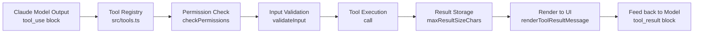
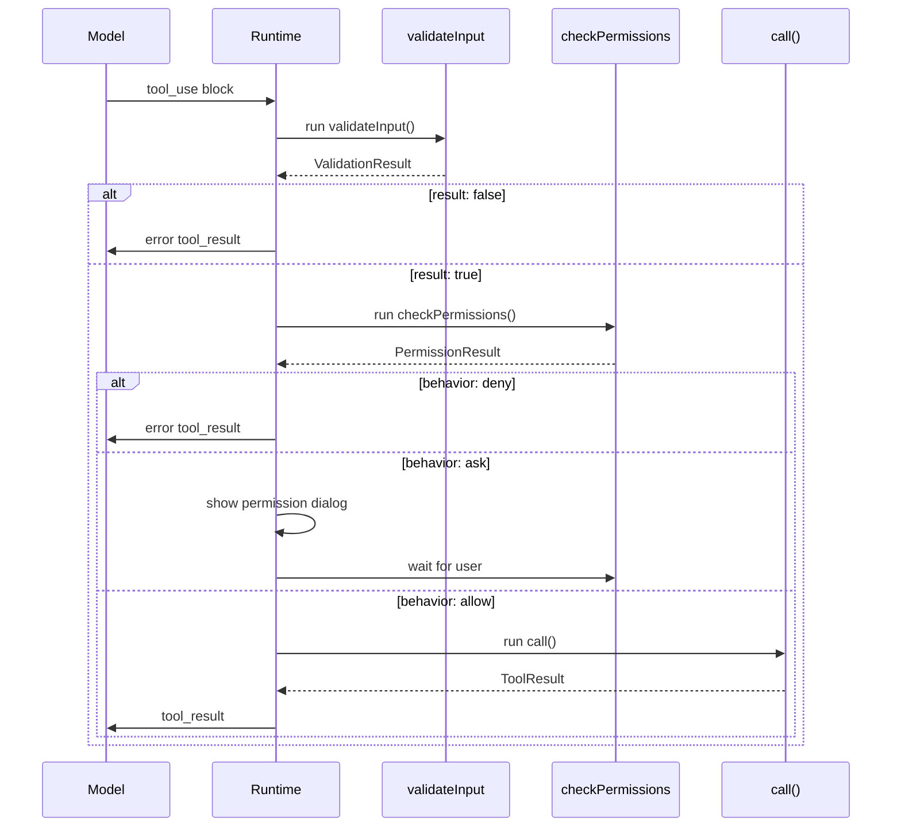
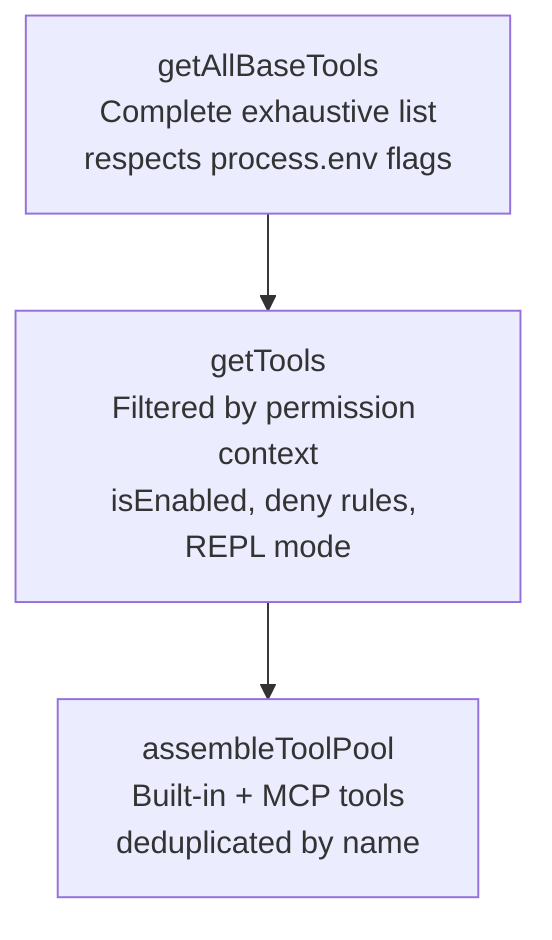
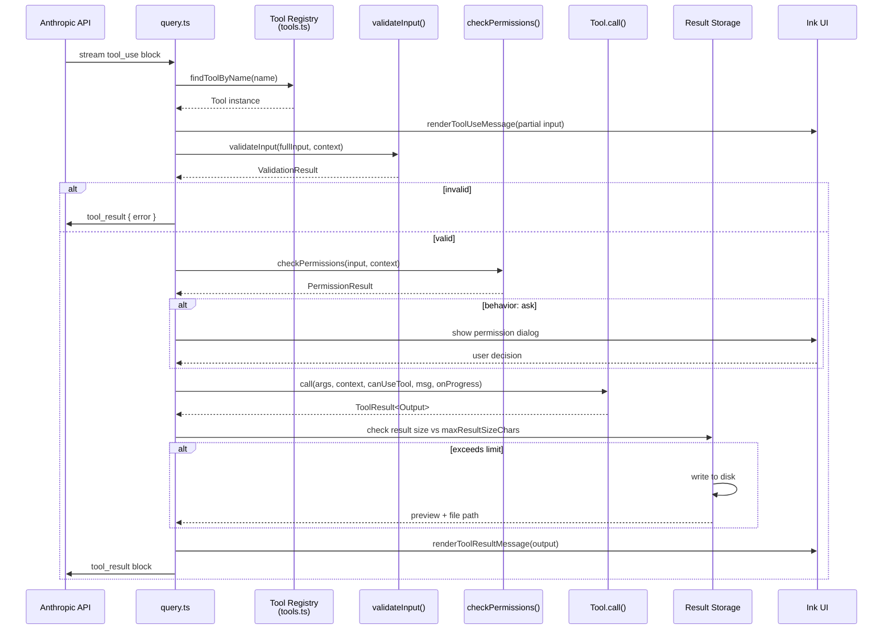
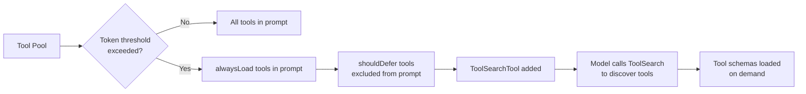
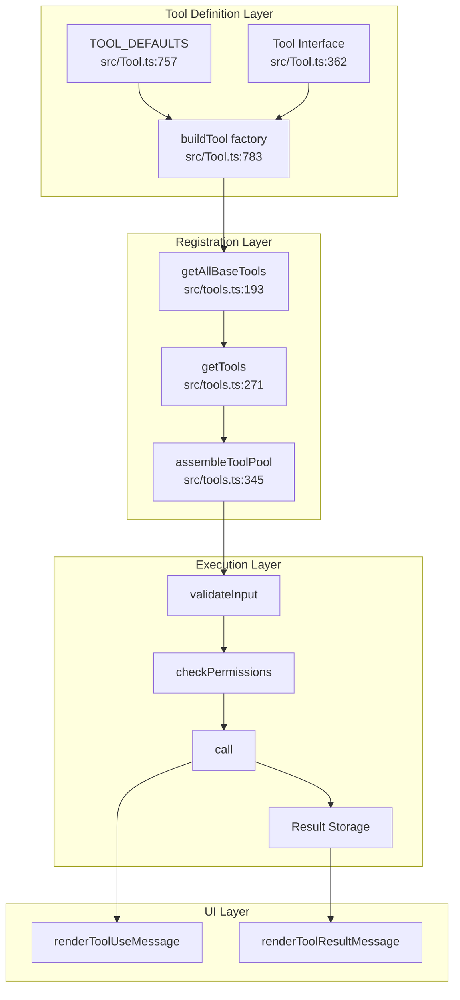

# Chapter 3: Tool System

> **Source references:** All line numbers refer to the Claude Code open-source snapshot at `anthhub/claude-code` (the `anthhub-claude-code` mirror used throughout this guide).

## Table of Contents

1. [Introduction](#1-introduction)
2. [Tool Interface Deep Dive](#2-tool-interface-deep-dive)
   - 2.1 [Identity Fields](#21-identity-fields)
   - 2.2 [Core Methods: call, checkPermissions, validateInput](#22-core-methods-call-checkpermissions-validateinput)
   - 2.3 [Render Methods](#23-render-methods)
   - 2.4 [Behavioral Flags](#24-behavioral-flags)
   - 2.5 [Result Storage: maxResultSizeChars](#25-result-storage-maxresultsize-chars)
   - 2.6 [Deferred Loading: shouldDefer](#26-deferred-loading-shoulddefer)
3. [The buildTool() Factory](#3-the-buildtool-factory)
4. [Tool Registration: Three-Layer Architecture](#4-tool-registration-three-layer-architecture)
5. [Core Tool Implementations](#5-core-tool-implementations)
   - 5.1 [BashTool](#51-bashtool)
   - 5.2 [FileEditTool](#52-fileedittool)
   - 5.3 [FileReadTool](#53-filereadtool)
   - 5.4 [GlobTool and GrepTool](#54-globtool-and-greptool)
   - 5.5 [AgentTool](#55-agenttool)
6. [Tool Execution Flow](#6-tool-execution-flow)
7. [ToolSearch and Deferred Loading](#7-toolsearch-and-deferred-loading)
8. [Tool Result Storage](#8-tool-result-storage)
9. [Hands-on: Build Your Own Tool](#9-hands-on-build-your-own-tool)
10. [Key Takeaways and What's Next](#10-key-takeaways-and-whats-next)

---

## 1. Introduction

The tool system is the **capability layer** of Claude Code. Every action Claude takes—reading a file, running a shell command, searching code, spawning a sub-agent—goes through this system. Understanding it unlocks the ability to extend Claude Code with custom capabilities, reason about permission boundaries, and trace execution paths from model output to actual side effects.

At its heart, the tool system answers three questions:

1. **What can Claude do?** — The `Tool` interface in `src/Tool.ts` defines a contract every tool must satisfy.
2. **Which tools are available right now?** — `src/tools.ts` implements a three-layer registration and filtering mechanism.
3. **How does a tool call become real?** — The execution flow converts a model's `tool_use` block into a validated, permission-checked, side-effect-producing result.



**Key Takeaways (Introduction)**
- Every Claude action is a tool call
- The `Tool` interface is the contract; `buildTool()` is the factory; `tools.ts` is the registry
- The system is both typesafe (TypeScript generics) and runtime-safe (permission checks, validation)

---

## 2. Tool Interface Deep Dive

The `Tool` type is defined in `src/Tool.ts` (lines 362–695). It is generic across three type parameters:

```typescript
// src/Tool.ts lines 362-365
export type Tool<
  Input extends AnyObject = AnyObject,
  Output = unknown,
  P extends ToolProgressData = ToolProgressData,
> = { ... }
```

- `Input` — a Zod schema type; constrains what the model can pass
- `Output` — the TypeScript type of the result returned by `call()`
- `P` — progress event type for streaming updates

### 2.1 Identity Fields

```typescript
// src/Tool.ts lines 371-377
readonly name: string
aliases?: string[]
searchHint?: string
```

| Field | Purpose | Example |
|-------|---------|---------|
| `name` | Primary identifier used in API calls | `"Bash"`, `"Edit"` |
| `aliases` | Legacy names for backwards compat when a tool is renamed | `["computer_tool"]` |
| `searchHint` | 3–10 word phrase for keyword search when tool is deferred | `"modify file contents in place"` |

`aliases` are used by `toolMatchesName()` (line 348):

```typescript
// src/Tool.ts lines 348-353
export function toolMatchesName(
  tool: { name: string; aliases?: string[] },
  name: string,
): boolean {
  return tool.name === name || (tool.aliases?.includes(name) ?? false)
}
```

`searchHint` feeds the `ToolSearch` deferred-loading system (see §7). The hint should **not** repeat the tool name—it should provide complementary vocabulary (e.g. `"jupyter"` for `NotebookEdit`).

### 2.2 Core Methods: call, checkPermissions, validateInput

**`call()`** — The actual implementation (lines 379-385):

```typescript
// src/Tool.ts lines 379-385
call(
  args: z.infer<Input>,
  context: ToolUseContext,
  canUseTool: CanUseToolFn,
  parentMessage: AssistantMessage,
  onProgress?: ToolCallProgress<P>,
): Promise<ToolResult<Output>>
```

`ToolUseContext` (lines 158-299) is a rich bag of everything the tool might need: `abortController`, `readFileState`, `getAppState()`, `setToolJSX`, `messages`, permission context, and more. Tools receive a snapshot of this context; it is not mutable by tools directly.

`ToolResult<Output>` (lines 321-336):

```typescript
// src/Tool.ts lines 321-336
export type ToolResult<T> = {
  data: T
  newMessages?: (UserMessage | AssistantMessage | AttachmentMessage | SystemMessage)[]
  contextModifier?: (context: ToolUseContext) => ToolUseContext
  mcpMeta?: { _meta?: Record<string, unknown>; structuredContent?: Record<string, unknown> }
}
```

The `contextModifier` field lets tools like `AgentTool` alter the context for subsequent turns (e.g., injecting conversation history from a sub-agent).

**`validateInput()`** — Pre-execution validation (lines 489-492):

```typescript
// src/Tool.ts lines 489-492
validateInput?(
  input: z.infer<Input>,
  context: ToolUseContext,
): Promise<ValidationResult>
```

`ValidationResult` (lines 95-101) is either `{ result: true }` or `{ result: false; message: string; errorCode: number }`. This runs **before** `checkPermissions`, so it can short-circuit without ever showing a permission prompt.

**`checkPermissions()`** — User-facing permission gate (lines 500-503):

```typescript
// src/Tool.ts lines 500-503
checkPermissions(
  input: z.infer<Input>,
  context: ToolUseContext,
): Promise<PermissionResult>
```

`PermissionResult` has a `behavior` field: `'allow'`, `'deny'`, `'ask'`. When `'ask'`, the UI shows a permission dialog. The general permission logic lives in `permissions.ts`; `checkPermissions` contains **tool-specific** logic only.

**Execution order:**



### 2.3 Render Methods

Tools control their own UI rendering through five optional render methods:

| Method | When called | Notes |
|--------|------------|-------|
| `renderToolUseMessage` | While parameters stream in (partial input!) | Input is `Partial<z.infer<Input>>` |
| `renderToolUseProgressMessage` | During execution | Receives `ProgressMessage[]` |
| `renderToolUseQueuedMessage` | When tool is waiting in queue | Optional |
| `renderToolResultMessage` | After execution completes | Full output available |
| `renderToolUseRejectedMessage` | When user denies permission | Optional; falls back to generic |
| `renderToolUseErrorMessage` | When tool throws | Optional; falls back to generic |

The `style?: 'condensed'` option passed to `renderToolResultMessage` lets the UI request a compact summary instead of the full output—used in non-verbose mode.

### 2.4 Behavioral Flags

```typescript
// src/Tool.ts lines 402-416
isConcurrencySafe(input: z.infer<Input>): boolean
isEnabled(): boolean
isReadOnly(input: z.infer<Input>): boolean
isDestructive?(input: z.infer<Input>): boolean
interruptBehavior?(): 'cancel' | 'block'
```

| Flag | Default | Meaning |
|------|---------|---------|
| `isConcurrencySafe` | `false` (from TOOL_DEFAULTS) | Can this tool run in parallel with others? |
| `isEnabled` | `true` | Is the tool available at all? |
| `isReadOnly` | `false` | Informs `--no-write` / read-only mode enforcement |
| `isDestructive` | `false` | Irreversible operations (delete, overwrite, send) |
| `interruptBehavior` | `'block'` | What happens when user sends a new message mid-run |

`GlobTool` and `GrepTool` both set `isConcurrencySafe() { return true }` (GlobTool line 76-78), enabling Claude to fire multiple searches simultaneously without a serialization barrier.

### 2.5 Result Storage: maxResultSizeChars

```typescript
// src/Tool.ts lines 464-467
maxResultSizeChars: number
```

Every tool must set this limit. When a tool result exceeds this threshold, the result is written to disk and Claude receives a preview plus a file path instead of the full content.

Special values:
- `Infinity` — Never persist (used by `FileReadTool` to prevent circular Read→file→Read loops)
- `100_000` — Common value for most tools (BashTool, GlobTool, GrepTool, FileEditTool)

### 2.6 Deferred Loading: shouldDefer

```typescript
// src/Tool.ts lines 438-449
readonly shouldDefer?: boolean
readonly alwaysLoad?: boolean
```

When ToolSearch is active, tools with `shouldDefer: true` are excluded from the initial system prompt. The model uses `ToolSearch` to discover and load them on demand. `alwaysLoad: true` forces inclusion even when ToolSearch is enabled—useful for tools the model must see on turn 1.

**Key Takeaways (Interface)**
- `Tool<Input, Output, P>` is generic: Zod schema types flow through everywhere
- `validateInput` runs before permissions; use it for cheap format checks
- `maxResultSizeChars` is required and guards against context window overflow
- `isConcurrencySafe` unlocks parallel execution—set it when safe

---

## 3. The buildTool() Factory

Rather than implementing the full `Tool` interface directly, every tool in the codebase uses `buildTool()`:

```typescript
// src/Tool.ts lines 783-792
export function buildTool<D extends AnyToolDef>(def: D): BuiltTool<D> {
  return {
    ...TOOL_DEFAULTS,
    userFacingName: () => def.name,
    ...def,
  } as BuiltTool<D>
}
```

The defaults (lines 757-769) are fail-closed where it matters:

```typescript
// src/Tool.ts lines 757-769
const TOOL_DEFAULTS = {
  isEnabled: () => true,
  isConcurrencySafe: (_input?: unknown) => false,      // assume not safe
  isReadOnly: (_input?: unknown) => false,              // assume writes
  isDestructive: (_input?: unknown) => false,
  checkPermissions: (input, _ctx?) =>
    Promise.resolve({ behavior: 'allow', updatedInput: input }),
  toAutoClassifierInput: (_input?: unknown) => '',      // skip classifier
  userFacingName: (_input?: unknown) => '',
}
```

The `ToolDef` type (lines 721-726) is `Tool` with all defaultable keys made optional:

```typescript
// src/Tool.ts lines 721-726
export type ToolDef<Input, Output, P> =
  Omit<Tool<Input, Output, P>, DefaultableToolKeys> &
  Partial<Pick<Tool<Input, Output, P>, DefaultableToolKeys>>
```

And `BuiltTool<D>` (lines 735-741) mirrors the runtime spread at the type level—meaning TypeScript knows exactly which methods came from `def` (with their original literal types) versus which came from defaults.

**Pattern used in every tool:**

```typescript
export const MyTool = buildTool({
  name: 'MyTool',
  maxResultSizeChars: 100_000,
  // ... only what you need to override
} satisfies ToolDef<...>)
```

The `satisfies` keyword (or the `ToolDef` constraint on `buildTool`) ensures TypeScript catches missing required fields at compile time.

**Key Takeaways (buildTool)**
- `buildTool()` is the single factory — never construct `Tool` objects manually
- Defaults are fail-closed: `isConcurrencySafe=false`, `isReadOnly=false`
- `BuiltTool<D>` preserves literal types from your definition
- `satisfies ToolDef<...>` catches type errors at the definition site

---

## 4. Tool Registration: Three-Layer Architecture

`src/tools.ts` implements three increasingly refined views of the tool pool:



### Layer 1: getAllBaseTools()

```typescript
// src/tools.ts lines 193-251
export function getAllBaseTools(): Tools {
  return [
    AgentTool,
    TaskOutputTool,
    BashTool,
    ...(hasEmbeddedSearchTools() ? [] : [GlobTool, GrepTool]),
    // ... many more
    ...(isToolSearchEnabledOptimistic() ? [ToolSearchTool] : []),
  ]
}
```

This is the **source of truth** for all tools. The comment on line 191-192 flags that it must stay in sync with the Statsig dynamic config used for system prompt caching. Conditional includes handle:
- Feature flags (`feature('PROACTIVE')`, `feature('KAIROS')`)
- Environment variables (`process.env.USER_TYPE === 'ant'`)
- Optional capabilities (`isTodoV2Enabled()`, `isWorktreeModeEnabled()`)

### Layer 2: getTools()

```typescript
// src/tools.ts lines 271-327
export const getTools = (permissionContext: ToolPermissionContext): Tools => {
  // Simple mode: only Bash, Read, Edit
  if (isEnvTruthy(process.env.CLAUDE_CODE_SIMPLE)) { ... }

  const tools = getAllBaseTools().filter(tool => !specialTools.has(tool.name))
  let allowedTools = filterToolsByDenyRules(tools, permissionContext)

  // REPL mode: hide primitive tools
  if (isReplModeEnabled()) { ... }

  const isEnabled = allowedTools.map(_ => _.isEnabled())
  return allowedTools.filter((_, i) => isEnabled[i])
}
```

`filterToolsByDenyRules()` (lines 262-269) uses the same wildcard matcher as the runtime permission check—so `mcp__server` in a deny rule strips all tools from that MCP server before the model even sees them.

### Layer 3: assembleToolPool()

```typescript
// src/tools.ts lines 345-367
export function assembleToolPool(
  permissionContext: ToolPermissionContext,
  mcpTools: Tools,
): Tools {
  const builtInTools = getTools(permissionContext)
  const allowedMcpTools = filterToolsByDenyRules(mcpTools, permissionContext)

  const byName = (a: Tool, b: Tool) => a.name.localeCompare(b.name)
  return uniqBy(
    [...builtInTools].sort(byName).concat(allowedMcpTools.sort(byName)),
    'name',
  )
}
```

The sort-then-deduplicate pattern is deliberate: built-ins and MCP tools are sorted **separately** before concatenation, keeping built-ins as a contiguous prefix. This preserves the server's prompt-cache breakpoint—interleaving MCP tools alphabetically into built-ins would bust cache keys for every user who adds an MCP server.

**Key Takeaways (Registration)**
- `getAllBaseTools()` → `getTools()` → `assembleToolPool()` is the three-layer funnel
- Deny rules strip tools *before* the model sees them, not just at call time
- Sort stability matters for prompt caching—built-ins form a stable prefix

---

## 5. Core Tool Implementations

### 5.1 BashTool

**File:** `src/tools/BashTool/BashTool.tsx`

BashTool is the most complex tool in the system. Its key implementation details:

#### AST-Based Security Parsing

```typescript
// src/tools/BashTool/BashTool.tsx line 17
import { parseForSecurity } from '../../utils/bash/ast.js'
```

Commands are parsed into an AST before execution. This enables:
- Detecting `cd` commands to reset CWD if outside project (`resetCwdIfOutsideProject`)
- Parsing compound commands to classify read vs. write operations
- Extracting permission-matchable command prefixes

#### Input Schema

```typescript
// src/tools/BashTool/BashTool.tsx lines 227-247
const fullInputSchema = lazySchema(() => z.strictObject({
  command: z.string(),
  timeout: semanticNumber(z.number().optional()),
  description: z.string().optional(),
  run_in_background: semanticBoolean(z.boolean().optional()),
  dangerouslyDisableSandbox: semanticBoolean(z.boolean().optional()),
  _simulatedSedEdit: z.object({ ... }).optional(),  // internal only
}))
```

`semanticNumber` and `semanticBoolean` are wrapper schemas that accept both typed values and string representations—the model sometimes serializes booleans as `"true"` strings.

#### Auto-Backgrounding

```typescript
// src/tools/BashTool/BashTool.tsx lines 56-57
const ASSISTANT_BLOCKING_BUDGET_MS = 15_000
```

In assistant mode, blocking bash commands that take longer than 15 seconds are automatically moved to background tasks. The user sees a `BackgroundHint` UI component.

#### Output Truncation

BashTool uses `EndTruncatingAccumulator` (imported at line 36) to cap output. The accumulator streams output and truncates from the end when the limit is reached, ensuring the most recent output is preserved.

#### Collapsible UI Classification

```typescript
// src/tools/BashTool/BashTool.tsx lines 59-67
const BASH_SEARCH_COMMANDS = new Set(['find', 'grep', 'rg', ...])
const BASH_READ_COMMANDS = new Set(['cat', 'head', 'tail', ...])
const BASH_LIST_COMMANDS = new Set(['ls', 'tree', 'du'])
```

The `isSearchOrReadBashCommand()` function (lines 95-172) parses the command and classifies it for collapsible display. All parts of a pipeline must be read/search commands for the whole command to collapse.

### 5.2 FileEditTool

**File:** `src/tools/FileEditTool/FileEditTool.ts`

#### Modification Time Verification

FileEditTool tracks file modification times to detect concurrent edits. Before applying a patch, it checks that the file hasn't been modified outside Claude since it was last read:

```typescript
// src/tools/FileEditTool/FileEditTool.ts line 56
import { FILE_UNEXPECTEDLY_MODIFIED_ERROR } from './constants.js'
```

If the modification time doesn't match, the edit is rejected with `FILE_UNEXPECTEDLY_MODIFIED_ERROR`, preventing silent overwrites of concurrent changes.

#### Fuzzy String Matching

```typescript
// src/tools/FileEditTool/utils.ts (referenced at line 72)
import { findActualString, getPatchForEdit } from './utils.js'
```

`findActualString` implements fuzzy matching when `old_string` doesn't match exactly—handling whitespace normalization and similar minor differences. This prevents tool failures when the model quotes strings with slightly different formatting.

#### LSP Integration

```typescript
// src/tools/FileEditTool/FileEditTool.ts lines 5-7
import { getLspServerManager } from '../../services/lsp/manager.js'
import { clearDeliveredDiagnosticsForFile } from '../../services/lsp/LSPDiagnosticRegistry.js'
```

After an edit, FileEditTool notifies the LSP server to refresh diagnostics. This keeps the IDE's error highlighting in sync with Claude's changes.

#### OOM Protection

```typescript
// src/tools/FileEditTool/FileEditTool.ts lines 84
const MAX_EDIT_FILE_SIZE = 1024 * 1024 * 1024 // 1 GiB
```

Files larger than 1 GiB are rejected before any string manipulation—V8/Bun string length limit is ~2^30 characters, so 1 GiB is the safe ceiling.

### 5.3 FileReadTool

**File:** `src/tools/FileReadTool/FileReadTool.ts`

#### Multi-Format Support

FileReadTool handles several formats beyond plain text:
- **Jupyter notebooks** (`.ipynb`) — maps cells to readable output via `mapNotebookCellsToToolResult`
- **PDFs** — extracts pages via `readPDF`, supports page ranges
- **Images** — detected by extension, compressed and base64-encoded
- **Binary files** — detected via `hasBinaryExtension`, rejected with helpful error

#### Image Compression

```typescript
// src/tools/FileReadTool/FileReadTool.ts lines 48-51
import {
  compressImageBufferWithTokenLimit,
  maybeResizeAndDownsampleImageBuffer,
} from '../../utils/imageResizer.js'
```

Images are compressed to fit within token limits before being embedded. The resizer uses adaptive quality reduction.

#### Blocking Device Protection

```typescript
// src/tools/FileReadTool/FileReadTool.ts lines 97-104
const BLOCKED_DEVICE_PATHS = new Set([
  '/dev/zero',   // infinite output
  // ...
])
```

Paths like `/dev/zero` would cause the process to hang reading infinite output. FileReadTool checks the path before any I/O.

#### maxResultSizeChars: Infinity

```typescript
// src/tools/FileReadTool/FileReadTool.ts (via buildTool call)
maxResultSizeChars: Infinity
```

FileReadTool sets `maxResultSizeChars` to `Infinity`, bypassing the disk-persistence path. Persisting a file read result would create a circular dependency: Read → persist to file → next Read reads the persisted file → etc. FileReadTool self-bounds through its own `limit` and `offset` parameters instead.

### 5.4 GlobTool and GrepTool

**Files:** `src/tools/GlobTool/GlobTool.ts`, `src/tools/GrepTool/GrepTool.ts`

Both tools are **concurrency-safe** (`isConcurrencySafe() { return true }`) and read-only, enabling Claude to fire multiple parallel searches.

#### GlobTool

```typescript
// src/tools/GlobTool/GlobTool.ts lines 57-78
export const GlobTool = buildTool({
  name: GLOB_TOOL_NAME,
  searchHint: 'find files by name pattern or wildcard',
  maxResultSizeChars: 100_000,
  isConcurrencySafe() { return true },
  isReadOnly() { return true },
  // ...
})
```

Output schema (lines 39-52) includes `truncated: boolean`—results are capped at 100 files. The model must use more specific patterns or narrow the search directory if truncated.

#### GrepTool

```typescript
// src/tools/GrepTool/GrepTool.ts line 21
import { ripGrep } from '../../utils/ripgrep.js'
```

GrepTool wraps `ripgrep` (not `grep`) for performance on large codebases. The input schema mirrors ripgrep's flags: `-B`, `-A`, `-C` for context lines, `-i` for case-insensitive, `type` for file type filtering.

The `output_mode` field supports three modes:
- `"content"` — matching lines with optional context
- `"files_with_matches"` — only file paths (default, lower cost)
- `"count"` — match count per file

#### Embedded Search Tools

```typescript
// src/tools.ts line 201
...(hasEmbeddedSearchTools() ? [] : [GlobTool, GrepTool]),
```

On Ant-internal builds, `bfs` and `ugrep` are embedded in the binary. When present, `find` and `grep` in Claude's shell are aliased to these faster tools—so the dedicated Glob/Grep tools become redundant and are excluded.

### 5.5 AgentTool

**File:** `src/tools/AgentTool/AgentTool.tsx`

AgentTool is Claude's mechanism for spawning sub-agents. It is the most architecturally significant tool because it implements the agent coordination system (Chapter 9).

Key behaviors:
- **Assembles a fresh tool pool** for the sub-agent via `assembleToolPool()` (line 16 import)
- **Supports worktrees** — can fork a git worktree for isolation
- **Supports remote agents** — can teleport to a remote machine
- **Auto-backgrounding** — long-running agents move to background after `getAutoBackgroundMs()` (120 seconds by default when enabled)

```typescript
// src/tools/AgentTool/AgentTool.tsx lines 72-76
function getAutoBackgroundMs(): number {
  if (isEnvTruthy(process.env.CLAUDE_AUTO_BACKGROUND_TASKS) ||
      getFeatureValue_CACHED_MAY_BE_STALE('tengu_auto_background_agents', false)) {
    return 120_000
  }
  return 0
}
```

**Key Takeaways (Core Tools)**
- BashTool uses AST parsing for security—it's more than `exec(command)`
- FileEditTool validates modification time to prevent silent overwrites
- FileReadTool sets `maxResultSizeChars: Infinity` to avoid circular persistence
- GlobTool/GrepTool are `isConcurrencySafe: true`, enabling parallel search
- AgentTool assembles an independent tool pool for each sub-agent

---

## 6. Tool Execution Flow

The following diagram traces a complete tool call from model output to feedback:



The `query.ts` orchestrator (not shown in the source listing, but the central coordinator) handles the streaming nature of tool_use blocks—`renderToolUseMessage` is called with partial input as parameters stream in, giving the UI real-time feedback before execution begins.

**Key Takeaways (Execution Flow)**
- Rendering starts before validation—partial input is streamed to UI immediately
- `validateInput` → `checkPermissions` → `call` is the guaranteed order
- Result size is checked *after* execution; large results go to disk transparently

---

## 7. ToolSearch and Deferred Loading

When the tool pool exceeds a certain token threshold, Claude Code enables ToolSearch. This mechanism reduces initial prompt length by deferring tool schemas.



The optimistic check at registration time:

```typescript
// src/tools.ts lines 248-250
...(isToolSearchEnabledOptimistic() ? [ToolSearchTool] : []),
```

`searchHint` is the vocabulary for keyword matching. When the model needs a capability (e.g., "edit a Jupyter notebook"), it calls `ToolSearch` with keywords like "jupyter notebook", which matches `NotebookEdit`'s `searchHint: 'jupyter'`.

**Key Takeaways (ToolSearch)**
- `shouldDefer: true` excludes a tool from initial prompt
- `alwaysLoad: true` forces inclusion even when ToolSearch is on
- `searchHint` is the discovery vocabulary — make it complementary to the tool name

---

## 8. Tool Result Storage

When `ToolResult.data` serializes to more than `maxResultSizeChars` characters, the result storage system kicks in:

```typescript
// src/tools/BashTool/BashTool.tsx line 40
import { buildLargeToolResultMessage, ensureToolResultsDir,
         generatePreview, getToolResultPath, PREVIEW_SIZE_BYTES
} from '../../utils/toolResultStorage.js'
```

The flow:
1. Serialize the result
2. Compare length to `maxResultSizeChars`
3. If exceeded: write full content to `~/.claude/tool_results/<uuid>.txt`
4. Return a preview (first `PREVIEW_SIZE_BYTES` bytes) plus the file path
5. Claude receives the preview and can read the full file via `FileReadTool` if needed

This prevents any single tool result from consuming the entire context window.

**Key Takeaways (Result Storage)**
- `maxResultSizeChars` is a hard wall — exceeded results always go to disk
- `Infinity` bypasses disk persistence (use for tools that self-bound their output)
- Preview + path allows Claude to read the full result on demand

---

## 9. Hands-on: Build Your Own Tool

Let's build a `WordCountTool` that counts words, lines, and characters in text.

### Step 1: Define the Tool

```typescript
// examples/03-tool-system/simple-tool.ts
import { buildTool } from './tool-interface'
import { z } from 'zod'

export const WordCountTool = buildTool({
  name: 'WordCount',
  searchHint: 'count words lines characters in text',
  maxResultSizeChars: 10_000,

  inputSchema: z.object({
    text: z.string().describe('The text to analyze'),
    include_details: z.boolean().optional()
      .describe('Include per-line breakdown'),
  }),

  async call(args, _context) {
    const lines = args.text.split('\n')
    const words = args.text.split(/\s+/).filter(w => w.length > 0)
    const chars = args.text.length

    const result = {
      lines: lines.length,
      words: words.length,
      chars,
      ...(args.include_details ? {
        breakdown: lines.map((line, i) => ({
          lineNumber: i + 1,
          words: line.split(/\s+/).filter(w => w.length > 0).length,
          chars: line.length,
        }))
      } : {}),
    }

    return { data: result }
  },

  // Read-only: pure computation, no side effects
  isReadOnly() { return true },
  // Safe to run in parallel with other tools
  isConcurrencySafe() { return true },

  renderToolUseMessage(input) {
    const preview = (input.text ?? '').slice(0, 50)
    return `Counting words in: "${preview}${(input.text?.length ?? 0) > 50 ? '...' : ''}"`
  },

  renderToolResultMessage(content) {
    return `${content.words} words, ${content.lines} lines, ${content.chars} chars`
  },

  mapToolResultToToolResultBlockParam(content, toolUseID) {
    return {
      type: 'tool_result',
      tool_use_id: toolUseID,
      content: JSON.stringify(content),
    }
  },

  async prompt() {
    return 'Count words, lines, and characters in text.'
  },

  async description() {
    return 'Counts words, lines, and characters in the provided text.'
  },

  async checkPermissions(_input, _context) {
    return { behavior: 'allow', updatedInput: _input }
  },
})
```

### Step 2: Register the Tool

```typescript
// In your custom tools.ts or plugin entrypoint:
import { WordCountTool } from './simple-tool'

// Add to your tool pool alongside built-in tools
const myTools = [...getTools(permissionContext), WordCountTool]
```

### Step 3: Verify the Interface Contract

The `buildTool()` factory will fill in defaults for:
- `isEnabled: () => true`
- `isConcurrencySafe: () => false` (we override this)
- `isReadOnly: () => false` (we override this)
- `checkPermissions: () => allow` (we explicitly implement)
- `toAutoClassifierInput: () => ''`
- `userFacingName: () => 'WordCount'`

**Common mistakes to avoid:**
1. Forgetting `maxResultSizeChars` — TypeScript will catch this (required field)
2. Setting `isConcurrencySafe: true` for tools with side effects
3. Using `mapToolResultToToolResultBlockParam` to return raw objects instead of strings
4. Setting `maxResultSizeChars: Infinity` for tools that don't self-bound their output

**Key Takeaways (Build Your Own)**
- Use `buildTool()` — never implement `Tool` directly
- Override only what differs from defaults
- Set `isReadOnly: true` and `isConcurrencySafe: true` for pure read tools
- `mapToolResultToToolResultBlockParam` must return a `ToolResultBlockParam`

---

## 10. Key Takeaways and What's Next

### Summary

The tool system is built around a clear separation of concerns:

| Concern | Where it lives |
|---------|---------------|
| Contract definition | `src/Tool.ts` — `Tool<Input, Output, P>` |
| Default behaviors | `src/Tool.ts` — `TOOL_DEFAULTS`, `buildTool()` |
| Registration & filtering | `src/tools.ts` — three-layer funnel |
| Permission checking | `checkPermissions()` + `src/utils/permissions/` |
| Input validation | `validateInput()` per tool |
| Result size limits | `maxResultSizeChars` per tool |
| Deferred loading | `shouldDefer`, `alwaysLoad`, `ToolSearch` |
| UI rendering | Render methods per tool |

### Architecture Diagram



### What's Next

- **Chapter 4: Command System** — How `/commands` (slash commands) work alongside tools; the `Command` type and how it differs from `Tool`
- **Chapter 7: Permission System** — Deep dive into `ToolPermissionContext`, deny rules, and the permission dialog flow
- **Chapter 9: Agent Coordination** — How `AgentTool` spawns sub-agents, manages their tool pools, and handles async lifecycles

---

*Source references in this chapter: `src/Tool.ts` (all line numbers relative to the anthhub-claude-code snapshot), `src/tools.ts`, `src/tools/BashTool/BashTool.tsx`, `src/tools/FileEditTool/FileEditTool.ts`, `src/tools/FileReadTool/FileReadTool.ts`, `src/tools/GlobTool/GlobTool.ts`, `src/tools/GrepTool/GrepTool.ts`, `src/tools/AgentTool/AgentTool.tsx`.*
