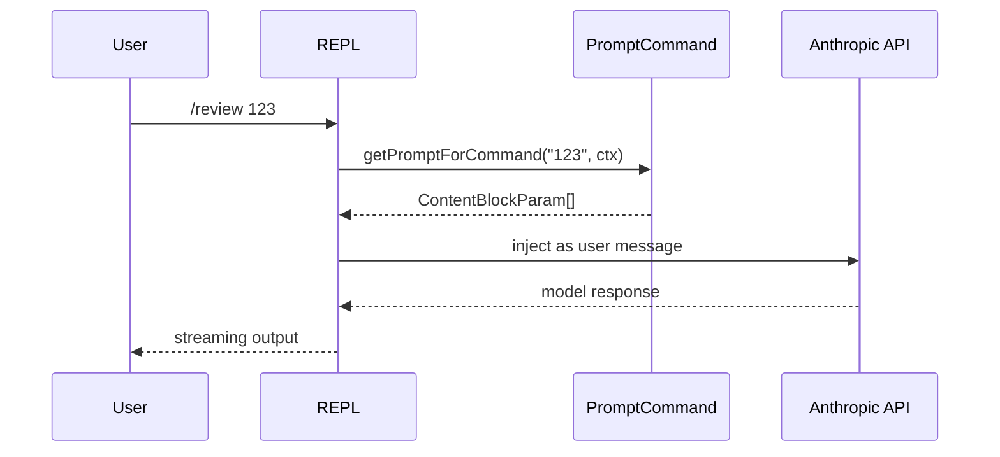
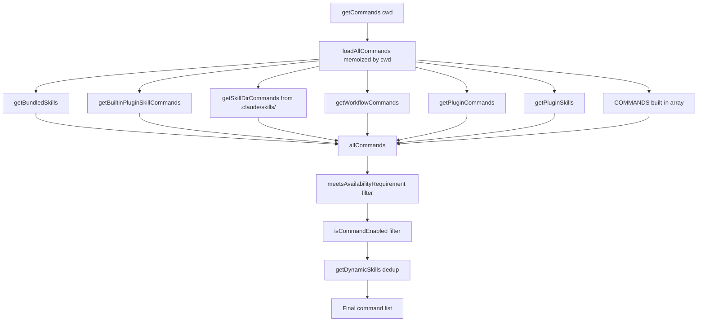
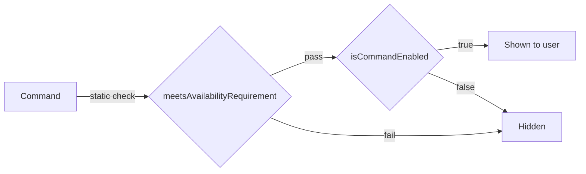

# Chapter 4: Command System

## Table of Contents

1. [Introduction: Commands vs Tools](#introduction-commands-vs-tools)
2. [Command Type System](#command-type-system)
   - [PromptCommand](#promptcommand)
   - [LocalCommand](#localcommand)
   - [LocalJSXCommand](#localjsxcommand)
   - [CommandBase Fields](#commandbase-fields)
3. [Command Registration](#command-registration)
   - [Static Imports](#static-imports)
   - [Feature-Flag-Gated Commands (DCE)](#feature-flag-gated-commands-dce)
   - [USER_TYPE Conditional Loading](#user_type-conditional-loading)
   - [Dynamic Sources: Skills, Plugins, Workflows](#dynamic-sources-skills-plugins-workflows)
4. [Command Lookup and Filtering Pipeline](#command-lookup-and-filtering-pipeline)
5. [Deep Dive: Representative Commands](#deep-dive-representative-commands)
   - [compact — LocalCommand with isEnabled guard](#compact--localcommand-with-isenabled-guard)
   - [diff — LocalJSXCommand](#diff--localjsxcommand)
   - [review — PromptCommand](#review--promptcommand)
   - [insights — Lazy PromptCommand Shim](#insights--lazy-promptcommand-shim)
6. [Skill-Based Commands](#skill-based-commands)
   - [Loading from .claude/skills/](#loading-from-claudeskills)
   - [Bundled Skills](#bundled-skills)
7. [Plugin Commands](#plugin-commands)
8. [Availability and Enablement](#availability-and-enablement)
9. [Hands-On: Implement a Slash Command](#hands-on-implement-a-slash-command)
10. [Key Takeaways](#key-takeaways)

---

## Introduction: Commands vs Tools

Claude Code exposes two fundamentally different extensibility surfaces: **Tools** and **Commands**.

| Dimension | Tools | Commands |
|---|---|---|
| Invoked by | The AI model | The user (typing `/`) |
| Syntax | JSON in API call | `/command-name [args]` |
| Definition | `Tool` class with `inputSchema` | `Command` object with typed fields |
| Purpose | Extend what Claude *can do* | Extend what users *can trigger* |
| Chapter | Chapter 3 | This chapter |

Commands are the slash-command interface users interact with directly. When you type `/compact`, `/diff`, or `/review pr-123`, you're invoking a command. The model never calls commands — it calls tools. This distinction keeps the system clean: commands are for human-facing workflows; tools are for agent capabilities.

```
User types /compact
     │
     ▼
processSlashCommand()   ← REPL input handler
     │
     ├─ type: 'prompt'  → getPromptForCommand() → inject into conversation
     ├─ type: 'local'   → load().call()          → execute in process, return text
     └─ type: 'local-jsx' → load().call()        → render Ink component
```

---

## Command Type System

The type definitions live in `src/types/command.ts`. The top-level union is:

```typescript
// src/types/command.ts:205-206
export type Command = CommandBase &
  (PromptCommand | LocalCommand | LocalJSXCommand)
```

Every command starts with `CommandBase` shared fields, then specializes into one of three execution models.

### PromptCommand

```typescript
// src/types/command.ts:25-57
export type PromptCommand = {
  type: 'prompt'
  progressMessage: string
  contentLength: number
  argNames?: string[]
  allowedTools?: string[]
  model?: string
  source: SettingSource | 'builtin' | 'mcp' | 'plugin' | 'bundled'
  pluginInfo?: { ... }
  disableNonInteractive?: boolean
  hooks?: HooksSettings
  skillRoot?: string
  context?: 'inline' | 'fork'
  agent?: string
  effort?: EffortValue
  paths?: string[]
  getPromptForCommand(
    args: string,
    context: ToolUseContext,
  ): Promise<ContentBlockParam[]>
}
```

Key fields:

- **`getPromptForCommand`** — returns an array of `ContentBlockParam` blocks that get injected into the conversation as the user's next message. This is how a command like `/review` expands into a long detailed prompt.
- **`context: 'inline' | 'fork'`** — `inline` (default) expands the prompt in the current conversation; `fork` spawns a sub-agent with a separate token budget.
- **`source`** — tracks where the command came from (`builtin`, `mcp`, `plugin`, `bundled`, or a `SettingSource` like `userSettings` / `projectSettings`).
- **`paths`** — glob patterns: the command is hidden until the model has touched matching files (useful for file-type-specific skills).



### LocalCommand

```typescript
// src/types/command.ts:74-78
type LocalCommand = {
  type: 'local'
  supportsNonInteractive: boolean
  load: () => Promise<LocalCommandModule>
}
```

And the module it loads:

```typescript
// src/types/command.ts:62-72
export type LocalCommandModule = {
  call: LocalCommandCall
}

export type LocalCommandCall = (
  args: string,
  context: LocalJSXCommandContext,
) => Promise<LocalCommandResult>
```

The `load()` pattern is **lazy loading** — the heavy implementation module is not `import`ed at startup. It's only fetched when the command is actually invoked. This keeps startup time fast even with 50+ commands registered.

`LocalCommandResult` can be:

```typescript
// src/types/command.ts:16-23
export type LocalCommandResult =
  | { type: 'text'; value: string }
  | { type: 'compact'; compactionResult: CompactionResult; displayText?: string }
  | { type: 'skip' }
```

### LocalJSXCommand

```typescript
// src/types/command.ts:144-152
type LocalJSXCommand = {
  type: 'local-jsx'
  load: () => Promise<LocalJSXCommandModule>
}
```

Same lazy `load()` pattern, but the implementation returns a React node (rendered by Ink in the terminal). Commands like `/diff`, `/memory`, `/config`, and `/doctor` use this type to render interactive terminal UIs.

### CommandBase Fields

All three types share `CommandBase`:

```typescript
// src/types/command.ts:175-203
export type CommandBase = {
  availability?: CommandAvailability[]   // auth gating
  description: string
  hasUserSpecifiedDescription?: boolean
  isEnabled?: () => boolean              // feature-flag gating
  isHidden?: boolean                     // hide from typeahead
  name: string
  aliases?: string[]
  isMcp?: boolean
  argumentHint?: string                  // gray hint in autocomplete
  whenToUse?: string                     // model-facing usage guidance
  version?: string
  disableModelInvocation?: boolean       // block AI from calling this
  userInvocable?: boolean
  loadedFrom?: 'commands_DEPRECATED' | 'skills' | 'plugin' | 'managed' | 'bundled' | 'mcp'
  kind?: 'workflow'
  immediate?: boolean                    // bypass queue
  isSensitive?: boolean                  // redact args from history
  userFacingName?: () => string
}
```

Notable fields:

- **`isEnabled`** — a thunk that evaluates at call-time. Used for feature-flag and environment-variable gating. Returning `false` hides the command from typeahead.
- **`availability`** — static auth requirement: `'claude-ai'` (OAuth subscribers) or `'console'` (API key users). Evaluated in `meetsAvailabilityRequirement()` on every `getCommands()` call, not memoized, so auth changes during a session take effect immediately.
- **`aliases`** — additional names (e.g., `/config` is also `/settings`).
- **`whenToUse`** — free-text guidance for the model's SkillTool. Not shown to users.
- **`disableModelInvocation`** — prevents the command from appearing in model-callable skill listings.

---

## Command Registration

The entire registration flow lives in `src/commands.ts` (754 lines). It has three distinct layers.

### Static Imports

The file begins with ~50 static `import` statements, one per built-in command:

```typescript
// src/commands.ts:2-57
import compact from './commands/compact/index.js'
import config from './commands/config/index.js'
import diff from './commands/diff/index.js'
import doctor from './commands/doctor/index.js'
import memory from './commands/memory/index.js'
// ...40+ more
```

These are **always loaded** at module initialization. Each `index.ts` is tiny (< 15 lines) — it just defines the command metadata object and the `load()` thunk. The heavy implementation is only pulled in when the command runs.

### Feature-Flag-Gated Commands (DCE)

Commands gated by `feature()` (Bun's dead code elimination):

```typescript
// src/commands.ts:62-122
const proactive =
  feature('PROACTIVE') || feature('KAIROS')
    ? require('./commands/proactive.js').default
    : null

const briefCommand =
  feature('KAIROS') || feature('KAIROS_BRIEF')
    ? require('./commands/brief.js').default
    : null

const bridge = feature('BRIDGE_MODE')
  ? require('./commands/bridge/index.js').default
  : null
// ...more feature-gated commands
```

`feature('FLAG_NAME')` is evaluated at build time by Bun's bundler. If the flag is `false`, the `require()` call (and the entire referenced module) is eliminated from the production bundle — true dead code elimination (DCE). This keeps the published binary lean.

At runtime, the result is either the command object or `null`. The `COMMANDS()` array then spreads only non-null values:

```typescript
// src/commands.ts:320-330
...(proactive ? [proactive] : []),
...(briefCommand ? [briefCommand] : []),
...(bridge ? [bridge] : []),
```

### USER_TYPE Conditional Loading

```typescript
// src/commands.ts:48-52
const agentsPlatform =
  process.env.USER_TYPE === 'ant'
    ? require('./commands/agents-platform/index.js').default
    : null
```

Ant-internal commands check `process.env.USER_TYPE === 'ant'` at runtime. They're only visible to Anthropic employees. The entire `INTERNAL_ONLY_COMMANDS` array is similarly gated:

```typescript
// src/commands.ts:343-346
...(process.env.USER_TYPE === 'ant' && !process.env.IS_DEMO
  ? INTERNAL_ONLY_COMMANDS
  : []),
```

### Dynamic Sources: Skills, Plugins, Workflows

The memoized `loadAllCommands()` function assembles all dynamic command sources in parallel:

```typescript
// src/commands.ts:449-469
const loadAllCommands = memoize(async (cwd: string): Promise<Command[]> => {
  const [
    { skillDirCommands, pluginSkills, bundledSkills, builtinPluginSkills },
    pluginCommands,
    workflowCommands,
  ] = await Promise.all([
    getSkills(cwd),
    getPluginCommands(),
    getWorkflowCommands ? getWorkflowCommands(cwd) : Promise.resolve([]),
  ])

  return [
    ...bundledSkills,
    ...builtinPluginSkills,
    ...skillDirCommands,
    ...workflowCommands,
    ...pluginCommands,
    ...pluginSkills,
    ...COMMANDS(),   // built-in commands come last
  ]
})
```

The priority order matters for name conflict resolution: bundled skills first, plugin skills last before built-ins. Built-ins always win because they're appended last and `findCommand()` returns the first match — actually bundled skills win when they share a name with built-ins because they appear earlier in the array.



---

## Command Lookup and Filtering Pipeline

`getCommands()` is not just the loader — it applies two runtime filters on every call:

```typescript
// src/commands.ts:476-517
export async function getCommands(cwd: string): Promise<Command[]> {
  const allCommands = await loadAllCommands(cwd)
  const dynamicSkills = getDynamicSkills()

  const baseCommands = allCommands.filter(
    _ => meetsAvailabilityRequirement(_) && isCommandEnabled(_),
  )

  // dedupe and insert dynamic skills
  ...
}
```

- **`meetsAvailabilityRequirement`** — checks `cmd.availability` against current auth state. Not memoized because auth can change mid-session (after `/login`).
- **`isCommandEnabled`** — delegates to `cmd.isEnabled?.() ?? true`. If the command has no `isEnabled`, it defaults to enabled.
- **Dynamic skills** — discovered during file I/O operations (e.g., when the model reads a file that triggers a path-matched skill) are merged in last, deduped by name.

Finding a command by name uses `findCommand()`:

```typescript
// src/commands.ts:688-698
export function findCommand(
  commandName: string,
  commands: Command[],
): Command | undefined {
  return commands.find(
    _ =>
      _.name === commandName ||
      getCommandName(_) === commandName ||
      _.aliases?.includes(commandName),
  )
}
```

It checks `name`, `userFacingName()`, and `aliases`. This is why `/settings` resolves to the `config` command (which declares `aliases: ['settings']`).

---

## Deep Dive: Representative Commands

### compact — LocalCommand with isEnabled guard

```typescript
// src/commands/compact/index.ts:1-15
import type { Command } from '../../commands.js'
import { isEnvTruthy } from '../../utils/envUtils.js'

const compact = {
  type: 'local',
  name: 'compact',
  description:
    'Clear conversation history but keep a summary in context. Optional: /compact [instructions for summarization]',
  isEnabled: () => !isEnvTruthy(process.env.DISABLE_COMPACT),
  supportsNonInteractive: true,
  argumentHint: '<optional custom summarization instructions>',
  load: () => import('./compact.js'),
} satisfies Command
```

The implementation (`compact.ts`) is ~288 lines, which would significantly slow startup if eagerly loaded. The `load()` thunk defers it until the user actually runs `/compact`.

The `isEnabled` guard checks `DISABLE_COMPACT` env var, allowing operators to disable the feature without code changes.

The `call()` implementation (in `compact.ts:40`) accepts optional custom summarization instructions and orchestrates multiple compaction strategies:
1. Session memory compaction (if no custom instructions)
2. Reactive compaction (feature-flagged path)
3. Traditional `compactConversation()` with microcompact pre-pass

### diff — LocalJSXCommand

```typescript
// src/commands/diff/index.ts:1-8
export default {
  type: 'local-jsx',
  name: 'diff',
  description: 'View uncommitted changes and per-turn diffs',
  load: () => import('./diff.js'),
} satisfies Command
```

The minimal index file — pure metadata. The `diff.js` implementation renders an Ink component that shows git diffs with interactive navigation. The `local-jsx` type tells the REPL dispatcher to render the returned React node in the terminal rather than printing text.

### review — PromptCommand

```typescript
// src/commands/review.ts:33-44
const review: Command = {
  type: 'prompt',
  name: 'review',
  description: 'Review a pull request',
  progressMessage: 'reviewing pull request',
  contentLength: 0,
  source: 'builtin',
  async getPromptForCommand(args): Promise<ContentBlockParam[]> {
    return [{ type: 'text', text: LOCAL_REVIEW_PROMPT(args) }]
  },
}
```

The `getPromptForCommand` returns the filled template as a content block. The REPL injects it as the user's next message to the model. Notice `contentLength: 0` — the actual content length is computed dynamically by the template function. This is a simplification for built-in commands; skill-based commands compute the token estimate from their Markdown file size.

The same file exports `ultrareview` as a `local-jsx` command — it uses the same name-space but completely different execution path (renders permission UI then forks to a remote agent).

### insights — Lazy PromptCommand Shim

```typescript
// src/commands.ts:190-202
const usageReport: Command = {
  type: 'prompt',
  name: 'insights',
  description: 'Generate a report analyzing your Claude Code sessions',
  contentLength: 0,
  progressMessage: 'analyzing your sessions',
  source: 'builtin',
  async getPromptForCommand(args, context) {
    const real = (await import('./commands/insights.js')).default
    if (real.type !== 'prompt') throw new Error('unreachable')
    return real.getPromptForCommand(args, context)
  },
}
```

The comment explains why: `insights.ts` is 113KB (3200 lines). The shim is a `PromptCommand` whose `getPromptForCommand` does a dynamic `import()` on first call. This is the same lazy-loading pattern as `LocalCommand.load()`, applied to a `PromptCommand`. The module is only fetched when `/insights` is first run.

---

## Skill-Based Commands

Skills are user-defined commands written as Markdown files. They're the primary extension mechanism for end users.

### Loading from .claude/skills/

The loader (`src/skills/loadSkillsDir.ts`) searches multiple directories in priority order:

```typescript
// src/skills/loadSkillsDir.ts:78-94
export function getSkillsPath(
  source: SettingSource | 'plugin',
  dir: 'skills' | 'commands',
): string {
  switch (source) {
    case 'policySettings':
      return join(getManagedFilePath(), '.claude', dir)
    case 'userSettings':
      return join(getClaudeConfigHomeDir(), dir)
    case 'projectSettings':
      return `.claude/${dir}`
    case 'plugin':
      return 'plugin'
  }
}
```

Sources in priority order:
1. `policySettings` — managed/enterprise policy (highest priority)
2. `userSettings` — `~/.claude/skills/` (global user skills)
3. `projectSettings` — `.claude/skills/` in the project directory

Each `.md` file in these directories becomes a `PromptCommand`. The filename (without extension) becomes the command name. Frontmatter controls metadata:

```markdown
---
description: Summarize all changes since the last release
whenToUse: Use when you need a release summary for changelogs
allowedTools: Bash, Read
context: inline
---

Please summarize all changes since the last git tag...
```

The frontmatter parser (`src/utils/frontmatterParser.ts`) extracts these fields and maps them to `PromptCommand` fields. `getPromptForCommand` returns the file body (after frontmatter) as the prompt content.

### Bundled Skills

Bundled skills are skills compiled into the binary — no external file needed. They're registered programmatically using `registerBundledSkill()`:

```typescript
// src/skills/bundledSkills.ts:53-60
export function registerBundledSkill(definition: BundledSkillDefinition): void {
  // ...handles file extraction and skillRoot setup
  bundledSkills.push(/* Command object */)
}
```

The `BundledSkillDefinition` type is similar to `PromptCommand` but with an additional `files` field — a map of relative paths to content. On first invocation, these files are extracted to disk so the model can `Read` them via tool calls. This is how built-in skills can ship reference documentation.

In `commands.ts`, bundled skills are collected via `getBundledSkills()` and placed first in the assembled command list, giving them highest priority.

---

## Plugin Commands

Plugins can inject both `PromptCommand` and `LocalCommand`/`LocalJSXCommand` entries. The loading flow:

```
Plugin installed at ~/.claude/plugins/<name>/
     │
     ▼
loadAllPluginsCacheOnly()   ← reads plugin manifests
     │
     ▼
walkPluginMarkdown()        ← finds .md files in plugin commands/ dir
     │
     ▼
buildCommandFromMarkdown()  ← creates PromptCommand for each file
     │
     ▼
getPluginCommands()         ← returns all plugin commands, memoized
```

Plugin commands get their `source` set to `'plugin'` and carry `pluginInfo` with the manifest:

```typescript
// PromptCommand fields for plugin commands
source: 'plugin',
pluginInfo: {
  pluginManifest: PluginManifest,
  repository: string,
}
```

The `formatDescriptionWithSource()` function (at `src/commands.ts:728`) prefixes plugin commands in the autocomplete display:

```typescript
// src/commands.ts:737-740
if (cmd.source === 'plugin') {
  const pluginName = cmd.pluginInfo?.pluginManifest.name
  if (pluginName) {
    return `(${pluginName}) ${cmd.description}`
  }
}
```

This labels plugin commands visually, so users know where a command comes from.

Plugin skills (from `plugins/<name>/skills/`) go through a similar path but via `getPluginSkills()`. They're placed in the `pluginSkills` group, which appears before built-in commands in the merged list.

---

## Availability and Enablement

The system uses two orthogonal gating mechanisms:



**`availability`** (static, auth-based):
```typescript
// src/types/command.ts:169-172
export type CommandAvailability =
  | 'claude-ai'   // claude.ai OAuth subscriber
  | 'console'     // Console API key user
```

Commands without `availability` are shown to everyone. Commands with `availability` require the user to match at least one of the listed auth types.

**`isEnabled`** (dynamic, feature-flag-based):
```typescript
// src/commands/compact/index.ts:9
isEnabled: () => !isEnvTruthy(process.env.DISABLE_COMPACT),
```

This is a zero-argument function evaluated on every `getCommands()` call. Use it for:
- Environment variable toggles
- GrowthBook feature flags
- Platform-specific conditions

The `isCommandEnabled()` helper provides a safe default:

```typescript
// src/types/command.ts:214-216
export function isCommandEnabled(cmd: CommandBase): boolean {
  return cmd.isEnabled?.() ?? true
}
```

---

## Hands-On: Implement a Slash Command

Let's implement a `/stats` command that shows statistics about the current directory. We'll create both a simplified demo and walk through where to place it in the real codebase.

### File Structure

```
src/commands/
└── stats/
    ├── index.ts      ← command metadata (type, name, load)
    └── stats.ts      ← implementation (call function)
```

### Step 1: Define the Command Metadata

```typescript
// src/commands/stats/index.ts
import type { Command } from '../../commands.js'

const stats = {
  type: 'local',
  name: 'stats',
  description: 'Show file statistics for the current directory',
  supportsNonInteractive: true,
  argumentHint: '[path]',
  load: () => import('./stats.js'),
} satisfies Command

export default stats
```

Key decisions:
- `type: 'local'` — returns text, no React UI needed
- `supportsNonInteractive: true` — works in `--print` mode
- `load: () => import('./stats.js')` — lazy load the implementation

### Step 2: Implement the Command

```typescript
// src/commands/stats/stats.ts
import { readdir, stat } from 'fs/promises'
import { join } from 'path'
import type { LocalCommandCall } from '../../types/command.js'

export const call: LocalCommandCall = async (args, context) => {
  const targetPath = args.trim() || context.options.cwd || process.cwd()

  try {
    const entries = await readdir(targetPath, { withFileTypes: true })
    const files = entries.filter(e => e.isFile())
    const dirs = entries.filter(e => e.isDirectory())

    const fileSizes = await Promise.all(
      files.map(f =>
        stat(join(targetPath, f.name)).then(s => s.size)
      )
    )

    const totalBytes = fileSizes.reduce((a, b) => a + b, 0)
    const avgBytes = files.length > 0 ? Math.round(totalBytes / files.length) : 0

    return {
      type: 'text',
      value: [
        `Directory: ${targetPath}`,
        `Files: ${files.length}`,
        `Subdirectories: ${dirs.length}`,
        `Total size: ${(totalBytes / 1024).toFixed(1)} KB`,
        `Average file size: ${avgBytes} bytes`,
      ].join('\n'),
    }
  } catch (err) {
    return {
      type: 'text',
      value: `Error reading directory: ${err instanceof Error ? err.message : String(err)}`,
    }
  }
}
```

### Step 3: Register in commands.ts

Add the import and include in the `COMMANDS()` array:

```typescript
// src/commands.ts — add near other imports
import stats from './commands/stats/index.js'

// Inside the COMMANDS() memoized array
const COMMANDS = memoize((): Command[] => [
  // ...existing commands...
  stats,   // ← add here
])
```

### Step 4: Test

```bash
# In development
bun run dev
# In Claude Code REPL
/stats
/stats src/commands
```

### Choosing the Right Command Type

| Use Case | Type | Reason |
|---|---|---|
| Show text output | `local` | Simple, works in non-interactive |
| Render interactive UI | `local-jsx` | Need Ink components |
| Expand to a model prompt | `prompt` | Let Claude handle the reasoning |
| User-written skill | `prompt` (via .md file) | Markdown frontmatter system |

See the full working implementation in `examples/04-command-system/slash-command.ts`.

---

## Key Takeaways

1. **Three command types** — `PromptCommand` (expand to prompt), `LocalCommand` (run in process, return text), `LocalJSXCommand` (run in process, render Ink UI). All lazy-load their implementations via `load()`.

2. **Registration is layered** — static imports for built-ins, `feature()` DCE for experimental commands, `USER_TYPE` for internal commands, and async parallel loading for dynamic sources (skills, plugins, workflows).

3. **`getCommands()` is the gating point** — it applies both `meetsAvailabilityRequirement` and `isCommandEnabled` filters on every call. Auth changes take effect immediately because this is not memoized.

4. **Skills are just Markdown files** — place a `.md` file in `~/.claude/skills/` or `.claude/skills/` with optional frontmatter, and it becomes a `/command-name` automatically.

5. **Plugins extend commands** — plugins can inject both prompt-based and local commands through manifest-declared files. They appear prefixed with their plugin name in the autocomplete.

6. **Lazy loading is critical** — every non-trivial command uses `load: () => import('./impl.js')`. The `index.ts` file is a ~10-line metadata declaration; the real code loads on first use.

7. **`source` and `loadedFrom` track provenance** — the system knows exactly where each command came from, enabling correct display labels, model invocation filtering, and bridge safety checks.

---

**What's Next:** Chapter 5 covers the Ink rendering layer — how `LocalJSXCommand` implementations produce interactive terminal UIs and how the REPL manages the React tree.
