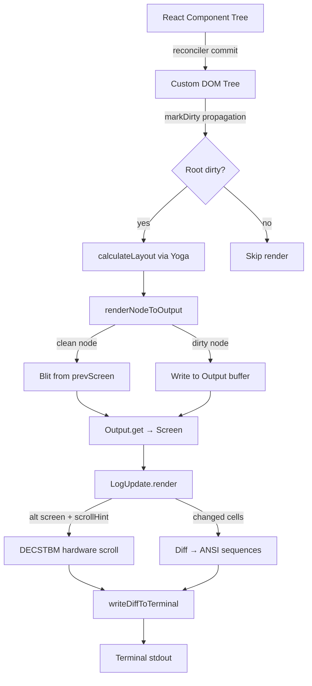

# Chapter 5: Terminal UI with Ink

## Table of Contents

1. [Introduction](#introduction)
2. [Ink's Custom Rendering Pipeline](#inks-custom-rendering-pipeline)
3. [DOM Model](#dom-model)
4. [Layout Engine](#layout-engine)
5. [Rendering Pipeline](#rendering-pipeline)
6. [Event System](#event-system)
7. [Core Components](#core-components)
8. [The REPL Screen](#the-repl-screen)
9. [Message Rendering](#message-rendering)
10. [Hands-on: Build Terminal UI with Ink](#hands-on-build-terminal-ui-with-ink)
11. [Key Takeaways & What's Next](#key-takeaways--whats-next)

---

## Introduction

Building a terminal UI that feels as responsive and feature-rich as Claude Code's interface is no trivial task. Standard `readline` or `ncurses`-based approaches quickly become unmanageable as complexity grows. Claude Code solves this problem by using **Ink** — a framework that lets you build terminal interfaces using React.

The core insight is compelling: React's declarative component model, diffing algorithm, and state management were already proven solutions for building complex UIs. Why not apply them to the terminal? Instead of updating the DOM, Ink reconciles a custom virtual DOM into ANSI escape sequences.

Claude Code goes further than the stock `ink` npm package. The team has made substantial modifications to build a production-grade terminal rendering system with:

- **Double-buffered rendering** with blit optimization
- **Hardware scrolling** via DECSTBM (DEC Set Top/Bottom Margins)
- **Pool-based memory management** for styles, characters, and hyperlinks
- **Two-phase event dispatch** mirroring browser capture/bubble semantics
- **Virtual message list** for rendering thousands of messages efficiently

This chapter dissects the custom Ink rendering pipeline from the ground up.

---

## Ink's Custom Rendering Pipeline

The original Ink library provides a solid foundation: a React reconciler that targets a custom DOM, combined with Yoga for flexbox layout. Claude Code's fork diverges significantly in several key areas.

### Comparison with Stock Ink

| Feature | Stock Ink | Claude Code's Fork |
|---|---|---|
| Screen buffer | Single string output | Double-buffered `Screen` object with typed cell arrays |
| Layout engine | Direct Yoga bindings | `LayoutNode` abstraction (`src/ink/layout/node.ts`) |
| Memory management | Allocates per frame | `CharPool` / `StylePool` / `HyperlinkPool` three-tier pooling |
| Rendering optimization | Full redraw each frame | Blit optimization via `nodeCache` (dirty-node skipping) |
| Hardware scrolling | Not supported | DECSTBM scroll regions in `log-update.ts:166-185` |
| Event system | Basic stdin parsing | Two-phase capture/bubble dispatch (`src/ink/events/dispatcher.ts`) |
| Mouse support | Minimal | Full SGR mouse tracking with hit-test in alt-screen mode |
| Text selection | Not supported | Full selection state with clipboard integration |

### LayoutNode Abstraction

Rather than coupling directly to Yoga's native bindings, Claude Code introduces a `LayoutNode` interface (`src/ink/layout/node.ts:93-152`). This abstraction layer defines all the layout operations that the rendering system needs — tree manipulation, computed value queries, and style setters — without exposing Yoga's implementation details.

```typescript
// src/ink/layout/node.ts:93
export type LayoutNode = {
  insertChild(child: LayoutNode, index: number): void
  removeChild(child: LayoutNode): void
  calculateLayout(width?: number, height?: number): void
  setMeasureFunc(fn: LayoutMeasureFunc): void
  getComputedLeft(): number
  getComputedTop(): number
  getComputedWidth(): number
  getComputedHeight(): number
  // ... style setters
}
```

The factory function `createLayoutNode()` in `src/ink/layout/engine.ts:4` returns a concrete Yoga implementation. Swapping layout engines would only require changing this one file.

### Three-Tier Pool System

Frame-by-frame allocation is a performance killer for a rendering system that needs to produce output at 60fps. Claude Code uses three object pools:

- **`StylePool`**: Interns ANSI style codes. Each unique combination of colors, bold, italic, etc. is stored once and referenced by a numeric ID. The `styleId` on each `Cell` is just an integer.
- **`CharPool`**: Caches tokenized and grapheme-clustered characters. Computing `stringWidth` and splitting grapheme clusters are expensive operations — the `charCache` in `output.ts` means lines that haven't changed are not re-processed.
- **`HyperlinkPool`**: Interns OSC 8 hyperlink URLs. Resets every 5 minutes (generational reset) to prevent unbounded growth.

These pools are shared across the `frontFrame` and `backFrame` in the Ink instance (`src/ink/ink.tsx:193-195`).

### Blit Optimization

The most impactful rendering optimization is the **blit**. When a DOM node's content hasn't changed, the renderer can copy its previously-rendered pixels from `prevScreen` (the front frame) directly into the `backScreen` (the back frame), skipping the expensive re-render of that subtree.

The `nodeCache` (`src/ink/node-cache.ts`) stores a `CachedNode` for each rendered element, containing its bounding rectangle and a reference to the previous frame's screen. If `node.dirty === false` and the layout hasn't shifted, `renderNodeToOutput` blits the cached pixels and returns early — O(changed pixels) instead of O(total pixels).

---

## DOM Model

The custom DOM lives in `src/ink/dom.ts`. It defines a parallel to the browser DOM, purpose-built for terminal rendering.

### Node Types

Seven element types are defined (`src/ink/dom.ts:18-27`):

```typescript
export type ElementNames =
  | 'ink-root'        // Document root — holds focusManager
  | 'ink-box'         // Layout container (like <div>)
  | 'ink-text'        // Text leaf with Yoga measure function
  | 'ink-virtual-text' // Text without its own Yoga node
  | 'ink-link'        // OSC 8 hyperlink (no Yoga node)
  | 'ink-progress'    // Progress indicator (no Yoga node)
  | 'ink-raw-ansi'    // Pre-rendered ANSI with known dimensions
```

Text nodes (`#text`) carry no Yoga node — only `ink-text` and `ink-raw-ansi` participate in layout measurement.

### The DOMElement Structure

`DOMElement` is the central node type (`src/ink/dom.ts:31-91`):

```typescript
export type DOMElement = {
  nodeName: ElementNames
  attributes: Record<string, DOMNodeAttribute>
  childNodes: DOMNode[]
  yogaNode?: LayoutNode      // Layout handle
  dirty: boolean             // Needs re-render?
  isHidden?: boolean         // Reconciler hide/unhide
  _eventHandlers?: Record<string, unknown>  // Separate from attrs to avoid dirty marking

  // Scroll state
  scrollTop?: number
  pendingScrollDelta?: number
  scrollClampMin?: number
  scrollClampMax?: number
  stickyScroll?: boolean
  scrollAnchor?: { el: DOMElement; offset: number }

  focusManager?: FocusManager  // Only on ink-root
  // ...
} & InkNode
```

The `_eventHandlers` field is stored separately from `attributes` — a deliberate design choice (`src/ink/dom.ts:49-51`). Event handler function references change identity on every React render. If they were stored in `attributes`, `setAttribute` would call `markDirty` on every render, defeating the blit optimization. The reconciler stores them in `_eventHandlers` where changes don't trigger dirty marks.

### Dirty Mark Propagation

When any DOM mutation occurs — text change, attribute update, style change — `markDirty` propagates the flag up to the root (`src/ink/dom.ts:393-413`):

```typescript
export const markDirty = (node?: DOMNode): void => {
  let current: DOMNode | undefined = node
  let markedYoga = false

  while (current) {
    if (current.nodeName !== '#text') {
      (current as DOMElement).dirty = true
      // Mark yoga dirty on leaf nodes for remeasurement
      if (!markedYoga && (current.nodeName === 'ink-text' || 
          current.nodeName === 'ink-raw-ansi') && current.yogaNode) {
        current.yogaNode.markDirty()
        markedYoga = true
      }
    }
    current = current.parentNode
  }
}
```

This upward propagation means the renderer can check `rootNode.dirty` to know if anything has changed at all. On a steady-state spinner tick, only the spinner text node is dirty — the rest of the tree is blitted unchanged.

### scheduleRenderFrom

For imperative DOM mutations that bypass React (like `scrollTop` changes from scroll events), `scheduleRenderFrom` walks up to the root and calls `onRender` — the throttled render scheduler — without going through React's reconciler (`src/ink/dom.ts:419-423`).

---

## Layout Engine

### Yoga Integration

Claude Code uses Facebook's Yoga layout engine — the same flexbox implementation used by React Native. Yoga computes box dimensions and positions given flex container constraints, implementing a substantial subset of CSS flexbox.

The integration point is the `LayoutNode` returned by `createLayoutNode()` in `src/ink/layout/engine.ts:4`. Each `DOMElement` (except `ink-virtual-text`, `ink-link`, and `ink-progress`) gets its own Yoga node at creation time (`src/ink/dom.ts:111-122`):

```typescript
export const createNode = (nodeName: ElementNames): DOMElement => {
  const needsYogaNode =
    nodeName !== 'ink-virtual-text' &&
    nodeName !== 'ink-link' &&
    nodeName !== 'ink-progress'
  const node: DOMElement = {
    // ...
    yogaNode: needsYogaNode ? createLayoutNode() : undefined,
    dirty: false,
  }

  if (nodeName === 'ink-text') {
    node.yogaNode?.setMeasureFunc(measureTextNode.bind(null, node))
  } else if (nodeName === 'ink-raw-ansi') {
    node.yogaNode?.setMeasureFunc(measureRawAnsiNode.bind(null, node))
  }
  return node
}
```

### Text Measurement

Text nodes need special treatment because Yoga doesn't know how wide text is in terminal cells. The `measureTextNode` function (`src/ink/dom.ts:332-374`) is registered as Yoga's measure callback for `ink-text` nodes:

1. `squashTextNodes` collects the text content from all child `#text` nodes
2. `expandTabs` converts tab characters to spaces (worst-case 8 spaces each)
3. `measureText` calls `stringWidth` to get the terminal cell width
4. If the text is wider than the container, `wrapText` applies the configured `textWrap` strategy

The `widthMode` parameter from Yoga tells the measure function how to interpret the `width` constraint — `Undefined` means Yoga is asking for the intrinsic size, `Exactly` or `AtMost` means there's a real constraint to respect.

### calculateLayout Flow

Layout is computed in `src/ink/ink.tsx:246-249`, triggered from the reconciler's `commitMount` phase:

```typescript
this.rootNode.yogaNode.setWidth(this.terminalColumns)
this.rootNode.yogaNode.calculateLayout(this.terminalColumns)
```

This single call computes layout for the entire tree in one pass. After this call, every `yogaNode` has valid `getComputedTop()`, `getComputedLeft()`, `getComputedWidth()`, and `getComputedHeight()` values.

---

## Rendering Pipeline

The complete rendering pipeline is a multi-stage process from React component tree to terminal output:



### Stage 1: Reconciler Commit

The React reconciler (`src/ink/reconciler.ts`) implements the host config interface that React needs to manage the custom DOM. Key methods:
- `createInstance` — allocates a `DOMElement` via `dom.createNode()`
- `appendChild` / `removeChild` — calls `dom.appendChildNode()` / `dom.removeChildNode()`
- `commitUpdate` — calls `dom.setAttribute()` and `dom.setStyle()` for changed props
- `resetAfterCommit` — calls `scheduleRender` to queue a render after each commit

### Stage 2: Renderer

`createRenderer` in `src/ink/renderer.ts` returns a closure that captures the root `DOMElement` and `StylePool`. On each render call (`src/ink/renderer.ts:38-177`):

1. Validates Yoga dimensions (guard against NaN before creating arrays)
2. Reuses or creates an `Output` instance
3. Resets scroll and layout shift state
4. Calls `renderNodeToOutput` with `prevScreen` (or `undefined` if contaminated)
5. Calls `output.get()` to flush the buffer into a `Screen`
6. Returns a `Frame` with the screen, viewport info, and cursor position

### Stage 3: renderNodeToOutput

`render-node-to-output.ts` is the core DFS tree walk. For each node:

1. Check `nodeCache` — if the node is clean and layout hasn't shifted, blit from `prevScreen` and return
2. Otherwise, compute the node's rectangle from Yoga (`getComputedTop`, `getComputedLeft`, etc.)
3. For `ink-box`: recurse into children, applying clip regions
4. For `ink-text`: call `squashTextNodesToSegments`, apply text styles, call `output.write()`
5. For `ink-raw-ansi`: call `output.write()` with the pre-rendered ANSI string
6. For scroll boxes: apply `scrollTop` offset and clip the visible viewport
7. Store the result in `nodeCache`, clear `node.dirty`

### Stage 4: Output Buffer

`Output` (`src/ink/output.ts`) collects operations — `write`, `blit`, `clip`, `unclip`, `clear`, `shift` — and applies them to the `Screen` on `get()`. The `charCache` in `Output` is a crucial optimization: each unique line of text is tokenized and grapheme-clustered exactly once, then reused across frames.

### Stage 5: LogUpdate Diff

`LogUpdate.render` in `src/ink/log-update.ts` compares the new `Screen` against the previous one:

- If viewport dimensions changed, emit a full reset
- If a `scrollHint` is present (alt-screen only) and DECSTBM is safe, emit hardware scroll commands first, then diff only the rows that changed (`src/ink/log-update.ts:166-185`)
- Walk each cell in the new screen; when it differs from the previous frame, emit cursor movement + style changes + character output

### Stage 6: writeDiffToTerminal

The `Diff` (an array of operations — stdout strings, cursor show/hide, carriage returns) is serialized and written to `process.stdout` in one `writeSync` call. The BSU/ESU (Begin Synchronized Update / End Synchronized Update) bracketing, when the terminal supports DEC 2026, makes the clear-and-paint sequence atomic — preventing visible tearing.

---

## Event System

### Two-Phase Dispatch

The event system (`src/ink/events/dispatcher.ts`) mirrors the browser's W3C event model with capture and bubble phases.

`collectListeners` walks the tree from target to root, building a flat listener array (`src/ink/events/dispatcher.ts:46-78`):
- Capture handlers are **prepended** (root-first)
- Bubble handlers are **appended** (target-first)

The result is: `[root-capture, ..., parent-capture, target-capture, target-bubble, parent-bubble, ..., root-bubble]`

`processDispatchQueue` iterates this array, calling each handler and checking `stopImmediatePropagation()` and `stopPropagation()` between calls (`src/ink/events/dispatcher.ts:87-114`).

### Event Priority

Events are mapped to React scheduling priorities (`src/ink/events/dispatcher.ts:122-138`):

```typescript
function getEventPriority(eventType: string): number {
  switch (eventType) {
    case 'keydown': case 'click': case 'focus':
      return DiscreteEventPriority   // Sync, flush immediately
    case 'resize': case 'scroll': case 'mousemove':
      return ContinuousEventPriority  // Batched
    default:
      return DefaultEventPriority
  }
}
```

`dispatchDiscrete` wraps the dispatch in React's `discreteUpdates`, ensuring keyboard and click events trigger synchronous state updates — users see immediate feedback.

### Mouse Hit-Test

Mouse events in alt-screen mode go through `dispatchClick` and `dispatchHover` in `src/ink/hit-test.ts`. These functions walk the DOM tree and use Yoga computed positions to find which `DOMElement` the mouse cursor is over. The hit-testing uses the same coordinate system as the rendered screen — each character cell is one unit.

### Event Handlers on DOM Nodes

Event handlers from React props are stored in `node._eventHandlers` by the reconciler (not in `node.attributes`). The `HANDLER_FOR_EVENT` map in `src/ink/events/event-handlers.ts` translates event type strings to prop names — e.g., `keydown` → `{ bubble: 'onKeyDown', capture: 'onKeyDownCapture' }`.

---

## Core Components

### Box

`Box` (`src/ink/components/Box.tsx`) is the fundamental layout container — analogous to `<div style="display: flex">` in the browser. It maps to an `ink-box` DOM node and supports all Yoga flexbox properties as React props.

Notable extra props beyond standard layout (`src/ink/components/Box.tsx:11-46`):
- `tabIndex` / `autoFocus` — participates in Tab/Shift+Tab focus cycling
- `onClick` — fires on left-button click in alt-screen mode, bubbles
- `onKeyDown` / `onKeyDownCapture` — keyboard events with capture support
- `onMouseEnter` / `onMouseLeave` — non-bubbling hover events (mode-1003)

Box uses React Compiler's memoization (`_c(42)` at the top) to avoid unnecessary re-renders when props haven't changed.

### Text

`Text` (`src/ink/components/Text.tsx`) renders styled text content into an `ink-text` node. Style props include `color`, `backgroundColor`, `bold`, `italic`, `underline`, `strikethrough`, `inverse`, and `wrap`.

The `bold` and `dim` props are mutually exclusive — enforced via TypeScript discriminated union (`src/ink/components/Text.tsx:49-58`):

```typescript
type WeightProps = { bold?: never; dim?: never }
  | { bold: boolean; dim?: never }
  | { dim: boolean; bold?: never }
```

Text wrapping modes (`src/ink/components/Text.tsx:60-100`): `wrap`, `wrap-trim`, `end`, `middle`, `start`, `truncate` — each has a pre-computed memoized style object to avoid allocation.

### ScrollBox

`ScrollBox` (`src/ink/components/ScrollBox.tsx`) is the most complex component. It wraps `Box` with `overflow: scroll` and exposes an imperative API via `ref` (`ScrollBoxHandle`) (`src/ink/components/ScrollBox.tsx:10-62`):

```typescript
export type ScrollBoxHandle = {
  scrollTo: (y: number) => void
  scrollBy: (dy: number) => void
  scrollToElement: (el: DOMElement, offset?: number) => void  // deferred to paint time
  scrollToBottom: () => void
  getScrollTop: () => number
  getScrollHeight: () => number
  getViewportHeight: () => number
  isSticky: () => boolean
  setClampBounds: (min: number | undefined, max: number | undefined) => void
}
```

The `scrollToElement` method is particularly clever — instead of reading `yogaNode.getComputedTop()` at call time (which might be stale), it stores an `{ el, offset }` reference on the DOM node's `scrollAnchor` field. `renderNodeToOutput` reads this at paint time, in the same Yoga pass that computes `scrollHeight`, ensuring the position is always fresh.

`stickyScroll` mode auto-pins to the bottom when content grows. The renderer detects when `scrollTop === maxScroll` and new content is added, updating `scrollTop` during the paint phase.

### AlternateScreen

`AlternateScreen` (`src/ink/components/AlternateScreen.tsx`) enters the terminal's alternate screen buffer (DEC 1049) on mount and exits on unmount. It uses `useInsertionEffect` (not `useLayoutEffect`) — a subtle timing requirement (`src/ink/components/AlternateScreen.tsx:33-79`). The reconciler calls `resetAfterCommit` (which triggers `onRender`) between the mutation and layout phases. With `useLayoutEffect`, the first render would fire before the alt-screen entry sequence, writing a frame to the main screen that becomes "preserved content" on exit. `useInsertionEffect` fires during the mutation phase, before `resetAfterCommit`, so the alt-screen is entered before the first frame.

### RawAnsi

`RawAnsi` (`src/ink/components/RawAnsi.tsx`) renders pre-built ANSI strings with externally-known dimensions. Unlike `ink-text`, no re-tokenization, no `stringWidth`, no wrapping — the producer (e.g., a syntax highlighter) already knows the exact dimensions and has already wrapped to the target width. The `rawWidth` and `rawHeight` attributes are used directly by `measureRawAnsiNode` (`src/ink/dom.ts:379-387`).

---

## The REPL Screen

`src/screens/REPL.tsx` is the top-level screen component for Claude Code's interactive session. It's a large component (~2000 lines) that orchestrates everything.

### Component Structure

```
REPL
└── AlternateScreen (enters alt buffer, enables mouse tracking)
    └── FullscreenLayout (Box with height=terminalRows, flexDirection=column)
        ├── VirtualMessageList (ScrollBox + virtualization)
        │   └── Message[] (rendered messages)
        ├── StatusBar (spinner, token count, cost)
        └── PromptInput (text input area)
```

### FullscreenLayout

The outermost `Box` is constrained to exactly `terminalRows` in height. This is the invariant that makes alt-screen rendering predictable — content fills the screen exactly, no scrollback, no overflow.

### VirtualMessageList

Messages can number in the thousands for long sessions. Rendering all of them every frame would be prohibitive. The virtual message list (`src/components/VirtualMessageList.tsx`) only mounts `Message` components for items whose Yoga-computed position intersects the visible viewport (plus a buffer above and below for smooth scrolling).

`useVirtualScroll` tracks the scroll position and computes which message indices are in-view, calling `setClampBounds` on the `ScrollBoxHandle` to constrain the scroll range to mounted content.

### PromptInput

`PromptInput` (`src/components/PromptInput/PromptInput.tsx`) is the text input area at the bottom of the screen. It uses `useDeclaredCursor` to report the caret position to the Ink instance, enabling correct CJK IME input display and screen reader tracking.

---

## Message Rendering

`src/components/Message.tsx` is the dispatcher for all message types. It receives a `NormalizedUserMessage | AssistantMessage | ...` and selects the appropriate renderer component based on the message type.

### Message Type Dispatch

The `MessageImpl` function (React-compiled) switches on message type and content block type to select a renderer (`src/components/Message.tsx:58-`):

| Message Content | Component |
|---|---|
| User text | `UserTextMessage` |
| Assistant text | `AssistantTextMessage` |
| Assistant thinking | `AssistantThinkingMessage` |
| Tool use | `AssistantToolUseMessage` |
| Tool result | `UserToolResultMessage` |
| System text | `SystemTextMessage` |
| Attachment | `AttachmentMessage` |
| Advisor | `AdvisorMessage` |
| Grouped tool use | `GroupedToolUseContent` |

### OffscreenFreeze

Static messages (already complete, not in-progress) are wrapped in `OffscreenFreeze`. This component uses `React.memo` with deep comparison to prevent re-renders when the message data hasn't changed. Combined with the blit optimization in the renderer, static messages add essentially zero cost to frame rendering.

### Width Handling

The `containerWidth` prop on `Message` allows callers to pass an absolute column width, eliminating a wrapper `Box` in the virtual list. Messages that contain code blocks or diffs need to know the terminal width to pre-wrap content for `RawAnsi` rendering — this width flows from `useTerminalSize` through the component tree.

---

## Ink Hooks

Claude Code's Ink fork ships a set of hooks that bridge the React component model to the imperative terminal. These hooks are the primary interface for components that need keyboard input, cursor positioning, or terminal metadata.

### useInput

`useInput` (`src/ink/hooks/use-input.ts`) is the primary keyboard event hook. It registers a callback that receives `(input: string, key: Key)` for each keypress event.

```typescript
// src/ink/hooks/use-input.ts:42
const useInput = (inputHandler: Handler, options: Options = {}) => {
  const { setRawMode, internal_exitOnCtrlC, internal_eventEmitter } = useStdin()

  // useLayoutEffect — not useEffect — so raw mode is enabled synchronously
  // during React's commit phase. useEffect defers to the next event loop tick,
  // leaving the terminal in cooked mode (echoing) briefly on mount.
  useLayoutEffect(() => {
    if (options.isActive === false) return
    setRawMode(true)
    return () => setRawMode(false)
  }, [options.isActive, setRawMode])
  // ...
}
```

The `isActive` option is used to gate multiple `useInput` instances — only active hooks process keystrokes. This enables Claude Code to selectively activate keyboard handlers for focused dialogs without unmounting background handlers.

The listener is registered once on mount with `useEventCallback`, keeping its position in the `EventEmitter`'s listener array stable. If `isActive` were a dependency that caused re-registration, the listener would move to the back of the queue, breaking `stopImmediatePropagation()` ordering.

### useDeclaredCursor

`useDeclaredCursor` (`src/ink/hooks/use-declared-cursor.ts`) lets a component declare where the terminal cursor should be parked after each frame. This is essential for:
- **CJK IME input**: Terminal emulators render preedit text at the physical cursor position
- **Screen readers**: Accessibility tools track the native cursor

```typescript
// src/ink/hooks/use-declared-cursor.ts:25
export function useDeclaredCursor({ line, column, active }): (element: DOMElement | null) => void {
  const setCursorDeclaration = useContext(CursorDeclarationContext)
  // ...
  useLayoutEffect(() => {
    const node = nodeRef.current
    if (active && node) {
      setCursorDeclaration({ relativeX: column, relativeY: line, node })
    } else {
      setCursorDeclaration(null, node)
    }
  })
}
```

The position is relative to the containing `Box`'s rendered rect, which `renderNodeToOutput` stores in `nodeCache`. The Ink instance reads this declaration at frame end and emits cursor positioning sequences. The timing — `useLayoutEffect` fires after `resetAfterCommit` calls `scheduleRender` via `queueMicrotask` — means the first frame picks up the declaration without a one-keystroke lag.

The node-identity check in `setCursorDeclaration` handles a subtle hazard: when focus moves between siblings, the newly-inactive sibling's cleanup effect might run after the newly-active sibling's declaration, potentially clobbering it. The node reference prevents this.

### useStdin

`useStdin` (`src/ink/hooks/use-stdin.ts`) exposes the stdin stream and raw mode control. Components use it to get the `EventEmitter` for input events, `setRawMode`, and `internal_exitOnCtrlC`. Most components use `useInput` instead of consuming `useStdin` directly.

### useTerminalViewport

`useTerminalViewport` (`src/ink/hooks/use-terminal-viewport.ts`) subscribes to terminal resize events and returns the current `{ columns, rows }`. Used throughout the UI to make layout decisions based on available terminal space. `TerminalSizeContext` (provided by the `App` component) broadcasts this to all descendants.

### useAnimationFrame

`useAnimationFrame` (`src/ink/hooks/use-animation-frame.ts`) provides a `requestAnimationFrame`-like primitive for terminal animations. Spinner and progress components use this to tick at `FRAME_INTERVAL_MS` (approximately 16ms) without coupling directly to `setInterval`.

### useSearchHighlight

`useSearchHighlight` (`src/ink/hooks/use-search-highlight.ts`) communicates the current search query to the Ink instance's `applySearchHighlight` overlay. When a search query is active, the renderer inverts the cell colors of all matching cells in the rendered `Screen` — a post-render pass that doesn't require React re-renders.

---

## Screen and Pool Architecture

### Screen Buffer

The `Screen` type in `src/ink/screen.ts` is the central data structure: a fixed-size grid of `Cell`s. Each `Cell` stores:
- `char`: the Unicode grapheme cluster
- `styleId`: index into `StylePool` (integer, not ANSI string)
- `hyperlink`: optional OSC 8 URL (interned by `HyperlinkPool`)
- `width`: `Normal`, `Wide`, `SpacerHead`, or `SpacerTail` (for CJK wide characters)

The screen is backed by typed arrays for cache efficiency. `setCellAt` and `cellAt` are the low-level read/write operations. The `noSelect` bitmap marks regions that should be excluded from text selection (line numbers, padding, etc.).

Double buffering is implemented at the `Frame` level in `src/ink/ink.tsx`. The Ink instance maintains `frontFrame` and `backFrame`:
- `frontFrame`: what the terminal currently shows
- `backFrame`: what we're rendering this frame

After `LogUpdate.render` produces the diff sequence, `frontFrame` and `backFrame` are swapped. The old `frontFrame` becomes the new `backFrame` for the next render, reusing its memory.

### Pool Generational Reset

`StylePool` and `HyperlinkPool` need different reset strategies:
- `StylePool` is **session-lived** — styles accumulate across the entire session because `styleId` values cached in `ClusteredChar` (the `charCache`) must remain valid. A `StylePool` reset would invalidate all cached characters.
- `HyperlinkPool` **resets every 5 minutes** (generational reset). URLs are re-interned on the next paint, which is cheap — the `Map.get` is far faster than the OSC 8 URL string allocation it avoids for unchanged cells.

### CharCache and Line Caching

`Output.charCache` (a `Map<string, ClusteredChar[]>`) caches the result of tokenizing and grapheme-clustering a line of text. The key is the raw ANSI string; the value is an array of `ClusteredChar` — each with precomputed `value`, `width`, `styleId`, and `hyperlink`.

When `renderNodeToOutput` calls `output.write(text, x, y)`, if `charCache` has the entry, the inner loop becomes pure property reads + `setCellAt` calls. No `stringWidth`, no `ansi-tokenize`, no `HyperlinkPool.intern` per character. This is the main reason steady-state text streaming is fast.

### prevScreen Contamination

`prevFrameContaminated` in `src/ink/renderer.ts:23-26` tracks whether the previous frame's screen buffer can be used for blit. It's set to `true` when:
1. The selection overlay mutates returned screen cells (inverts them)
2. `resetFramesForAltScreen()` replaces the buffer with blanks on resize
3. `forceRedraw()` resets it to 0×0

When contaminated, the renderer passes `undefined` as `prevScreen` to `renderNodeToOutput`, disabling blit for that frame and forcing a full repaint. The flag is cleared afterward, so the O(changed cells) fast path resumes.

---

## Scroll Architecture Deep Dive

### pendingScrollDelta

Scroll events (mouse wheel, trackpad) arrive as raw pixel deltas from the terminal. Claude Code accumulates these in `node.pendingScrollDelta` rather than immediately updating `scrollTop`. The renderer drains this accumulator at a controlled rate each frame:

- **xterm.js** (VS Code terminal): adaptive drain — slow clicks jump instantly (`abs <= 5` drains all), faster flicks use a small fixed step for smooth animation (`src/ink/render-node-to-output.ts:117-156`)
- **Native terminals** (iTerm2, Ghostty): proportional drain — 3/4 of the remaining delta per frame, capped at `innerHeight - 1`

The direction reversal is "free" with this accumulator approach — a partial scroll up followed by a scroll down simply reduces the positive accumulator value. No animation target to track, no cancellation needed.

### scrollAnchor vs. scrollTo

The `scrollAnchor` mechanism (see ScrollBox section) solves a fundamental race condition: when `scrollTo(N)` is called imperatively, the `N` value is computed from Yoga data that may be stale by the time the throttled renderer fires 16ms later. If content was added in the meantime, the stored `N` no longer points to the right place.

`scrollAnchor: { el, offset }` defers the position read to paint time — the renderer reads `el.yogaNode.getComputedTop()` in the **same Yoga pass** that determines `scrollHeight`. The value is always consistent with the layout being painted.

### DECSTBM Scroll Optimization

When only `scrollTop` changed and nothing else moved, `render-node-to-output.ts` records a `ScrollHint` (`src/ink/render-node-to-output.ts:49-65`):

```typescript
export type ScrollHint = { top: number; bottom: number; delta: number }
```

`LogUpdate.render` reads this hint and, if DECSTBM is safe (the terminal supports DEC 2026 atomic updates), emits:
1. `CSI top;bottom r` — set scroll region
2. `CSI n S` (scroll up) or `CSI n T` (scroll down)  
3. `CSI r` — reset scroll region
4. `CSI H` — cursor home

Then the diff loop only finds the rows that **scrolled in** (the new content revealed at the top or bottom). The rows in the middle were shifted by hardware — no byte traffic for them. On a terminal with 80 rows of chat, this reduces the per-scroll diff from ~80 row updates to typically 1-3.

`shiftRows(prev.screen, ...)` in `LogUpdate.render` (`src/ink/log-update.ts:174`) applies the equivalent shift to the previous screen buffer so the subsequent diff loop computes correctly against the hardware-shifted state.

---

## Hands-on: Build Terminal UI with Ink

The best way to understand the rendering pipeline is to build with it. The examples in this chapter demonstrate the core patterns.

### Setting Up

```bash
mkdir my-ink-app && cd my-ink-app
npm init -y
npm install ink react
npm install --save-dev @types/react typescript tsx
```

Create a `tsconfig.json`:

```json
{
  "compilerOptions": {
    "target": "ES2022",
    "module": "ESNext",
    "moduleResolution": "bundler",
    "jsx": "react",
    "strict": true
  }
}
```

Run examples with:

```bash
npx tsx examples/05-ink-rendering/hello-ink.tsx
npx tsx examples/05-ink-rendering/interactive-ui.tsx
```

### Example 1: hello-ink.tsx

This example demonstrates basic Ink rendering: `Box` for layout, `Text` for styled content, and a message list pattern similar to what Claude Code uses. See `examples/05-ink-rendering/hello-ink.tsx`.

Key concepts demonstrated:
- Flexbox layout with `Box` and `flexDirection`
- Text styling with `color`, `bold`, `dimColor`
- Border rendering with `borderStyle`
- Dynamic updates via React state

### Example 2: interactive-ui.tsx

This example builds a simplified REPL interface: a scrollable message list, a text input area, and keyboard event handling. See `examples/05-ink-rendering/interactive-ui.tsx`.

Key concepts demonstrated:
- `useInput` for keyboard event handling
- State-driven message list rendering
- Box layout for a fixed-bottom input area
- `flexGrow` and `flexShrink` for responsive layout

---

## Key Takeaways & What's Next

### Key Takeaways

1. **React for terminals works** — the declarative component model, state management, and reconciler diffing translate cleanly to terminal output. Ink proves this thesis.

2. **The `dirty` flag is the performance lever** — `markDirty` propagates up the tree on every mutation; the renderer checks this flag before doing any work. Clean subtrees are blitted O(1). This is what makes steady-state frames (spinner ticks) near-zero cost.

3. **Double buffering enables safe diffing** — `frontFrame` (what the terminal currently shows) and `backFrame` (what we're rendering) are swapped each frame. The diff between them produces the minimal ANSI sequence to bring the terminal to the new state.

4. **Event handlers bypass dirty marks** — storing them in `_eventHandlers` rather than `attributes` is a critical optimization. Without this, every React render (even a no-op) would mark every interactive node dirty.

5. **DECSTBM hardware scrolling** — when only `scrollTop` changed, the terminal's hardware scroll is vastly cheaper than rewriting hundreds of rows. The `scrollHint` mechanism communicates this optimization from `renderNodeToOutput` to `LogUpdate`.

6. **Abstracting the layout engine** — the `LayoutNode` interface decouples rendering from Yoga. If a faster layout engine becomes available, only `src/ink/layout/engine.ts` and `src/ink/layout/yoga.ts` need to change.

### Rendering Performance Summary

```
Frame type             | Cost model
-----------------------|--------------------------
Static content tick    | O(1) — blit all unchanged
Spinner update         | O(spinner cells) — blit rest
New message streaming  | O(new rows) — blit old rows
Full resize            | O(rows × cols) — full reset
Scroll (DECSTBM)       | O(changed rows) — hardware shift
```

### What's Next

**Chapter 6: Service Layer** examines how Claude Code structures its business logic — the API client, conversation management, tool execution, and streaming response handling. Having seen how the UI renders state, we'll now see how that state is produced and updated.

---

*Source references in this chapter are to `anthhub-claude-code` (the annotated fork). Line numbers reference the compiled output in `src/`.*
