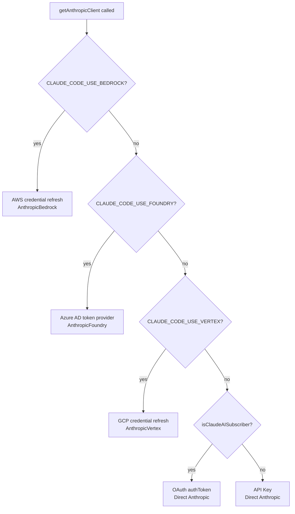
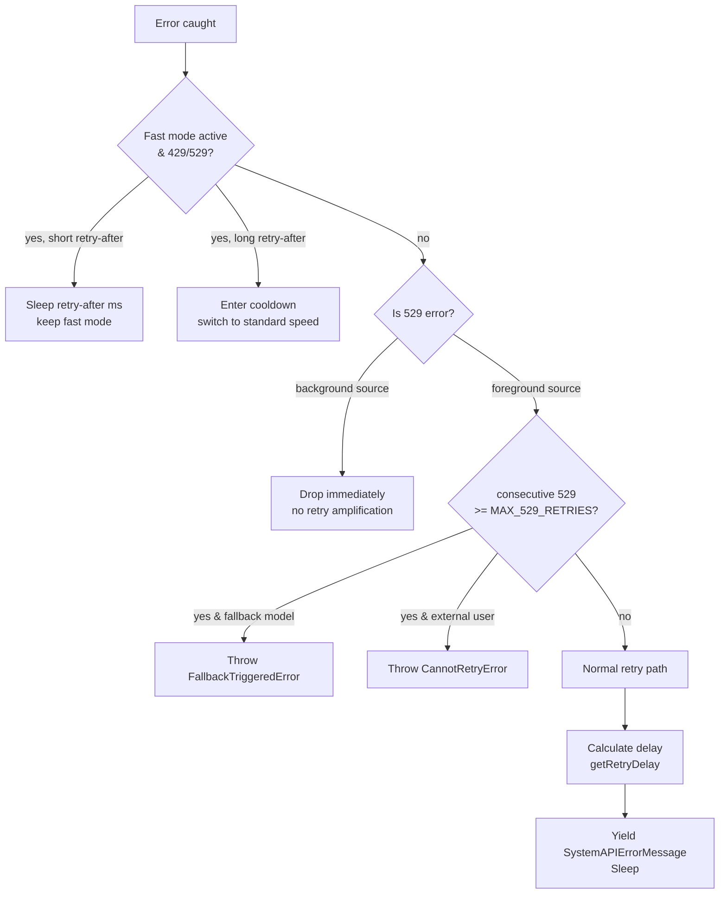
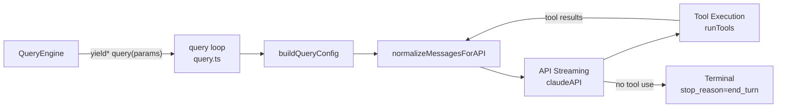
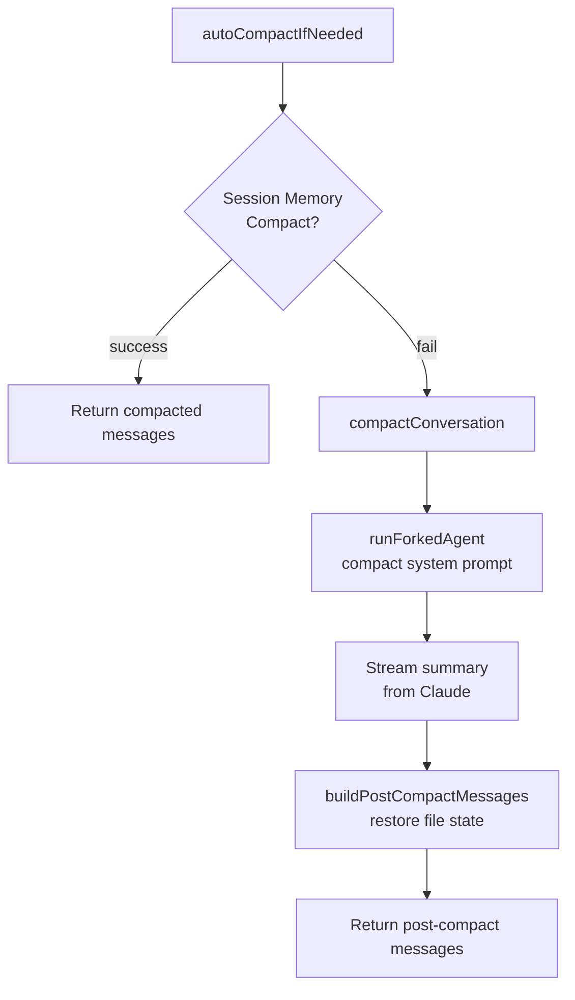

# Chapter 6: Service Layer & API Communication

## Table of Contents

1. [Introduction](#introduction)
2. [Multi-Provider API Client](#multi-provider-api-client)
3. [The Retry System](#the-retry-system)
4. [QueryEngine & Query Loop](#queryengine--query-loop)
5. [Context Compression](#context-compression)
6. [Token Estimation & Cost Tracking](#token-estimation--cost-tracking)
7. [Analytics Service](#analytics-service)
8. [Hands-on: Streaming API Client](#hands-on-streaming-api-client)
9. [Key Takeaways & What's Next](#key-takeaways--whats-next)

---

## Introduction

The service layer is Claude Code's external communication backbone. Every time the model generates a response, every time a tool result is sent, and every time the context window grows — all of it flows through a carefully designed set of services.

Unlike a simple HTTP client wrapper, Claude Code's service layer handles real-world complexity: multiple cloud providers (AWS Bedrock, Google Vertex, Azure Foundry), exponential-backoff retry with observable intermediate states, streaming responses that yield tokens in real time, context compression when conversations grow too long, and an analytics pipeline that protects user privacy at the type level.

This chapter dissects each layer in depth.

```
┌─────────────────────────────────────────────────────────────────┐
│                         Service Layer                           │
│                                                                 │
│  ┌──────────────┐  ┌──────────────┐  ┌──────────────────────┐  │
│  │  API Client  │  │  Retry Sys.  │  │    Query Engine      │  │
│  │  (client.ts) │  │(withRetry.ts)│  │  (QueryEngine.ts /   │  │
│  │              │  │              │  │      query.ts)        │  │
│  └──────┬───────┘  └──────┬───────┘  └──────────┬───────────┘  │
│         │                 │                      │              │
│  ┌──────▼───────────────────────────────────────▼───────────┐  │
│  │           Context Compression (compact.ts)               │  │
│  └──────────────────────────────────────────────────────────┘  │
│                                                                 │
│  ┌────────────────────┐  ┌────────────────────────────────────┐ │
│  │  Token Estimation  │  │     Analytics (index.ts)           │ │
│  │(tokenEstimation.ts)│  │  + Cost Tracker (cost-tracker.ts)  │ │
│  └────────────────────┘  └────────────────────────────────────┘ │
└─────────────────────────────────────────────────────────────────┘
```

---

## Multi-Provider API Client

### The Factory Function

The entry point for all API communication is `getAnthropicClient()` in `src/services/api/client.ts`. It's an async factory function that inspects environment variables to decide which backend to create:

```
src/services/api/client.ts:88
export async function getAnthropicClient({
  apiKey, maxRetries, model, fetchOverride, source
}): Promise<Anthropic>
```

The function returns an `Anthropic`-typed object even for non-Anthropic providers. This "lying about the return type" comment (`// we have always been lying about the return type`, line 188) is intentional: all four SDKs share the same message API surface, so callers never need to know which provider is in use.

### Provider Selection Logic

Provider selection is entirely environment-variable driven:

```
client.ts:153-315

CLAUDE_CODE_USE_BEDROCK=true  → AnthropicBedrock (AWS)
CLAUDE_CODE_USE_FOUNDRY=true  → AnthropicFoundry (Azure)
CLAUDE_CODE_USE_VERTEX=true   → AnthropicVertex (GCP)
(none)                        → Anthropic (Direct API)
```



### Shared ARGS Configuration

All four provider paths share the same base configuration object (`ARGS`, line 141):

```typescript
// client.ts:141-152
const ARGS = {
  defaultHeaders,         // session ID, user-agent, container ID
  maxRetries,             // passed in from caller
  timeout: parseInt(process.env.API_TIMEOUT_MS || String(600 * 1000), 10),
  dangerouslyAllowBrowser: true,
  fetchOptions: getProxyFetchOptions({ forAnthropicAPI: true }),
}
```

The 600-second (10-minute) default timeout is intentional — agentic tasks executing long shell commands can legitimately take several minutes.

### Custom Headers and Request ID Injection

The `buildFetch()` function (line 358) wraps the native `fetch` to inject a per-request UUID into `x-client-request-id`. This header lets the Anthropic API team correlate server logs with timed-out requests that never received a server request ID.

```typescript
// client.ts:374-376
if (injectClientRequestId && !headers.has(CLIENT_REQUEST_ID_HEADER)) {
  headers.set(CLIENT_REQUEST_ID_HEADER, randomUUID())
}
```

Notice the guard: only first-party Anthropic API calls get this header. Bedrock, Vertex, and Foundry don't log it, and unknown headers risk rejection by strict proxies.

### AWS Bedrock: Region Override for Small Models

The Bedrock branch has a subtle optimization (line 157-160): if the model being requested is the "small fast model" (Haiku), it checks `ANTHROPIC_SMALL_FAST_MODEL_AWS_REGION`. This lets operators put the inexpensive model in a different region — useful in enterprise deployments where the main model is in a compliance-sensitive region and the fast utility model can live elsewhere.

### Vertex: Metadata Server Timeout Prevention

The Vertex branch contains a comment worth reading in full (lines 241-288). The `google-auth-library` discovers the GCP project ID in this order:

1. Environment variables (`GCLOUD_PROJECT`, `GOOGLE_CLOUD_PROJECT`)
2. Credential files (service account JSON, ADC)
3. `gcloud` config
4. GCE metadata server — which causes a **12-second timeout** outside GCP

The code explicitly avoids setting `projectId` as a fallback when the user has configured other discovery methods, to prevent interfering with their existing auth setup.

---

## The Retry System

`withRetry.ts` is arguably the most complex file in the service layer. Its `withRetry()` function is an `AsyncGenerator` — a design choice with significant implications.

### AsyncGenerator Pattern: Observable Intermediate States

```typescript
// withRetry.ts:170-178
export async function* withRetry<T>(
  getClient: () => Promise<Anthropic>,
  operation: (client: Anthropic, attempt: number, context: RetryContext) => Promise<T>,
  options: RetryOptions,
): AsyncGenerator<SystemAPIErrorMessage, T>
```

The return type is `AsyncGenerator<SystemAPIErrorMessage, T>`. This means:
- The generator **yields** `SystemAPIErrorMessage` objects during waits between retries
- The generator **returns** `T` on success
- Each yielded message surfaces through `QueryEngine` as a `{type:'system', subtype:'api_retry'}` event on stdout

This is clever: the UI layer can show real-time "Retrying in 8s..." messages without `withRetry` needing to know anything about the UI. The information flows upstream through the generator protocol.

### Retry Decision Tree



### The 529 "Overloaded" Error

HTTP 529 is Anthropic's custom "server overloaded" status. The code has an interesting comment at line 618-619:

```typescript
// Sometimes the SDK fails to properly pass the 529 status code during streaming
(error.message?.includes('"type":"overloaded_error"') ?? false)
```

During streaming, the SDK may receive the 529 body but fail to set `error.status = 529`. The code defensively checks the error message text as a fallback.

### Foreground vs Background 529 Retry

`FOREGROUND_529_RETRY_SOURCES` (line 62-82) is a set of query sources where the user is actively waiting for results. These sources retry on 529. Everything else (title generation, suggestions, classifiers) bails immediately:

```typescript
// withRetry.ts:56-61
// Foreground query sources where the user IS blocking on the result — these
// retry on 529. Everything else (summaries, titles, suggestions, classifiers)
// bails immediately: during a capacity cascade each retry is 3-10× gateway
// amplification, and the user never sees those fail anyway.
const FOREGROUND_529_RETRY_SOURCES = new Set<QuerySource>([
  'repl_main_thread', 'sdk', 'agent:custom', 'agent:default', ...
])
```

The reasoning is explicit: during a capacity cascade, retrying background requests amplifies load 3-10x, and users never see those failures anyway.

### Fast Mode Retry Strategy

Fast Mode (turbo speed via prompt caching) has its own retry logic. When a 429/529 arrives:

1. If `retry-after` < 20 seconds: wait and retry **with fast mode still active** (preserving prompt cache coherence)
2. If `retry-after` >= 20 seconds: enter "cooldown" for at least 10 minutes, switch to standard speed

```typescript
// withRetry.ts:284-303
const retryAfterMs = getRetryAfterMs(error)
if (retryAfterMs !== null && retryAfterMs < SHORT_RETRY_THRESHOLD_MS) {
  // Short retry: wait and retry with fast mode still active
  await sleep(retryAfterMs, options.signal, { abortError })
  continue
}
// Long retry: enter cooldown (switches to standard speed model)
const cooldownMs = Math.max(
  retryAfterMs ?? DEFAULT_FAST_MODE_FALLBACK_HOLD_MS,
  MIN_COOLDOWN_MS,
)
triggerFastModeCooldown(Date.now() + cooldownMs, cooldownReason)
```

The "preserve prompt cache" concern is real: switching models during a fast-mode session would invalidate the cached prefix.

### Backoff Algorithm

The `getRetryDelay()` function (line 530-548) implements classic exponential backoff with jitter:

```typescript
export function getRetryDelay(
  attempt: number,
  retryAfterHeader?: string | null,
  maxDelayMs = 32000,
): number {
  if (retryAfterHeader) {
    const seconds = parseInt(retryAfterHeader, 10)
    if (!isNaN(seconds)) return seconds * 1000
  }

  // BASE_DELAY_MS = 500ms
  const baseDelay = Math.min(BASE_DELAY_MS * Math.pow(2, attempt - 1), maxDelayMs)
  const jitter = Math.random() * 0.25 * baseDelay  // up to 25% jitter
  return baseDelay + jitter
}
```

The delay progression with `BASE_DELAY_MS = 500`:
- Attempt 1: 500ms + jitter
- Attempt 2: 1000ms + jitter  
- Attempt 3: 2000ms + jitter
- Attempt 4: 4000ms + jitter
- ...caps at 32000ms (32 seconds)

### OAuth Token Refresh on 401

The main retry loop has special handling for authentication errors (line 239-251). On a 401 "token expired" or 403 "token revoked", it calls `handleOAuth401Error()` to force a token refresh, then recreates the client with fresh credentials. This is why `client` is nullable — it starts as `null` and gets lazily initialized.

### Persistent Retry Mode (Unattended Sessions)

`CLAUDE_CODE_UNATTENDED_RETRY` enables a special mode for CI/unattended sessions. In this mode:
- 429/529 errors retry indefinitely
- Max backoff is 5 minutes (vs 32 seconds normal)
- Long waits are chunked into 30-second heartbeats (`HEARTBEAT_INTERVAL_MS = 30_000`)
- Each chunk yields a `SystemAPIErrorMessage` to keep the host from marking the session idle

```typescript
// withRetry.ts:488-503
let remaining = delayMs
while (remaining > 0) {
  if (error instanceof APIError) {
    yield createSystemAPIErrorMessage(error, remaining, reportedAttempt, maxRetries)
  }
  const chunk = Math.min(remaining, HEARTBEAT_INTERVAL_MS)
  await sleep(chunk, options.signal, { abortError })
  remaining -= chunk
}
```

---

## QueryEngine & Query Loop

### Architecture Overview

`QueryEngine.ts` is the high-level orchestrator. It wraps the core `query()` function from `query.ts`, adding session management, memory loading, tool setup, and message post-processing.

`query.ts` contains the inner loop: the tight cycle of building an API request, streaming the response, executing tools, and continuing until a terminal condition is reached.



### Query Loop State

The query loop maintains mutable state across iterations (query.ts:204-217):

```typescript
type State = {
  messages: Message[]
  toolUseContext: ToolUseContext
  autoCompactTracking: AutoCompactTrackingState | undefined
  maxOutputTokensRecoveryCount: number
  hasAttemptedReactiveCompact: boolean
  maxOutputTokensOverride: number | undefined
  pendingToolUseSummary: Promise<ToolUseSummaryMessage | null> | undefined
  stopHookActive: boolean | undefined
  turnCount: number
  transition: Continue | undefined
}
```

The `transition` field records why the previous iteration continued (e.g., "tool_use", "max_output_tokens_recovery", "auto_compact"). This lets tests assert that specific recovery paths fired without inspecting message content.

### QueryParams

```typescript
// query.ts:181-198
export type QueryParams = {
  messages: Message[]
  systemPrompt: SystemPrompt
  userContext: { [k: string]: string }
  systemContext: { [k: string]: string }
  canUseTool: CanUseToolFn
  toolUseContext: ToolUseContext
  fallbackModel?: string
  querySource: QuerySource
  maxOutputTokensOverride?: number
  maxTurns?: number
  skipCacheWrite?: boolean
  taskBudget?: { total: number }
  deps?: QueryDeps
}
```

The `querySource` field is the "who is asking" label — it flows through to `withRetry` to control 529 retry behavior, analytics attribution, and Fast Mode handling.

### Config Snapshot at Entry

```typescript
// query.ts:295
const config = buildQueryConfig()
```

`buildQueryConfig()` snapshots all environment/statsig/session state once at loop entry. The comment explains why `feature()` gates are excluded from `QueryConfig`: the loop reads them lazily each iteration so that a flag flip mid-session takes immediate effect without restarting.

### The Streaming Loop

The core inner loop invokes `withRetry()` which calls `queryModelWithStreaming()`. Each streaming chunk is yielded upstream through the `AsyncGenerator` chain:

```
withRetry<T> → yields SystemAPIErrorMessage (on retry)
             → returns T (on success)

queryModelWithStreaming → yields StreamEvent tokens
                       → returns AssistantMessage (final)
```

Tool use is handled by `runTools()` (from `toolOrchestration.ts`), which executes tool calls in parallel where possible and returns `ToolResultBlockParam[]` to append to the next message.

---

## Context Compression

Context compression is one of the more sophisticated subsystems in Claude Code. It handles the fundamental constraint: every API call must fit within the model's context window.

### The Threshold System

`autoCompact.ts` defines a layered threshold system (lines 62-65):

```typescript
export const AUTOCOMPACT_BUFFER_TOKENS = 13_000
export const WARNING_THRESHOLD_BUFFER_TOKENS = 20_000
export const ERROR_THRESHOLD_BUFFER_TOKENS = 20_000
export const MANUAL_COMPACT_BUFFER_TOKENS = 3_000
```

Starting from the effective context window (model max minus 20K for output), these thresholds trigger progressively more urgent actions:

```
Effective Context Window
│
├─ effectiveWindow - 20K  ← Warning threshold
├─ effectiveWindow - 20K  ← Error threshold (same, two separate signals)
├─ effectiveWindow - 13K  ← Auto-compact threshold (triggers compression)
└─ effectiveWindow - 3K   ← Blocking limit (user cannot continue)
```

### Session Memory Compaction Priority

Before running a full conversation compaction, `autoCompactIfNeeded()` (line 241) tries a lighter-weight option first:

```typescript
// autoCompact.ts:287-309
const sessionMemoryResult = await trySessionMemoryCompaction(
  messages,
  toolUseContext.agentId,
  recompactionInfo.autoCompactThreshold,
)
if (sessionMemoryResult) {
  // Session memory compaction succeeded — skip full compact
  return { wasCompacted: true, compactionResult: sessionMemoryResult }
}
```

Session Memory Compaction prunes old messages by updating a persistent "memory" file outside the conversation, preserving recent context. This is faster and cheaper than summarizing the entire conversation.

### Circuit Breaker

The circuit breaker (line 258-265) prevents hammering the API with doomed compaction attempts:

```typescript
const MAX_CONSECUTIVE_AUTOCOMPACT_FAILURES = 3

if (
  tracking?.consecutiveFailures !== undefined &&
  tracking.consecutiveFailures >= MAX_CONSECUTIVE_AUTOCOMPACT_FAILURES
) {
  return { wasCompacted: false }
}
```

The comment explains the motivation: before this fix, sessions where context was irrecoverably over the limit were making ~250,000 wasted API calls per day globally.

### Full Compaction via Forked Agent

When session memory compaction fails, `compactConversation()` in `compact.ts` runs a **forked agent** to summarize the conversation:



The forked agent runs with `cacheSafeParams` that allow it to share the parent's prompt cache (line 53-54 in compact.ts imports `runForkedAgent` from `forkedAgent.js`). This is important for cost: the forked compaction agent doesn't need to re-pay for the cached prefix.

### Image Stripping Before Compaction

`stripImagesFromMessages()` (compact.ts:145) removes image and document blocks before sending the conversation for summarization. Images:
1. Don't help the summarizer (it's generating text, not analyzing images)
2. Can cause the compaction request itself to hit the prompt-too-long limit

Image blocks are replaced with `[image]` placeholders so the summary notes that an image was shared.

### Recursion Guards

`shouldAutoCompact()` (autoCompact.ts:160) checks the `querySource`:

```typescript
if (querySource === 'session_memory' || querySource === 'compact') {
  return false
}
```

Without this, the compaction agent itself could trigger compaction, causing infinite recursion. The forked agent is deliberately excluded from auto-compact.

---

## Token Estimation & Cost Tracking

### Three-Tier Token Counting

Claude Code uses three tiers of token counting with different accuracy/speed tradeoffs:

**Tier 1: API-based counting** (`countMessagesTokensWithAPI`, tokenEstimation.ts:140)
- Calls `anthropic.beta.messages.countTokens()`
- Exact, but costs an API round-trip
- Used for critical decisions (should we compact now?)

**Tier 2: Haiku-based counting** (`countTokensViaHaikuFallback`, tokenEstimation.ts:251)
- Sends a dummy request with `max_tokens: 1` to Haiku (cheap)
- Reads `usage.input_tokens` from the response
- Used when the direct count API is unavailable (some Vertex regions)

**Tier 3: Rough estimation** (`roughTokenCountEstimation`, tokenEstimation.ts:203)
- `Math.round(content.length / bytesPerToken)` where `bytesPerToken` defaults to 4
- O(1), no API call, slightly inaccurate
- Used for UI warnings and quick decisions

```typescript
// tokenEstimation.ts:203-208
export function roughTokenCountEstimation(
  content: string,
  bytesPerToken: number = 4,
): number {
  return Math.round(content.length / bytesPerToken)
}
```

### File-Type-Aware Estimation

`bytesPerTokenForFileType()` (tokenEstimation.ts:215) adjusts the bytes-per-token ratio based on content type:

```typescript
case 'json':
case 'jsonl':
case 'jsonc':
  return 2  // Dense JSON: many single-char tokens ({, }, :, ,, ")
default:
  return 4
```

JSON files use `bytesPerToken = 2` because `{`, `}`, `:`, `,`, `"` are each 1 character but also 1 token. The standard 4 bytes/token assumption would undercount by 2x.

### Cost Tracking Architecture

`cost-tracker.ts` aggregates per-model usage from `bootstrap/state.ts`. The `addToTotalSessionCost()` function (line 278) does several things in one call:

1. Accumulates model-level counters (input tokens, output tokens, cache read/write)
2. Reports to OpenTelemetry counters (`getCostCounter()`, `getTokenCounter()`)
3. Handles "advisor" sub-usage (tools that call a secondary model)
4. Returns the total cost including advisor costs

The session cost is persisted to `~/.claude/projects/<hash>/config.json` via `saveCurrentSessionCosts()` (line 143), keyed by session ID so it survives restarts.

### Cache Token Accounting

The cost tracker carefully distinguishes:
- `cache_read_input_tokens`: tokens served from cache (cheap)
- `cache_creation_input_tokens`: tokens written to cache (slightly more expensive)
- `input_tokens`: regular input (most expensive per token)

This distinction matters because prompt caching can reduce costs by 80-90% for long repeated system prompts.

---

## Analytics Service

### Zero-Dependency Design

`src/services/analytics/index.ts` is the public API for analytics events. Its most important architectural property is the comment at line 7-9:

```typescript
/**
 * DESIGN: This module has NO dependencies to avoid import cycles.
 * Events are queued until attachAnalyticsSink() is called during app initialization.
 */
```

Because `index.ts` has zero imports from the rest of the codebase, any module can import it without risk of circular dependencies. The actual routing logic lives in `sink.ts`, which is only loaded during app startup.

### Event Queue

Before the sink is attached (during module initialization, before `main()` runs), events are queued:

```typescript
// analytics/index.ts:81-84
const eventQueue: QueuedEvent[] = []
let sink: AnalyticsSink | null = null
```

When `attachAnalyticsSink()` is called, it drains the queue via `queueMicrotask()` — asynchronously, to avoid blocking startup.

### PII Protection at the Type Level

The most creative design decision in the analytics module is this type:

```typescript
// analytics/index.ts:19
export type AnalyticsMetadata_I_VERIFIED_THIS_IS_NOT_CODE_OR_FILEPATHS = never
```

This is a `never` type used as a **marker**. When `logEvent()` accepts metadata, strings must be cast to this type:

```typescript
logEvent('tengu_api_retry', {
  error: (error as APIError).message as AnalyticsMetadata_I_VERIFIED_THIS_IS_NOT_CODE_OR_FILEPATHS,
})
```

The cast is a compile-time signal that the developer has verified this string value doesn't contain PII (code snippets, file paths). Without the cast, TypeScript would reject string values in event metadata. This forces a manual review moment at every analytics call site.

### Proto-Tagged PII Fields

For fields that DO contain PII but need to be logged for debugging:

```typescript
export type AnalyticsMetadata_I_VERIFIED_THIS_IS_PII_TAGGED = never
```

Fields tagged with `_PROTO_` prefix in the metadata key are routed to a privileged-access BigQuery column by the first-party event exporter. The `stripProtoFields()` function (line 45) removes them before sending to Datadog or other general-access storage.

### GrowthBook Feature Flags

`growthbook.ts` integrates with GrowthBook for dynamic feature flags. The exported function `getFeatureValue_CACHED_MAY_BE_STALE()` (referenced throughout the codebase) deliberately signals in its name that:
1. The result is cached (fast, no network call)
2. It may be stale (the GrowthBook SDK refreshes in the background)

This is the right tradeoff for high-frequency hot paths like the retry loop.

### Analytics Sink Routing

`sink.ts` routes events to two backends:
1. **Datadog** — for operational metrics (gated by `tengu_log_datadog_events` feature flag)
2. **First-party event logging** — Anthropic's internal BigQuery pipeline

Events can be sampled via `tengu_event_sampling_config`. When sampled, a `sample_rate` field is automatically added to the metadata so downstream analysis can weight the event correctly.

---

## Hands-on: Streaming API Client

The example code in `examples/06-service-layer/streaming-api.ts` builds a simplified version of Claude Code's streaming API client. It demonstrates:

1. **Multi-provider detection** — environment variable routing
2. **AsyncGenerator retry** — yielding intermediate states
3. **Exponential backoff with jitter** — matching the production algorithm
4. **Token counting** — rough estimation logic

```
examples/06-service-layer/streaming-api.ts
```

Key patterns to study in the example:

### Pattern 1: AsyncGenerator as Observable

```typescript
async function* withRetry<T>(
  operation: () => Promise<T>,
  options: RetryOptions,
): AsyncGenerator<RetryEvent, T> {
  for (let attempt = 1; attempt <= options.maxRetries + 1; attempt++) {
    try {
      return await operation()
    } catch (error) {
      if (attempt > options.maxRetries) throw error
      const delay = getRetryDelay(attempt)
      yield { type: 'retry', attempt, delayMs: delay }
      await sleep(delay)
    }
  }
  throw new Error('unreachable')
}
```

Callers can observe retry events without polling:

```typescript
for await (const event of withRetry(operation, opts)) {
  if (event.type === 'retry') {
    console.log(`Retrying in ${event.delayMs}ms...`)
  }
}
```

### Pattern 2: Backoff Formula

The backoff formula from `withRetry.ts:542-547` is straightforward to implement:

```typescript
function getRetryDelay(attempt: number, maxDelayMs = 32000): number {
  const base = Math.min(500 * Math.pow(2, attempt - 1), maxDelayMs)
  const jitter = Math.random() * 0.25 * base
  return Math.round(base + jitter)
}
```

### Pattern 3: Token Estimation Cascade

```typescript
async function countTokens(text: string): Promise<number> {
  try {
    // Tier 1: API-based (exact)
    return await countWithAPI(text)
  } catch {
    // Tier 3: Rough estimation (fast)
    return Math.round(text.length / 4)
  }
}
```

---

## Key Takeaways & What's Next

### Key Takeaways

1. **AsyncGenerator as the retry primitive** — `withRetry` yields intermediate retry messages through the same channel as regular API output. This keeps the retry logic decoupled from the UI while still allowing real-time feedback.

2. **Provider abstraction through environment variables** — The factory pattern in `client.ts` means the rest of the codebase doesn't need `if (bedrock)` branches. All four providers expose the same `Anthropic` interface.

3. **529 retry is not universal** — Background tasks (title generation, suggestions) bail immediately on 529 to avoid amplifying load during capacity cascades. Only foreground user-facing requests retry.

4. **Context compression uses a circuit breaker** — Three consecutive failures trip the breaker, preventing thousands of wasted API calls in sessions where context is irrecoverably over the limit.

5. **PII protection is enforced at the type level** — The `AnalyticsMetadata_I_VERIFIED_THIS_IS_NOT_CODE_OR_FILEPATHS` marker type requires developers to make an explicit cast, creating a mandatory review moment at every analytics call site.

6. **Token estimation has three tiers** — Exact API counting, cheap Haiku-based counting, and O(1) rough estimation. The right tier is chosen based on how critical the decision is and what's available.

7. **Session costs survive restarts** — Costs are persisted to project config keyed by session ID, so the user sees accurate totals even after reconnecting.

### Architecture Patterns Observed

| Pattern | Where Used | Purpose |
|---------|-----------|---------|
| AsyncGenerator | `withRetry`, `query` | Observable intermediate states |
| Factory function | `getAnthropicClient` | Provider abstraction |
| Zero-dependency module | `analytics/index.ts` | Avoid import cycles |
| Marker types | `AnalyticsMetadata_*` | Compile-time PII enforcement |
| Circuit breaker | `autoCompactIfNeeded` | Prevent wasted API calls |
| Three-tier fallback | Token estimation | Accuracy vs speed tradeoff |

### What's Next

Chapter 7 covers the **Permission System** — how Claude Code decides whether a tool call is allowed, the `CanUseTool` interface, and the consent flow that lets users grant or deny capabilities at runtime.

---

*Source references: `src/services/api/client.ts`, `src/services/api/withRetry.ts`, `src/QueryEngine.ts`, `src/query.ts`, `src/services/compact/compact.ts`, `src/services/compact/autoCompact.ts`, `src/services/tokenEstimation.ts`, `src/cost-tracker.ts`, `src/services/analytics/index.ts`, `src/services/analytics/growthbook.ts`*
