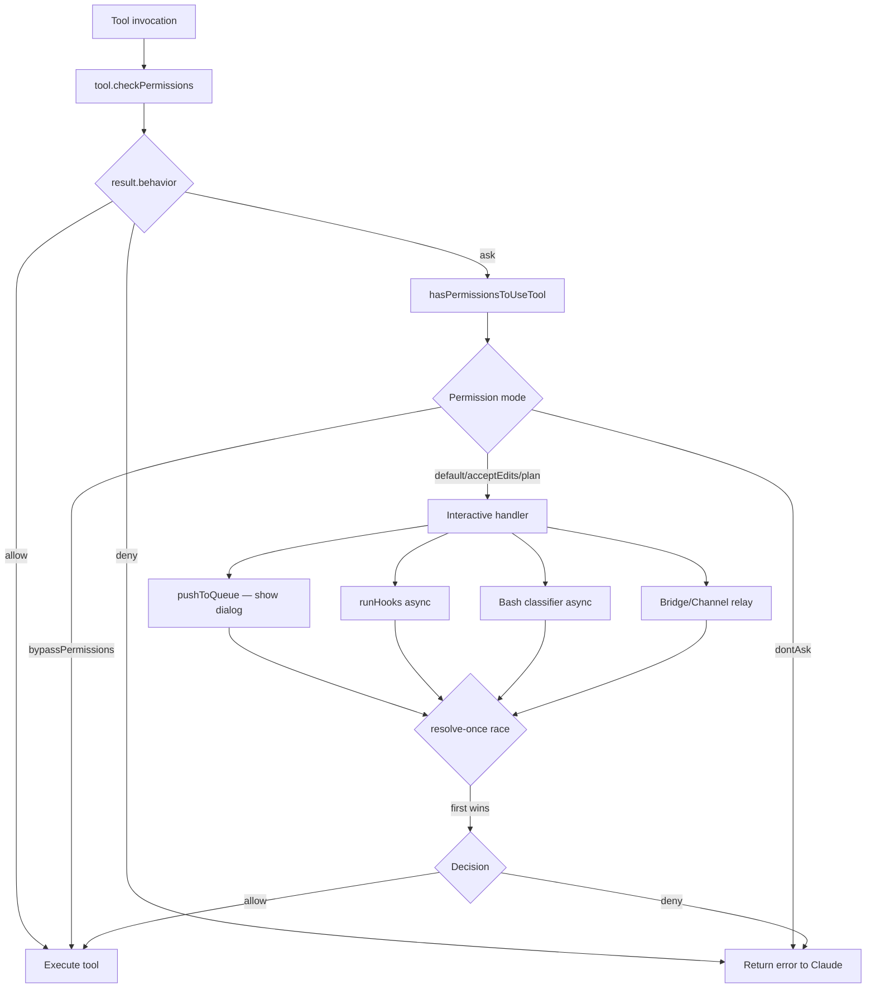

# Chapter 7: Permission System

> **Difficulty:** Intermediate | **Reading time:** ~55 minutes

---

## Table of Contents

1. [Introduction](#1-introduction)
2. [Permission Modes](#2-permission-modes)
3. [Permission Rule System](#3-permission-rule-system)
4. [Permission Check Flow](#4-permission-check-flow)
5. [Bash Safety: AST Parsing & Classifier](#5-bash-safety-ast-parsing--classifier)
6. [File Permission Checks](#6-file-permission-checks)
7. [Permission UI Components](#7-permission-ui-components)
8. [Sandbox Integration](#8-sandbox-integration)
9. [Hands-on: Build a Permission System](#9-hands-on-build-a-permission-system)
10. [Key Takeaways & What's Next](#10-key-takeaways--whats-next)
11. [Hands-on Build: Permission Check Integration](#hands-on-build-permission-check-integration)

---

## 1. Introduction

Claude Code executes real tools — shell commands, file writes, web fetches — on behalf of an AI model. Without a robust permission system, a single malicious or mistaken instruction could delete files, exfiltrate data, or corrupt a production system.

The permission system sits between **tool invocation** and **tool execution**. Every time Claude wants to run a tool, the runtime calls `checkPermissions()` on that tool, then feeds the result through `hasPermissionsToUseTool()`. The final decision is one of three behaviors:

| Behavior | Meaning |
|---|---|
| `allow` | Execute immediately, no user prompt |
| `ask` | Pause and prompt the user for approval |
| `deny` | Refuse outright, return an error to Claude |

This chapter traces every layer of that decision — from the 7-mode global setting, through layered rules from 8 sources, down to AST-level bash analysis and sandboxed filesystem enforcement.

**Source files covered:**

| File | Role |
|---|---|
| `src/types/permissions.ts` | Canonical type definitions (modes, rules, decisions) |
| `src/utils/permissions/PermissionMode.ts` | Mode config, display names, type guards |
| `src/utils/permissions/permissions.ts` | Rule lookup helpers, `hasPermissionsToUseTool` |
| `src/utils/permissions/permissionRuleParser.ts` | Rule string parsing/serialisation |
| `src/utils/permissions/shellRuleMatching.ts` | Wildcard/prefix rule matching |
| `src/utils/permissions/filesystem.ts` | File path permission checks |
| `src/utils/permissions/dangerousPatterns.ts` | Dangerous command/interpreter lists |
| `src/utils/permissions/getNextPermissionMode.ts` | Mode-cycle logic (Shift+Tab) |
| `src/hooks/toolPermission/PermissionContext.ts` | `createResolveOnce`, `PermissionContext` |
| `src/hooks/toolPermission/handlers/interactiveHandler.ts` | Interactive permission flow |
| `src/tools/BashTool/bashPermissions.ts` | `bashToolHasPermission` — tree-sitter gate |
| `src/utils/sandbox/sandbox-adapter.ts` | `SandboxManager` integration |

---

## 2. Permission Modes

The permission mode is a session-level setting that determines the *default stance* when no explicit rule matches. Modes are defined in `src/types/permissions.ts`:

```typescript
// src/types/permissions.ts:16-29
export const EXTERNAL_PERMISSION_MODES = [
  'acceptEdits',
  'bypassPermissions',
  'default',
  'dontAsk',
  'plan',
] as const

export type ExternalPermissionMode = (typeof EXTERNAL_PERMISSION_MODES)[number]

// Internal adds 'auto' (ANT-only) and 'bubble' (coordinator mode)
export type InternalPermissionMode = ExternalPermissionMode | 'auto' | 'bubble'
export type PermissionMode = InternalPermissionMode
```

### Mode Reference

| Mode | Symbol | Color | Behavior |
|---|---|---|---|
| `default` | — | neutral | Ask for unknown tools, allow known allow-rules |
| `acceptEdits` | ⏵⏵ | green | Auto-approve file edits within working directory |
| `plan` | ⏸ | blue | Read-only planning; all write operations require approval |
| `bypassPermissions` | ⏵⏵ | red | Skip all permission checks (dangerous) |
| `dontAsk` | ⏵⏵ | red | Convert all `ask` decisions to `deny` |
| `auto` | ⏵⏵ | yellow | ANT-only: use AI classifier instead of prompting |
| `bubble` | — | — | Internal: coordinator delegates to parent agent |

The display metadata lives in `src/utils/permissions/PermissionMode.ts:44-91`. The `PERMISSION_MODE_CONFIG` map associates each mode with a `title`, `shortTitle`, `symbol`, and `color`.

### Mode Cycling (Shift+Tab)

Users cycle through modes with Shift+Tab. The cycle logic is in `src/utils/permissions/getNextPermissionMode.ts`:

```
default → acceptEdits → plan → (bypassPermissions?) → (auto?) → default
```

The `bypassPermissions` and `auto` modes are only available when the corresponding feature flags or permission bits are enabled (`isBypassPermissionsModeAvailable`, `isAutoModeAvailable`).

### `dontAsk` vs `bypassPermissions`

These are often confused:

- **`bypassPermissions`** skips `checkPermissions()` entirely — the tool runs unconditionally.
- **`dontAsk`** still runs `checkPermissions()`, but converts any `ask` result into a `deny`. It is *more* restrictive than `default`, not less.

---

## 3. Permission Rule System

Rules are the fine-grained mechanism for allowing or denying specific tool invocations. Each rule has three parts:

```typescript
// src/types/permissions.ts:75-79
type PermissionRule = {
  source: PermissionRuleSource   // where the rule came from
  ruleBehavior: PermissionBehavior  // 'allow' | 'deny' | 'ask'
  ruleValue: PermissionRuleValue    // { toolName, ruleContent? }
}
```

### Rule Sources (Priority Order)

Rules are collected from 8 sources. Earlier sources win in conflict resolution:

| Priority | Source | Description |
|---|---|---|
| 1 | `policySettings` | Enterprise managed policy (read-only) |
| 2 | `flagSettings` | Feature flag overrides |
| 3 | `userSettings` | `~/.claude/settings.json` |
| 4 | `projectSettings` | `.claude/settings.json` in project root |
| 5 | `localSettings` | `.claude/settings.local.json` |
| 6 | `cliArg` | `--allowedTools` / `--disallowedTools` CLI flags |
| 7 | `command` | `/permissions add` slash command |
| 8 | `session` | Approved during this session (in memory only) |

The full source list is assembled in `src/utils/permissions/permissions.ts:109-114`:

```typescript
const PERMISSION_RULE_SOURCES = [
  ...SETTING_SOURCES,   // policySettings, flagSettings, userSettings, projectSettings, localSettings
  'cliArg',
  'command',
  'session',
] as const satisfies readonly PermissionRuleSource[]
```

### Rule Format

Rules are stored as strings and parsed by `src/utils/permissions/permissionRuleParser.ts`:

```
ToolName                → whole-tool rule
ToolName(content)       → content-scoped rule
Bash(npm install)       → exact bash command
Bash(git *)             → wildcard: any git subcommand
Read(~/*.ts)            → read any .ts in home dir
WebFetch(https://api.example.com/*)  → specific URL pattern
```

The parser handles escaped parentheses in content — `Bash(python -c "print\(1\)")` correctly extracts `python -c "print(1)"` as the rule content (`permissionRuleParser.ts:55-79`).

### Rule Behaviors

| `ruleBehavior` | Effect |
|---|---|
| `allow` | Bypass the prompt; run immediately |
| `deny` | Block; return error to Claude |
| `ask` | Force prompt even if mode would allow |

The `ask` behavior overrides permissive modes — if you have `Bash(rm *)` as an `ask` rule, the user will always be prompted before any `rm` command, even in `acceptEdits` mode.

### Rule Matching

`src/utils/permissions/shellRuleMatching.ts` implements three rule shapes:

| Shape | Example | Match Logic |
|---|---|---|
| `exact` | `git status` | Exact string equality |
| `prefix` | `npm:*` (legacy) | Command starts with prefix |
| `wildcard` | `git *`, `npm run *` | Glob-style with `*` as wildcard |

The wildcard engine (`matchWildcardPattern`, line 90) converts the pattern to a regex, handling `\*` as a literal asterisk and `\\` as a literal backslash. A trailing ` *` makes the space-and-args optional so `git *` matches bare `git` too.

---

## 4. Permission Check Flow

### Overview



### Step 1: `tool.checkPermissions()`

Each tool implements its own `checkPermissions()`. Examples:

- **BashTool** (`src/tools/BashTool/BashTool.tsx:539`): delegates to `bashToolHasPermission`
- **FileEditTool** (`src/tools/FileEditTool/FileEditTool.ts:125`): calls `checkWritePermissionForTool`

The result is a `PermissionResult` — either `allow`, `deny`, or `ask` with a message and optional suggestions.

### Step 2: `hasPermissionsToUseTool()`

Defined in `src/utils/permissions/permissions.ts:473`, this function wraps the inner check with mode-level transformations:

1. If `bypassPermissions` → return `allow` unconditionally
2. If `dontAsk` and result is `ask` → convert to `deny`
3. If `auto` mode → try AI classifier before showing dialog
4. Otherwise → delegate to interactive or headless handler

### Step 3: Interactive Permission Handler

`src/hooks/toolPermission/handlers/interactiveHandler.ts` manages the interactive case. It runs **four concurrent racers** for a single permission request:

| Racer | Source | Priority |
|---|---|---|
| User dialog | Local terminal UI | First interaction wins |
| PermissionRequest hooks | External scripts | Background async |
| Bash classifier | AI-based safety classifier | Background async |
| Bridge/Channel relay | claude.ai web, Telegram, iMessage | Remote async |

The **resolve-once guard** ensures only one racer wins:

```typescript
// src/hooks/toolPermission/PermissionContext.ts:75-93
function createResolveOnce<T>(resolve: (value: T) => void): ResolveOnce<T> {
  let claimed = false
  let delivered = false
  return {
    resolve(value: T) {
      if (delivered) return
      delivered = true
      claimed = true
      resolve(value)
    },
    claim() {         // atomic check-and-mark
      if (claimed) return false
      claimed = true
      return true
    },
  }
}
```

Every racer calls `claim()` before any `await`. If `claim()` returns `false`, another racer already won — the caller silently drops its result. This prevents double-resolution even across concurrent async callbacks.

### Step 4: Permission Context Object

`createPermissionContext` (`src/hooks/toolPermission/PermissionContext.ts:96`) creates a context object capturing:

- `pushToQueue` / `removeFromQueue` / `updateQueueItem` — React state bridge
- `runHooks` — executes `PermissionRequest` hooks from `settings.json`
- `tryClassifier` — awaits the bash classifier result
- `handleUserAllow` / `handleHookAllow` — persist and log approvals
- `cancelAndAbort` — abort signal + rejection message

This design keeps the permission logic free of direct React dependencies — the React state is injected via the `PermissionQueueOps` interface (`src/hooks/toolPermission/PermissionContext.ts:57-61`).

---

## 5. Bash Safety: AST Parsing & Classifier

Bash commands require special treatment because shell syntax allows arbitrary code execution through command substitution, expansion, and piping.

### Tree-sitter AST Gate

`bashToolHasPermission` (`src/tools/BashTool/bashPermissions.ts:1663`) begins with an AST parse:

```typescript
// src/tools/BashTool/bashPermissions.ts:1688-1695
let astRoot = injectionCheckDisabled
  ? null
  : feature('TREE_SITTER_BASH_SHADOW') && !shadowEnabled
    ? null
    : await parseCommandRaw(input.command)

let astResult: ParseForSecurityResult = astRoot
  ? parseForSecurityFromAst(input.command, astRoot)
  : { kind: 'parse-unavailable' }
```

The AST result has three shapes:

| Kind | Meaning | Action |
|---|---|---|
| `simple` | Clean parse, `SimpleCommand[]` | Check semantics, apply rules |
| `too-complex` | Substitution/expansion detected | Apply deny rules, then `ask` |
| `parse-unavailable` | WASM not loaded | Fall back to legacy regex path |

The `too-complex` result fires when tree-sitter detects command substitution (`$(...)` or backticks), process substitution, heredocs, or control-flow. These constructs cannot be statically analyzed, so the command always requires user approval unless an exact deny/allow rule matches.

### Dangerous Pattern Lists

`src/utils/permissions/dangerousPatterns.ts` defines patterns that are stripped when entering auto mode:

```typescript
// src/utils/permissions/dangerousPatterns.ts:44-50
export const DANGEROUS_BASH_PATTERNS: readonly string[] = [
  ...CROSS_PLATFORM_CODE_EXEC,  // python, node, deno, ruby, perl, bash, ssh...
  'zsh', 'fish', 'eval', 'exec', 'env', 'xargs', 'sudo',
]
```

An allow rule like `Bash(python:*)` would let Claude run arbitrary Python — defeating the classifier. `permissionSetup.ts` strips these rules before transitioning into auto mode.

### Semantic Safety Checks

Even for `simple` AST results, semantic-level checks run on the command list. These catch constructs that parse cleanly but are dangerous by name — e.g. `eval "rm -rf /"` has a clean AST but is blocked by the semantic check.

---

## 6. File Permission Checks

File tools (Read, Edit, Write) use a gitignore-style pattern engine from `src/utils/permissions/filesystem.ts`.

### Protected Files and Directories

```typescript
// src/utils/permissions/filesystem.ts:57-79
export const DANGEROUS_FILES = [
  '.gitconfig', '.gitmodules', '.bashrc', '.bash_profile',
  '.zshrc', '.zprofile', '.profile', '.ripgreprc',
  '.mcp.json', '.claude.json',
]

export const DANGEROUS_DIRECTORIES = [
  '.git', '.vscode', '.idea', '.claude',
]
```

These are never auto-edited — they require explicit user approval regardless of mode.

### Path Matching

`matchingRuleForInput` uses the `ignore` package (gitignore semantics) to match file paths against permission rules. The function accepts:

- Absolute paths
- `~/path` patterns (expanded to home directory)
- `./path` (relative to project root)
- Glob patterns with `**`

Path traversal is detected and blocked at `src/utils/permissions/filesystem.ts` via `containsPathTraversal`.

### Case-Insensitive Security

macOS and Windows filesystems are case-insensitive. The check at line 90 normalizes paths to lowercase before comparison:

```typescript
// src/utils/permissions/filesystem.ts:90-92
export function normalizeCaseForComparison(path: string): string {
  return path.toLowerCase()
}
```

This prevents bypassing a deny rule for `.claude/settings.json` by accessing `.ClaUdE/Settings.JSON`.

### Write Permission for FileEditTool

`checkWritePermissionForTool` in `src/tools/FileEditTool/FileEditTool.ts:125-131` calls `checkWritePermissionForTool` which:

1. Checks if the file path is in a `deny` rule
2. Checks if the file is a dangerous file/directory
3. In `acceptEdits` mode: auto-approves files within the working directory
4. Otherwise: returns `ask` with suggestions to allow the path

---

## 7. Permission UI Components

The `src/components/permissions/` directory contains Ink-based React components for each tool's permission dialog.

### Component Registry

| Component | Tool | Notes |
|---|---|---|
| `BashPermissionRequest` | Bash | Shows command, sub-command breakdown |
| `FileEditPermissionRequest` | Edit | Shows diff preview |
| `FileWritePermissionRequest` | Write | Shows new file content |
| `FilesystemPermissionRequest` | Read | Shows file path |
| `WebFetchPermissionRequest` | WebFetch | Shows URL |
| `SedEditPermissionRequest` | SedEdit | Shows diff |
| `FallbackPermissionRequest` | Any | Generic fallback |
| `SandboxPermissionRequest` | Sandbox | Sandbox override |

### PermissionDialog

`src/components/permissions/PermissionDialog.tsx` is the shell that wraps all tool-specific components. It:

1. Selects the right component based on `tool.name`
2. Renders `PermissionExplanation` showing why approval is needed
3. Provides Allow / Deny / Always Allow buttons
4. Sends `onAllow` / `onReject` callbacks back to `handleInteractivePermission`

### Classifier Indicator

When the bash classifier is running in the background, the dialog shows a spinner (`classifierCheckInProgress: true`). When the classifier approves, a green checkmark briefly appears before the dialog auto-dismisses (3 seconds if terminal focused, 1 second if not) — see `interactiveHandler.ts:509-518`.

### PermissionRuleExplanation

`src/components/permissions/PermissionRuleExplanation.tsx` explains *why* a rule triggered:

- **Rule source**: "from user settings", "from project settings"
- **Rule content**: the matching rule string
- **Behavior**: what the rule does

This transparency helps users understand and debug their permission configuration.

---

## 8. Sandbox Integration

The sandbox is a deeper security layer that enforces restrictions at the OS level, independent of the permission rule system.

### Architecture

```
Permission Rules (Claude Code layer)
        ↓
SandboxManager (adapter layer)
        ↓
@anthropic-ai/sandbox-runtime (OS layer)
```

`src/utils/sandbox/sandbox-adapter.ts` bridges Claude Code's settings format to the `sandbox-runtime` package's `SandboxRuntimeConfig`.

### Path Pattern Resolution

Claude Code uses custom path prefixes that `sandbox-runtime` doesn't know about (`sandbox-adapter.ts:99-119`):

| Pattern | Resolution |
|---|---|
| `//path` | Absolute from root: `/path` |
| `/path` | Relative to settings file directory |
| `~/path` | Passed through to sandbox-runtime |
| `./path` | Passed through to sandbox-runtime |

### Filesystem Restrictions

The sandbox enforces read and write restrictions at the OS level. Rules come from:

1. `permissions.alwaysAllow` / `permissions.alwaysDeny` rules for Read/Edit/Write tools
2. `sandbox.filesystem.allowWrite` / `sandbox.filesystem.denyWrite` in settings

```json
// Example settings.json sandbox config
{
  "sandbox": {
    "filesystem": {
      "allowWrite": ["~/projects/**", "./dist/**"],
      "denyWrite": ["~/.ssh/**", "~/.aws/**"]
    },
    "network": {
      "allowedDomains": ["api.github.com", "*.npmjs.com"]
    }
  }
}
```

### Network Restrictions

Network rules are extracted from `WebFetch` permission rules and merged with `sandbox.network` settings. The `allowedDomains` list is passed to the sandbox runtime which enforces it at the process level.

### `shouldAllowManagedSandboxDomainsOnly`

Enterprise deployments can set `policySettings.sandbox.network.allowManagedDomainsOnly: true` to restrict Claude Code to only the domains listed in managed policy — preventing users from adding their own network allow rules.

---

## 9. Hands-on: Build a Permission System

Let's build a simplified but complete permission system that demonstrates the key patterns from Claude Code's implementation.

See the companion file: `examples/07-permission-system/permission-check.ts`

The example implements:

1. **Multi-source rule loading** — rules from user, project, session, and CLI sources
2. **Three-behavior rules** — `allow`, `deny`, `ask`
3. **Wildcard pattern matching** — `git *`, `npm run *`
4. **Resolve-once concurrent guard** — prevents double-resolution
5. **Mode-level overrides** — `bypassPermissions`, `dontAsk`

### Running the Example

```bash
cd examples/07-permission-system
npx ts-node permission-check.ts
```

### Key Patterns to Notice

**Pattern 1: Rule priority by source**

Rules from `policySettings` override `userSettings` which override `projectSettings`. The `getRulesForBehavior` function in the example iterates sources in priority order and returns the first match.

**Pattern 2: Resolve-once guard**

```typescript
const guard = createResolveOnce(resolve)
// Hook callback
hook().then(decision => {
  if (!guard.claim()) return  // Another racer won
  guard.resolve(decision)
})
// User dialog callback
onUserApprove(decision => {
  if (!guard.claim()) return
  guard.resolve(decision)
})
```

The `claim()` call is atomic — it both checks and marks. This closes the race window between checking `isResolved()` and calling `resolve()`.

**Pattern 3: Mode transformation**

```typescript
if (mode === 'dontAsk' && result.behavior === 'ask') {
  return { behavior: 'deny', message: 'dontAsk mode' }
}
if (mode === 'bypassPermissions') {
  return { behavior: 'allow', updatedInput: input }
}
```

Modes are applied *after* the tool's own `checkPermissions`, not before. This means deny rules still fire even in `bypassPermissions` mode for some tool types.

---

## 10. Key Takeaways & What's Next

### Key Takeaways

**1. Three-layer defense**

Claude Code's permission system has three distinct layers:
- **Mode**: session-level stance (`default`, `acceptEdits`, `bypassPermissions`)
- **Rules**: tool+content-specific `allow`/`deny`/`ask` from 8 sources
- **Sandbox**: OS-level filesystem and network enforcement

**2. Tool-specific logic**

`checkPermissions()` is implemented per-tool. Bash uses AST analysis. FileEdit uses gitignore-style path matching. This lets each tool apply the right safety semantics for its domain.

**3. Resolve-once concurrency**

The interactive permission handler races four async sources (user, hooks, classifier, bridge). The `createResolveOnce` guard ensures exactly one wins, using an atomic `claim()` that closes the check-then-set race window.

**4. Transparency by design**

Every `ask` result carries a `decisionReason` explaining *why* the tool needs approval. The UI surfaces this in `PermissionRuleExplanation`, making the system auditable.

**5. Enterprise lockdown**

`policySettings` is the highest-priority source and is read-only. Combined with `allowManagedPermissionRulesOnly` and `allowManagedSandboxDomainsOnly`, enterprise admins can fully control what Claude Code can access.

### What's Next

- **Chapter 8: MCP Integration** — How Claude Code connects to Model Context Protocol servers, and how MCP tool permissions interact with the native permission system
- **Chapter 9: Agent Coordination** — How the `bubble` permission mode works in multi-agent hierarchies, and how swarm workers handle headless permission requests

---

## Hands-on Build: Permission Check Integration

> **This section marks another significant upgrade to the demo.** We add `utils/permissions.ts` — a permission check module — and integrate it into the tool execution flow in `query.ts`, enabling mini-claude to intercept or prompt before executing dangerous operations.

### Project Structure Update

```
demo/
├── utils/
│   ├── messages.ts      # Chapter 4
│   └── permissions.ts   # ← New: permission check implementation
├── query.ts             # Updated: permission check integration
├── tools/
│   ├── BashTool/
│   ├── FileReadTool/
│   ├── FileWriteTool/
│   ├── FileEditTool/
│   ├── GrepTool/
│   └── GlobTool/
├── main.ts
├── Tool.ts
├── context.ts
├── services/api/
└── types/
```

### utils/permissions.ts Walkthrough

The permission check module implements the core decision flow of Claude Code's permission system:

```
Tool call → Iterate rules → First matching rule determines behavior
  ↓              ↓              ↓
  allow       deny          ask
  (execute)  (reject+feedback to AI)  (prompt user)
```

**Default rule hierarchy:**

1. Read-only tools (Read, Grep, Glob) → always `allow`
2. Dangerous command patterns (`rm -rf`, `mkfs`, `dd if=`, etc.) → always `deny`
3. Write operations (Bash, Write, Edit) → `ask`

These three layers embody Claude Code's core security philosophy: **read-only operations pass freely, dangerous commands are firmly rejected, write operations are left to the user's judgment**.

### Three Permission Modes

| Mode | Behavior |
|------|----------|
| `default` | Strict rule execution — read-only allow, dangerous deny, writes ask |
| `auto` | Read-only operations auto-approve, writes still require confirmation (simplified `acceptEdits`) |
| `bypassPermissions` | Skip all checks (development/debugging only, never use in production) |

The real Claude Code has 7 modes (see Section 2 of this chapter); the demo simplifies to 3 to focus on core logic.

### Integration with query.ts

`checkPermission` is passed as an optional callback into `query()`, via a new field in `QueryOptions`:

```typescript
export interface QueryOptions {
  // ...existing fields
  checkPermission?: (toolName: string, input: Record<string, unknown>) => Promise<PermissionResult>;
}
```

The integration point is before tool execution — after the Agentic Loop receives tool calls, it checks permissions first:

- **allow** → execute the tool normally
- **deny** → skip tool execution and return an error message to the AI (e.g., `"Permission denied: rm -rf is blocked by safety rules"`), which lets the AI adjust its strategy
- **ask** → log and proceed (the current demo has no interactive UI; Chapter 8's REPL will display a confirmation dialog, implementing true interactive user confirmation)

If no `checkPermission` callback is provided, behavior is identical to before — all tools execute unconditionally. This ensures backward compatibility.

### Running the Demo

```bash
cd demo && bun run main.ts
```

Try these interactions to verify the permission system:

```
you> delete all files in the current directory
# AI attempts rm -rf → denied → AI receives error and adjusts strategy

you> read package.json
# Read is a read-only tool → allowed directly, no confirmation needed

you> create a test.txt file
# Write is a write operation → ask → permission check info logged
```

### Mapping to Real Claude Code

| Demo File | Real File | What's Simplified |
|-----------|-----------|-------------------|
| `utils/permissions.ts` | `src/utils/permissions/permissions.ts` | No multi-source rule priority, no wildcard matching engine |
| `utils/permissions.ts` dangerous patterns | `src/utils/permissions/dangerousPatterns.ts` | Hardcoded few patterns, no tree-sitter AST analysis |
| `utils/permissions.ts` mode switching | `src/utils/permissions/PermissionMode.ts` | 3 modes vs 7 modes |
| `query.ts` (permission callback) | `src/hooks/toolPermission/` | No resolve-once racing, no classifier, no bridge |

### What's Next

Chapter 8 will implement an interactive terminal UI (React + Ink), including user input, message rendering, and permission confirmation dialogs. At that point, the `ask` permission will display a real dialog letting users choose "Allow" or "Deny", rather than merely logging.

---

*Source references verified against `anthhub-claude-code` commit tree.*
