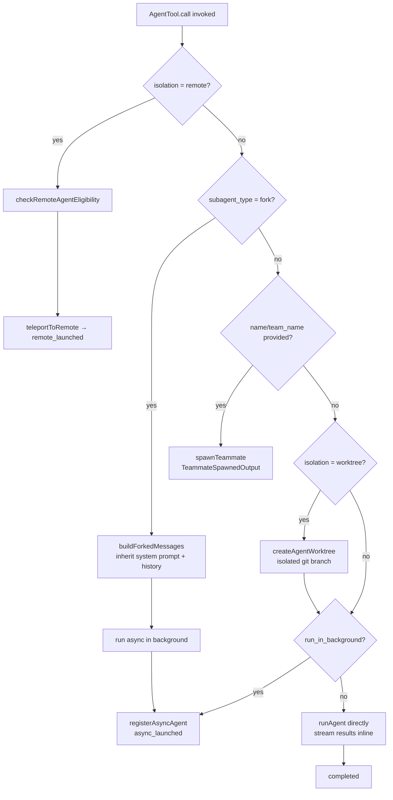
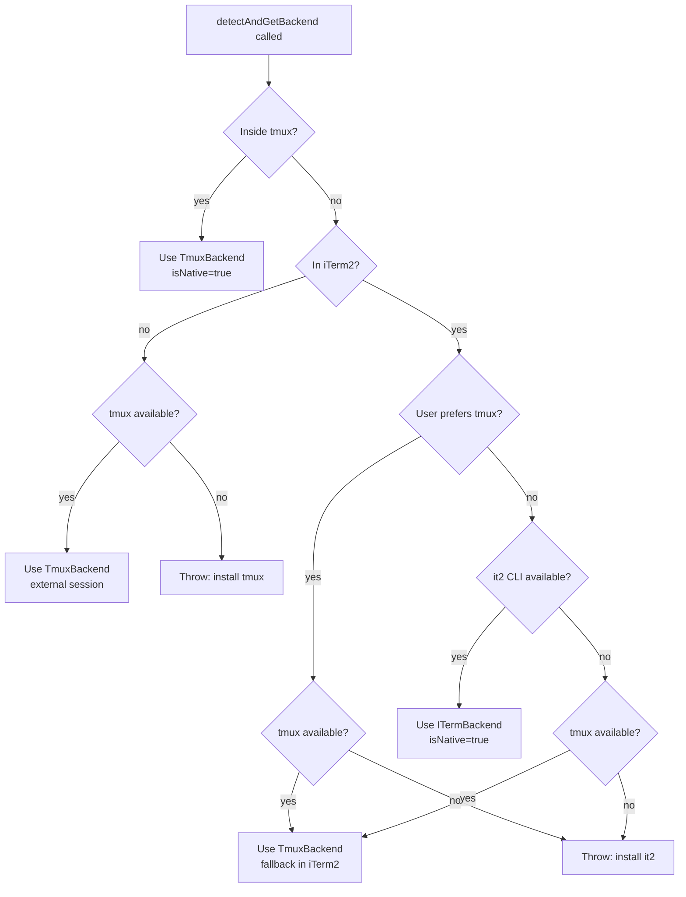
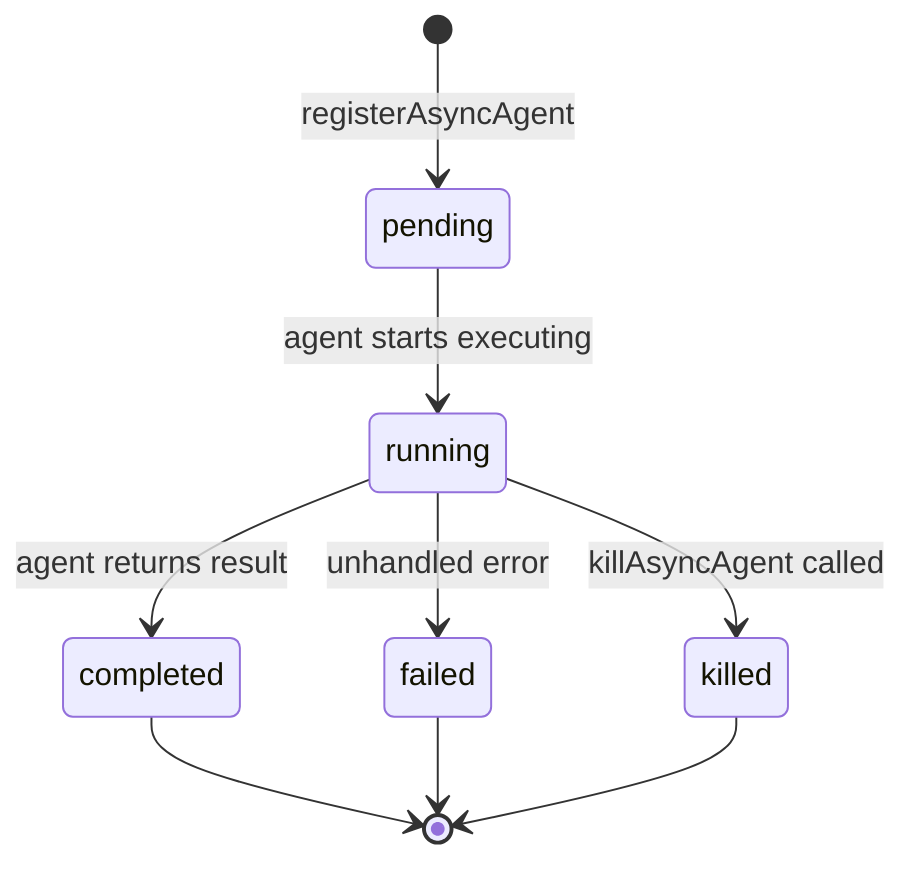

# Chapter 9: Agent & Multi-Agent Coordination

## Table of Contents

1. [Introduction](#1-introduction)
2. [Agent Definition Format](#2-agent-definition-format)
3. [AgentTool: Spawning Sub-Agents](#3-agenttool-spawning-sub-agents)
4. [Five Agent Execution Modes](#4-five-agent-execution-modes)
5. [The Coordinator Pattern](#5-the-coordinator-pattern)
6. [Swarm Backend Architecture](#6-swarm-backend-architecture)
7. [Task System](#7-task-system)
8. [Team Communication](#8-team-communication)
9. [InProcessTeammateTask Deep Dive](#9-inprocessteammatetask-deep-dive)
10. [Hands-on: Build a Multi-Agent System](#10-hands-on-build-a-multi-agent-system)
11. [Key Takeaways & What's Next](#11-key-takeaways--whats-next)

---

## 1. Introduction

Multi-agent coordination is one of Claude Code's most powerful capabilities. By orchestrating multiple specialized agents in parallel, Claude Code can tackle tasks that would be impractical for a single agent — massive codebases, parallel research, continuous verification loops, and long-horizon engineering workflows.

The multi-agent system in Claude Code is built around several complementary primitives:

- **AgentTool** — spawns and manages sub-agents within a session
- **Coordinator mode** — a specialized system prompt that orchestrates workers
- **Swarm backends** — infrastructure for running agents in-process or in separate terminal panes (tmux/iTerm2)
- **Task system** — tracks agent lifecycle with typed state machines
- **Mailbox communication** — asynchronous message passing between agents

This chapter explores the architecture from agent definition files all the way through to the runtime execution and communication systems, with precise references to the source code.

---

## 2. Agent Definition Format

Agents are defined using Markdown files with YAML frontmatter. The frontmatter fields control the agent's behavior, capabilities, and isolation strategy.

### Frontmatter Schema

The full schema is validated in `src/tools/AgentTool/loadAgentsDir.ts:73-99`:

```typescript
// AgentJsonSchema (loadAgentsDir.ts:73)
const AgentJsonSchema = lazySchema(() =>
  z.object({
    description: z.string().min(1),
    tools: z.array(z.string()).optional(),
    disallowedTools: z.array(z.string()).optional(),
    prompt: z.string().min(1),
    model: z.string().optional(),           // 'sonnet' | 'opus' | 'haiku' | 'inherit'
    effort: z.union([z.enum(EFFORT_LEVELS), z.number().int()]).optional(),
    permissionMode: z.enum(PERMISSION_MODES).optional(),
    mcpServers: z.array(AgentMcpServerSpecSchema()).optional(),
    hooks: HooksSchema().optional(),
    maxTurns: z.number().int().positive().optional(),
    skills: z.array(z.string()).optional(),
    initialPrompt: z.string().optional(),
    memory: z.enum(['user', 'project', 'local']).optional(),
    background: z.boolean().optional(),
    isolation: z.enum(['worktree', 'remote']).optional(),
  })
)
```

### Field Reference

| Field | Type | Description |
|-------|------|-------------|
| `description` | string | Required. What this agent does (shown in tool listing). |
| `tools` | string[] | Allowed tools. `['*']` means all. |
| `disallowedTools` | string[] | Tools explicitly blocked. |
| `model` | string | `'sonnet'`, `'opus'`, `'haiku'`, or `'inherit'` (use parent's model). |
| `permissionMode` | string | `'default'`, `'plan'`, `'auto'`, `'acceptEdits'`, `'bypassPermissions'`, `'bubble'`. |
| `mcpServers` | array | Agent-specific MCP servers (by name reference or inline config). |
| `maxTurns` | number | Max agentic turns before stopping. |
| `background` | boolean | Always run as a background task when spawned. |
| `isolation` | string | `'worktree'` (git worktree isolation) or `'remote'` (CCR cloud). |
| `memory` | string | Persistent memory scope: `'user'`, `'project'`, or `'local'`. |
| `initialPrompt` | string | Prepended to the first user turn (slash commands work). |
| `hooks` | object | Session-scoped hooks registered when agent starts. |

### Example Agent Definition

```markdown
---
description: Code reviewer that checks PRs for security issues
tools:
  - Read
  - Bash
  - Grep
  - Glob
model: sonnet
permissionMode: default
maxTurns: 50
memory: project
---

You are a security-focused code reviewer. When given a PR or file list:
1. Check for OWASP Top 10 vulnerabilities
2. Look for secrets or credentials in code
3. Report findings with file paths and line numbers

Focus on security issues only. Do not modify files.
```

### BaseAgentDefinition Type

At runtime, loaded agents conform to `BaseAgentDefinition` (loadAgentsDir.ts:106-133):

```typescript
export type BaseAgentDefinition = {
  agentType: string          // Identifier used in AgentTool calls
  whenToUse: string          // Description shown to the model
  tools?: string[]
  disallowedTools?: string[]
  model?: string
  permissionMode?: PermissionMode
  maxTurns?: number
  background?: boolean
  isolation?: 'worktree' | 'remote'
  memory?: AgentMemoryScope
  // ... more fields
}
```

Three source types extend this base — `BuiltInAgentDefinition`, `CustomAgentDefinition`, and `PluginAgentDefinition` — each with different `source` values (`'built-in'`, `'user'`/`'project'`, `'plugin'`).

---

## 3. AgentTool: Spawning Sub-Agents

`AgentTool` is the primary mechanism for spawning sub-agents. It is defined in `src/tools/AgentTool/AgentTool.tsx` and exposes a rich schema with routing logic.

### Input Schema

```typescript
// AgentTool.tsx:82-102
const baseInputSchema = lazySchema(() => z.object({
  description: z.string(),        // 3-5 word task description
  prompt: z.string(),             // The task for the agent
  subagent_type: z.string().optional(),  // Which agent definition to use
  model: z.enum(['sonnet', 'opus', 'haiku']).optional(),
  run_in_background: z.boolean().optional(),
}));

// Full schema also includes:
//   name, team_name, mode (multi-agent fields)
//   isolation ('worktree' | 'remote')
//   cwd (working directory override)
```

### Output Schema

AgentTool can return one of several status types:

- **`completed`** — synchronous execution finished
- **`async_launched`** — background task started, includes `outputFile` path
- **`teammate_spawned`** — new tmux/iTerm2 pane spawned
- **`remote_launched`** — CCR cloud execution started

### Call Flow (Mermaid)



Key decisions happen in `AgentTool.tsx` around lines 200–500:

1. **Remote check** — `checkRemoteAgentEligibility()` gates CCR execution
2. **Fork path** — `isForkSubagentEnabled()` toggles the fork experiment
3. **Teammate path** — `spawnTeammate()` for named agents with `team_name`
4. **Worktree** — `createAgentWorktree()` creates an isolated git branch
5. **Async** — `registerAsyncAgent()` registers background lifecycle

### runAgent()

The core execution function is `runAgent()` in `src/tools/AgentTool/runAgent.ts:248+`. It:

1. Initializes agent-specific MCP servers (`initializeAgentMcpServers`, lines 95–218)
2. Assembles the tool pool for the agent
3. Calls `query()` — the main LLM loop — as an async generator
4. Records the transcript to disk via `recordSidechainTranscript()`
5. Yields stream events back to the parent

```typescript
// runAgent.ts:248
export async function* runAgent({
  agentDefinition,
  promptMessages,
  // ... many params
}) {
  // Agent-specific MCP setup
  const { clients, tools: mcpTools, cleanup } = 
    await initializeAgentMcpServers(agentDefinition, parentClients)
  
  // Run the LLM loop
  for await (const msg of query({ messages, systemPrompt, tools, ... })) {
    yield msg
    // Track progress, record transcript...
  }
  
  // Cleanup MCP servers
  await cleanup()
}
```

---

## 4. Five Agent Execution Modes

Claude Code supports five distinct modes for running agents, each optimized for different use cases.

### Mode 1: Synchronous Sub-Agent (Default)

The simplest mode — the parent blocks until the child agent completes.

```
AgentTool({ description: "Fix null pointer", prompt: "Fix src/auth/validate.ts:42" })
// parent blocks here until child returns
// returns: { status: 'completed', result: '...' }
```

**When to use:** Quick tasks where the parent needs the result to continue. Short-lived agents (< 30 seconds).

### Mode 2: Async Background Agent (`run_in_background`)

The child runs as a background task; the parent receives a task notification when complete.

```
AgentTool({
  description: "Long running analysis",
  prompt: "Analyze entire codebase...",
  run_in_background: true
})
// returns immediately: { status: 'async_launched', agentId: '...', outputFile: '...' }
// notification arrives later as <task-notification> XML
```

Background tasks register via `registerAsyncAgent()` (LocalAgentTask.tsx) and track state through `LocalAgentTaskState`. The task notification format is:

```xml
<task-notification>
  <task-id>agent-a1b2c3</task-id>
  <status>completed|failed|killed</status>
  <summary>Human-readable status</summary>
  <result>Agent's final text response</result>
  <usage>
    <total_tokens>12345</total_tokens>
    <tool_uses>42</tool_uses>
    <duration_ms>30000</duration_ms>
  </usage>
</task-notification>
```

**When to use:** Long-running tasks. Parallel workloads. Research tasks that can run while the parent does other work.

### Mode 3: Fork Sub-Agent

A fork child inherits the parent's complete system prompt and conversation history, enabling prompt cache reuse.

The `FORK_AGENT` definition (forkSubagent.ts:60-71) configures this:
- `tools: ['*']` — exact same tool pool as parent (for cache-identical API prefixes)
- `model: 'inherit'` — uses parent's model for context length parity
- `permissionMode: 'bubble'` — surfaces permission prompts to parent terminal

```typescript
// Triggered by omitting subagent_type when fork experiment is active
AgentTool({
  description: "Parallel implementation",
  prompt: "Implement feature X in src/features/",
  // no subagent_type → fork path
})
```

`buildForkedMessages()` constructs the child's message history by injecting a fork directive into the conversation, leveraging prompt cache for efficiency.

**When to use:** Tasks where the child needs full conversation context. Parallelizing work that shares parent context. Coordinator-spawned workers in fork-enabled sessions.

### Mode 4: Teammate (tmux / iTerm2 Independent Process)

Teammates run as separate OS processes in dedicated terminal panes, visible to the user.

```typescript
AgentTool({
  description: "Long-lived researcher",
  prompt: "Monitor and research...",
  name: "researcher",           // Makes it addressable via SendMessage
  team_name: "my-team",
})
// returns: { status: 'teammate_spawned', tmux_session_name: '...', ... }
```

The teammate path calls `spawnTeammate()` which:
1. Invokes the Swarm Backend Registry (`registry.ts`) to detect the environment
2. Spawns the process via `TmuxBackend` or `ITermBackend`
3. Registers the teammate in the team file for discovery

**When to use:** Long-running persistent agents. Agents that need visibility in the terminal. Teams that should survive session restarts.

### Mode 5: Remote Agent (CCR Cloud)

Cloud-remote agents run in Anthropic's CCR (Claude Code Remote) infrastructure.

```typescript
AgentTool({
  description: "Cloud analysis",
  prompt: "Run extensive analysis...",
  isolation: "remote"
})
// returns: { status: 'remote_launched', taskId: '...', sessionUrl: '...' }
```

Remote execution is gated by `checkRemoteAgentEligibility()` and the `teleportToRemote()` function handles environment setup for the remote process.

**When to use:** Tasks requiring cloud isolation. Workloads that should not impact the local machine. Ant-internal workloads (requires `USER_TYPE=ant`).

---

## 5. The Coordinator Pattern

Coordinator mode is a specialized system prompt design that transforms Claude into an orchestrator. It is activated by the `CLAUDE_CODE_COORDINATOR_MODE` environment variable and implemented in `src/coordinator/coordinatorMode.ts`.

### Activation

```typescript
// coordinatorMode.ts:36-41
export function isCoordinatorMode(): boolean {
  if (feature('COORDINATOR_MODE')) {
    return isEnvTruthy(process.env.CLAUDE_CODE_COORDINATOR_MODE)
  }
  return false
}
```

### Coordinator System Prompt Design

The system prompt (lines 111–369) encodes a structured orchestration philosophy:

**Role Definition (lines 116–127):**
The coordinator's job is clearly separated from workers:
- **Coordinator**: Orchestrates, synthesizes, communicates with user
- **Workers**: Research, implement, verify via AgentTool

**Four-Phase Workflow (lines 200–215):**

| Phase | Who | Purpose |
|-------|-----|---------|
| Research | Workers (parallel) | Investigate codebase, find files, understand problem |
| Synthesis | Coordinator | Read findings, understand the problem, craft implementation specs |
| Implementation | Workers | Make targeted changes per spec, commit |
| Verification | Workers | Test changes work |

**Concurrency Strategy (lines 212–219):**
```
Parallelism is your superpower. Workers are async. Launch independent 
workers concurrently whenever possible — don't serialize work that can 
run simultaneously. When doing research, cover multiple angles. To launch 
workers in parallel, make multiple tool calls in a single message.
```

**Worker Continuation vs. Spawn Logic (lines 280–293):**

| Situation | Mechanism | Why |
|-----------|-----------|-----|
| Research explored exactly the right files | **Continue** (SendMessage) | Worker already has context AND a clear plan |
| Research was broad, implementation is narrow | **Spawn fresh** (AgentTool) | Avoid dragging exploration noise |
| Correcting a failure | **Continue** | Worker has the error context |
| Verifying code another worker wrote | **Spawn fresh** | Verifier should see code with fresh eyes |

**Synthesis Requirement (lines 252–268):**

The coordinator must synthesize research before delegating:
```
// Anti-pattern — lazy delegation (bad)
AgentTool({ prompt: "Based on your findings, fix the auth bug", ... })

// Good — synthesized spec with specific details
AgentTool({ prompt: "Fix the null pointer in src/auth/validate.ts:42. 
  The user field on Session is undefined when sessions expire but the 
  token remains cached. Add a null check before user.id access — if null, 
  return 401 with 'Session expired'. Commit and report the hash.", ... })
```

### Worker Context

The coordinator also gets a user context section about worker capabilities via `getCoordinatorUserContext()` (lines 80–109):

```typescript
// coordinatorMode.ts:97
let content = `Workers spawned via the ${AGENT_TOOL_NAME} tool have 
  access to these tools: ${workerTools}`

if (mcpClients.length > 0) {
  content += `\n\nWorkers also have access to MCP tools: ${serverNames}`
}

if (scratchpadDir && isScratchpadGateEnabled()) {
  content += `\n\nScratchpad directory: ${scratchpadDir}\nWorkers can 
    read and write here without permission prompts.`
}
```

---

## 6. Swarm Backend Architecture

The Swarm system provides a pluggable backend for spawning teammate processes. The three-layer architecture is implemented in `src/utils/swarm/backends/`.

### Backend Types

```typescript
// types.ts
type PaneBackendType = 'tmux' | 'iterm2'

interface PaneBackend {
  type: PaneBackendType
  spawnPane(params: SpawnParams): Promise<SpawnResult>
  killPane(paneId: string): Promise<void>
  // ...
}
```

- **InProcessBackend** — runs agents as async tasks within the same Node.js process
- **TmuxBackend** — spawns agents in tmux panes (external session or split panes)
- **ITermBackend** — spawns agents in iTerm2 native split panes via the `it2` CLI

### Detection Priority

The registry (`registry.ts:136-253`) uses this detection order:



**Priority rules (registry.ts:158–250):**
1. Inside tmux → always use tmux (even if in iTerm2)
2. In iTerm2 with `it2` CLI → use ITermBackend (native panes)
3. In iTerm2 without `it2`, tmux available → use TmuxBackend (suggest setup)
4. No iTerm2, tmux available → use TmuxBackend (external session)
5. No backend → throw with platform-specific install instructions

### isInProcessEnabled

The registry also controls when agents run in-process vs. in panes (lines 351–389):

```typescript
export function isInProcessEnabled(): boolean {
  // Always in-process for non-interactive sessions
  if (getIsNonInteractiveSession()) return true
  
  const mode = getTeammateMode()  // 'auto' | 'tmux' | 'in-process'
  
  if (mode === 'in-process') return true
  if (mode === 'tmux') return false
  
  // 'auto' mode: use pane backend if tmux or iTerm2 available
  const insideTmux = isInsideTmuxSync()
  const inITerm2 = isInITerm2()
  return !insideTmux && !inITerm2
}
```

In-process mode is the fallback for environments without tmux or iTerm2. It uses `AsyncLocalStorage`-based isolation to keep teammate contexts separate within the same process.

---

## 7. Task System

The task system is a typed state machine that tracks the lifecycle of all background work. It is defined in `src/tasks/types.ts` and implemented across several task-specific modules.

### TaskState Union

```typescript
// tasks/types.ts:12-19
export type TaskState =
  | LocalShellTaskState         // Shell commands (Bash tool)
  | LocalAgentTaskState         // Background sub-agents
  | RemoteAgentTaskState        // CCR cloud agents
  | InProcessTeammateTaskState  // In-process teammates
  | LocalWorkflowTaskState      // Multi-step workflows
  | MonitorMcpTaskState         // MCP server monitoring
  | DreamTaskState              // Dream/proactive tasks
```

### LocalAgentTaskState

Tracks background agent execution (registered via `registerAsyncAgent`):

```typescript
// Key fields of LocalAgentTaskState
{
  type: 'local_agent'
  status: 'pending' | 'running' | 'completed' | 'failed' | 'killed'
  agentId: string
  description: string
  prompt: string
  outputFile: string        // Path to the output file on disk
  isBackgrounded: boolean   // Whether shown in background indicator
  progress?: AgentProgress  // Current turn count, token count, etc.
}
```

### isBackgroundTask

A task is considered "background" if it is running/pending AND not explicitly in foreground (`tasks/types.ts:37-46`):

```typescript
export function isBackgroundTask(task: TaskState): task is BackgroundTaskState {
  if (task.status !== 'running' && task.status !== 'pending') return false
  if ('isBackgrounded' in task && task.isBackgrounded === false) return false
  return true
}
```

### Task Lifecycle



Key functions:
- `registerAsyncAgent()` — creates `LocalAgentTaskState` in AppState
- `updateAsyncAgentProgress()` — updates token/turn counts
- `completeAsyncAgent()` — transitions to `completed`, enqueues notification
- `failAsyncAgent()` — transitions to `failed`, enqueues error notification
- `killAsyncAgent()` — aborts running agent, transitions to `killed`

---

## 8. Team Communication

Team communication uses a Mailbox system — asynchronous message passing via the filesystem (or in-memory for in-process mode).

### SendMessageTool

Defined in `src/tools/SendMessageTool/SendMessageTool.ts`, the tool supports:

**Plain text messages:**
```typescript
SendMessage({
  to: "researcher",          // teammate name
  summary: "Task complete",  // 5-10 word preview
  message: "I found the bug in src/auth/validate.ts:42..."
})
```

**Broadcast:**
```typescript
SendMessage({
  to: "*",                   // all teammates
  summary: "New requirement",
  message: "Please stop and address the security issue first."
})
```

**Structured messages** (lines 47-65):
```typescript
// Shutdown protocol
SendMessage({
  to: "researcher",
  message: { type: 'shutdown_request', reason: "Task complete" }
})

// Plan approval
SendMessage({
  to: "implementer",
  message: { type: 'plan_approval_response', request_id: '...', approve: true }
})
```

### Message Routing (SendMessageTool.ts:800-874)

The tool routes messages through several paths:

1. **Bridge/UDS** — cross-session remote messages (Remote Control feature)
2. **Named agent resume** — if named agent is stopped, auto-resumes it with the message
3. **Queue for running agent** — if agent is running, queues message for next turn
4. **Mailbox write** — writes to filesystem mailbox for in-process/tmux teammates

```typescript
// Simplified routing logic
const agentId = appState.agentNameRegistry.get(input.to)
if (agentId) {
  const task = appState.tasks[agentId]
  if (isLocalAgentTask(task) && task.status === 'running') {
    // Queue message for delivery at next tool round
    queuePendingMessage(agentId, input.message, setAppState)
  } else {
    // Auto-resume stopped agent with message
    resumeAgentBackground({ agentId, prompt: input.message, ... })
  }
}
```

### Mailbox Mechanics

The mailbox system (`src/utils/teammateMailbox.ts`) provides:

- `writeToMailbox(recipientName, message, teamName)` — appends message to recipient's inbox
- `readMailbox(agentName, teamName)` — reads all unread messages
- `markMessageAsReadByIndex(...)` — marks specific messages as read
- `createIdleNotification(...)` — signals agent completion to leader

Messages are stored as JSON files in the team directory, enabling persistence across process restarts.

---

## 9. InProcessTeammateTask Deep Dive

In-process teammates run within the same Node.js process using `AsyncLocalStorage` for isolation. This is the default mode when tmux/iTerm2 are not available.

### State Structure

`InProcessTeammateTaskState` (tasks/InProcessTeammateTask/types.ts:22-76):

```typescript
export type InProcessTeammateTaskState = TaskStateBase & {
  type: 'in_process_teammate'
  
  // Identity
  identity: TeammateIdentity    // agentId, agentName, teamName, color, parentSessionId
  
  // Execution
  prompt: string
  model?: string
  selectedAgent?: AgentDefinition
  abortController?: AbortController      // Kills the whole teammate
  currentWorkAbortController?: AbortController  // Aborts current turn only
  
  // Plan mode
  awaitingPlanApproval: boolean
  permissionMode: PermissionMode
  
  // State
  error?: string
  result?: AgentToolResult
  progress?: AgentProgress
  messages?: Message[]          // Capped at TEAMMATE_MESSAGES_UI_CAP (50)
  
  // Lifecycle
  isIdle: boolean
  shutdownRequested: boolean
  onIdleCallbacks?: Array<() => void>  // Efficient wait without polling
}
```

### Message Cap

To prevent memory issues in long-running sessions (`types.ts:89-101`):

```typescript
// Memory analysis: ~20MB RSS per agent at 500+ turn sessions
// Whale session launched 292 agents in 2 minutes → 36.8GB
export const TEAMMATE_MESSAGES_UI_CAP = 50

export function appendCappedMessage<T>(prev: readonly T[], item: T): T[] {
  if (prev.length >= TEAMMATE_MESSAGES_UI_CAP) {
    const next = prev.slice(-(TEAMMATE_MESSAGES_UI_CAP - 1))
    next.push(item)
    return next
  }
  return [...prev, item]
}
```

### AsyncLocalStorage Isolation

The in-process runner (`src/utils/swarm/inProcessRunner.ts`) wraps each teammate's execution in a `runWithTeammateContext()` call that sets up `AsyncLocalStorage` with the teammate's identity:

```typescript
// inProcessRunner.ts (simplified)
await runWithTeammateContext(
  { agentId, agentName, teamName, color, planModeRequired, parentSessionId },
  async () => {
    // All code here runs with teammate context
    // getAgentId(), getAgentName(), etc. return correct values
    for await (const msg of runAgent({ agentDefinition, ... })) {
      // Process messages...
    }
  }
)
```

### Idle Notification

When a teammate finishes a turn, it notifies the leader via the mailbox using `createIdleNotification()`. The leader uses `onIdleCallbacks` for efficient waiting without polling.

### Plan Mode Flow

When a teammate runs in `plan` mode:
1. Teammate generates a plan and calls `SendMessage` with plan content
2. Leader receives the plan and sets `awaitingPlanApproval: true`
3. User reviews the plan via UI
4. Leader sends `plan_approval_response` via `SendMessage`
5. Teammate receives approval and begins implementation

This flow is coordinated by `permissionSync.ts` and `leaderPermissionBridge.ts`.

---

## 10. Hands-on: Build a Multi-Agent System

The example at `examples/09-agent-coordination/multi-agent.ts` demonstrates a complete multi-agent system with:

1. **Agent definition** using frontmatter-style configuration
2. **Task state management** with a typed state machine
3. **Mailbox communication** between agents
4. **Coordinator dispatch** pattern

### Running the Example

```bash
cd examples/09-agent-coordination
npx ts-node multi-agent.ts
```

### Key Patterns Demonstrated

**Pattern 1: Agent Registry**
```typescript
const agentRegistry = new Map<string, AgentDefinition>()
agentRegistry.set('researcher', {
  agentType: 'researcher',
  model: 'sonnet',
  tools: ['Read', 'Grep', 'Glob'],
  permissionMode: 'default',
  // ...
})
```

**Pattern 2: Task Lifecycle**
```typescript
type TaskStatus = 'pending' | 'running' | 'completed' | 'failed'
interface AgentTask {
  id: string
  agentType: string
  status: TaskStatus
  prompt: string
  result?: string
  startedAt?: Date
  completedAt?: Date
}
```

**Pattern 3: Mailbox Communication**
```typescript
class MailboxSystem {
  private mailboxes = new Map<string, Message[]>()
  
  send(to: string, from: string, content: string) {
    // Write to recipient's mailbox
  }
  
  read(agentName: string): Message[] {
    // Return unread messages
  }
}
```

**Pattern 4: Coordinator Dispatch**
```typescript
class Coordinator {
  async dispatch(task: string) {
    // Phase 1: Research (parallel)
    const [codeFindings, testFindings] = await Promise.all([
      this.runAgent('researcher', `Research: ${task}`),
      this.runAgent('researcher', `Find tests for: ${task}`),
    ])
    
    // Phase 2: Synthesis
    const spec = this.synthesize(codeFindings, testFindings)
    
    // Phase 3: Implementation
    await this.runAgent('implementer', spec)
    
    // Phase 4: Verification
    await this.runAgent('verifier', `Verify the implementation: ${task}`)
  }
}
```

---

## 11. Key Takeaways & What's Next

### Key Takeaways

**Architecture Principles:**
- Agent definitions use Markdown frontmatter with a rich schema for tools, model, permissions, and isolation
- `AgentTool` is a single entry point that routes to five distinct execution modes based on parameters
- The coordinator pattern separates orchestration (synthesis, planning) from execution (workers)

**Execution Modes:**
- Synchronous for quick tasks, async background for long-running work
- Fork agents inherit parent context and prompt cache for efficient parallelism
- Teammates run as real processes visible in terminal panes
- Remote agents (CCR) provide cloud isolation

**Infrastructure:**
- Swarm backends (InProcess/Tmux/iTerm2) are auto-detected based on environment
- The task system provides a typed state machine for all background work
- Mailbox communication enables async message passing between agents

**Design Patterns:**
- Synthesize before delegating: coordinators must understand research before directing implementation
- Continue vs. spawn: choose based on context overlap
- Parallel research, sequential writes: fan out reads, serialize writes to the same files
- Message caps prevent memory bloat in long-running swarm sessions

### What's Next

In **Chapter 10: Plugin & Skill System**, we'll explore how Claude Code is extended through plugins and skills — user-authored Markdown files that add new commands and behaviors without modifying the core codebase.

Topics covered:
- Plugin loading and the plugin agent system
- Skill frontmatter format and resolution
- `initialPrompt` and skill chaining
- The `cli-hub` ecosystem and sharing skills

---

*Source references in this chapter:*
- `src/tools/AgentTool/AgentTool.tsx` — Main AgentTool implementation
- `src/tools/AgentTool/runAgent.ts` — Agent execution loop
- `src/tools/AgentTool/loadAgentsDir.ts` — Agent definition loading and validation
- `src/tools/AgentTool/forkSubagent.ts` — Fork subagent experiment
- `src/coordinator/coordinatorMode.ts` — Coordinator system prompt and logic
- `src/tasks/types.ts` — TaskState union types
- `src/tasks/InProcessTeammateTask/types.ts` — In-process teammate state
- `src/utils/swarm/backends/registry.ts` — Backend detection and selection
- `src/utils/swarm/inProcessRunner.ts` — In-process runner with AsyncLocalStorage
- `src/tools/SendMessageTool/SendMessageTool.ts` — Agent communication
- `src/tools/TeamCreateTool/TeamCreateTool.ts` — Team creation
