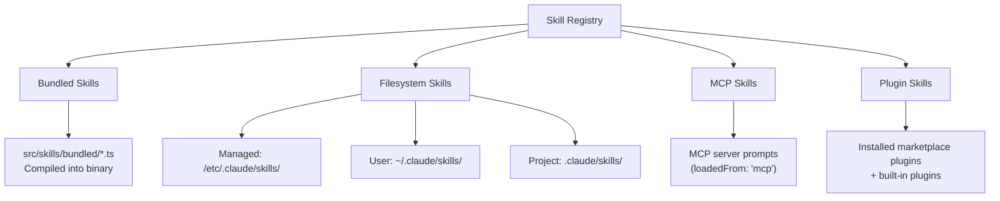
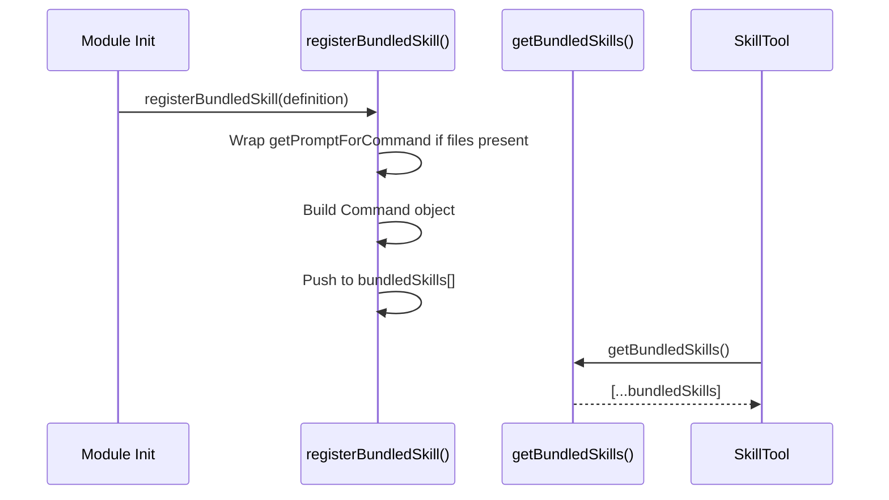
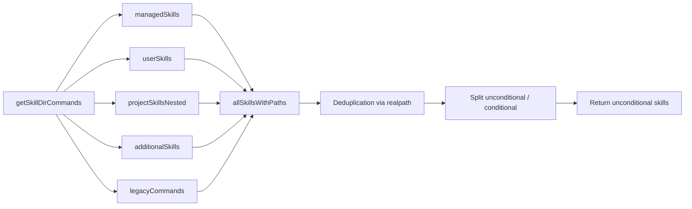
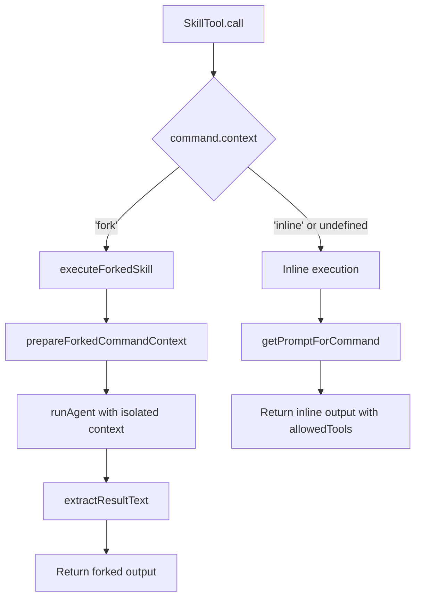
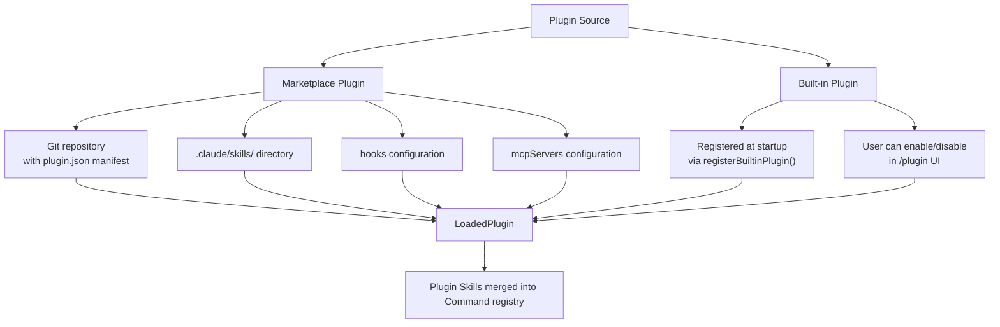
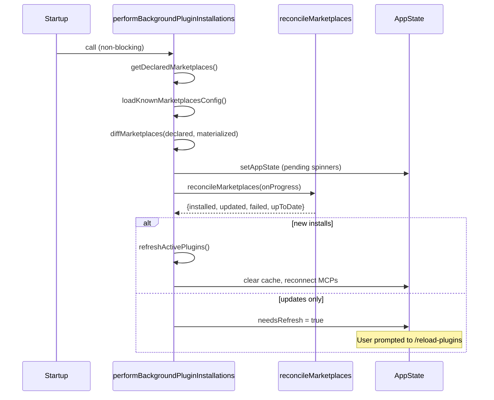

# Chapter 10: Plugin & Skill System

> **Difficulty:** Intermediate | **Reading time:** ~55 minutes

---

## Table of Contents

1. [Introduction](#1-introduction)
2. [Skill System Architecture](#2-skill-system-architecture)
3. [BundledSkill Definition](#3-bundledskill-definition)
4. [Filesystem Skills](#4-filesystem-skills)
5. [Skill Loading & Registration](#5-skill-loading--registration)
6. [SkillTool Execution](#6-skilltool-execution)
7. [Plugin System](#7-plugin-system)
8. [Built-in Plugins](#8-built-in-plugins)
9. [Security Model](#9-security-model)
10. [Hands-on: Create a Custom Skill](#10-hands-on-create-a-custom-skill)
11. [Key Takeaways & What's Next](#11-key-takeaways--whats-next)

---

## 1. Introduction

Claude Code's extensibility is built on two layered abstractions: **Skills** and **Plugins**.

- **Skills** are prompt-based commands that Claude can invoke autonomously or users can trigger manually via `/skill-name`. They are Markdown files with YAML frontmatter that define behavior, allowed tools, and execution context.
- **Plugins** are packages of skills, hooks, and MCP server configurations that can be installed from marketplace repositories or shipped as built-in components.

Together they form a two-tier extension mechanism:

```
User invokes /commit  →  SkillTool resolves command  →  executes skill prompt
                                                           (inline or forked)
Plugin installed      →  provides skills + hooks + MCPs  →  merged into registry
```

This architecture enables the ecosystem to grow organically: Anthropic ships bundled skills, teams publish marketplace plugins, and individuals create project-level custom skills — all sharing the same execution engine.

---

## 2. Skill System Architecture

Skills come from four distinct sources. Understanding this hierarchy is fundamental to knowing how conflicts are resolved and how to place your own skills correctly.



### Four Skill Sources

| Source | `loadedFrom` value | Location | Priority |
|---|---|---|---|
| Bundled | `'bundled'` | Compiled into binary | Highest |
| Managed | `'skills'` | `/etc/.claude/skills/` (policy) | High |
| User | `'skills'` | `~/.claude/skills/` | Medium |
| Project | `'skills'` | `.claude/skills/` | Low |
| Plugin | `'plugin'` | Installed marketplace | Varies |
| MCP | `'mcp'` | MCP server prompts | Varies |

Source: `src/skills/loadSkillsDir.ts:67-73` — the `LoadedFrom` type union.

### Command Type

All skills ultimately become `Command` objects of type `'prompt'`. The `source` field distinguishes their origin: `'bundled'`, `'userSettings'`, `'projectSettings'`, or `'policySettings'`. The `loadedFrom` field provides finer granularity including `'mcp'` and `'plugin'`.

---

## 3. BundledSkill Definition

Bundled skills are TypeScript objects that ship inside the CLI binary. They are registered programmatically at startup via `registerBundledSkill()`.

### The `BundledSkillDefinition` Interface

Source: `src/skills/bundledSkills.ts:15-41`

```typescript
export type BundledSkillDefinition = {
  name: string                          // Slash-command name (e.g., "commit")
  description: string                   // Shown in /skill listing
  aliases?: string[]                    // Alternative invocation names
  whenToUse?: string                    // Hint for Claude to auto-invoke
  argumentHint?: string                 // Shown in UI alongside the skill name
  allowedTools?: string[]               // Tool names this skill may use
  model?: string                        // Override model for this skill
  disableModelInvocation?: boolean      // Prevent use via SkillTool
  userInvocable?: boolean               // Show in /skill list (default: true)
  isEnabled?: () => boolean             // Dynamic availability check
  hooks?: HooksSettings                 // Lifecycle hooks
  context?: 'inline' | 'fork'          // Execution context
  agent?: string                        // Agent type for forked execution
  files?: Record<string, string>        // Reference files extracted to disk
  getPromptForCommand: (               // Returns prompt content blocks
    args: string,
    context: ToolUseContext,
  ) => Promise<ContentBlockParam[]>
}
```

### Key Fields Explained

**`context: 'inline' | 'fork'`**

This is the most consequential field. It determines whether the skill runs in the current conversation context or in an isolated sub-agent:

- `'inline'` (default): The skill prompt is injected into the ongoing conversation. Claude processes it within the same token budget. Simpler, lower overhead.
- `'fork'`: A new sub-agent is spawned with its own token budget and message history. Results are returned as a text summary. Use this for long-running or self-contained tasks.

**`files?: Record<string, string>`**

When set, the bundled skill extracts reference files to disk on first invocation (lazy). This allows the model to `Read` or `Grep` structured reference material without embedding it in the prompt. The extraction directory is based on a per-process nonce (see Security section). Source: `src/skills/bundledSkills.ts:59-73`.

**`whenToUse`**

This string is included in SkillTool's system prompt so Claude knows when to proactively invoke this skill. Without it, Claude may miss opportunities to use the skill automatically.

### Registration Flow



Source: `src/skills/bundledSkills.ts:53-100`

---

## 4. Filesystem Skills

Users and teams create custom skills as Markdown files on disk. The file format is identical whether at user-level (`~/.claude/skills/`) or project-level (`.claude/skills/`).

### Directory Structure

The `/skills/` directory uses a strict **directory-per-skill** format:

```
.claude/
└── skills/
    ├── my-skill/
    │   └── SKILL.md          ← required filename
    ├── code-review/
    │   ├── SKILL.md
    │   └── checklist.md      ← additional reference files
    └── deploy/
        └── SKILL.md
```

Only the directory format is supported in `/skills/`. Single `.md` files directly inside `/skills/` are **ignored**. Source: `src/skills/loadSkillsDir.ts:425`.

### SKILL.md Frontmatter Format

```markdown
---
description: Review code for security vulnerabilities and best practices
argument-hint: "[file or PR number]"
allowed-tools: Read, Grep, Bash
model: claude-opus-4-5
context: fork
when_to_use: Use when reviewing code changes before merging
user-invocable: true
paths:
  - src/**
  - "*.ts"
hooks:
  PostToolUse:
    - matcher: "Bash"
      hooks:
        - type: command
          command: echo "Tool used"
---

You are a security-focused code reviewer. Analyze the provided code for:

1. SQL injection vulnerabilities
2. XSS risks
3. Authentication bypasses
4. ...
```

### Supported Frontmatter Fields

| Field | Type | Description |
|---|---|---|
| `description` | string | Human-readable description |
| `argument-hint` | string | UI hint for arguments |
| `allowed-tools` | string[] | Permitted tools |
| `model` | string | Model override (or `"inherit"`) |
| `context` | `"fork"` | Force forked execution |
| `when_to_use` | string | Auto-invoke hint for Claude |
| `user-invocable` | boolean | Show in `/skill` list (default: true) |
| `paths` | string[] | Path patterns to activate this skill |
| `hooks` | HooksSettings | Lifecycle hooks |
| `agent` | string | Agent type for forked context |
| `effort` | string/int | Effort level override |
| `arguments` | string[] | Named argument placeholders |
| `disable-model-invocation` | boolean | Block SkillTool invocation |
| `version` | string | Skill version |

Source: `src/skills/loadSkillsDir.ts:185-264`

### Path-Conditional Skills

The `paths` frontmatter field enables **conditional skills** — skills that only appear in Claude's context when the user is working with files matching certain patterns:

```yaml
paths:
  - src/database/**
  - "*.sql"
```

This skill will only be available when the conversation involves database or SQL files. Conditional skills are stored separately and activated on demand. Source: `src/skills/loadSkillsDir.ts:771-796`.

### Variable Substitution

Inside skill content, several special variables are replaced at invocation time:

- `$ARGUMENTS` — The arguments string passed to the skill
- `${CLAUDE_SKILL_DIR}` — The directory containing the skill (for referencing sibling files)
- `${CLAUDE_SESSION_ID}` — The current session ID

Source: `src/skills/loadSkillsDir.ts:344-370`

### Inline Shell Execution

Skill content can embed shell commands using backtick syntax:

```markdown
Current git status:
!`git status --short`
```

These are executed when the skill is loaded, before being sent to Claude. MCP skills are **exempt** from shell execution for security. Source: `src/skills/loadSkillsDir.ts:373-396`.

---

## 5. Skill Loading & Registration

The loading pipeline is more sophisticated than it appears. Let's trace it step by step.

### Load Priority Order



Source: `src/skills/loadSkillsDir.ts:638-800`

### Deduplication via `realpath`

The loader uses filesystem `realpath()` to resolve symlinks to their canonical path, then deduplicates based on the resolved path. This prevents the same skill file from appearing twice when accessed through different paths (e.g., overlapping parent directories, symlinks).

```typescript
// src/skills/loadSkillsDir.ts:118-124
async function getFileIdentity(filePath: string): Promise<string | null> {
  try {
    return await realpath(filePath)  // Resolves all symlinks
  } catch {
    return null
  }
}
```

Why `realpath` instead of inodes? Inode numbers are unreliable on certain filesystems (NFS, ExFAT, some container mounts report inode 0). `realpath` is filesystem-agnostic. See the comment at line 113-117.

### `.skillsignore`

Projects can place a `.skillsignore` file in `.claude/skills/` to exclude specific skills from loading, using the same ignore syntax as `.gitignore`. The loader uses the `ignore` npm package for pattern matching.

### Memoization

`getSkillDirCommands` is wrapped with `lodash-es/memoize`. The memoization key is `cwd`. This means skills are loaded once per working directory per process lifetime. If skills change on disk, a `/reload-plugins` command (or process restart) is needed to pick them up.

Source: `src/skills/loadSkillsDir.ts:638`

### Bare Mode

When Claude Code is launched with `--bare`, the skill auto-discovery is skipped. Only explicitly provided `--add-dir` paths are scanned. This is useful for isolated or policy-constrained environments.

---

## 6. SkillTool Execution

The `SkillTool` is how Claude programmatically invokes skills. It's registered as a standard tool and appears in the tool list as `Skill`.

### Input Schema

```typescript
// src/tools/SkillTool/SkillTool.ts:291-298
z.object({
  skill: z.string().describe('The skill name. E.g., "commit", "review-pr"'),
  args: z.string().optional().describe('Optional arguments for the skill'),
})
```

### Validation

Before executing, the tool validates:

1. Skill name is non-empty
2. Skill exists in the command registry (including MCP skills)
3. Skill has `type === 'prompt'` (not a built-in command)
4. Skill does not have `disableModelInvocation: true`

Source: `src/tools/SkillTool/SkillTool.ts:354-429`

### Execution: Inline vs Fork



**Inline execution** returns the expanded prompt content plus allowed tools. The calling agent then uses those tools directly within the current conversation turn.

**Forked execution** spawns a sub-agent via `runAgent()`, collects all its messages, extracts the final result text, and returns it as a summary. The sub-agent's message history is discarded — only the result propagates back.

### Output Schema

```typescript
// Inline skill
{
  success: boolean,
  commandName: string,
  allowedTools?: string[],
  model?: string,
  status?: 'inline'
}

// Forked skill
{
  success: boolean,
  commandName: string,
  status: 'forked',
  agentId: string,
  result: string          // Extracted text from sub-agent
}
```

Source: `src/tools/SkillTool/SkillTool.ts:301-329`

### Analytics

Every skill invocation emits a `tengu_skill_tool_invocation` event with fields including:
- `command_name` (redacted for third-party)
- `execution_context` (`'fork'` or `'inline'`)
- `invocation_trigger` (`'claude-proactive'` or `'nested-skill'`)
- `query_depth` (nesting level)

Source: `src/tools/SkillTool/SkillTool.ts:152-203`

### Permission Checking

Skills can be allow-listed or deny-listed in Claude Code settings. The permission check supports both exact matches and prefix wildcards:

```
"review-pr"    → exact match
"review:*"     → prefix wildcard (matches any skill starting with "review:")
```

Source: `src/tools/SkillTool/SkillTool.ts:451-466`

---

## 7. Plugin System

While skills are individual prompt commands, plugins are bundles that can ship multiple skills, hooks, and MCP server configurations together.

### Plugin Architecture



### Plugin Identifier Format

Plugins use the format `{name}@{marketplace}`:

- `"commit@official"` — Official marketplace plugin
- `"my-plugin@github.com/user/repo"` — Third-party marketplace
- `"my-tool@builtin"` — Built-in plugin

Source: `src/utils/plugins/pluginIdentifier.ts`

### `PluginInstallationManager`

The background installation flow handles marketplace plugin setup without blocking Claude Code startup:



Source: `src/services/plugins/PluginInstallationManager.ts:60-184`

### Reconciliation Logic

The reconciler computes a diff between declared marketplaces (from settings) and installed marketplaces (from the on-disk cache):

- **Missing** — Install (git clone)
- **Source changed** — Reinstall (source URL changed)
- **Up to date** — Skip

After new installs, `refreshActivePlugins()` is called automatically to clear caches and re-establish MCP connections. After updates-only, a notification prompts the user to manually reload.

---

## 8. Built-in Plugins

Built-in plugins (`@builtin`) ship with Claude Code but remain user-toggleable via the `/plugin` UI. They differ from bundled skills:

| | Bundled Skills | Built-in Plugins |
|---|---|---|
| Visibility | Always present | Shown in `/plugin` UI |
| Togglable | No | Yes, persisted to user settings |
| Components | Skill only | Skills + hooks + MCPs |
| Registration | `registerBundledSkill()` | `registerBuiltinPlugin()` |
| ID format | `name` | `name@builtin` |

Source: `src/plugins/builtinPlugins.ts:1-14`

### `BuiltinPluginDefinition`

```typescript
type BuiltinPluginDefinition = {
  name: string
  description: string
  version?: string
  defaultEnabled?: boolean              // Default: true
  isAvailable?: () => boolean           // Dynamic availability check
  skills?: BundledSkillDefinition[]     // Skills provided
  hooks?: HooksSettings                 // Hook configurations
  mcpServers?: MCPServerConfig[]        // MCP servers to connect
}
```

### Enable/Disable Flow

```typescript
// src/plugins/builtinPlugins.ts:71-73
const userSetting = settings?.enabledPlugins?.[pluginId]
const isEnabled = userSetting !== undefined
  ? userSetting === true
  : (definition.defaultEnabled ?? true)
```

User preferences in `~/.claude/settings.json` under `enabledPlugins` override the plugin's default. If no preference is set, `defaultEnabled` (default: `true`) applies.

### Skill Command Conversion

When a built-in plugin's skill is added to the command registry, it goes through `skillDefinitionToCommand()`. Notably, the `source` field is set to `'bundled'` (not `'builtin'`):

```typescript
// src/plugins/builtinPlugins.ts:149
// 'bundled' not 'builtin' — 'builtin' in Command.source means hardcoded
// slash commands (/help, /clear).
source: 'bundled',
loadedFrom: 'bundled',
```

This keeps plugin skills in the SkillTool's listing and exempt from prompt truncation.

---

## 9. Security Model

The skill and plugin system takes several security measures that are worth understanding.

### Safe File Writing for Bundled Skills

When bundled skills extract reference files to disk, they use hardened file creation flags:

```typescript
// src/skills/bundledSkills.ts:176-193
const SAFE_WRITE_FLAGS =
  process.platform === 'win32'
    ? 'wx'                              // Windows: fail if exists
    : fsConstants.O_WRONLY |
      fsConstants.O_CREAT |
      fsConstants.O_EXCL |             // Fail if file exists (no races)
      O_NOFOLLOW                        // Fail if final component is a symlink

async function safeWriteFile(p: string, content: string): Promise<void> {
  const fh = await open(p, SAFE_WRITE_FLAGS, 0o600)  // Owner-read-only
  try {
    await fh.writeFile(content, 'utf8')
  } finally {
    await fh.close()
  }
}
```

This prevents:
- **TOCTOU races**: `O_EXCL` ensures atomic create-or-fail
- **Symlink attacks**: `O_NOFOLLOW` rejects symlinks in the final path component
- **Overly permissive files**: `0o600` (owner read/write only)

### Nonce-Based Extraction Directory

The extraction directory root includes a per-process nonce (from `getBundledSkillsRoot()`). Even if an attacker learns the nonce (e.g., via `inotify` on the predictable parent), the `0o700` directory mode prevents writes from other users.

### Path Traversal Prevention

Before writing any bundled skill file, the relative path is validated against traversal:

```typescript
// src/skills/bundledSkills.ts:196-205
function resolveSkillFilePath(baseDir: string, relPath: string): string {
  const normalized = normalize(relPath)
  if (
    isAbsolute(normalized) ||
    normalized.split(pathSep).includes('..') ||
    normalized.split('/').includes('..')
  ) {
    throw new Error(`bundled skill file path escapes skill dir: ${relPath}`)
  }
  return join(baseDir, normalized)
}
```

### MCP Skill Shell Execution Blocked

Skills from MCP servers cannot execute inline shell commands (`!`\`...\``). The guard is in `createSkillCommand()`:

```typescript
// src/skills/loadSkillsDir.ts:373-374
if (loadedFrom !== 'mcp') {
  finalContent = await executeShellCommandsInPrompt(...)
}
```

MCP skills are remote and untrusted — they can define prompts but not run arbitrary shell code on the user's machine.

---

## 10. Hands-on: Create a Custom Skill

Let's create a complete custom skill. We'll build a "smart commit" skill that analyzes staged changes and writes a conventional commit message.

### Step 1: Create the Skill Directory

```bash
mkdir -p .claude/skills/smart-commit
```

### Step 2: Write the SKILL.md

```markdown
---
description: Generate a conventional commit message from staged changes
argument-hint: "[optional: scope or type override]"
allowed-tools: Bash, Read
when_to_use: Use when the user wants to commit staged changes with a well-formatted message
context: fork
---

Analyze the staged git changes and generate a conventional commit message.

## Instructions

1. Run `!`git diff --cached --stat`` to see which files changed
2. Run `!`git diff --cached`` to see the actual diff
3. Analyze the nature of the changes:
   - Bug fix → `fix:`
   - New feature → `feat:`
   - Refactoring → `refactor:`
   - Tests → `test:`
   - Documentation → `docs:`
   - Build/tooling → `chore:`
4. Write a commit message following the format:
   ```
   type(scope): short description
   
   Longer explanation if needed (optional)
   ```
5. Execute the commit: `git commit -m "..."`

$ARGUMENTS
```

### Step 3: Verify Loading

```bash
# Restart Claude Code and check skills are loaded
/skills
# Should show: smart-commit — Generate a conventional commit message...
```

### Step 4: Invoke the Skill

As a user:
```
/smart-commit
```

Or Claude will auto-invoke it when you say "commit my changes".

### Step 5: Advanced — Bundled Skill in TypeScript

For skills that need programmatic logic, create a bundled skill:

See the full example in [`examples/10-plugin-skill-system/custom-skill.ts`](../../examples/10-plugin-skill-system/custom-skill.ts).

```typescript
import { registerBundledSkill } from '../skills/bundledSkills.js'

registerBundledSkill({
  name: 'smart-commit',
  description: 'Generate a conventional commit message from staged changes',
  context: 'fork',
  allowedTools: ['Bash', 'Read'],
  whenToUse: 'Use when the user wants to commit staged changes',
  async getPromptForCommand(args, context) {
    const scope = args.trim() || 'auto'
    return [{
      type: 'text',
      text: `Analyze staged changes and write a ${scope} conventional commit.
      
Run git diff --cached to see changes, then commit with a proper message.`
    }]
  }
})
```

### Step 6: Built-in Plugin Pattern

To bundle multiple skills with toggleability:

```typescript
import { registerBuiltinPlugin } from '../plugins/builtinPlugins.js'

registerBuiltinPlugin({
  name: 'git-workflow',
  description: 'Git workflow automation tools',
  version: '1.0.0',
  defaultEnabled: true,
  skills: [
    smartCommitSkill,
    branchCleanupSkill,
    prDraftSkill,
  ],
  hooks: {
    PostToolUse: [{
      matcher: 'Bash',
      hooks: [{ type: 'command', command: 'git status --short' }]
    }]
  }
})
```

---

## 11. Key Takeaways & What's Next

### Key Takeaways

1. **Four skill sources** with distinct `loadedFrom` values: `bundled`, `skills`, `mcp`, `plugin`. Priority goes: managed policy > user > project.

2. **`BundledSkillDefinition`** is the programmatic API (`src/skills/bundledSkills.ts:15`). The `context` field (`'inline'` vs `'fork'`) is the most impactful choice — fork gives isolation, inline shares context.

3. **Filesystem skills** live at `skill-name/SKILL.md` — the directory format is mandatory in `/skills/`. YAML frontmatter controls all behavior; the Markdown body is the prompt.

4. **Deduplication uses `realpath`** (`src/skills/loadSkillsDir.ts:118`) to handle symlinks correctly across diverse filesystems.

5. **SkillTool dispatches** to either `executeForkedSkill()` or inline execution based on `command.context`. Forked skills get isolated sub-agents; inline skills inject into the current conversation.

6. **Plugin background installation** is non-blocking (`PluginInstallationManager.ts:60`). New installs trigger auto-refresh; updates set `needsRefresh` for user-initiated reload.

7. **Security**: `O_EXCL | O_NOFOLLOW | 0o600` for bundled file extraction, path traversal validation, MCP shell execution blocked.

8. **Built-in plugins** (`@builtin`) are user-toggleable via `/plugin` UI but their skills appear as `source: 'bundled'` in the registry — preserving SkillTool discoverability.

### Architecture Summary

```
User types /smart-commit
        ↓
CommandSystem resolves to PromptCommand
        ↓
SkillTool.validateInput() — command exists + is prompt type
        ↓
SkillTool.checkPermissions() — allow/deny rules
        ↓
command.context === 'fork'?
    Yes → executeForkedSkill() → runAgent() → extractResultText()
    No  → getPromptForCommand() → inject into conversation
```

### What's Next

**Chapter 11: State & Context Management** — How `AppState` flows through the application, how session state is maintained across tool calls, and how the context window is managed.

**Chapter 12: Advanced Features** — Effort levels, argument substitution, shell execution in prompts, and the experimental skill search system.

---

*Source files referenced in this chapter:*
- `src/skills/bundledSkills.ts` — BundledSkillDefinition, registerBundledSkill
- `src/skills/loadSkillsDir.ts` — Filesystem loading, deduplication, path-conditional skills
- `src/tools/SkillTool/SkillTool.ts` — Skill execution (inline/fork)
- `src/plugins/builtinPlugins.ts` — Built-in plugin registry
- `src/services/plugins/PluginInstallationManager.ts` — Background marketplace installation
