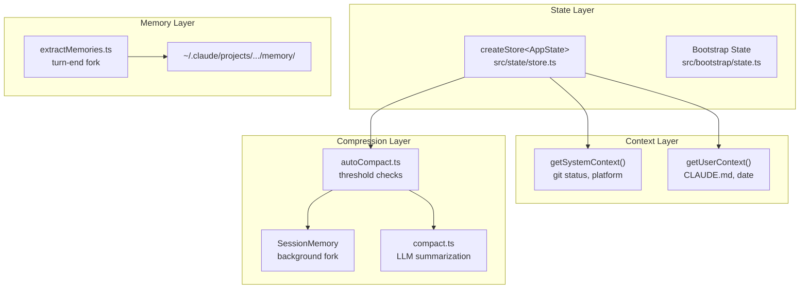
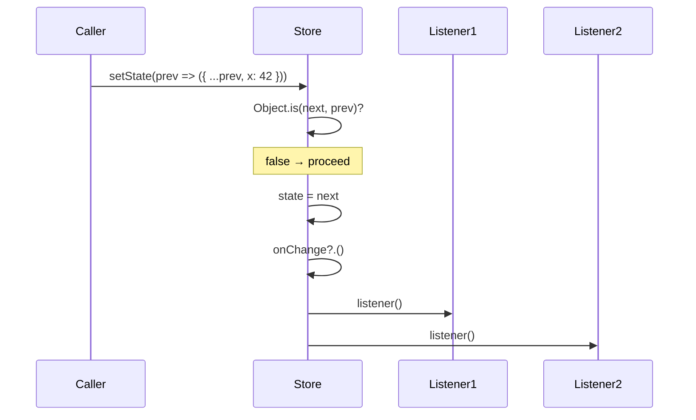
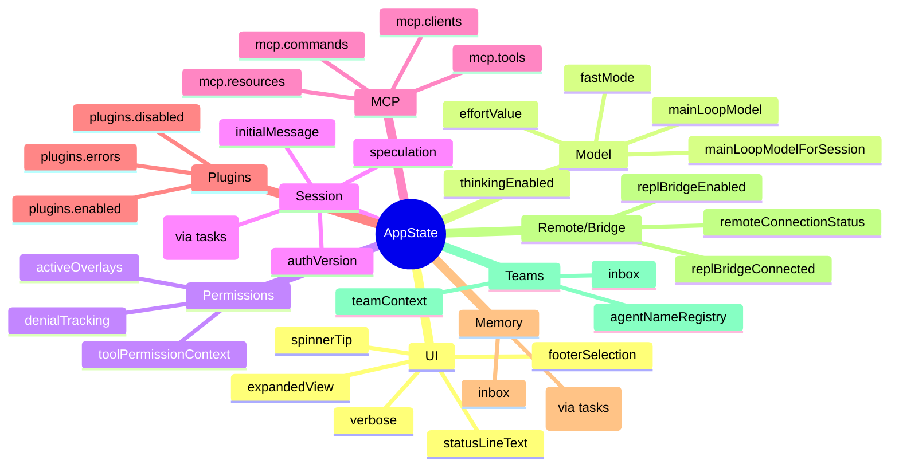
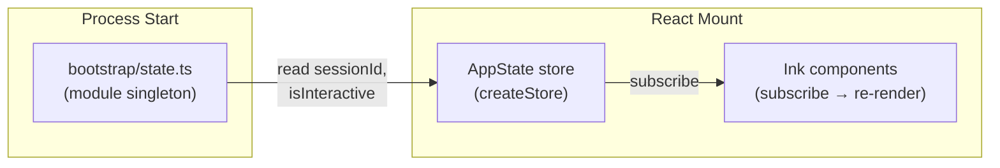
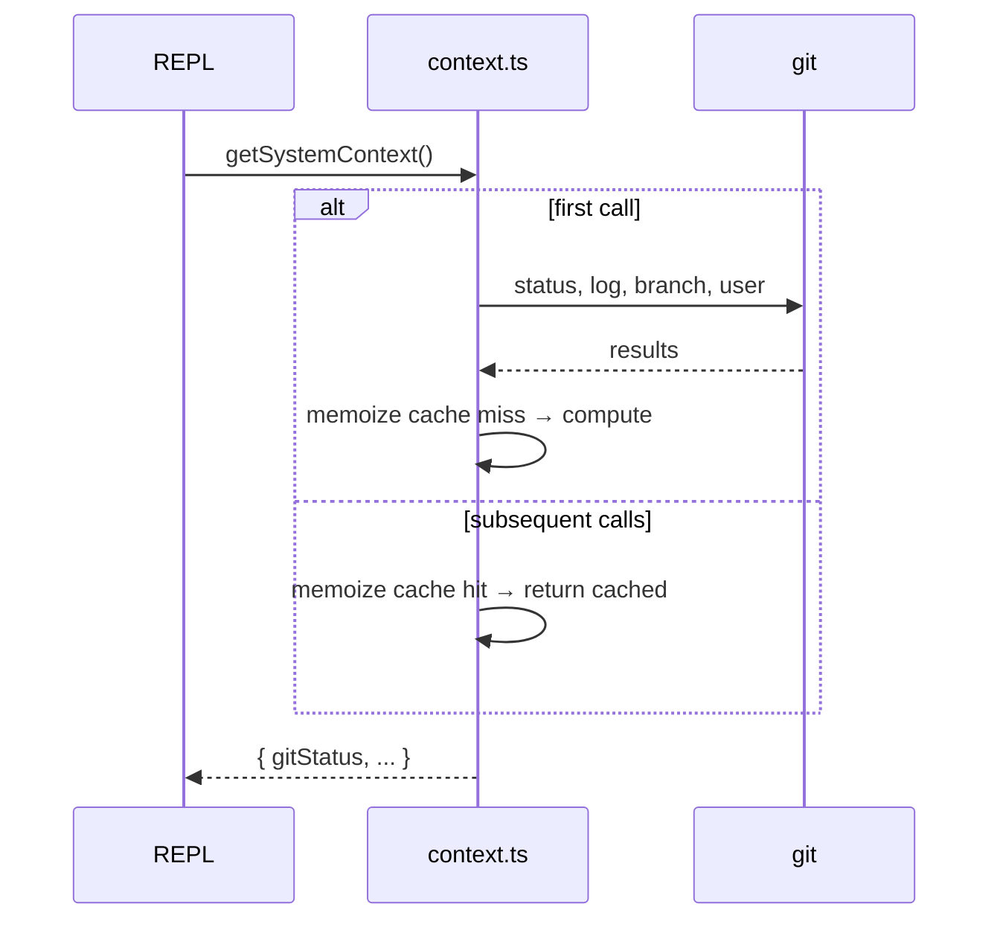
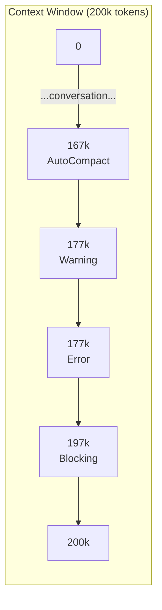
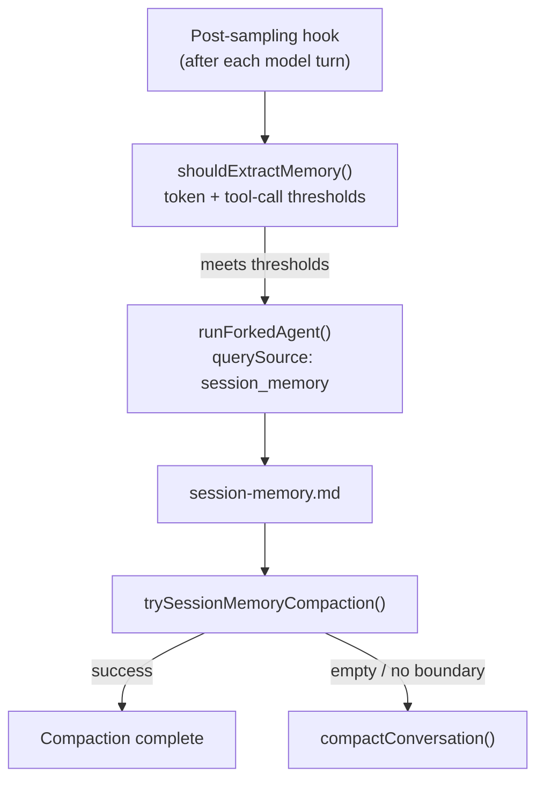
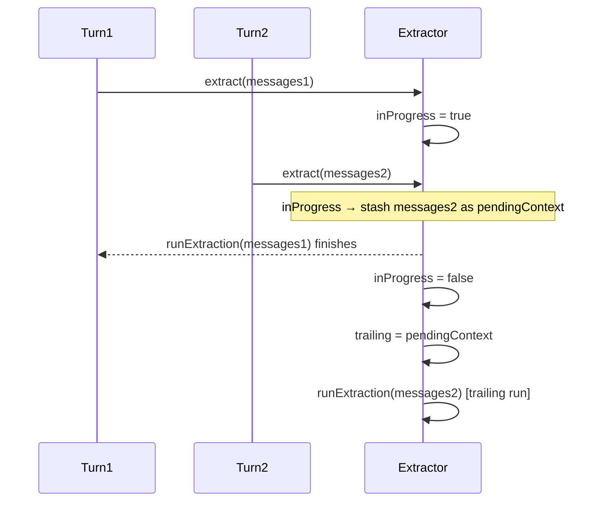

# Chapter 11: State Management & Context

## Table of Contents

1. [Introduction](#1-introduction)
2. [The Minimal Store](#2-the-minimal-store)
3. [AppState Structure](#3-appstate-structure)
4. [Bootstrap State — The Global Singleton](#4-bootstrap-state--the-global-singleton)
5. [Context System](#5-context-system)
6. [Context Compression](#6-context-compression)
7. [Session Memory](#7-session-memory)
8. [Auto Memory Extraction](#8-auto-memory-extraction)
9. [Memory Types](#9-memory-types)
10. [Hands-on: Build a Context Manager](#10-hands-on-build-a-context-manager)
11. [Key Takeaways & What's Next](#11-key-takeaways--whats-next)

---

## 1. Introduction

An AI agent session is not stateless. Between the first user message and the final response, Claude Code maintains a rich web of state: the current conversation messages, permission settings, MCP server connections, task progress, UI flags, and — crucially — a growing context window that eventually bumps into the model's hard token limit.

Managing that state well is the difference between an agent that feels coherent across a long coding session and one that forgets what it was doing every few turns.

This chapter dissects Claude Code's state management layer end to end:

- A **minimal reactive store** (34 lines of TypeScript) that powers the entire UI
- A **flat AppState type** (~360 lines) grouping every piece of runtime data
- A **two-level context system** that injects environment and user instructions into each conversation
- A **multi-threshold compression pipeline** that keeps token usage within bounds
- A **Session Memory service** that maintains a running markdown log of the conversation
- An **Auto Memory Extraction agent** that distills durable facts at the end of each query loop



---

## 2. The Minimal Store

### Source: `src/state/store.ts` (34 lines)

The entire UI reactivity system rests on a 34-line file. No Redux, no MobX, no Zustand — just closures.

```typescript
// src/state/store.ts:1-34
type Listener = () => void
type OnChange<T> = (args: { newState: T; oldState: T }) => void

export type Store<T> = {
  getState: () => T
  setState: (updater: (prev: T) => T) => void
  subscribe: (listener: Listener) => () => void
}

export function createStore<T>(
  initialState: T,
  onChange?: OnChange<T>,
): Store<T> {
  let state = initialState
  const listeners = new Set<Listener>()

  return {
    getState: () => state,

    setState: (updater: (prev: T) => T) => {
      const prev = state
      const next = updater(prev)
      if (Object.is(next, prev)) return       // ← shallow compare, bail early
      state = next
      onChange?.({ newState: next, oldState: prev })
      for (const listener of listeners) listener()
    },

    subscribe: (listener: Listener) => {
      listeners.add(listener)
      return () => listeners.delete(listener)  // ← unsubscribe fn
    },
  }
}
```

### Design Decisions

**Functional updater `(prev => next)`** — Each `setState` call receives the current state as its argument. This prevents stale-closure bugs where the caller captures an old state snapshot.

**`Object.is` for change detection** — JavaScript's `===` treats `NaN !== NaN` and `-0 === +0`. `Object.is` inverts both: it short-circuits when the updater returns the exact same object reference, preventing unnecessary listener notifications and React re-renders.

**`Set<Listener>` for deduplication** — If a component accidentally registers the same listener twice, `Set` silently deduplicates. The unsubscribe function calls `listeners.delete(listener)`, which is O(1) regardless of set size.

**`onChange` callback for side effects** — The optional `onChange` fires before listeners, giving external observers (analytics, persistence) access to both old and new state before the UI re-renders.



---

## 3. AppState Structure

### Source: `src/state/AppStateStore.ts:89-452`

`AppState` is the single source of truth for everything that changes during a session. It uses `DeepImmutable<{}>` for most fields (enforced immutability) while excluding function-heavy fields like `tasks` and `agentNameRegistry`.

The ~360 fields group into logical categories:



### Field Categories in Detail

**UI and display** (`src/state/AppStateStore.ts:94-108`):
```typescript
statusLineText: string | undefined
expandedView: 'none' | 'tasks' | 'teammates'
isBriefOnly: boolean
footerSelection: FooterItem | null
spinnerTip?: string
```

**Model configuration** (`src/state/AppStateStore.ts:93`):
```typescript
mainLoopModel: ModelSetting        // null = default, string = override
mainLoopModelForSession: ModelSetting
thinkingEnabled: boolean | undefined
effortValue?: EffortValue
fastMode?: boolean
```

**Permission context** (`src/state/AppStateStore.ts:109`):
```typescript
toolPermissionContext: ToolPermissionContext
denialTracking?: DenialTrackingState
activeOverlays: ReadonlySet<string>
```

**Team and inbox** (`src/state/AppStateStore.ts:323-361`):
```typescript
teamContext?: {
  teamName: string
  teammates: { [id: string]: TeammateInfo }
  isLeader?: boolean
}
inbox: { messages: InboxMessage[] }
agentNameRegistry: Map<string, AgentId>  // name → ID routing for SendMessage
```

**Speculation (pre-computation)** (`src/state/AppStateStore.ts:52-79`):
```typescript
speculation: SpeculationState   // idle | active (pre-runs likely next tool call)
speculationSessionTimeSavedMs: number
```

### `getDefaultAppState()`

`src/state/AppStateStore.ts:456-569` constructs the initial state. A notable detail: it uses a `require()` inside the function body to avoid a circular import between `AppStateStore` and `teammate.ts`:

```typescript
// src/state/AppStateStore.ts:459-465
const teammateUtils =
  require('../utils/teammate.js') as typeof import('../utils/teammate.js')
const initialMode: PermissionMode =
  teammateUtils.isTeammate() && teammateUtils.isPlanModeRequired()
    ? 'plan'
    : 'default'
```

---

## 4. Bootstrap State — The Global Singleton

### Source: `src/bootstrap/state.ts`

While `AppState` holds UI and conversation state, `bootstrap/state.ts` holds **process-level singletons** that must survive before React mounts: telemetry meters, session IDs, cost counters, API credentials, and the `originalCwd`.

```typescript
// src/bootstrap/state.ts:45-100 (simplified)
type State = {
  originalCwd: string
  projectRoot: string          // stable — set once, never updated mid-session
  totalCostUSD: number
  sessionId: SessionId
  isInteractive: boolean
  modelUsage: { [modelName: string]: ModelUsage }
  // ... telemetry counters, OAuth tokens, SDK betas ...
}
```

The comment at the top of the file is explicit: **"DO NOT ADD MORE STATE HERE — BE JUDICIOUS WITH GLOBAL STATE"** (`src/bootstrap/state.ts:31`). This module is intentionally lean because its state is invisible to React and hard to test.

### Isolation Principle

Bootstrap state and AppState are kept separate for a reason:

| | `bootstrap/state.ts` | `AppState` via `createStore` |
|---|---|---|
| Lifecycle | Process lifetime | Session / React render lifetime |
| Visibility | Invisible to React | React-reactive via `subscribe` |
| Testability | Hard to reset | `getDefaultAppState()` for fresh state |
| Contents | Credentials, telemetry | UI flags, messages, permissions |



---

## 5. Context System

### Source: `src/context.ts`

Before the first API call, Claude Code assembles two context maps that are prepended to the system prompt and cached for the duration of the session.

```typescript
// src/context.ts:116-150
export const getSystemContext = memoize(
  async (): Promise<{ [k: string]: string }> => {
    const gitStatus =
      isEnvTruthy(process.env.CLAUDE_CODE_REMOTE) ||
      !shouldIncludeGitInstructions()
        ? null
        : await getGitStatus()

    return {
      ...(gitStatus && { gitStatus }),
    }
  },
)

// src/context.ts:155-189
export const getUserContext = memoize(
  async (): Promise<{ [k: string]: string }> => {
    const claudeMd = shouldDisableClaudeMd
      ? null
      : getClaudeMds(filterInjectedMemoryFiles(await getMemoryFiles()))
    setCachedClaudeMdContent(claudeMd || null)

    return {
      ...(claudeMd && { claudeMd }),
      currentDate: `Today's date is ${getLocalISODate()}.`,
    }
  },
)
```

### `getGitStatus()` — What Gets Collected

```typescript
// src/context.ts:61-104
const [branch, mainBranch, status, log, userName] = await Promise.all([
  getBranch(),
  getDefaultBranch(),
  execFileNoThrow(gitExe(), ['--no-optional-locks', 'status', '--short'], ...),
  execFileNoThrow(gitExe(), ['--no-optional-locks', 'log', '--oneline', '-n', '5'], ...),
  execFileNoThrow(gitExe(), ['config', 'user.name'], ...),
])
```

The result is capped at 2000 characters (`MAX_STATUS_CHARS = 2000`, line 20) with a truncation notice when exceeded.

### Memoization and Cache Invalidation

Both functions use `lodash-es/memoize`. The cache is never explicitly invalidated during a session (the context is fixed at session start), except when `setSystemPromptInjection()` is called for cache-breaking experiments:

```typescript
// src/context.ts:29-34
export function setSystemPromptInjection(value: string | null): void {
  systemPromptInjection = value
  getUserContext.cache.clear?.()
  getSystemContext.cache.clear?.()
}
```



---

## 6. Context Compression

### Source: `src/services/compact/autoCompact.ts`

The context window is finite. Claude Code manages it with a four-threshold system that triggers progressively stronger interventions as token usage grows.

### The Four Thresholds

```typescript
// src/services/compact/autoCompact.ts:62-65
export const AUTOCOMPACT_BUFFER_TOKENS    = 13_000
export const WARNING_THRESHOLD_BUFFER_TOKENS = 20_000
export const ERROR_THRESHOLD_BUFFER_TOKENS   = 20_000
export const MANUAL_COMPACT_BUFFER_TOKENS    = 3_000
```

Given an effective context window of `W` (model context window minus 20k for output):

| Threshold | Formula | Action |
|---|---|---|
| Warning | `W - WARNING_THRESHOLD_BUFFER_TOKENS` | Show yellow indicator in UI |
| Error | `W - ERROR_THRESHOLD_BUFFER_TOKENS` | Show red warning |
| AutoCompact | `W - AUTOCOMPACT_BUFFER_TOKENS` | Trigger background compaction |
| Blocking | `W - MANUAL_COMPACT_BUFFER_TOKENS` | Refuse new prompts |



### AutoCompact Decision Flow

```typescript
// src/services/compact/autoCompact.ts:241-351
export async function autoCompactIfNeeded(...): Promise<{
  wasCompacted: boolean
  consecutiveFailures?: number
}> {
  // 1. Circuit breaker — stop after 3 consecutive failures
  if (tracking?.consecutiveFailures >= MAX_CONSECUTIVE_AUTOCOMPACT_FAILURES) {
    return { wasCompacted: false }
  }

  // 2. Check threshold
  if (!(await shouldAutoCompact(messages, model, querySource))) {
    return { wasCompacted: false }
  }

  // 3. Try Session Memory compaction first (cheaper — no LLM call)
  const sessionMemoryResult = await trySessionMemoryCompaction(
    messages, agentId, autoCompactThreshold,
  )
  if (sessionMemoryResult) {
    return { wasCompacted: true, compactionResult: sessionMemoryResult }
  }

  // 4. Fall back to legacy LLM-based compaction
  try {
    const result = await compactConversation(messages, toolUseContext, ...)
    return { wasCompacted: true, compactionResult: result, consecutiveFailures: 0 }
  } catch (error) {
    return { wasCompacted: false, consecutiveFailures: prevFailures + 1 }
  }
}
```

### Circuit Breaker

The `consecutiveFailures` counter (`MAX_CONSECUTIVE_AUTOCOMPACT_FAILURES = 3`) prevents runaway API calls when the context is irrecoverably over the limit. Without it, sessions with 50+ consecutive failures wasted ~250k API calls per day globally (comment in `autoCompact.ts:68-70`).

### Recursion Guards

Compaction itself runs a forked agent. `shouldAutoCompact()` explicitly guards against nested compaction:

```typescript
// src/services/compact/autoCompact.ts:170-172
if (querySource === 'session_memory' || querySource === 'compact') {
  return false
}
```

---

## 7. Session Memory

### Source: `src/services/SessionMemory/sessionMemory.ts`

Session Memory maintains a markdown file (`.claude/tmp/<sessionId>/session-memory.md`) that summarizes the current conversation. It is the **preferred compaction source** when available: using it avoids an expensive LLM summarization call.

### Architecture



### Extraction Thresholds

```typescript
// src/services/SessionMemory/sessionMemoryUtils.ts (DEFAULT_SESSION_MEMORY_CONFIG)
{
  minimumMessageTokensToInit: 10_000,   // tokens before first extraction
  minimumTokensBetweenUpdate: 5_000,    // token growth between updates
  toolCallsBetweenUpdates: 10,          // tool calls between updates
}
```

`shouldExtractMemory()` (`sessionMemory.ts:134-181`) requires:

1. **Initialization threshold** — total context tokens exceed `minimumMessageTokensToInit`
2. **Token growth** — context has grown by at least `minimumTokensBetweenUpdate` since last extraction
3. **Trigger condition** (either):
   - Token growth AND tool call count both exceed thresholds
   - Token growth threshold met AND last assistant turn has no tool calls (natural break)

The token threshold is **always** required. Tool calls alone cannot trigger extraction.

### Sequential Write Protection

```typescript
// src/services/SessionMemory/sessionMemory.ts:272
const extractSessionMemory = sequential(async function (context) { ... })
```

`sequential()` (`src/utils/sequential.ts`) wraps an async function so that concurrent calls are queued rather than running in parallel. This prevents two forked agents from writing to the session memory file simultaneously.

### Tool Permissions for the Forked Agent

The extraction agent runs with a tight permission set (`createMemoryFileCanUseTool`, lines 460-481):

```typescript
// Only FileEdit on the exact memory file path is allowed
if (tool.name === FILE_EDIT_TOOL_NAME && filePath === memoryPath) {
  return { behavior: 'allow', updatedInput: input }
}
return { behavior: 'deny', message: `only ${FILE_EDIT_TOOL_NAME} on ${memoryPath} is allowed` }
```

---

## 8. Auto Memory Extraction

### Source: `src/services/extractMemories/extractMemories.ts`

While Session Memory summarizes the *current conversation*, Auto Memory extracts *durable facts* that should persist across sessions. It runs at the end of each complete query loop (when the model produces a final response with no tool calls).

### Closure-Scoped State Pattern

Instead of module-level mutable variables, all state lives in a closure created by `initExtractMemories()`:

```typescript
// src/services/extractMemories/extractMemories.ts:296-320
export function initExtractMemories(): void {
  const inFlightExtractions = new Set<Promise<void>>()
  let lastMemoryMessageUuid: string | undefined
  let inProgress = false
  let turnsSinceLastExtraction = 0
  let pendingContext: { context; appendSystemMessage? } | undefined

  // ... runExtraction, executeExtractMemoriesImpl ...
}
```

This pattern (also used by `confidenceRating.ts`) makes unit testing trivial: call `initExtractMemories()` in `beforeEach` to get a completely fresh closure with zero state.

### Trailing Run Pattern

If a new extraction arrives while one is in progress, the latest context is stashed as `pendingContext`. When the current run finishes, it processes the trailing context:



Only the **latest** stashed context is processed. If three turns arrive while a run is in progress, only the third is kept — it contains all the messages the first and second would have seen.

### Mutual Exclusion with the Main Agent

The main agent's system prompt also has memory-saving instructions. To avoid duplicate writes:

```typescript
// src/services/extractMemories/extractMemories.ts:348-359
if (hasMemoryWritesSince(messages, lastMemoryMessageUuid)) {
  // advance cursor, skip forked agent
  logEvent('tengu_extract_memories_skipped_direct_write', ...)
  return
}
```

`hasMemoryWritesSince()` scans assistant messages for FileEdit/FileWrite tool_use blocks targeting paths inside `isAutoMemPath()`.

### Constraints on the Forked Agent

The extraction agent is given `createAutoMemCanUseTool(memoryDir)` (`extractMemories.ts:171-222`):

| Tool | Permission |
|---|---|
| FileRead, Grep, Glob | Unrestricted |
| Bash | Read-only commands only (`isReadOnly` check) |
| FileEdit / FileWrite | Only paths inside auto-memory dir |
| All others | Denied |

The agent is also capped at **5 turns** (`maxTurns: 5`) since well-behaved extractions complete in 2–4 turns.

---

## 9. Memory Types

### Source: `src/memdir/memoryTypes.ts:14-21`

Claude Code defines exactly four memory types. The taxonomy is intentionally narrow — early versions with more types caused more confusion than benefit during evals.

```typescript
export const MEMORY_TYPES = [
  'user',
  'feedback',
  'project',
  'reference',
] as const
```

Each memory is stored as a markdown file with YAML frontmatter:

```markdown
---
name: user_role
description: User is a TypeScript engineer focused on AI tooling
type: user
---

User is a TypeScript engineer building AI agent tooling.
```

### Type Semantics

| Type | Content | When to Save |
|---|---|---|
| `user` | Role, goals, expertise level | When you learn about who the user is |
| `feedback` | How to approach work — corrections and confirmations | Corrections ("don't do X") and validated choices |
| `project` | Ongoing work, decisions, incidents not in git | Who is doing what and why |
| `reference` | Pointers to external systems (Linear, Grafana, Slack) | When you learn where information lives |

### What NOT to Save

From `src/memdir/memoryTypes.ts:183-195`:

- Code patterns, architecture, file paths — derivable from current project state
- Git history, who changed what — `git log` is authoritative
- Debugging recipes — the fix is in the code; the commit has the context
- Anything already in CLAUDE.md files
- Ephemeral in-progress work or conversation state

### Memory Directory Layout

```
~/.claude/
  projects/
    <sanitized-git-root>/
      memory/
        MEMORY.md          ← index file (pointers to topic files)
        user_role.md
        feedback_terse.md
        project_auth_rewrite.md
      logs/
        2026/04/2026-04-01.md   ← assistant-mode daily log
  tmp/
    <sessionId>/
      session-memory.md   ← session-scoped (deleted on exit)
```

`getAutoMemPath()` (`src/memdir/paths.ts:223-235`) resolves the memory directory in priority order:

1. `CLAUDE_COWORK_MEMORY_PATH_OVERRIDE` env var (Cowork space-scoped mount)
2. `autoMemoryDirectory` in `settings.json` (trusted sources: policy/local/user — not project settings)
3. `~/.claude/projects/<sanitized-git-root>/memory/`

---

## 10. Hands-on: Build a Context Manager

The example file at `examples/11-state-context/context-manager.ts` implements all patterns from this chapter in ~350 lines of TypeScript with detailed comments.

### Running the Example

```bash
cd examples/11-state-context
npx ts-node context-manager.ts
# or
bun run context-manager.ts
```

### What the Example Shows

**1. Minimal Store with Object.is**

```typescript
const store = createStore<AppState>(defaultState)
const unsubscribe = store.subscribe(() => console.log('state changed'))

// Functional updater prevents stale closures
store.setState(prev => ({ ...prev, tokenCount: prev.tokenCount + 100 }))

// Same reference → Object.is → no listener fired
const s = store.getState()
store.setState(() => s)  // silent — no notification
```

**2. Context Collection**

```typescript
const [system, user] = await Promise.all([
  getSystemContext(),  // git status, platform
  getUserContext(),    // CLAUDE.md, current date
])
// Both are memoized — subsequent calls return immediately
```

**3. Threshold Calculation**

```typescript
const state = calculateTokenWarningState(
  185_000,   // current token usage
  200_000,   // context window
  true,      // auto-compact enabled
)
// { isAboveWarningThreshold: true, isAboveAutoCompactThreshold: true, ... }
```

**4. Session Memory Service**

```typescript
const sm = new SessionMemoryService({ minimumMessageTokensToInit: 10_000 })
const shouldExtract = sm.shouldExtract(messages, currentTokens)
if (shouldExtract) {
  await sm.enqueueExtraction(messages, currentTokens, memoryPath)
}
```

**5. Auto Memory with Trailing Run**

```typescript
const extractor = initAutoMemoryExtractor()
// Turn 1: starts extraction
await extractor.extract(messages1)  // inProgress = true

// Turn 2 (arrives during Turn 1): stashed as pendingContext
await extractor.extract(messages2)  // will run as trailing extraction

await extractor.drain()  // await all in-flight extractions before exit
```

**6. Typed Memory Records**

```typescript
saveMemory({
  name: 'feedback_terse',
  description: 'User prefers terse responses',
  type: 'feedback',
  body: 'Keep responses terse.\n\n**Why:** user said "I can read the diff"\n\n**How to apply:** skip summary paragraphs.',
})
```

---

## 11. Key Takeaways & What's Next

### Key Takeaways

**Simplicity at the store level** — `createStore` is 34 lines. The power comes from composing it with React's rendering model, not from the store itself. When you need state management for an agent loop, start here: a closure, a `Set<Listener>`, and `Object.is`.

**Separation of concerns across two state layers** — Bootstrap state (`bootstrap/state.ts`) owns process-level singletons (credentials, telemetry, session ID). AppState (`AppStateStore.ts`) owns session-level reactive data. Mixing them creates circular imports and testability problems.

**Memoized context beats re-collection** — `getSystemContext()` and `getUserContext()` are memoized because their sources (git, filesystem) are expensive to read. The tradeoff is that context is a snapshot of session-start state. This is explicit and intentional.

**Four thresholds, two fallback paths** — The compression system is layered. Session Memory compaction (no LLM call, uses existing notes) is tried first. Legacy LLM summarization is the fallback. A circuit breaker prevents wasted API calls when compaction is structurally impossible.

**Closure-scoped state for testability** — `initExtractMemories()` creates a fresh closure instead of using module-level variables. This pattern makes `beforeEach(() => initExtractMemories())` sufficient to reset all state between tests.

**Four memory types, strict exclusions** — The taxonomy (user / feedback / project / reference) is intentionally small. The exclusion list (no code patterns, no git history, no ephemeral state) is as important as the inclusion criteria.

### What's Next

Chapter 12 covers advanced features: speculation (pre-running likely tool calls), ultraplan mode, computer use, and the context collapse system that replaces auto-compact when context reaches 90%+ of the window.

---

*Source files referenced in this chapter:*
- `src/state/store.ts` — Minimal store, 34 lines
- `src/state/AppStateStore.ts` — Full AppState type and `getDefaultAppState()`
- `src/bootstrap/state.ts` — Process-level singleton state
- `src/context.ts` — `getSystemContext()`, `getUserContext()`, `getGitStatus()`
- `src/services/compact/autoCompact.ts` — Token thresholds and `autoCompactIfNeeded()`
- `src/services/SessionMemory/sessionMemory.ts` — Session memory extraction and compaction
- `src/services/compact/sessionMemoryCompact.ts` — `trySessionMemoryCompaction()`
- `src/services/extractMemories/extractMemories.ts` — Auto memory extraction
- `src/memdir/memoryTypes.ts` — Memory type taxonomy
- `src/memdir/paths.ts` — `getAutoMemPath()`, `isAutoMemoryEnabled()`
