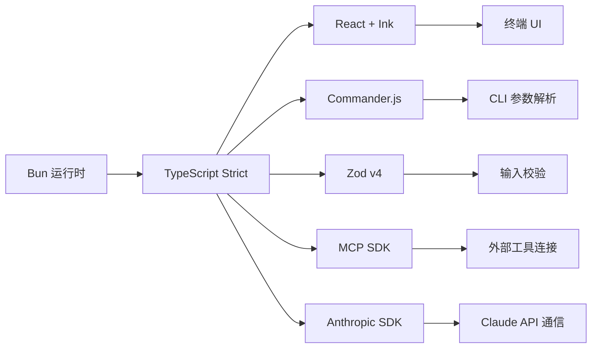
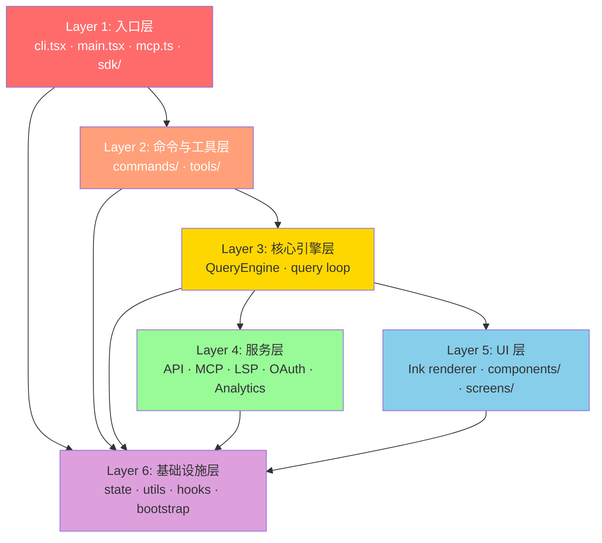
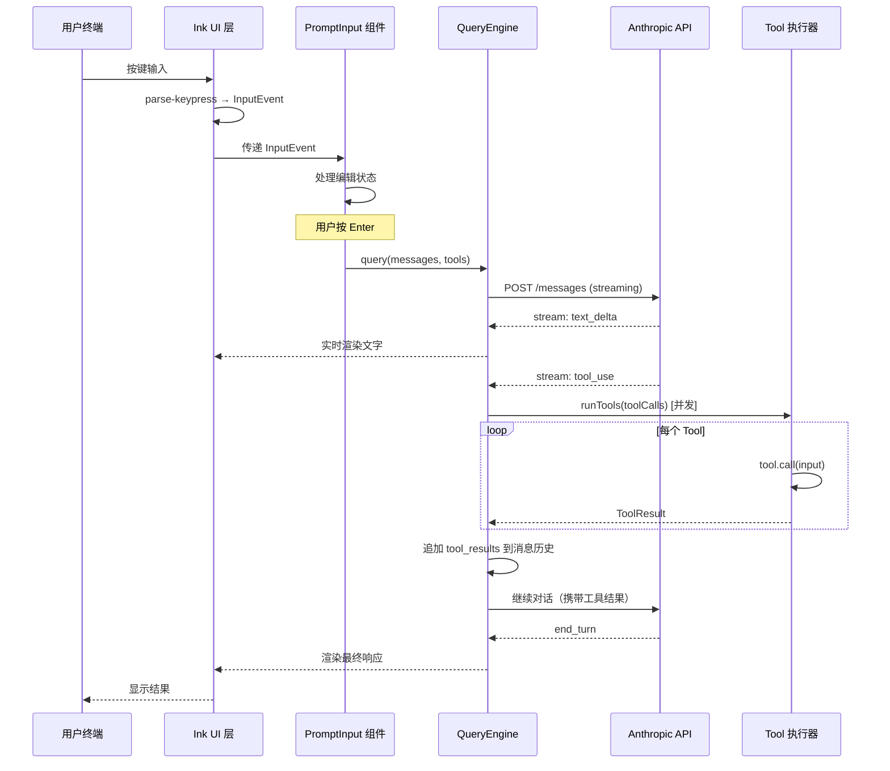

# 第一章：项目概览与架构

> **难度**：入门级  
> **目标**：理解 Claude Code 是什么、技术栈组成、整体架构设计，建立学习全局观

---

## 目录

1. [什么是 Claude Code？](#1-什么是-claude-code)
2. [技术栈深度解析](#2-技术栈深度解析)
3. [架构概览](#3-架构概览)
4. [目录结构全景](#4-目录结构全景)
5. [核心设计模式](#5-核心设计模式)
6. [数据流：从用户输入到响应](#6-数据流从用户输入到响应)
7. [动手构建：mini-claude 脚手架](#7-动手构建mini-claude-脚手架)
8. [源码阅读练习](#8-源码阅读练习)
9. [下一章预告](#9-下一章预告)

---

## 1. 什么是 Claude Code？

Claude Code 是 Anthropic 出品的 CLI（命令行界面）AI 编程助手。区别于网页版 Claude，它直接运行在你的终端里，能够感知并操作你本地的代码仓库。

### 1.1 核心能力

简单来说，Claude Code 能做四件事：

| 能力 | 说明 |
|------|------|
| **编辑文件** | 读取、修改、创建代码文件 |
| **运行命令** | 在 shell 中执行命令并分析输出 |
| **搜索代码** | 用 ripgrep 在代码库中快速搜索 |
| **多 Agent 协调** | 启动子 Agent 并行处理复杂任务 |

这些能力组合起来，使 Claude Code 可以独立完成"理解需求 → 修改代码 → 运行测试 → 修复问题"的完整循环。

### 1.2 为什么值得学习它的源码？

学习 Claude Code 的源码有两个层面的价值：

**工程价值**：它是一个真实上线、数十万用户在用的大型 CLI 工具。规模约 1900 个文件、512K+ 行 TypeScript，包含完整的 OAuth 认证、MCP 协议集成、OpenTelemetry 遥测、Feature Flag 系统等企业级工程实践。

**AI 系统设计价值**：Claude Code 本身就是一个 AI Agent 系统。通过阅读它的源码，你能直接看到 AI Agent 在工业级产品中是如何设计"工具调用循环（Tool Use Loop）"、如何管理上下文、如何协调多个子 Agent 的——这些设计思路在你构建自己的 AI 应用时直接适用。

### 要点总结

- Claude Code 是运行在终端的 AI 编程助手，核心能力是文件操作、命令执行、代码搜索和多 Agent 协调
- 源码规模约 512K+ 行 TypeScript，是学习大型 CLI 工具和 AI Agent 系统设计的优质样本

---

## 2. 技术栈深度解析

下面逐一介绍 Claude Code 的技术选型，以及每个技术在项目中扮演的角色。



### 2.1 Bun：为什么不用 Node.js？

Claude Code 选择 [Bun](https://bun.sh/) 而非 Node.js 作为运行时，原因是多方面的：

**启动速度**：Bun 的冷启动时间远低于 Node.js。对于 CLI 工具而言，用户每次输入命令都要等待启动，100ms 的启动差异会被每个用户、每次使用感知到，积累起来是巨大的体验差距。

**内置 Bundler**：Bun 自带打包能力，无需额外配置 webpack 或 esbuild，简化了构建流程。

**`feature()` macro**：这是 Bun 独有的编译时宏（Compile-time Macro）。Claude Code 用它来实现 Feature Flag，在构建时直接消除死代码（Dead Code Elimination，DCE），对外发布版本不会包含任何内部功能的代码。

```typescript
// 这是 Bun 的编译时 feature macro
// 构建时如果 FLAG 为 false，整个 if 块会被彻底移除
import { feature } from "bun:bundle";

if (feature("INTERNAL_DASHBOARD")) {
  // 外部版本构建时，这段代码完全不存在于产物中
  initInternalDashboard();
}
```

### 2.2 TypeScript Strict 模式

项目全程开启 TypeScript 的 `strict` 模式，这意味着：
- 不允许隐式 `any`
- 严格的 null 检查
- 函数参数双向协变检查

在这么大的代码库里保持 strict 模式，说明团队对类型安全有很高的要求。阅读源码时，你会发现类型定义非常精确，这对理解模块间接口很有帮助。

### 2.3 React + Ink：终端里的 React

这是整个技术栈里最有趣的选择之一。[Ink](https://github.com/vadimdemedes/ink) 是一个用 React 构建终端 UI 的框架。

普通的终端输出是线性的——打印一行，光标就往下走一行。但 Claude Code 的终端界面有动态更新、组件状态、条件渲染等特性。Ink 通过自定义 React Renderer，将虚拟 DOM 的 diff 算法应用到终端字符输出上，实现了"终端里的 React 组件模型"。

值得注意的是，Claude Code 并没有直接用 Ink，而是基于 Ink 构建了自己的自定义渲染管线（位于 `src/ink/` 目录），以满足更精细的性能和控制需求。

```typescript
// 终端 UI 用 React 组件描述，就像写网页一样
import { Box, Text } from "ink";

function StatusBar({ message, isLoading }) {
  return (
    <Box borderStyle="round">
      <Text color={isLoading ? "yellow" : "green"}>
        {isLoading ? "思考中..." : message}
      </Text>
    </Box>
  );
}
```

### 2.4 Commander.js：CLI 参数解析

[Commander.js](https://github.com/tj/commander.js) 是 Node.js/Bun 生态最流行的 CLI 参数解析库，负责处理 `claude --help`、`claude --version`、子命令等参数。Claude Code 用它来注册和解析所有 CLI 入口参数。

### 2.5 Zod v4：运行时输入校验

[Zod](https://zod.dev/) 是 TypeScript 生态的 Schema 验证库。Claude Code 用 Zod v4 来校验：
- 工具调用的参数（Tool inputs from LLM）
- MCP 协议消息
- 配置文件格式

LLM 返回的 JSON 在结构上是不可信的——你不能假设 AI 一定按照期望的格式输出。Zod 提供了运行时的严格校验，是 AI 系统中 Trust Boundary（信任边界）的重要组成部分。

### 2.6 MCP SDK：连接外部工具

MCP（Model Context Protocol）是 Anthropic 开源的协议，用于让 AI 模型连接外部工具和数据源。Claude Code 既作为 MCP **客户端**（调用外部 MCP 服务器提供的工具），也作为 MCP **服务端**（将自身能力暴露给其他 Claude 实例）。

```
Claude Code (MCP Client) <---> MCP Server (外部工具)
                                例如: 数据库查询、文件系统、浏览器控制
```

### 2.7 Anthropic SDK：与 Claude API 通信

[Anthropic SDK](https://github.com/anthropics/anthropic-sdk-typescript) 处理与 Claude API 的所有通信，包括：
- 流式响应（Streaming）
- 工具调用（Tool Use）
- 消息历史管理

### 要点总结

- Bun 带来更快启动速度和编译时 Feature Flag（`feature()` macro）
- React + Ink 将组件化 UI 模型带入终端，Claude Code 在此基础上构建了自定义渲染管线
- Zod 在 Trust Boundary 处（LLM 输出、外部输入）做运行时校验，是 AI 系统安全性的关键

---

## 3. 架构概览

Claude Code 采用分层架构（Layered Architecture），共六层，每层有明确的职责边界。



### 3.1 各层职责详解

**Layer 1 - 入口层**

这是程序的"大门"，负责解析 CLI 参数、决定程序运行模式（交互模式、管道模式、MCP 服务端模式、SDK 模式），然后启动对应的流程。

```
cli.tsx      → Commander.js 参数解析，入口分发
main.tsx     → 主交互会话启动，React 渲染树根节点
mcp.ts       → MCP Server 模式入口
sdk/         → 作为 SDK 被其他程序嵌入时的入口
```

**Layer 2 - 命令与工具层**

Claude Code 有两类"功能点"：
- **Commands（命令）**：用户显式触发的斜杠命令，如 `/help`、`/clear`、`/pr`，共 70+
- **Tools（工具）**：AI 自主决定调用的能力，如读文件、执行 bash、搜索代码，共 40+

Commands 由用户发起，Tools 由 AI 发起，这是一个重要区别。

**Layer 3 - 核心引擎层**

`QueryEngine.ts` 是整个系统的心脏。它实现了 AI Agent 最核心的循环：

```
用户输入 → 调用 Claude API → 收到 tool_use → 执行工具 → 结果发回 API → 重复，直到 end_turn
```

这个循环（也叫 Agentic Loop）使 AI 能够自主地采取多步骤行动。

**Layer 4 - 服务层**

封装所有外部依赖：
- `API Service`：Anthropic Claude API 通信
- `MCP Service`：MCP 协议客户端/服务端
- `LSP Service`：Language Server Protocol，提供代码智能（跳转定义等）
- `OAuth Service`：认证授权流程
- `Analytics Service`：OpenTelemetry 遥测数据上报

**Layer 5 - UI 层**

140+ 个 React 组件，通过自定义 Ink 渲染管线输出到终端。包含各种 Screen（全屏页面）和细粒度 Component（如 ProgressBar、Spinner、CodeBlock）。

**Layer 6 - 基础设施层**

横切所有层的基础能力：
- `state/`：全局应用状态（基于 singleton 模式）
- `utils/`：通用工具函数
- `hooks/`：React hooks
- `bootstrap/`：程序初始化，严格隔离，不能 import 上层模块

### 3.2 层间关系的关键约束

架构中有一个重要约束：**`bootstrap/` 层不能 import 应用层模块**。这通过 ESLint 规则来强制执行，防止初始化代码产生循环依赖，保证启动过程的稳定性。

### 要点总结

- 六层架构清晰分离职责：入口 → 命令/工具 → 核心引擎 → 服务 → UI → 基础设施
- QueryEngine（核心引擎）是 Agentic Loop 的实现，是整个系统最关键的模块
- bootstrap 层通过 ESLint 规则强制隔离，是架构约束的工程化体现

---

## 4. 目录结构全景

下面是 `src/` 目录的全景图，标注了各目录的重要性：

```
src/
├── main.tsx              ⭐⭐⭐  CLI 主入口，React 渲染树根节点
├── commands.ts           ⭐⭐⭐  斜杠命令注册中心
├── tools.ts              ⭐⭐⭐  Agent 工具注册中心
├── Tool.ts               ⭐⭐⭐  工具类型定义（核心抽象）
├── QueryEngine.ts        ⭐⭐⭐  LLM 查询引擎，Agentic Loop 实现
│
├── entrypoints/          ⭐⭐⭐  多入口点
│   ├── cli.tsx           →  Commander.js CLI 入口
│   ├── mcp.ts            →  MCP Server 模式入口
│   └── sdk/              →  SDK 嵌入模式入口
│
├── commands/             ⭐⭐⭐  70+ 斜杠命令实现
│   ├── help.ts           →  /help 命令
│   ├── clear.ts          →  /clear 命令
│   ├── pr.ts             →  /pr 命令（创建 Pull Request）
│   └── ...
│
├── tools/                ⭐⭐⭐  40+ Agent 工具实现
│   ├── BashTool/         →  执行 shell 命令
│   ├── FileReadTool/     →  读取文件
│   ├── FileEditTool/     →  编辑文件
│   ├── GlobTool/         →  文件路径匹配
│   ├── GrepTool/         →  代码内容搜索
│   └── ...
│
├── components/           ⭐⭐   140+ UI 组件（React + Ink）
│   ├── PromptInput/      →  用户输入框
│   ├── AssistantMessage/ →  AI 回复渲染
│   ├── ToolResult/       →  工具执行结果展示
│   └── ...
│
├── services/             ⭐⭐   外部服务集成
│   ├── claude.ts         →  Anthropic API 客户端
│   ├── mcp.ts            →  MCP 协议客户端
│   ├── lsp.ts            →  LSP 协议客户端
│   └── oauth.ts          →  OAuth 认证服务
│
├── ink/                  ⭐⭐   自定义 Ink 渲染引擎
│   ├── renderer.ts       →  自定义渲染管线
│   └── ...
│
├── bootstrap/            ⭐⭐   程序引导（严格隔离）
│   ├── state.ts          →  全局状态单例
│   └── ...
│
├── screens/              ⭐    全屏页面级组件
├── hooks/                ⭐    React hooks
├── utils/                ⭐    通用工具函数
├── types/                ⭐    全局类型定义
└── constants/            ⭐    常量定义
```

### 4.1 重点目录解读

**`tools/` 目录的设计哲学**

每个 Tool 是一个**自包含模块**，独立目录，包含：
- 实现代码（`index.ts`）
- Prompt 描述（`prompt.ts` 或内联）
- 类型定义

这种设计让每个工具可以独立开发、测试和维护，完全符合单一职责原则。

**`commands/` vs `tools/`**

初看可能会混淆这两个目录：
- `commands/`：用户用 `/xxx` 触发，有明确的"用户意图"，执行后直接反馈
- `tools/`：AI 自主决策调用，AI 决定"是否需要以及何时调用"，结果作为 AI 下一步推理的输入

**`QueryEngine.ts` 为何最重要**

这个单文件（或模块）实现了 Claude Code 最核心的逻辑：
1. 将消息历史发送给 Claude API
2. 解析流式响应
3. 识别 `tool_use` 请求并分发执行
4. 将工具结果追加到消息历史
5. 循环，直到 AI 返回 `end_turn`

理解这个文件，你就理解了 Claude Code 的灵魂。

### 要点总结

- `tools/` 和 `commands/` 的区别：前者 AI 自主调用，后者用户显式触发
- `QueryEngine.ts` 是最核心的单一模块，实现了 Agentic Loop
- 每个 Tool 自包含在独立目录，是典型的模块化设计

---

## 5. 核心设计模式

Claude Code 的代码中有几个值得专门讲解的设计模式，这些模式体现了团队在性能优化和工程质量上的深思熟虑。

### 5.1 并行预取（Parallel Prefetch）

**问题**：用户打开 Claude Code 时，需要读取 macOS Keychain（存储 API Key）、读取配置文件、建立 TCP 连接到 Anthropic API。这些操作如果串行执行，会显著增加启动时间。

**解法**：在 `main.tsx` 的模块 import 阶段就立即触发这些异步操作，不等待结果，让它们在后台并行进行。

```typescript
// main.tsx - 顶层，模块加载时就立即开始
// 不 await，让它们并行跑在后台
startMdmRawRead();          // 读取 MDM（设备管理）配置
startKeychainPrefetch();    // 预取 macOS Keychain 中的 API Key

// TCP + TLS 连接到 Anthropic API 需要 100-200ms
// 提前建立连接，用户真正发送请求时可以直接复用
preconnectAnthropicApi();
```

等用户真正需要这些资源时，它们已经准备好了，实现"零感知延迟"。这种模式在性能敏感的 CLI 工具中非常有价值。

```mermaid
gantt
    title 并行预取 vs 串行等待
    dateFormat X
    axisFormat %Lms

    section 串行（慢）
    读取配置    :0, 50
    Keychain    :50, 150
    TCP建连     :200, 400
    用户可用    :400, 450

    section 并行预取（快）
    读取配置    :0, 50
    Keychain    :0, 100
    TCP建连     :0, 200
    用户可用    :200, 250
```



### 5.2 懒加载（Lazy Loading）

**问题**：Claude Code 有 70+ 个命令和 40+ 个工具。如果启动时全部加载，会增加不必要的初始化时间和内存占用。

**解法**：

Commands 使用 `load()` 方法懒加载实现：

```typescript
// commands.ts - 命令只注册元信息，实现代码不在此加载
const commands = [
  {
    name: "pr",
    description: "创建 Pull Request",
    load: () => import("./commands/pr"),  // 只有真正执行时才加载
  },
  // ...
];
```

Tool Schema 用 `lazySchema()` 懒加载 Zod Schema（Zod Schema 构建有一定开销）：

```typescript
// Tool 的 Zod 校验 schema 只在第一次被调用时才构建
const inputSchema = lazySchema(() =>
  z.object({
    command: z.string().describe("要执行的 shell 命令"),
  })
);
```

特殊模式（bridge、daemon）用动态 import：

```typescript
// 只有在特定条件下才需要这些模块
if (mode === "bridge") {
  const { startBridge } = await import("./bridge");
  await startBridge();
}
```

### 5.3 编译时死代码消除（DCE via Feature Flags）

**问题**：Claude Code 有内部版本（含调试工具、内部仪表盘等）和外部发布版本。如何确保外部用户下载的包不包含任何内部代码？

**解法**：使用 Bun 的 `feature()` 编译时宏。

```typescript
import { feature } from "bun:bundle";

// 构建外部版本时，INTERNAL_METRICS_DASHBOARD = false
// Bun 打包器会将整个 if 块替换为 if (false) { ... }
// 然后死代码消除会彻底移除这段代码
if (feature("INTERNAL_METRICS_DASHBOARD")) {
  registerInternalDashboard();
}

if (feature("EMPLOYEE_ONLY_COMMANDS")) {
  registerEmployeeCommands();
}
```

与运行时 Feature Flag（如 LaunchDarkly）的区别：
- 运行时 Flag：代码在产物中存在，只是被 if 跳过
- 编译时 Flag：代码根本不存在于产物中，无法被逆向工程

这对于保护内部功能代码不被用户看到至关重要。

### 5.4 自包含工具模块（Self-contained Tool Modules）

每个 AI 工具（Tool）被设计为**自包含模块**：

```typescript
// tools/BashTool/index.ts
import { buildTool, TOOL_DEFAULTS } from "../Tool";

export const BashTool = buildTool({
  name: "Bash",
  description: `执行 shell 命令...`,  // AI 看到的工具描述就在这里

  // Zod Schema 定义输入格式
  inputSchema: lazySchema(() =>
    z.object({
      command: z.string(),
      timeout: z.number().optional(),
    })
  ),

  // 实现函数
  async call({ command, timeout }) {
    return executeShellCommand(command, timeout);
  },

  ...TOOL_DEFAULTS,
});
```

`buildTool()` 是工厂函数，`TOOL_DEFAULTS` 提供共享默认值。这种模式让新增工具非常简单——只需复制一个目录，修改名称、描述和实现即可。

### 5.5 Bootstrap 隔离（Bootstrap Isolation）

`bootstrap/` 目录包含程序初始化的核心代码，特别是 `bootstrap/state.ts`——它是整个应用的全局状态单例。

**关键约束**：bootstrap 代码**不能** import 应用层（commands、tools、components 等）的模块。

```
bootstrap/state.ts
    ↑ 可以被任何层 import
    ✗ 不能 import 应用层模块
```

这个约束通过项目的 ESLint 规则强制执行。原因：如果 bootstrap 代码依赖应用层代码，就会形成复杂的初始化依赖链，极难调试初始化顺序问题（这类 bug 通常很难复现）。

### 要点总结

- **并行预取**：在 import 阶段就触发后台操作，消除感知延迟
- **懒加载**：70+ 命令和 40+ 工具按需加载，优化启动时间
- **编译时 DCE**：`feature()` macro 让内部代码物理上不存在于外部产物
- **自包含工具**：每个 Tool 独立目录，`buildTool()` 工厂函数降低开发门槛
- **Bootstrap 隔离**：通过 ESLint 规则强制防止初始化循环依赖

---

## 6. 数据流：从用户输入到响应

理解数据如何在系统中流动，是理解整个架构的关键。以下是一次完整的用户交互流程：



### 6.1 关键路径详解

**Step 1：输入捕获**

用户的每次按键被 `parse-keypress` 处理成 `InputEvent`（普通字符、控制键、特殊键），传递给 `PromptInput` 组件管理编辑状态。

**Step 2：触发查询**

用户按下 Enter，`PromptInput` 调用 `QueryEngine` 的 `query()` 函数，传入完整消息历史和可用工具列表。

**Step 3：流式 API 调用**

`QueryEngine` 向 Anthropic API 发起 streaming 请求。流式响应有两种类型：
- `text_delta`：AI 生成的文字，实时渲染到终端
- `tool_use`：AI 决定调用工具，携带工具名和参数

**Step 4：并发工具执行**

当 AI 返回一个或多个 `tool_use`，`runTools()` 并发执行所有工具（`Promise.all`），收集 `ToolResult`。这是性能优化的关键：AI 经常一次要求读取多个文件，并发执行大幅减少等待时间。

**Step 5：循环**

将工具结果追加到消息历史，发回 API，AI 基于结果继续推理。这个循环一直持续，直到 API 返回 `end_turn`（表示 AI 认为任务已完成，不需要再调用工具）。

**Step 6：渲染最终响应**

`end_turn` 信号触发最终的 UI 渲染，将 AI 的回答展示给用户。

### 6.2 消息历史的结构

消息历史是整个 Agentic Loop 的"记忆"，每次循环后都会被更新：

```typescript
// 一次工具调用循环后，消息历史的增长
messages = [
  // 初始
  { role: "user", content: "帮我找一下 main.tsx 在哪里" },
  
  // AI 决定使用工具
  { role: "assistant", content: [
    { type: "text", text: "我来帮你搜索..." },
    { type: "tool_use", id: "tool_1", name: "Glob", input: { pattern: "**/main.tsx" } }
  ]},
  
  // 工具结果
  { role: "user", content: [
    { type: "tool_result", tool_use_id: "tool_1", content: "src/main.tsx" }
  ]},
  
  // AI 基于结果的最终回答
  { role: "assistant", content: [
    { type: "text", text: "找到了，位于 src/main.tsx" }
  ]},
];
```

### 要点总结

- 数据流的核心是 QueryEngine 实现的 Agentic Loop：调用 API → 执行工具 → 追加结果 → 再次调用 API
- 工具并发执行（`Promise.all`）是重要的性能优化
- 消息历史是 AI 的"记忆"，携带了完整的上下文，每次循环后追加新内容

---

## 7. 动手构建：mini-claude 脚手架

从本章开始，我们动手构建 `mini-claude`——一个与 Claude Code 真实架构对应的可运行 AI 编程助手。每一章都会新增一个模块，到教程结束时你会拥有一个功能完整的 CLI AI 助手。

**本章目标**：搭建项目脚手架，定义核心类型系统。完成后 demo 可通过 TypeScript 编译。

### 7.1 初始化项目

```bash
cd demo
bun install
```

项目结构如下：

```
demo/
├── main.ts              # 入口文件（当前：类型验证）
├── package.json
├── tsconfig.json
└── types/
    ├── index.ts          # 类型统一导出
    ├── message.ts        # 消息与内容块类型
    ├── tool.ts           # 工具接口类型
    ├── permissions.ts    # 权限类型
    └── config.ts         # 配置类型
```

**关键配置说明：**

- `package.json` 中设置 `"type": "module"` 启用 ESModule。Bun 原生支持 ESModule，这也是 Node.js 生态的未来方向。
- `tsconfig.json` 中 `module` 设为 `"ESNext"`，配合 `moduleResolution: "bundler"`，让 TypeScript 理解 Bun 的模块解析方式。
- `strict: true` 开启 TypeScript 严格模式——这与真实 Claude Code 的配置一致。严格模式消除了隐式 `any`，强制处理 `null`/`undefined`，虽然初期会多写一些类型注解，但能在编译期捕获大量潜在 bug。
- `target` 设为 `"ESNext"` 因为 Bun 直接运行 TypeScript，无需降级编译，可以使用最新的 JavaScript 语法特性。

### 7.2 消息类型：数据流的基础

打开 `demo/types/message.ts`，这是整个系统的数据基础。

**核心设计：Discriminated Union（可区分联合类型）**

Claude Code 的消息系统使用 TypeScript 的 discriminated union 模式——通过 `type` 字段区分不同的消息类型和内容块类型：

```typescript
// 内容块：AI 回复中的每个"片段"
export type ContentBlock = TextBlock | ToolUseBlock | ToolResultBlock;

// 消息：对话历史的每一条记录
export type Message = UserMessage | AssistantMessage | SystemMessage;
```

这个模式的好处是 TypeScript 可以自动收窄类型：

```typescript
function processBlock(block: ContentBlock) {
  switch (block.type) {
    case "text":
      // TypeScript 知道这里 block 是 TextBlock
      console.log(block.text);
      break;
    case "tool_use":
      // TypeScript 知道这里 block 是 ToolUseBlock
      console.log(block.name, block.input);
      break;
    case "tool_result":
      // TypeScript 知道这里 block 是 ToolResultBlock
      console.log(block.content, block.is_error);
      break;
  }
}
```

**与 Anthropic API 的对应关系**

我们的类型直接映射到 [Anthropic Messages API](https://docs.anthropic.com/en/api/messages) 的消息格式：

| mini-claude 类型 | API 概念 | 说明 |
|-----------------|---------|------|
| `TextBlock` | `content_block` (text) | AI 生成的文字 |
| `ToolUseBlock` | `content_block` (tool_use) | AI 决定调用工具 |
| `ToolResultBlock` | `tool_result` | 工具执行结果，作为 user 消息发回 |
| `UserMessage` | `role: "user"` | 用户输入 + 工具结果 |
| `AssistantMessage` | `role: "assistant"` | AI 的回复 |
| `StopReason` | `stop_reason` | 为什么 AI 停止了输出 |

**StopReason 是 Agentic Loop 的控制信号**

```typescript
export type StopReason = "end_turn" | "tool_use" | "max_tokens";
```

- `end_turn`：AI 认为任务完成，循环结束
- `tool_use`：AI 需要调用工具，等待结果后继续循环
- `max_tokens`：输出达到长度限制，可能需要继续

这三个值决定了 QueryEngine 在每次 API 调用后的行为——是继续循环还是停止。

### 7.3 工具类型：能力的抽象

打开 `demo/types/tool.ts`，这里定义了 Tool 接口——Claude Code 最核心的抽象。

```typescript
export interface Tool {
  name: string;            // AI 用此名称引用工具
  description: string;     // 告诉 AI 何时使用此工具
  inputSchema: JSONSchema; // 参数格式（发给 API）
  call(input): Promise<ToolResult>;  // 实际执行逻辑
  isReadOnly?: boolean;    // 影响并发策略
}
```

**为什么用 JSON Schema？**

Anthropic API 要求用 JSON Schema 描述工具参数。AI 根据 Schema 生成结构化的参数 JSON，然后我们解析并执行。这就是为什么真实 Claude Code 使用 Zod——Zod 同时提供 TypeScript 类型安全和运行时 JSON Schema 校验。

我们的简化版直接用 JSON Schema 类型定义，省略了 Zod 的运行时校验（后续章节会添加）。

**isReadOnly 的意义**

这个标志不只是文档——它直接影响工具编排策略：
- `isReadOnly: true`（如 FileRead、Grep）→ 可以并发执行
- `isReadOnly: false`（如 Bash、FileWrite）→ 必须串行执行

真实 Claude Code 中，并发执行只读工具是一个重要的性能优化。

### 7.4 权限类型：安全的基础

打开 `demo/types/permissions.ts`。权限系统确保 AI 不会随意执行危险操作。

核心概念是三种权限行为：

```typescript
export type PermissionBehavior = "allow" | "deny" | "ask";
```

每次工具调用前，权限检查器根据规则决定行为：

```
工具调用 → 匹配规则 → allow（直接执行）
                    → deny（拒绝并告知 AI）
                    → ask（显示确认对话框给用户）
```

权限模式（`PermissionMode`）控制默认的严格程度。真实 Claude Code 有更复杂的模式（如 `auto` 模式使用 ML 分类器自动判断 bash 命令安全性），我们先实现核心三种。

### 7.5 验证类型系统

运行以下命令，确认一切正常：

```bash
# TypeScript 类型检查
cd demo
bun run typecheck

# 运行入口文件，验证类型在运行时也能正常工作
bun run main.ts
```

你应该看到类似输出：

```
mini-claude - 类型系统验证
========================================
消息历史: 2 条
  用户消息: "帮我看一下 main.ts 的内容"
  助手消息: 2 个内容块
  工具调用: 1 个
    → Read({"file_path":"main.ts"})
注册工具: Read
  描述: 读取文件内容
  ...
类型系统验证通过！
```

### 常见问题

**Q: `Cannot find module './types/index.js'`**
A: 确保你在 `demo/` 目录下运行了 `bun install`。Bun 直接运行 TypeScript，`.js` 后缀是 ESModule 的标准导入方式。

**Q: 类型检查报错 `Type 'xxx' is not assignable`**
A: 检查 `tsconfig.json` 中是否开启了 `strict: true`。严格模式下 TypeScript 不允许隐式 any。

### 7.6 与真实 Claude Code 的对应关系

| demo 文件 | 真实 Claude Code 对应 | 简化了什么 |
|-----------|---------------------|-----------|
| `types/message.ts` | `src/types/message.ts` | 省略了 ProgressMessage、AttachmentMessage、TombstoneMessage 等 |
| `types/tool.ts` | `src/Tool.ts` | 从 30+ 字段简化为 5 个核心字段，省略了 Zod 校验 |
| `types/permissions.ts` | `src/types/permissions.ts` | 省略了 ML 分类器、附加工作目录等高级功能 |
| `types/config.ts` | 分散在多处 | 统一为单一配置对象 |

这些简化都是有意的——每个被省略的功能都会在后续章节按需添加。

---

## 8. 源码阅读练习

完成以下练习，加深对项目结构的理解。

### 练习 1：统计各目录的文件数和代码行数

运行以下命令，了解项目各部分的规模：

```bash
# 统计 tools/ 目录下每个工具的代码行数
find src/tools -name "*.ts" -o -name "*.tsx" | \
  xargs wc -l | sort -n

# 统计各顶层目录的文件数
for dir in src/commands src/tools src/components src/services src/hooks; do
  count=$(find $dir -name "*.ts" -o -name "*.tsx" 2>/dev/null | wc -l)
  echo "$count  $dir"
done | sort -n
```

**思考**：哪个目录最大？为什么？

### 练习 2：绘制模块依赖图

找出 `QueryEngine.ts` 直接 import 了哪些模块：

```bash
# 查看 QueryEngine 的 import 语句
grep "^import" src/QueryEngine.ts | head -30

# 查看 Tool.ts 定义的核心类型
grep "^export" src/Tool.ts
```

尝试手绘一张 `QueryEngine → 依赖模块` 的关系图。

### 练习 3：发现所有 Feature Flag

找出代码中所有使用 `feature()` macro 的地方：

```bash
# 搜索所有 feature flag 使用
grep -r "feature(" src/ --include="*.ts" --include="*.tsx" | \
  grep "bun:bundle\|feature('" | \
  grep -o "feature('[^']*')" | \
  sort | uniq
```

**思考**：这些 Flag 分别是用来控制什么功能的？哪些可能是内部专属功能？

---

## 9. 下一章预告

本章我们完成了两件事：

1. **理解全貌**：Claude Code 的技术栈、六层架构、核心设计模式、数据流
2. **搭建脚手架**：创建了 mini-claude 项目，定义了消息、工具、权限三套核心类型

**第二章：Tool 接口实现与工具注册表**

有了类型基础，下一步是让工具"活起来"。我们将：

- 实现 `buildTool()` 工厂函数——用最少的代码定义新工具
- 创建工具注册表——管理所有可用工具，支持按名称查找
- 实现三个真实工具：**BashTool**（执行 shell 命令）、**FileReadTool**（读取文件）、**GrepTool**（搜索代码）
- 实现 `toolToAPIFormat()` 将工具转换为 Anthropic API 格式

完成第二章后，运行 `bun run main.ts` 你将看到工具实际执行命令并返回结果。

---

*本章对应源码：`src/main.tsx`、`src/QueryEngine.ts`、`src/Tool.ts`、`src/tools.ts`、`src/commands.ts`*

*本章 demo 代码：`demo/types/` 目录*

*难度等级：⭐ 入门 | 下一章难度：⭐⭐ 初级*
