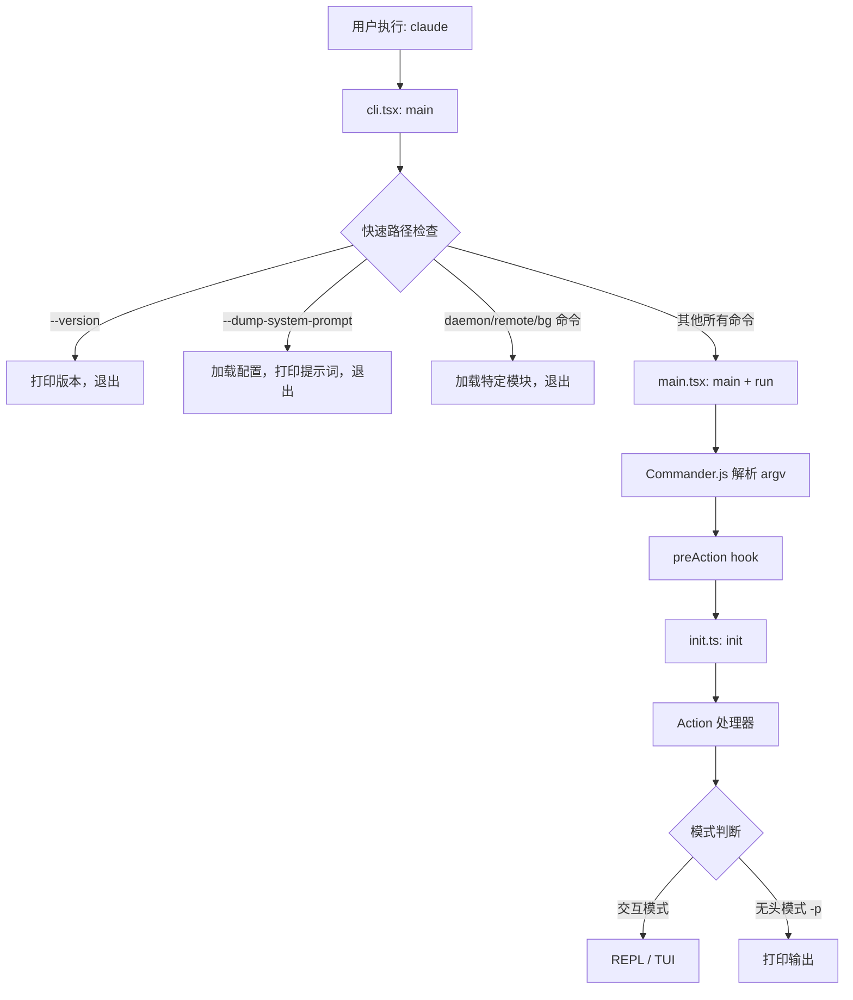
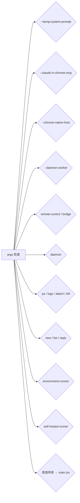
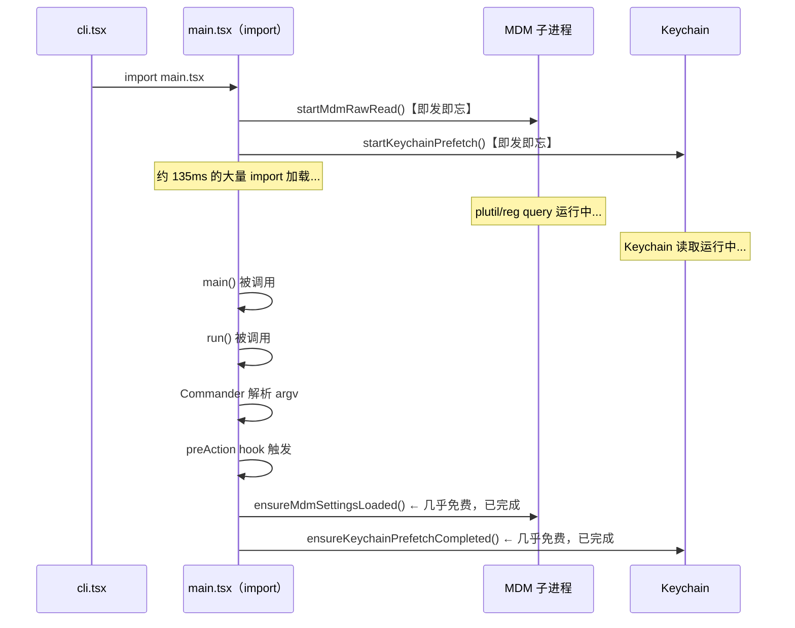
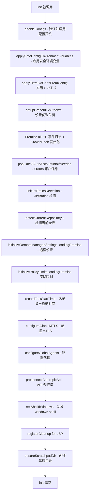
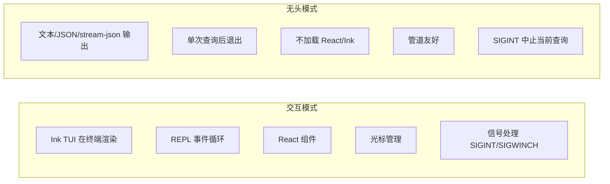

# 第二章：CLI 入口与启动流程

## 目录

1. [简介](#1-简介)
2. [入口点架构](#2-入口点架构)
3. [快速路径分发（cli.tsx）](#3-快速路径分发clitsx)
4. [main.tsx 启动序列](#4-maintsx-启动序列)
5. [核心初始化（init.ts）](#5-核心初始化initts)
6. [Bootstrap 状态隔离](#6-bootstrap-状态隔离)
7. [交互模式与无头模式](#7-交互模式与无头模式)
8. [启动性能优化](#8-启动性能优化)
9. [动手实践：构建一个简单的 CLI](#9-动手实践构建一个简单的-cli)
10. [关键要点与下一章预告](#10-关键要点与下一章预告)

---

## 1. 简介

当你在终端输入 `claude` 并按下回车，接下来数百毫秒内发生的事情决定了整个用户体验。启动缓慢令人沮丧，而快速启动则显得专业。Claude Code 的 CLI 入口是经过精心工程设计的代码，通过以下几个关键技术最小化从启动到首次输出的时间：

- **快速路径分发（Fast-path dispatch）**：`--version` 等特殊标志可以在零模块加载的情况下立即返回
- **并行预取（Parallel prefetch）**：MDM 读取和 Keychain 查询在其他 import 执行前就已启动
- **记忆化初始化（Memoized initialization）**：`init()` 函数无论被调用多少次，只执行一次
- **死代码消除（Dead Code Elimination, DCE）**：`feature('DUMP_SYSTEM_PROMPT')` 等特性标志在构建时求值，未发布的功能在外部构建中的代码量为零

**本章学习目标：**

读完本章，你将理解：
- Claude Code 的多入口点架构设计
- 为什么 `cli.tsx` 和 `main.tsx` 需要分开
- 快速路径分发模式如何避免为简单命令加载大量模块
- `init.ts` 如何用 `memoize` 保证单次初始化语义
- `bootstrap/state.ts` 是什么，以及为何要强制执行严格的隔离规则
- 交互模式和无头模式的区别
- 多种启动性能优化技巧

---

## 2. 入口点架构

Claude Code 不是一个简单的单文件 CLI。它有**多个入口点**，服务于不同的使用场景：

```
src/
├── entrypoints/
│   ├── cli.tsx        ← 主 CLI 入口（快速路径分发器）
│   ├── init.ts        ← 核心初始化逻辑
│   ├── mcp.ts         ← MCP 服务端入口
│   └── sdk/           ← Agent SDK 入口
├── main.tsx           ← Commander.js 完整 CLI 定义
└── bootstrap/
    └── state.ts       ← 全局单例状态
```

核心思路是：`cli.tsx` 是一个**轻量级分发器**，位于重量级 `main.tsx` 之前。这种分离是出于性能考量：如果你只是想查看版本号，完全没有必要加载 Commander.js、React 以及其他数十个模块。



### 为什么不用一个文件？

`cli.tsx` 和 `main.tsx` 的分离体现了一个根本性的取舍：**加载时间 vs 功能完整性**。

`main.tsx` 是一个 4,683 行的文件，在顶层就 import 了 Commander.js、React、Ink 以及数十个服务。所有这些 import 都需要时间来求值——冷启动通常需要 100-200ms。

相比之下，`cli.tsx` 只有几行代码。`--version` 快速路径（第 37-42 行）**不需要导入任何外部模块**：

```typescript
// src/entrypoints/cli.tsx:37-42
if (args.length === 1 && (args[0] === '--version' || args[0] === '-v' || args[0] === '-V')) {
  // MACRO.VERSION 在构建时被内联替换
  console.log(`${MACRO.VERSION} (Claude Code)`);
  return;
}
```

`MACRO.VERSION` 是一个构建时常量——bundler 会将其直接替换为如 `"1.2.3"` 这样的字符串。这是速度最快的版本检查方式。

---

## 3. 快速路径分发（cli.tsx）

`cli.tsx` 的全部目的就是在加载昂贵的 `main.tsx` 之前处理特殊情况。我们来逐一分析每条快速路径：

### 3.1 环境初始化（第 1-26 行）

在任何其他操作之前，`cli.tsx` 设置运行环境：

```typescript
// src/entrypoints/cli.tsx:5
process.env.COREPACK_ENABLE_AUTO_PIN = '0';
```

这可以防止 Corepack 将 `yarnpkg` 添加到用户的 `package.json` 中——这是一个曾经影响大量用户的真实 Bug。

```typescript
// src/entrypoints/cli.tsx:9-14
if (process.env.CLAUDE_CODE_REMOTE === 'true') {
  const existing = process.env.NODE_OPTIONS || '';
  process.env.NODE_OPTIONS = existing 
    ? `${existing} --max-old-space-size=8192` 
    : '--max-old-space-size=8192';
}
```

对于远程/容器环境（CCR），V8 堆被调整为 8GB。这必须在 Node.js 求值任何模块之前完成，因为堆大小在启动时就固定了。

`feature('ABLATION_BASELINE')` 代码块（第 21-26 行）特别有趣：

```typescript
// src/entrypoints/cli.tsx:21-26
if (feature('ABLATION_BASELINE') && process.env.CLAUDE_CODE_ABLATION_BASELINE) {
  for (const k of ['CLAUDE_CODE_SIMPLE', 'CLAUDE_CODE_DISABLE_THINKING', ...]) {
    process.env[k] ??= '1';
  }
}
```

`feature()` 是一个**构建时 DCE 门控**：在外部构建（你下载的版本）中，`feature('ABLATION_BASELINE')` 在构建时求值为 `false`，整个代码块从 bundle 中被消除。这段代码只存在于 Anthropic 内部用于 ML 实验的构建中。

第 16-19 行的注释解释了为什么这段代码在 `cli.tsx` 而不是 `init.ts` 中：

> BashTool/AgentTool/PowerShellTool 在导入时（模块级别）将 DISABLE_BACKGROUND_TASKS 捕获为常量——init() 运行太晚了。

这是一个微妙的时序约束：某些模块在**首次被导入时**（在模块求值时，而非调用时）读取环境变量。如果你想影响它们的行为，必须在它们被导入之前设置环境变量。

### 3.2 版本快速路径（第 37-42 行）

```typescript
// src/entrypoints/cli.tsx:33-42
async function main(): Promise<void> {
  const args = process.argv.slice(2);

  // --version/-v 的快速路径：零模块加载
  if (args.length === 1 && (args[0] === '--version' || args[0] === '-v' || args[0] === '-V')) {
    console.log(`${MACRO.VERSION} (Claude Code)`);
    return;
  }
```

零 import，零模块加载。只有字符串比较和 console.log。整个过程在 10ms 内完成。

### 3.3 启动性能分析器（第 45-48 行）

对于所有非版本路径，首先加载启动性能分析器：

```typescript
// src/entrypoints/cli.tsx:45-48
const { profileCheckpoint } = await import('../utils/startupProfiler.js');
profileCheckpoint('cli_entry');
```

注意这里使用的是**动态 import**（`await import(...)`）而非顶层静态 import。这意味着分析器模块只在需要时才加载，而且它自身的加载时间也被记录在案。

### 3.4 特性门控的快速路径（第 50-245 行）

`cli.tsx` 的其余部分是一系列快速路径，每个都由特性标志或参数检查守护：



每条快速路径遵循相同的模式：

```typescript
// src/entrypoints/cli.tsx:100-106（daemon-worker 快速路径）
if (feature('DAEMON') && args[0] === '--daemon-worker') {
  const { runDaemonWorker } = await import('../daemon/workerRegistry.js');
  await runDaemonWorker(args[1]);
  return;  // ← 关键：早返回防止 main.tsx 被加载
}
```

每条快速路径后面的 `return` 至关重要。没有它，代码会继续执行并加载 `main.tsx`。

### 3.5 BG Sessions 快速路径（第 185-209 行）

后台 Session 管理的快速路径更为复杂，展示了跨多个命令的模式匹配：

```typescript
// src/entrypoints/cli.tsx:185-209
if (feature('BG_SESSIONS') && (
  args[0] === 'ps' || args[0] === 'logs' || 
  args[0] === 'attach' || args[0] === 'kill' || 
  args.includes('--bg') || args.includes('--background')
)) {
  profileCheckpoint('cli_bg_path');
  const { enableConfigs } = await import('../utils/config.js');
  enableConfigs();
  const bg = await import('../cli/bg.js');
  switch (args[0]) {
    case 'ps':   await bg.psHandler(args.slice(1));   break;
    case 'logs': await bg.logsHandler(args[1]);        break;
    case 'attach': await bg.attachHandler(args[1]);    break;
    case 'kill': await bg.killHandler(args[1]);        break;
    default:     await bg.handleBgFlag(args);
  }
  return;
}
```

注意这里调用了 `enableConfigs()` 但没有调用完整的 `init()`。这些 Session 管理命令需要读取配置文件，但不需要完整的初始化栈（OAuth、遥测、代理配置等）。

---

## 4. main.tsx 启动序列

当没有快速路径匹配时，`cli.tsx` 最终会加载 `main.tsx`。但 `main.tsx` 在 `main()` 函数被调用之前就有自己的启动优化。

### 4.1 模块级并行预取（main.tsx 第 1-20 行）

`main.tsx` 的最顶部（在任何 `export` 或 `function` 定义之前）执行了三个副作用：

```typescript
// src/main.tsx:1-20（模块级，在 import 时执行）
import { profileCheckpoint, profileReport } from './utils/startupProfiler.js';

// 副作用 1：标记进入 main.tsx
profileCheckpoint('main_tsx_entry');

import { startMdmRawRead } from './utils/settings/mdm/rawRead.js';
// 副作用 2：开始读取 MDM（移动设备管理）策略设置
// 这会 spawn 一个子进程（macOS 上是 plutil，Windows 上是 reg query）
startMdmRawRead();

import { ensureKeychainPrefetchCompleted, startKeychainPrefetch } from './utils/secureStorage/keychainPrefetch.js';
// 副作用 3：开始从 Keychain 读取 OAuth token 和 API key
// 在 macOS 上通过同步 spawn 使用系统 Keychain（否则需要约 65ms）
startKeychainPrefetch();
```

源码中的注释解释了其原理：

> startMdmRawRead 启动 MDM 子进程（plutil/reg query），使它们与下面约 135ms 的 import 并行运行。startKeychainPrefetch 并行启动两个 macOS keychain 读取——否则 isRemoteManagedSettingsEligible() 会在 applySafeConfigEnvironmentVariables() 内部通过同步 spawn 顺序读取它们（每次 macOS 启动约 65ms）

这三个操作在**模块求值时**就被触发了——这意味着它们在 `import './main.tsx'` 开始执行时就立刻启动，在任何函数被调用之前。等到下面约 135ms 的大量 import 完成加载，MDM 子进程和 keychain 读取很可能已经完成了。

这就是**并行预取（Parallel Prefetch）**模式：提前启动缓慢的 I/O 操作，同时并行做有用的 CPU 工作，然后在需要时收集结果。



### 4.2 main() 函数（第 585-884 行）

`main()` 在调用 `run()` 之前处理几个特殊情况：

```typescript
// src/main.tsx:585-607
export async function main() {
  profileCheckpoint('main_function_start');

  // 安全：防止 Windows PATH 劫持
  process.env.NoDefaultCurrentDirectoryInExePath = '1';

  // 尽早初始化 warning handler
  initializeWarningHandler();
  
  // 注册 exit/SIGINT 时的清理
  process.on('exit', () => { resetCursor(); });
  process.on('SIGINT', () => {
    if (process.argv.includes('-p') || process.argv.includes('--print')) {
      return; // print 模式有自己的 SIGINT 处理器
    }
    process.exit(0);
  });
```

设置好信号处理器后，`main()` 处理几种特殊参数改写：

- **cc:// URL**（第 612-642 行）：将 `claude cc://server/session` 改写为内部 `open` 子命令（无头模式）
- **深度链接 URI**（第 644-677 行）：处理 macOS URL Scheme 启动的 `--handle-uri`
- **`claude assistant`**（第 685-700 行）：暂存 session ID 并剥离子命令，由主 TUI 处理
- **`claude ssh`**（第 702 行以后）：类似的暂存并剥离模式

最后，`main()` 调用 `run()`，后者定义完整的 Commander.js 程序。

### 4.3 run() 函数与 preAction Hook（第 884-967 行）

`run()` 创建 Commander 程序并注册 `preAction` hook：

```typescript
// src/main.tsx:884-917
async function run(): Promise<CommanderCommand> {
  const program = new CommanderCommand()
    .configureHelp(createSortedHelpConfig())
    .enablePositionalOptions();

  // preAction 在每个命令的 action 之前运行，但不在显示帮助时运行
  program.hook('preAction', async thisCommand => {
    profileCheckpoint('preAction_start');
    
    // 等待模块级别启动的预取（此时几乎已完成）
    await Promise.all([
      ensureMdmSettingsLoaded(),
      ensureKeychainPrefetchCompleted()
    ]);
    profileCheckpoint('preAction_after_mdm');
    
    // 运行完整初始化
    await init();
    profileCheckpoint('preAction_after_init');
    ...
  });
```

`preAction` hook 是一个巧妙的设计选择。Commander.js 允许你附加一个 hook，它在任何命令 action 之前运行，但**不在显示帮助时运行**。这意味着 `claude --help` 可以立即显示帮助文本，完全不运行 `init()`。

`preAction` 内部的执行顺序：

1. `await Promise.all([ensureMdmSettingsLoaded(), ensureKeychainPrefetchCompleted()])` — 收集预取结果（几乎瞬时，因为约 135ms 前就已启动）
2. `await init()` — 完整初始化（记忆化，只执行一次）
3. `initSinks()` — 附加分析/日志 sink
4. 处理 `--plugin-dir` 标志
5. 执行配置迁移
6. 开始加载远程托管设置（非阻塞）
7. 开始上传用户设置（非阻塞，如果启用）

---

## 5. 核心初始化（init.ts）

`init.ts` 导出一个单一的记忆化函数：`init()`。`memoize` 包装器是最重要的设计选择：

```typescript
// src/entrypoints/init.ts:57
export const init = memoize(async (): Promise<void> => {
  // ... 初始化逻辑
})
```

来自 lodash-es 的 `memoize` 保证了无论 `init()` 被调用多少次，初始化逻辑只执行一次。后续调用会立即返回缓存的 Promise。

这非常关键，因为多条代码路径可能调用 `init()`：
- `preAction` hook
- 各个命令处理器
- 测试设置代码

如果没有记忆化，可能会导致竞态条件、重复分析事件或双重初始化错误。

### 5.1 初始化步骤

`init()` 函数按顺序执行以下步骤：



让我们详细看最重要的几个步骤：

**步骤 1：enableConfigs()（第 65 行）**
```typescript
// src/entrypoints/init.ts:63-69
try {
  const configsStart = Date.now()
  enableConfigs()
  logForDiagnosticsNoPII('info', 'init_configs_enabled', {
    duration_ms: Date.now() - configsStart,
  })
```

这一步验证所有配置文件（settings.json、.mcp.json、CLAUDE.md）并启用配置系统。如果配置文件有解析错误，会抛出 `ConfigParseError`，在底部的 catch 块中处理。

**步骤 2：applySafeConfigEnvironmentVariables()（第 74 行）**

"安全"环境变量在信任对话框之前应用。"不安全"的（可能影响安全性的）则等到建立信任之后。

**步骤 3：applyExtraCACertsFromConfig()（第 79 行）**

这一步对时序要求很高。Bun（运行时）通过 BoringSSL 在启动时缓存 TLS 证书存储。如果在第一个 TLS 连接建立后才添加 CA 证书，它们不会影响现有连接。注释解释道：

> 在任何 TLS 连接之前，将 settings.json 中的 NODE_EXTRA_CA_CERTS 应用到 process.env 中。Bun 通过 BoringSSL 在启动时缓存 TLS 证书存储，所以这必须在第一次 TLS 握手之前发生。

**步骤 4：并行分析初始化（第 94-105 行）**
```typescript
// src/entrypoints/init.ts:94-105
void Promise.all([
  import('../services/analytics/firstPartyEventLogger.js'),
  import('../services/analytics/growthbook.js'),
]).then(([fp, gb]) => {
  fp.initialize1PEventLogging()
  gb.onGrowthBookRefresh(() => {
    void fp.reinitialize1PEventLoggingIfConfigChanged()
  })
})
```

注意 `void Promise.all(...)` — `void` 关键字显式丢弃了这个 Promise。这是即发即忘（fire-and-forget）：分析初始化在后台启动，不阻塞 init 的其余部分。

**步骤 5：preconnectAnthropicApi()（第 159 行）**
```typescript
// src/entrypoints/init.ts:159
preconnectAnthropicApi()
```

这在后台发起到 `api.anthropic.com` 的 TCP+TLS 握手。等用户输入完第一个提示词并按下回车，TCP 连接已经预热，节省了第一次 API 请求的 100-200ms。

### 5.2 init() 中的错误处理

整个 init 逻辑体被 try-catch 包裹（第 62-237 行）：

```typescript
// src/entrypoints/init.ts:215-237
} catch (error) {
  if (error instanceof ConfigParseError) {
    if (getIsNonInteractiveSession()) {
      // 非交互模式：写入 stderr，以代码 1 退出
      process.stderr.write(`Configuration error in ${error.filePath}: ${error.message}\n`)
      gracefulShutdownSync(1)
      return
    }
    // 交互模式：通过 Ink/React 显示视觉错误对话框
    return import('../components/InvalidConfigDialog.js').then(m =>
      m.showInvalidConfigDialog({ error }),
    )
  } else {
    throw error  // 非配置错误重新抛出
  }
}
```

这展示了交互/无头的分离：在无头模式（`-p`）中，错误以纯文本写入 stderr。在交互模式中，它们会触发完整的 Ink 渲染对话框。

还要注意 `import('../components/InvalidConfigDialog.js')` 是错误处理路径中的动态 import。第 30 行的注释解释了原因：

> showInvalidConfigDialog 通过动态 import 在错误路径中加载，以避免在 init 时加载 React

导入 React 会显著增加启动时间。将其推迟到错误路径（希望永远不会运行），可以保持正常路径的速度。

---

## 6. Bootstrap 状态隔离

`src/bootstrap/state.ts` 定义了 Claude Code 会话的**全局单例状态**。这是整个代码库中受限最严格的文件。

### 6.1 "DO NOT ADD" 规则

`state.ts` 的第 31 行有一条被 ESLint 强制执行的注释：

```typescript
// src/bootstrap/state.ts:31
// DO NOT ADD MORE STATE HERE - BE JUDICIOUS WITH GLOBAL STATE
```

这不只是注释——还有一个名为 `bootstrap-isolation` 的自定义 ESLint 规则，防止其他文件从 `state.ts` 导入过多内容，保持依赖关系图的整洁。

### 6.2 State 包含什么

`State` 类型（第 45-200 行以后）是一个大型的会话级值记录：

```typescript
// src/bootstrap/state.ts:45-100（节选）
type State = {
  originalCwd: string       // 启动时的工作目录
  projectRoot: string       // 稳定的项目根目录
  totalCostUSD: number      // 运行时 API 费用累计
  totalAPIDuration: number  // 运行时 API 耗时累计
  isInteractive: boolean    // 交互模式 vs 无头模式标志
  sessionId: SessionId      // 唯一会话标识符
  meter: Meter | null       // OpenTelemetry meter
  inlinePlugins: Array<string>  // --plugin-dir 插件
  // ... 50+ 个其他字段
}
```

### 6.3 为什么隔离很重要

`state.ts` 被设计为导入依赖图中的**叶节点**。它只从少数其他模块导入（主要是类型定义和用于 UUID 的 crypto）。如果 `state.ts` 导入了 `main.tsx` 或 `init.ts`，就会产生循环依赖，可能导致微妙的初始化顺序 Bug。

`bootstrap-isolation` ESLint 规则强制执行这一点：

```typescript
// src/bootstrap/state.ts:15-18
// eslint-disable-next-line custom-rules/bootstrap-isolation
import { randomUUID } from 'src/utils/crypto.js'
```

`eslint-disable-next-line` 注释值得注意：即使是这个小小的 `randomUUID` 导入也需要显式覆盖隔离规则，并附上解释为什么允许的注释。

### 6.4 初始状态

`STATE` 对象在模块加载时用默认值初始化。示例如下：

```typescript
// src/bootstrap/state.ts:~295-315（节选）
const STATE: State = {
  originalCwd: realpathSync(cwd()),
  projectRoot: realpathSync(cwd()),
  isInteractive: false,          // 默认：非交互
  totalCostUSD: 0,
  totalAPIDuration: 0,
  sessionId: asSessionId(randomUUID()),
  meter: null,
  // ...
}
```

`isInteractive: false` 是默认值。当 `main.tsx` 检测到 stdout 是 TTY 且没有 `-p` 标志时，该值会被设置为 `true`。

---

## 7. 交互模式与无头模式

交互模式和无头模式的分支点发生在 `main.tsx` 的主 action 处理器中（在 `program.name('claude')` 定义并注册 action 的地方，大约第 968 行以后）。

### 7.1 模式检测

模式检测结合了多个信号：

1. **TTY 检查**：`process.stdout.isTTY` — stdout 是否连接到终端？
2. **`-p`/`--print` 标志**：显式请求非交互式输出
3. **`--output-format`**：`stream-json` 或 `json` 意味着非交互式使用

```typescript
// src/bootstrap/state.ts:1057-1066
export function getIsNonInteractiveSession(): boolean {
  return !STATE.isInteractive
}

export function setIsInteractive(value: boolean): void {
  STATE.isInteractive = value
}
```

### 7.2 两种模式的差异



**交互模式**（无 `-p` 标志）：
- 加载 React 和 Ink 进行终端 UI 渲染
- 进入 REPL 事件循环（读取-求值-打印循环）
- 管理光标位置、颜色、边框绘制
- 处理窗口大小调整（SIGWINCH）以重新渲染

**无头模式**（带 `-p` 或 `--print`）：
- 向 stdout 输出文本/JSON
- 执行单次查询后退出
- 永远不加载 Ink/React（除非有配置错误对话框）
- 适合 shell 脚本和管道

这种分离也影响错误处理（如 `init.ts` 中所见）、遥测初始化以及插件加载行为。

---

## 8. 启动性能优化

让我们总结启动路径中使用的所有性能技术：

### 8.1 并行预取（Parallel Prefetch）

在模块求值时启动，在 `main()` 被调用之前：

```typescript
// src/main.tsx:14-20
startMdmRawRead();    // spawn plutil/reg query 子进程
startKeychainPrefetch();  // 开始 macOS keychain 读取
```

这些操作与约 135ms 的 import 求值时间重叠。等 `preAction` 调用 `ensureMdmSettingsLoaded()` 时，结果通常已经准备好了。

### 8.2 惰性加载（Lazy Loading via Dynamic Import）

重型模块只在真正需要它们的代码路径中才被加载：

```typescript
// 只在 --dump-system-prompt 时加载
const { getSystemPrompt } = await import('../constants/prompts.js');

// 只在配置解析错误时加载
return import('../components/InvalidConfigDialog.js').then(...)

// OpenTelemetry（约 400KB）只在遥测初始化时加载
// src/entrypoints/init.ts:44-46 注释：
// initializeTelemetry 通过 import() 在 setMeterState() 中延迟加载
// 以推迟约 400KB 的 OpenTelemetry + protobuf 模块
```

### 8.3 API 预连接（API Preconnection）

在 `init()` 期间，到 `api.anthropic.com` 的 TCP+TLS 握手在后台启动，早于用户完成第一个提示词：

```typescript
// src/entrypoints/init.ts:153-159
// 预连接到 Anthropic API——将 TCP+TLS 握手（约 100-200ms）
// 与 action 处理器工作的约 100ms 重叠。
// 在 CA 证书 + 代理 agent 配置好之后，
// 这样预热的连接使用正确的传输层。
preconnectAnthropicApi()
```

### 8.4 特性标志 DCE（Feature Flag Dead Code Elimination）

构建时 `feature()` 标志从 bundle 中消除整个代码块：

```typescript
// src/entrypoints/cli.tsx:21-26
if (feature('ABLATION_BASELINE') && process.env.CLAUDE_CODE_ABLATION_BASELINE) {
  // 这整个代码块在外部构建中被移除
}
```

Bun bundler（`bun:bundle`）在构建时求值 `feature()` 调用。如果特性被禁用，整个 `if` 块变成 `if (false) { ... }`，然后作为死代码被消除。外部用户永远不会下载这段代码。

### 8.5 记忆化初始化（Memoized Initialization）

```typescript
// src/entrypoints/init.ts:57
export const init = memoize(async (): Promise<void> => { ... })
```

第二次调用 `init()` 会立即返回一个已 resolved 的 Promise，没有任何额外工作。没有双重初始化的风险。

### 8.6 启动性能分析器

分析器（`src/utils/startupProfiler.ts`）在每个检查点记录时间戳：

```typescript
profileCheckpoint('cli_entry');
profileCheckpoint('main_tsx_entry');
profileCheckpoint('preAction_start');
profileCheckpoint('preAction_after_mdm');
profileCheckpoint('preAction_after_init');
// ...
```

运行 `claude --debug` 可以看到这些时间戳，方便识别启动时间的瓶颈所在。

### 优化技术汇总

| 技术 | 位置 | 收益 |
|------|------|------|
| 快速路径分发 | `cli.tsx` | `--version` 低于 10ms |
| 并行预取 | `main.tsx` 模块级别 | 节省约 65ms keychain + MDM 读取 |
| API 预连接 | `init.ts` | 节省第一次 API 请求 100-200ms |
| 惰性动态 import | 全代码库 | 无头模式不加载 React/Ink |
| 特性标志 DCE | 构建时 | 从 bundle 移除未发布特性 |
| 记忆化 init | `init.ts` | 无双重初始化风险 |

---

## 9. 动手实践：构建一个简单的 CLI

现在让我们应用这些模式，构建一个模拟 Claude Code 启动架构的简化版 CLI。

完整实现见 `examples/02-cli-entrypoint/simple-cli.ts`。以下是关键模式的讲解：

### 模式一：加载重型模块之前的快速路径

```typescript
// 在加载 Commander 之前处理 --version
if (args[0] === '--version') {
  console.log('1.0.0');
  process.exit(0);
}

// 现在可以安全加载 Commander（重型）
const { Command } = await import('commander');
```

### 模式二：并行预取

```typescript
// 在模块加载时启动缓慢的 I/O
const configReadPromise = readFileAsync('config.json').catch(() => null);
const credentialsPromise = readCredentials().catch(() => null);

// ... 做其他工作（模块加载、参数解析）...

// 稍后收集结果——此时几乎是免费的
const [config, credentials] = await Promise.all([
  configReadPromise,
  credentialsPromise
]);
```

### 模式三：记忆化初始化

```typescript
import memoize from 'lodash-es/memoize.js';

const init = memoize(async () => {
  // 无论调用多少次，只运行一次
  await loadConfig();
  await setupLogging();
  await connectDatabase();
});

// 可以从多个地方安全调用
await init(); // 运行初始化
await init(); // 立即返回缓存的 Promise
```

### 模式四：preAction Hook

```typescript
program.hook('preAction', async () => {
  // 在每个命令之前运行，但不在 --help 时运行
  await init();
  initAnalytics();
});

program.command('foo').action(async () => {
  // init() 已经被调用，有保证
  doWork();
});
```

### 运行示例

```bash
# 运行示例
bun run examples/02-cli-entrypoint/simple-cli.ts

# 快速路径：--version
bun run examples/02-cli-entrypoint/simple-cli.ts --version

# 无头模式
bun run examples/02-cli-entrypoint/simple-cli.ts --print "hello"

# 显示帮助（不运行 init()）
bun run examples/02-cli-entrypoint/simple-cli.ts --help
```

---

## 10. 关键要点与下一章预告

### 关键要点

1. **双文件入口**：`cli.tsx` 是轻量级分发器；`main.tsx` 是完整 CLI。这种分离使快速路径成为可能，无需为简单命令承担全部模块加载成本。

2. **快速路径几乎零成本**：`--version` 以零模块 import 运行。每条快速路径都以 `return` 结束，阻止重型 CLI 被加载。

3. **模块求值时的并行预取**：MDM 和 keychain 读取在 `main.tsx` 被 import 时就启动，与约 135ms 的 import 求值时间重叠。等 `preAction` 运行时，它们（基本上）已经完成。

4. **`preAction` hook 是初始化点**：它在命令之前运行但不在帮助时运行。这里调用 `init()`，保证初始化恰好在需要时发生。

5. **`init()` 是记忆化的**：来自 lodash 的 `memoize` 包装器保证了单次执行语义。在任何地方调用，只运行一次。

6. **`bootstrap/state.ts` 是会话单例**：`DO NOT ADD MORE STATE HERE` 规则和 `bootstrap-isolation` ESLint 规则保持状态模块的整洁和最小依赖。

7. **交互模式 vs 无头模式是一等公民的区别**：state 中的 `isInteractive` 标志影响错误处理、UI 渲染、遥测初始化等。

8. **特性标志 DCE 移除未发布特性**：`feature('FEATURE_NAME')` 调用在构建时求值，从外部构建中消除死代码。

### 下一章预告

在**第三章：工具系统**中，我们将探索 Claude Code 如何定义、注册和执行工具——这是让 Claude 真正能够做事（如读取文件、运行 bash 命令、编辑代码）的机制。我们将看到 `Tool` 接口如何定义、工具如何被收集和过滤，以及工具使用循环如何与 Anthropic API 配合工作。

---

*本章涉及的源码文件：*
- `src/entrypoints/cli.tsx` — 快速路径分发器
- `src/main.tsx` — Commander.js CLI 定义（4,683 行）
- `src/entrypoints/init.ts` — 核心初始化逻辑
- `src/bootstrap/state.ts` — 全局会话状态单例
