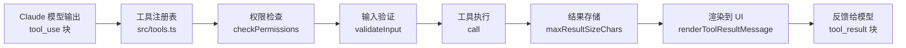
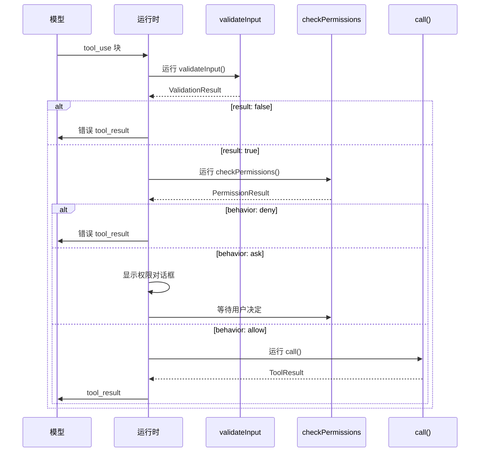
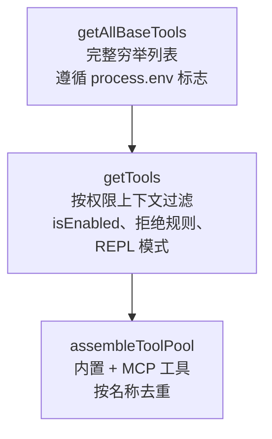
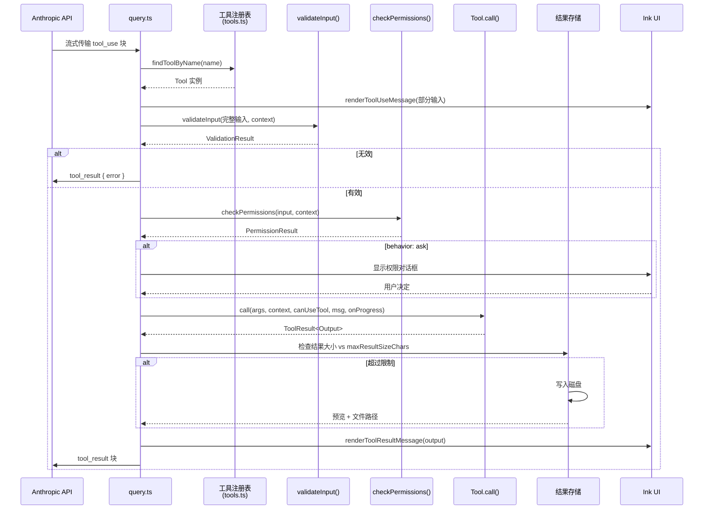
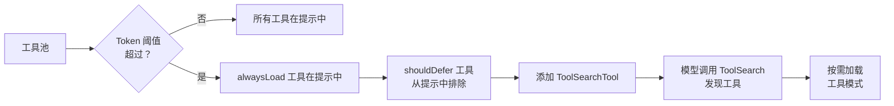
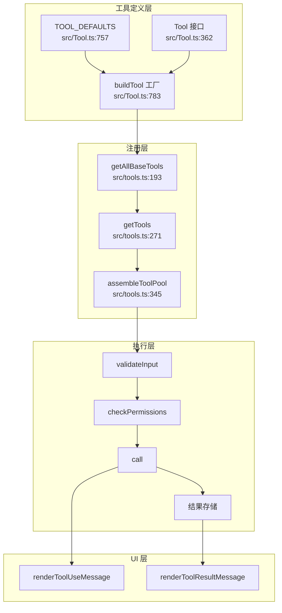

# 第三章：工具系统

> **源码引用：** 所有行号均指向 `anthhub/claude-code` 的开源快照（本指南全程使用 `anthhub-claude-code` 镜像）。

## 目录

1. [简介](#1-简介)
2. [Tool 接口深度解析](#2-tool-接口深度解析)
   - 2.1 [标识字段](#21-标识字段)
   - 2.2 [核心方法：call、checkPermissions、validateInput](#22-核心方法callcheckpermissionsvalidateinput)
   - 2.3 [渲染方法](#23-渲染方法)
   - 2.4 [行为标志](#24-行为标志)
   - 2.5 [结果存储：maxResultSizeChars](#25-结果存储maxresultsize-chars)
   - 2.6 [延迟加载：shouldDefer](#26-延迟加载shoulddefer)
3. [buildTool() 工厂函数](#3-buildtool-工厂函数)
4. [工具注册：三层架构](#4-工具注册三层架构)
5. [核心工具实现](#5-核心工具实现)
   - 5.1 [BashTool](#51-bashtool)
   - 5.2 [FileEditTool](#52-fileedittool)
   - 5.3 [FileReadTool](#53-filereadtool)
   - 5.4 [GlobTool 和 GrepTool](#54-globtool-和-greptool)
   - 5.5 [AgentTool](#55-agenttool)
6. [工具执行流程](#6-工具执行流程)
7. [ToolSearch 与延迟加载](#7-toolsearch-与延迟加载)
8. [工具结果存储](#8-工具结果存储)
9. [动手实践：创建自定义工具](#9-动手实践创建自定义工具)
10. [核心要点与下一步](#10-核心要点与下一步)

---

## 1. 简介

工具系统是 Claude Code 的**能力层**。Claude 的每一个动作——读取文件、运行 shell 命令、搜索代码、派生子代理——都经过这个系统。理解它能够让你扩展 Claude Code 的自定义能力、分析权限边界，并追踪从模型输出到实际副作用的完整执行路径。

工具系统本质上回答三个问题：

1. **Claude 能做什么？** — `src/Tool.ts` 中的 `Tool` 接口定义了每个工具必须满足的契约。
2. **现在哪些工具可用？** — `src/tools.ts` 实现了三层注册和过滤机制。
3. **工具调用如何成为现实？** — 执行流程将模型的 `tool_use` 块转换为经过验证、权限检查、产生副作用的结果。



**核心要点（简介）**
- Claude 的每个动作都是一次工具调用
- `Tool` 接口是契约；`buildTool()` 是工厂；`tools.ts` 是注册表
- 系统在类型层面（TypeScript 泛型）和运行时层面（权限检查、验证）都是安全的

---

## 2. Tool 接口深度解析

`Tool` 类型定义在 `src/Tool.ts`（第 362–695 行）。它有三个泛型参数：

```typescript
// src/Tool.ts 第 362-365 行
export type Tool<
  Input extends AnyObject = AnyObject,
  Output = unknown,
  P extends ToolProgressData = ToolProgressData,
> = { ... }
```

- `Input` — Zod 模式类型；约束模型可以传递的内容
- `Output` — `call()` 返回结果的 TypeScript 类型
- `P` — 用于流式更新的进度事件类型

### 2.1 标识字段

```typescript
// src/Tool.ts 第 371-377 行
readonly name: string
aliases?: string[]
searchHint?: string
```

| 字段 | 用途 | 示例 |
|------|------|------|
| `name` | API 调用中使用的主标识符 | `"Bash"`、`"Edit"` |
| `aliases` | 工具重命名时用于向后兼容的旧名称 | `["computer_tool"]` |
| `searchHint` | 工具延迟时用于关键词搜索的 3–10 个词的短语 | `"modify file contents in place"` |

`aliases` 由 `toolMatchesName()`（第 348 行）使用：

```typescript
// src/Tool.ts 第 348-353 行
export function toolMatchesName(
  tool: { name: string; aliases?: string[] },
  name: string,
): boolean {
  return tool.name === name || (tool.aliases?.includes(name) ?? false)
}
```

`searchHint` 用于 `ToolSearch` 延迟加载系统（见第 7 节）。提示词**不应**重复工具名称——它应该提供互补词汇（例如 `NotebookEdit` 的 `"jupyter"`）。

### 2.2 核心方法：call、checkPermissions、validateInput

**`call()`** — 实际实现（第 379-385 行）：

```typescript
// src/Tool.ts 第 379-385 行
call(
  args: z.infer<Input>,
  context: ToolUseContext,
  canUseTool: CanUseToolFn,
  parentMessage: AssistantMessage,
  onProgress?: ToolCallProgress<P>,
): Promise<ToolResult<Output>>
```

`ToolUseContext`（第 158-299 行）是工具可能需要的一切的集合：`abortController`、`readFileState`、`getAppState()`、`setToolJSX`、`messages`、权限上下文等。工具接收这个上下文的快照；工具不能直接改变它。

`ToolResult<Output>`（第 321-336 行）：

```typescript
// src/Tool.ts 第 321-336 行
export type ToolResult<T> = {
  data: T
  newMessages?: (UserMessage | AssistantMessage | AttachmentMessage | SystemMessage)[]
  contextModifier?: (context: ToolUseContext) => ToolUseContext
  mcpMeta?: { _meta?: Record<string, unknown>; structuredContent?: Record<string, unknown> }
}
```

`contextModifier` 字段让 `AgentTool` 等工具能修改后续轮次的上下文（例如，注入子代理的对话历史）。

**`validateInput()`** — 执行前验证（第 489-492 行）：

```typescript
// src/Tool.ts 第 489-492 行
validateInput?(
  input: z.infer<Input>,
  context: ToolUseContext,
): Promise<ValidationResult>
```

`ValidationResult`（第 95-101 行）要么是 `{ result: true }`，要么是 `{ result: false; message: string; errorCode: number }`。这在 `checkPermissions` **之前**运行，因此可以在不显示权限提示的情况下短路。

**`checkPermissions()`** — 面向用户的权限门控（第 500-503 行）：

```typescript
// src/Tool.ts 第 500-503 行
checkPermissions(
  input: z.infer<Input>,
  context: ToolUseContext,
): Promise<PermissionResult>
```

`PermissionResult` 有一个 `behavior` 字段：`'allow'`、`'deny'`、`'ask'`。当为 `'ask'` 时，UI 显示权限对话框。通用权限逻辑在 `permissions.ts` 中；`checkPermissions` 只包含**工具特有**的逻辑。

**执行顺序：**



### 2.3 渲染方法

工具通过五个可选渲染方法控制自己的 UI 渲染：

| 方法 | 调用时机 | 注意事项 |
|------|----------|----------|
| `renderToolUseMessage` | 参数流式传输时（输入不完整！） | 输入是 `Partial<z.infer<Input>>` |
| `renderToolUseProgressMessage` | 执行过程中 | 接收 `ProgressMessage[]` |
| `renderToolUseQueuedMessage` | 工具在队列中等待时 | 可选 |
| `renderToolResultMessage` | 执行完成后 | 完整输出可用 |
| `renderToolUseRejectedMessage` | 用户拒绝权限时 | 可选；回退到通用版本 |
| `renderToolUseErrorMessage` | 工具抛出异常时 | 可选；回退到通用版本 |

传递给 `renderToolResultMessage` 的 `style?: 'condensed'` 选项让 UI 可以请求紧凑摘要而非完整输出——用于非详细模式。

### 2.4 行为标志

```typescript
// src/Tool.ts 第 402-416 行
isConcurrencySafe(input: z.infer<Input>): boolean
isEnabled(): boolean
isReadOnly(input: z.infer<Input>): boolean
isDestructive?(input: z.infer<Input>): boolean
interruptBehavior?(): 'cancel' | 'block'
```

| 标志 | 默认值 | 含义 |
|------|--------|------|
| `isConcurrencySafe` | `false`（来自 TOOL_DEFAULTS） | 此工具能否与其他工具并行运行？ |
| `isEnabled` | `true` | 工具是否完全可用？ |
| `isReadOnly` | `false` | 用于 `--no-write` / 只读模式强制执行 |
| `isDestructive` | `false` | 不可逆操作（删除、覆盖、发送） |
| `interruptBehavior` | `'block'` | 工具运行时用户发送新消息会发生什么 |

`GlobTool` 和 `GrepTool` 都设置了 `isConcurrencySafe() { return true }`（GlobTool 第 76-78 行），使 Claude 能够同时发起多个搜索而无需串行化屏障。

### 2.5 结果存储：maxResultSizeChars

```typescript
// src/Tool.ts 第 464-467 行
maxResultSizeChars: number
```

每个工具都必须设置这个限制。当工具结果超过这个阈值时，结果会被写入磁盘，Claude 收到的是预览加文件路径，而不是完整内容。

特殊值：
- `Infinity` — 永不持久化（FileReadTool 使用此值，以防止循环的 Read→文件→Read 依赖）
- `100_000` — 大多数工具的常用值（BashTool、GlobTool、GrepTool、FileEditTool）

### 2.6 延迟加载：shouldDefer

```typescript
// src/Tool.ts 第 438-449 行
readonly shouldDefer?: boolean
readonly alwaysLoad?: boolean
```

当 ToolSearch 激活时，设置了 `shouldDefer: true` 的工具会从初始系统提示中排除。模型使用 `ToolSearch` 按需发现和加载它们。`alwaysLoad: true` 即使在 ToolSearch 启用时也强制包含——适用于模型在第一轮就必须看到的工具。

**核心要点（接口）**
- `Tool<Input, Output, P>` 是泛型的：Zod 模式类型处处流动
- `validateInput` 在权限检查之前运行；用它做廉价的格式检查
- `maxResultSizeChars` 是必需的，防止上下文窗口溢出
- `isConcurrencySafe` 解锁并行执行——在安全时设置它

---

## 3. buildTool() 工厂函数

代码库中的每个工具都使用 `buildTool()` 而不是直接实现完整的 `Tool` 接口：

```typescript
// src/Tool.ts 第 783-792 行
export function buildTool<D extends AnyToolDef>(def: D): BuiltTool<D> {
  return {
    ...TOOL_DEFAULTS,
    userFacingName: () => def.name,
    ...def,
  } as BuiltTool<D>
}
```

默认值（第 757-769 行）在关键处是失败安全的（fail-closed）：

```typescript
// src/Tool.ts 第 757-769 行
const TOOL_DEFAULTS = {
  isEnabled: () => true,
  isConcurrencySafe: (_input?: unknown) => false,      // 假设不安全
  isReadOnly: (_input?: unknown) => false,              // 假设有写入
  isDestructive: (_input?: unknown) => false,
  checkPermissions: (input, _ctx?) =>
    Promise.resolve({ behavior: 'allow', updatedInput: input }),
  toAutoClassifierInput: (_input?: unknown) => '',      // 跳过分类器
  userFacingName: (_input?: unknown) => '',
}
```

`ToolDef` 类型（第 721-726 行）是将所有可默认键设为可选的 `Tool`：

```typescript
// src/Tool.ts 第 721-726 行
export type ToolDef<Input, Output, P> =
  Omit<Tool<Input, Output, P>, DefaultableToolKeys> &
  Partial<Pick<Tool<Input, Output, P>, DefaultableToolKeys>>
```

而 `BuiltTool<D>`（第 735-741 行）在类型层面镜像了运行时展开——意味着 TypeScript 确切知道哪些方法来自 `def`（保留其原始字面量类型），哪些来自默认值。

**每个工具使用的模式：**

```typescript
export const MyTool = buildTool({
  name: 'MyTool',
  maxResultSizeChars: 100_000,
  // ... 只需覆盖你需要的部分
} satisfies ToolDef<...>)
```

`satisfies` 关键字（或 `buildTool` 上的 `ToolDef` 约束）确保 TypeScript 在编译时捕获缺失的必需字段。

**核心要点（buildTool）**
- `buildTool()` 是唯一的工厂——永远不要手动构造 `Tool` 对象
- 默认值是失败安全的：`isConcurrencySafe=false`、`isReadOnly=false`
- `BuiltTool<D>` 保留你定义中的字面量类型
- `satisfies ToolDef<...>` 在定义处捕获类型错误

---

## 4. 工具注册：三层架构

`src/tools.ts` 实现了三个逐步精细的工具池视图：



### 第一层：getAllBaseTools()

```typescript
// src/tools.ts 第 193-251 行
export function getAllBaseTools(): Tools {
  return [
    AgentTool,
    TaskOutputTool,
    BashTool,
    ...(hasEmbeddedSearchTools() ? [] : [GlobTool, GrepTool]),
    // ... 更多工具
    ...(isToolSearchEnabledOptimistic() ? [ToolSearchTool] : []),
  ]
}
```

这是所有工具的**真理来源**。第 191-192 行的注释标记它必须与用于系统提示缓存的 Statsig 动态配置保持同步。条件包含处理：
- 功能标志（`feature('PROACTIVE')`、`feature('KAIROS')`）
- 环境变量（`process.env.USER_TYPE === 'ant'`）
- 可选能力（`isTodoV2Enabled()`、`isWorktreeModeEnabled()`）

### 第二层：getTools()

```typescript
// src/tools.ts 第 271-327 行
export const getTools = (permissionContext: ToolPermissionContext): Tools => {
  // 简单模式：只有 Bash、Read、Edit
  if (isEnvTruthy(process.env.CLAUDE_CODE_SIMPLE)) { ... }

  const tools = getAllBaseTools().filter(tool => !specialTools.has(tool.name))
  let allowedTools = filterToolsByDenyRules(tools, permissionContext)

  // REPL 模式：隐藏原始工具
  if (isReplModeEnabled()) { ... }

  const isEnabled = allowedTools.map(_ => _.isEnabled())
  return allowedTools.filter((_, i) => isEnabled[i])
}
```

`filterToolsByDenyRules()`（第 262-269 行）使用与运行时权限检查相同的通配符匹配器——因此拒绝规则中的 `mcp__server` 在模型看到工具**之前**就剥离了该 MCP 服务器的所有工具。

### 第三层：assembleToolPool()

```typescript
// src/tools.ts 第 345-367 行
export function assembleToolPool(
  permissionContext: ToolPermissionContext,
  mcpTools: Tools,
): Tools {
  const builtInTools = getTools(permissionContext)
  const allowedMcpTools = filterToolsByDenyRules(mcpTools, permissionContext)

  const byName = (a: Tool, b: Tool) => a.name.localeCompare(b.name)
  return uniqBy(
    [...builtInTools].sort(byName).concat(allowedMcpTools.sort(byName)),
    'name',
  )
}
```

先排序后去重的模式是刻意的：内置工具和 MCP 工具在拼接前**分别**排序，使内置工具保持连续前缀。这保留了服务器的提示缓存断点——将 MCP 工具按字母表插入内置工具中会使每个添加了 MCP 服务器的用户的缓存键失效。

**核心要点（注册）**
- `getAllBaseTools()` → `getTools()` → `assembleToolPool()` 是三层漏斗
- 拒绝规则在模型看到工具之前就剥离它们，而不仅仅是在调用时
- 排序稳定性对提示缓存很重要——内置工具形成稳定前缀

---

## 5. 核心工具实现

### 5.1 BashTool

**文件：** `src/tools/BashTool/BashTool.tsx`

BashTool 是系统中最复杂的工具。其关键实现细节：

#### 基于 AST 的安全解析

```typescript
// src/tools/BashTool/BashTool.tsx 第 17 行
import { parseForSecurity } from '../../utils/bash/ast.js'
```

命令在执行前被解析为 AST。这支持：
- 检测 `cd` 命令，若超出项目范围则重置 CWD（`resetCwdIfOutsideProject`）
- 解析复合命令以分类读写操作
- 提取可匹配权限的命令前缀

#### 输入模式

```typescript
// src/tools/BashTool/BashTool.tsx 第 227-247 行
const fullInputSchema = lazySchema(() => z.strictObject({
  command: z.string(),
  timeout: semanticNumber(z.number().optional()),
  description: z.string().optional(),
  run_in_background: semanticBoolean(z.boolean().optional()),
  dangerouslyDisableSandbox: semanticBoolean(z.boolean().optional()),
  _simulatedSedEdit: z.object({ ... }).optional(),  // 仅内部使用
}))
```

`semanticNumber` 和 `semanticBoolean` 是接受类型化值和字符串表示的包装模式——模型有时将布尔值序列化为 `"true"` 字符串。

#### 自动后台化

```typescript
// src/tools/BashTool/BashTool.tsx 第 56-57 行
const ASSISTANT_BLOCKING_BUDGET_MS = 15_000
```

在助手模式下，阻塞式 bash 命令若超过 15 秒，会自动移到后台任务。用户看到 `BackgroundHint` UI 组件。

#### 输出截断

BashTool 使用 `EndTruncatingAccumulator`（第 36 行导入）来限制输出。累加器流式传输输出，达到限制时从末尾截断，确保保留最近的输出。

#### 可折叠 UI 分类

```typescript
// src/tools/BashTool/BashTool.tsx 第 59-67 行
const BASH_SEARCH_COMMANDS = new Set(['find', 'grep', 'rg', ...])
const BASH_READ_COMMANDS = new Set(['cat', 'head', 'tail', ...])
const BASH_LIST_COMMANDS = new Set(['ls', 'tree', 'du'])
```

`isSearchOrReadBashCommand()` 函数（第 95-172 行）解析命令并对其进行可折叠显示分类。管道中的所有部分都必须是读取/搜索命令，整个命令才能折叠。

### 5.2 FileEditTool

**文件：** `src/tools/FileEditTool/FileEditTool.ts`

#### 修改时间验证

FileEditTool 跟踪文件修改时间以检测并发编辑。在应用补丁之前，它检查自上次读取以来文件是否在 Claude 之外被修改：

```typescript
// src/tools/FileEditTool/FileEditTool.ts 第 56 行
import { FILE_UNEXPECTEDLY_MODIFIED_ERROR } from './constants.js'
```

如果修改时间不匹配，编辑会被拒绝并带有 `FILE_UNEXPECTEDLY_MODIFIED_ERROR`，防止静默覆盖并发更改。

#### 模糊字符串匹配

```typescript
// src/tools/FileEditTool/utils.ts（第 72 行引用）
import { findActualString, getPatchForEdit } from './utils.js'
```

当 `old_string` 不完全匹配时，`findActualString` 实现模糊匹配——处理空白规范化和类似的细微差异。这防止了模型引用格式略有不同的字符串时工具失败。

#### LSP 集成

```typescript
// src/tools/FileEditTool/FileEditTool.ts 第 5-7 行
import { getLspServerManager } from '../../services/lsp/manager.js'
import { clearDeliveredDiagnosticsForFile } from '../../services/lsp/LSPDiagnosticRegistry.js'
```

编辑后，FileEditTool 通知 LSP 服务器刷新诊断。这使 IDE 的错误高亮与 Claude 的更改保持同步。

#### OOM 防护

```typescript
// src/tools/FileEditTool/FileEditTool.ts 第 84 行
const MAX_EDIT_FILE_SIZE = 1024 * 1024 * 1024 // 1 GiB
```

大于 1 GiB 的文件在任何字符串操作之前就被拒绝——V8/Bun 字符串长度限制约为 2^30 个字符，因此 1 GiB 是安全上限。

### 5.3 FileReadTool

**文件：** `src/tools/FileReadTool/FileReadTool.ts`

#### 多格式支持

FileReadTool 处理纯文本以外的几种格式：
- **Jupyter notebooks**（`.ipynb`）——通过 `mapNotebookCellsToToolResult` 将 cell 映射为可读输出
- **PDF** ——通过 `readPDF` 提取页面，支持页面范围
- **图像** ——通过扩展名检测，压缩后 base64 编码
- **二进制文件** ——通过 `hasBinaryExtension` 检测，带有有用错误信息拒绝

#### 图像压缩

```typescript
// src/tools/FileReadTool/FileReadTool.ts 第 48-51 行
import {
  compressImageBufferWithTokenLimit,
  maybeResizeAndDownsampleImageBuffer,
} from '../../utils/imageResizer.js'
```

图像在嵌入之前被压缩以适应 token 限制。调整器使用自适应质量降低。

#### 阻塞设备防护

```typescript
// src/tools/FileReadTool/FileReadTool.ts 第 97-104 行
const BLOCKED_DEVICE_PATHS = new Set([
  '/dev/zero',   // 无限输出
  // ...
])
```

像 `/dev/zero` 这样的路径会导致进程挂起读取无限输出。FileReadTool 在任何 I/O 之前检查路径。

#### maxResultSizeChars: Infinity

```typescript
// src/tools/FileReadTool/FileReadTool.ts（通过 buildTool 调用）
maxResultSizeChars: Infinity
```

FileReadTool 将 `maxResultSizeChars` 设置为 `Infinity`，绕过磁盘持久化路径。持久化文件读取结果会创建循环依赖：Read → 持久化到文件 → 下次 Read 读取持久化文件 → 等等。FileReadTool 通过自己的 `limit` 和 `offset` 参数自行限制输出。

### 5.4 GlobTool 和 GrepTool

**文件：** `src/tools/GlobTool/GlobTool.ts`、`src/tools/GrepTool/GrepTool.ts`

两个工具都是**并发安全**的（`isConcurrencySafe() { return true }`）且只读，使 Claude 能够发起多个并行搜索。

#### GlobTool

```typescript
// src/tools/GlobTool/GlobTool.ts 第 57-78 行
export const GlobTool = buildTool({
  name: GLOB_TOOL_NAME,
  searchHint: 'find files by name pattern or wildcard',
  maxResultSizeChars: 100_000,
  isConcurrencySafe() { return true },
  isReadOnly() { return true },
  // ...
})
```

输出模式（第 39-52 行）包括 `truncated: boolean`——结果上限为 100 个文件。如果截断，模型必须使用更具体的模式或缩小搜索目录。

#### GrepTool

```typescript
// src/tools/GrepTool/GrepTool.ts 第 21 行
import { ripGrep } from '../../utils/ripgrep.js'
```

GrepTool 包装 `ripgrep`（而非 `grep`）以在大型代码库上提高性能。输入模式镜像了 ripgrep 的标志：`-B`、`-A`、`-C` 用于上下文行，`-i` 用于不区分大小写，`type` 用于文件类型过滤。

`output_mode` 字段支持三种模式：
- `"content"` ——带可选上下文的匹配行
- `"files_with_matches"` ——只有文件路径（默认，成本较低）
- `"count"` ——每个文件的匹配计数

#### 嵌入式搜索工具

```typescript
// src/tools.ts 第 201 行
...(hasEmbeddedSearchTools() ? [] : [GlobTool, GrepTool]),
```

在 Ant 内部构建中，`bfs` 和 `ugrep` 嵌入在二进制文件中。当存在时，Claude 的 shell 中的 `find` 和 `grep` 被别名为这些更快的工具——因此专用的 Glob/Grep 工具变得多余并被排除。

### 5.5 AgentTool

**文件：** `src/tools/AgentTool/AgentTool.tsx`

AgentTool 是 Claude 派生子代理的机制。它是架构上最重要的工具，因为它实现了代理协调系统（第 9 章）。

关键行为：
- **为子代理组装新的工具池**，通过 `assembleToolPool()`（第 16 行导入）
- **支持工作树** ——可以派生 git 工作树进行隔离
- **支持远程代理** ——可以传送到远程机器
- **自动后台化** ——长时间运行的代理在 `getAutoBackgroundMs()` 后（默认启用时为 120 秒）移到后台

```typescript
// src/tools/AgentTool/AgentTool.tsx 第 72-76 行
function getAutoBackgroundMs(): number {
  if (isEnvTruthy(process.env.CLAUDE_AUTO_BACKGROUND_TASKS) ||
      getFeatureValue_CACHED_MAY_BE_STALE('tengu_auto_background_agents', false)) {
    return 120_000
  }
  return 0
}
```

**核心要点（核心工具）**
- BashTool 使用 AST 解析来保证安全——它不仅仅是 `exec(command)`
- FileEditTool 验证修改时间以防止静默覆盖
- FileReadTool 设置 `maxResultSizeChars: Infinity` 以避免循环持久化
- GlobTool/GrepTool 是 `isConcurrencySafe: true`，支持并行搜索
- AgentTool 为每个子代理组装独立的工具池

---

## 6. 工具执行流程

以下图表追踪了从模型输出到反馈的完整工具调用：



`query.ts` 编排器（源码中未直接列出，但是中央协调器）处理 tool_use 块的流式特性——在参数流入时调用 `renderToolUseMessage` 处理部分输入，在执行开始之前给 UI 提供实时反馈。

**核心要点（执行流程）**
- 渲染在验证之前开始——部分输入立即流式传输到 UI
- `validateInput` → `checkPermissions` → `call` 是有保证的顺序
- 结果大小在执行*之后*检查；大结果透明地写入磁盘

---

## 7. ToolSearch 与延迟加载

当工具池超过特定 token 阈值时，Claude Code 启用 ToolSearch。此机制通过延迟工具模式来减少初始提示长度。



注册时的乐观检查：

```typescript
// src/tools.ts 第 248-250 行
...(isToolSearchEnabledOptimistic() ? [ToolSearchTool] : []),
```

`searchHint` 是关键词匹配的词汇。当模型需要某种能力（例如，"编辑 Jupyter notebook"）时，它用 "jupyter notebook" 等关键词调用 `ToolSearch`，匹配 `NotebookEdit` 的 `searchHint: 'jupyter'`。

**核心要点（ToolSearch）**
- `shouldDefer: true` 将工具从初始提示中排除
- `alwaysLoad: true` 即使 ToolSearch 开启也强制包含
- `searchHint` 是发现词汇——让它与工具名称互补

---

## 8. 工具结果存储

当 `ToolResult.data` 序列化超过 `maxResultSizeChars` 个字符时，结果存储系统介入：

```typescript
// src/tools/BashTool/BashTool.tsx 第 40 行
import { buildLargeToolResultMessage, ensureToolResultsDir,
         generatePreview, getToolResultPath, PREVIEW_SIZE_BYTES
} from '../../utils/toolResultStorage.js'
```

流程：
1. 序列化结果
2. 与 `maxResultSizeChars` 比较长度
3. 若超过：将完整内容写入 `~/.claude/tool_results/<uuid>.txt`
4. 返回预览（前 `PREVIEW_SIZE_BYTES` 字节）加文件路径
5. Claude 收到预览，若需要可通过 `FileReadTool` 读取完整文件

这防止任何单个工具结果消耗整个上下文窗口。

**核心要点（结果存储）**
- `maxResultSizeChars` 是硬性限制——超过的结果总是写入磁盘
- `Infinity` 绕过磁盘持久化（用于自行限制输出的工具）
- 预览+路径允许 Claude 按需读取完整结果

---

## 9. 动手实践：创建自定义工具

让我们创建一个 `WordCountTool`，用于统计文本中的单词、行和字符。

### 第一步：定义工具

```typescript
// examples/03-tool-system/simple-tool.ts
import { buildTool } from './tool-interface'
import { z } from 'zod'

export const WordCountTool = buildTool({
  name: 'WordCount',
  searchHint: 'count words lines characters in text',
  maxResultSizeChars: 10_000,

  inputSchema: z.object({
    text: z.string().describe('要分析的文本'),
    include_details: z.boolean().optional()
      .describe('包含逐行明细'),
  }),

  async call(args, _context) {
    const lines = args.text.split('\n')
    const words = args.text.split(/\s+/).filter(w => w.length > 0)
    const chars = args.text.length

    const result = {
      lines: lines.length,
      words: words.length,
      chars,
      ...(args.include_details ? {
        breakdown: lines.map((line, i) => ({
          lineNumber: i + 1,
          words: line.split(/\s+/).filter(w => w.length > 0).length,
          chars: line.length,
        }))
      } : {}),
    }

    return { data: result }
  },

  // 只读：纯计算，无副作用
  isReadOnly() { return true },
  // 可与其他工具并行运行
  isConcurrencySafe() { return true },

  renderToolUseMessage(input) {
    const preview = (input.text ?? '').slice(0, 50)
    return `正在统计词数："${preview}${(input.text?.length ?? 0) > 50 ? '...' : ''}"`
  },

  renderToolResultMessage(content) {
    return `${content.words} 个单词，${content.lines} 行，${content.chars} 个字符`
  },

  mapToolResultToToolResultBlockParam(content, toolUseID) {
    return {
      type: 'tool_result',
      tool_use_id: toolUseID,
      content: JSON.stringify(content),
    }
  },

  async prompt() {
    return '统计文本中的单词、行和字符数。'
  },

  async description() {
    return '统计提供文本中的单词、行和字符数。'
  },

  async checkPermissions(_input, _context) {
    return { behavior: 'allow', updatedInput: _input }
  },
})
```

### 第二步：注册工具

```typescript
// 在你的自定义 tools.ts 或插件入口点中：
import { WordCountTool } from './simple-tool'

// 与内置工具一起添加到工具池
const myTools = [...getTools(permissionContext), WordCountTool]
```

### 第三步：验证接口契约

`buildTool()` 工厂会为以下内容填充默认值：
- `isEnabled: () => true`
- `isConcurrencySafe: () => false`（我们覆盖了这个）
- `isReadOnly: () => false`（我们覆盖了这个）
- `checkPermissions: () => allow`（我们明确实现）
- `toAutoClassifierInput: () => ''`
- `userFacingName: () => 'WordCount'`

**常见错误：**
1. 忘记 `maxResultSizeChars`——TypeScript 会捕获这个（必需字段）
2. 为有副作用的工具设置 `isConcurrencySafe: true`
3. 使用 `mapToolResultToToolResultBlockParam` 返回原始对象而非字符串
4. 为不自行限制输出的工具设置 `maxResultSizeChars: Infinity`

**核心要点（创建自定义工具）**
- 使用 `buildTool()`——永远不要直接实现 `Tool`
- 只覆盖与默认值不同的内容
- 为纯读取工具设置 `isReadOnly: true` 和 `isConcurrencySafe: true`
- `mapToolResultToToolResultBlockParam` 必须返回 `ToolResultBlockParam`

---

## 10. 核心要点与下一步

### 总结

工具系统围绕清晰的关注点分离构建：

| 关注点 | 位置 |
|--------|------|
| 契约定义 | `src/Tool.ts` — `Tool<Input, Output, P>` |
| 默认行为 | `src/Tool.ts` — `TOOL_DEFAULTS`、`buildTool()` |
| 注册与过滤 | `src/tools.ts` — 三层漏斗 |
| 权限检查 | `checkPermissions()` + `src/utils/permissions/` |
| 输入验证 | 每个工具的 `validateInput()` |
| 结果大小限制 | 每个工具的 `maxResultSizeChars` |
| 延迟加载 | `shouldDefer`、`alwaysLoad`、`ToolSearch` |
| UI 渲染 | 每个工具的渲染方法 |

### 架构图



### 下一步

- **第 4 章：命令系统** — `/commands`（斜杠命令）如何与工具一起工作；`Command` 类型及其与 `Tool` 的区别
- **第 7 章：权限系统** — `ToolPermissionContext`、拒绝规则和权限对话框流程的深度解析
- **第 9 章：代理协调** — `AgentTool` 如何派生子代理、管理其工具池以及处理异步生命周期

---

*本章源码引用：`src/Tool.ts`（所有行号相对于 anthhub-claude-code 快照）、`src/tools.ts`、`src/tools/BashTool/BashTool.tsx`、`src/tools/FileEditTool/FileEditTool.ts`、`src/tools/FileReadTool/FileReadTool.ts`、`src/tools/GlobTool/GlobTool.ts`、`src/tools/GrepTool/GrepTool.ts`、`src/tools/AgentTool/AgentTool.tsx`。*
