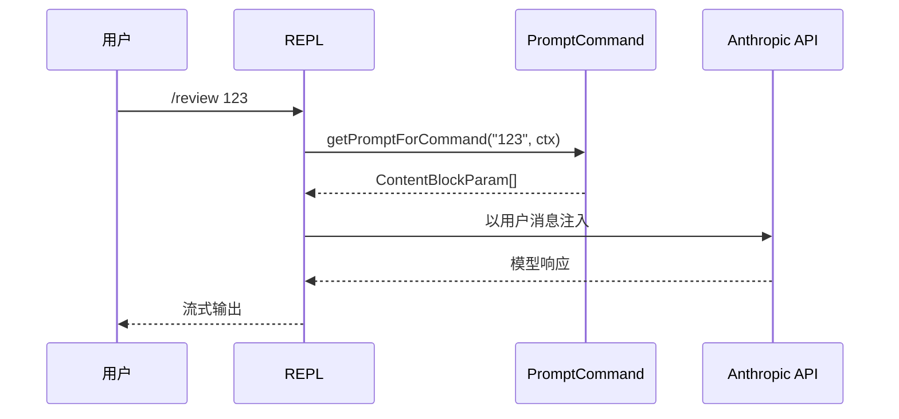
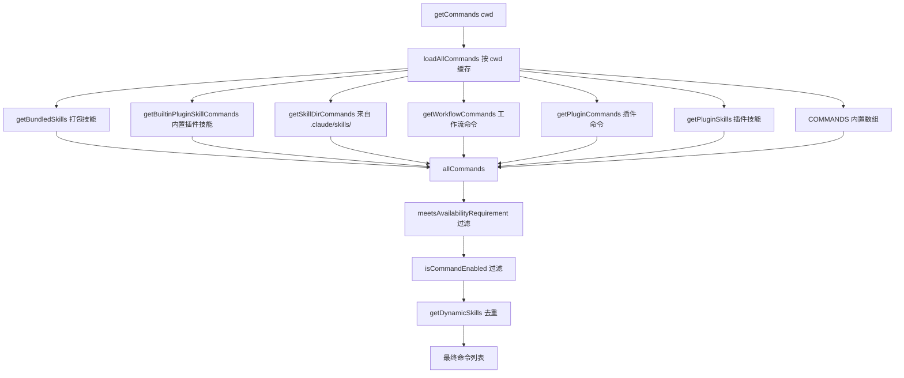
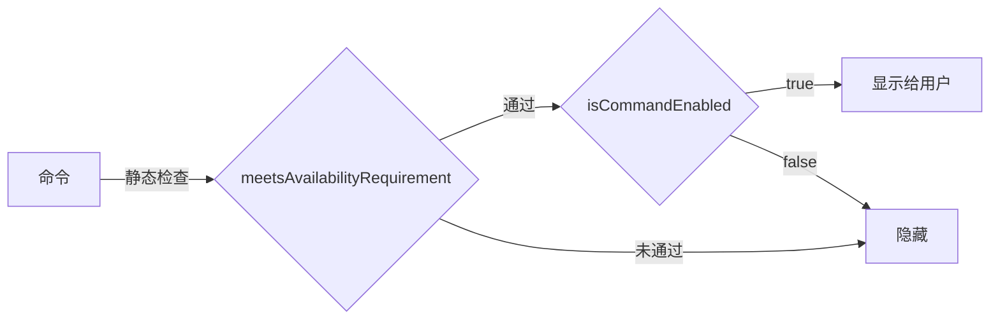

# 第四章：命令系统

## 目录

1. [引言：命令 vs 工具](#引言命令-vs-工具)
2. [命令类型系统](#命令类型系统)
   - [PromptCommand](#promptcommand)
   - [LocalCommand](#localcommand)
   - [LocalJSXCommand](#localjsxcommand)
   - [CommandBase 通用字段](#commandbase-通用字段)
3. [命令注册机制](#命令注册机制)
   - [静态导入](#静态导入)
   - [Feature Flag 死代码消除](#feature-flag-死代码消除)
   - [USER_TYPE 条件加载](#user_type-条件加载)
   - [动态来源：技能、插件、工作流](#动态来源技能插件工作流)
4. [命令查找与过滤流水线](#命令查找与过滤流水线)
5. [典型命令深度解析](#典型命令深度解析)
   - [compact — 带 isEnabled 守卫的 LocalCommand](#compact--带-isenabled-守卫的-localcommand)
   - [diff — LocalJSXCommand](#diff--localjsxcommand)
   - [review — PromptCommand](#review--promptcommand)
   - [insights — 懒加载 PromptCommand 外壳](#insights--懒加载-promptcommand-外壳)
6. [基于技能文件的命令](#基于技能文件的命令)
   - [从 .claude/skills/ 加载](#从-claudeskills-加载)
   - [打包技能 Bundled Skills](#打包技能-bundled-skills)
7. [插件命令](#插件命令)
8. [可用性与启用状态](#可用性与启用状态)
9. [动手实践：实现一个斜杠命令](#动手实践实现一个斜杠命令)
10. [核心要点](#核心要点)

---

## 引言：命令 vs 工具

Claude Code 提供两种本质不同的扩展能力：**工具（Tools）** 和 **命令（Commands）**。

| 维度 | 工具 | 命令 |
|---|---|---|
| 调用方 | AI 模型 | 用户（输入 `/`） |
| 语法 | API 调用中的 JSON | `/命令名 [参数]` |
| 定义方式 | 带 `inputSchema` 的 `Tool` 类 | 带类型字段的 `Command` 对象 |
| 用途 | 扩展 Claude *能做什么* | 扩展用户*能触发什么* |
| 所在章节 | 第三章 | 本章 |

命令是用户直接交互的斜杠命令界面。当你输入 `/compact`、`/diff` 或 `/review pr-123` 时，你在调用一个命令。模型不会调用命令 — 它调用工具。这种区分保持了系统的清晰性：命令服务于面向人类的工作流；工具服务于 Agent 能力。

```
用户输入 /compact
     │
     ▼
processSlashCommand()   ← REPL 输入处理器
     │
     ├─ type: 'prompt'    → getPromptForCommand() → 注入对话
     ├─ type: 'local'     → load().call()          → 进程内执行，返回文本
     └─ type: 'local-jsx' → load().call()          → 渲染 Ink 组件
```

---

## 命令类型系统

类型定义位于 `src/types/command.ts`。顶层联合类型为：

```typescript
// src/types/command.ts:205-206
export type Command = CommandBase &
  (PromptCommand | LocalCommand | LocalJSXCommand)
```

每个命令从 `CommandBase` 共享字段开始，然后特化为三种执行模型之一。

### PromptCommand

```typescript
// src/types/command.ts:25-57
export type PromptCommand = {
  type: 'prompt'
  progressMessage: string
  contentLength: number
  argNames?: string[]
  allowedTools?: string[]
  model?: string
  source: SettingSource | 'builtin' | 'mcp' | 'plugin' | 'bundled'
  pluginInfo?: { ... }
  disableNonInteractive?: boolean
  hooks?: HooksSettings
  skillRoot?: string
  context?: 'inline' | 'fork'
  agent?: string
  effort?: EffortValue
  paths?: string[]
  getPromptForCommand(
    args: string,
    context: ToolUseContext,
  ): Promise<ContentBlockParam[]>
}
```

关键字段说明：

- **`getPromptForCommand`** — 返回 `ContentBlockParam` 数组，这些内容被注入为对话中的下一条用户消息。这就是 `/review` 等命令如何展开为详细提示词的原理。
- **`context: 'inline' | 'fork'`** — `inline`（默认）在当前对话中展开提示词；`fork` 以独立 token 预算启动子 Agent。
- **`source`** — 追踪命令来源（`builtin`、`mcp`、`plugin`、`bundled`，或 `SettingSource` 如 `userSettings`/`projectSettings`）。
- **`paths`** — glob 模式：只有当模型触及匹配文件后，该命令才可见（适用于文件类型专属技能）。



### LocalCommand

```typescript
// src/types/command.ts:74-78
type LocalCommand = {
  type: 'local'
  supportsNonInteractive: boolean
  load: () => Promise<LocalCommandModule>
}
```

以及它加载的模块类型：

```typescript
// src/types/command.ts:62-72
export type LocalCommandModule = {
  call: LocalCommandCall
}

export type LocalCommandCall = (
  args: string,
  context: LocalJSXCommandContext,
) => Promise<LocalCommandResult>
```

`load()` 模式是**懒加载** — 繁重的实现模块在启动时不被 `import`，只在命令实际被调用时才获取。这保证了即使注册了 50+ 个命令，启动速度依然很快。

`LocalCommandResult` 可以是：

```typescript
// src/types/command.ts:16-23
export type LocalCommandResult =
  | { type: 'text'; value: string }
  | { type: 'compact'; compactionResult: CompactionResult; displayText?: string }
  | { type: 'skip' }
```

### LocalJSXCommand

```typescript
// src/types/command.ts:144-152
type LocalJSXCommand = {
  type: 'local-jsx'
  load: () => Promise<LocalJSXCommandModule>
}
```

同样的懒加载 `load()` 模式，但实现返回一个 React 节点（由 Ink 在终端中渲染）。`/diff`、`/memory`、`/config`、`/doctor` 等命令使用此类型来渲染交互式终端 UI。

### CommandBase 通用字段

三种类型都共享 `CommandBase`：

```typescript
// src/types/command.ts:175-203
export type CommandBase = {
  availability?: CommandAvailability[]   // 授权门控
  description: string
  hasUserSpecifiedDescription?: boolean
  isEnabled?: () => boolean              // 功能标志门控
  isHidden?: boolean                     // 从自动补全中隐藏
  name: string
  aliases?: string[]
  isMcp?: boolean
  argumentHint?: string                  // 自动补全中的灰色提示
  whenToUse?: string                     // 面向模型的使用指导
  version?: string
  disableModelInvocation?: boolean       // 禁止 AI 调用此命令
  userInvocable?: boolean
  loadedFrom?: 'commands_DEPRECATED' | 'skills' | 'plugin' | 'managed' | 'bundled' | 'mcp'
  kind?: 'workflow'
  immediate?: boolean                    // 绕过队列立即执行
  isSensitive?: boolean                  // 从历史记录中隐藏参数
  userFacingName?: () => string
}
```

注意字段：

- **`isEnabled`** — 在调用时求值的零参数函数。用于功能标志和环境变量门控。返回 `false` 则从自动补全中隐藏命令。
- **`availability`** — 静态授权要求：`'claude-ai'`（OAuth 订阅者）或 `'console'`（API 密钥用户）。在每次 `getCommands()` 调用时通过 `meetsAvailabilityRequirement()` 求值，不缓存，因此会话期间的授权变化立即生效。
- **`aliases`** — 额外名称（例如 `/config` 也是 `/settings`）。
- **`whenToUse`** — 给模型 SkillTool 的自由文本指导，不显示给用户。
- **`disableModelInvocation`** — 阻止命令出现在模型可调用技能列表中。

---

## 命令注册机制

整个注册流程位于 `src/commands.ts`（754 行）。它有三个不同的层次。

### 静态导入

文件以约 50 条静态 `import` 语句开头，每个内置命令一条：

```typescript
// src/commands.ts:2-57
import compact from './commands/compact/index.js'
import config from './commands/config/index.js'
import diff from './commands/diff/index.js'
import doctor from './commands/doctor/index.js'
import memory from './commands/memory/index.js'
// ...40+ 条更多
```

这些在**模块初始化时始终加载**。每个 `index.ts` 都很小（< 15 行）— 它只定义命令元数据对象和 `load()` 惰性函数。繁重的实现只在命令运行时才被拉取。

### Feature Flag 死代码消除

通过 `feature()` 门控的命令（Bun 的死代码消除）：

```typescript
// src/commands.ts:62-122
const proactive =
  feature('PROACTIVE') || feature('KAIROS')
    ? require('./commands/proactive.js').default
    : null

const briefCommand =
  feature('KAIROS') || feature('KAIROS_BRIEF')
    ? require('./commands/brief.js').default
    : null

const bridge = feature('BRIDGE_MODE')
  ? require('./commands/bridge/index.js').default
  : null
// ...更多 feature 门控命令
```

`feature('FLAG_NAME')` 在构建时由 Bun 的打包器求值。如果标志为 `false`，`require()` 调用（及引用的整个模块）从生产包中消除 — 这是真正的死代码消除（DCE）。这使发布的二进制文件保持精简。

在运行时，结果要么是命令对象，要么是 `null`。`COMMANDS()` 数组随后只展开非 null 值：

```typescript
// src/commands.ts:320-330
...(proactive ? [proactive] : []),
...(briefCommand ? [briefCommand] : []),
...(bridge ? [bridge] : []),
```

### USER_TYPE 条件加载

```typescript
// src/commands.ts:48-52
const agentsPlatform =
  process.env.USER_TYPE === 'ant'
    ? require('./commands/agents-platform/index.js').default
    : null
```

Ant 内部命令在运行时检查 `process.env.USER_TYPE === 'ant'`，只对 Anthropic 员工可见。整个 `INTERNAL_ONLY_COMMANDS` 数组类似地被门控：

```typescript
// src/commands.ts:343-346
...(process.env.USER_TYPE === 'ant' && !process.env.IS_DEMO
  ? INTERNAL_ONLY_COMMANDS
  : []),
```

### 动态来源：技能、插件、工作流

缓存化的 `loadAllCommands()` 函数并行组装所有动态命令来源：

```typescript
// src/commands.ts:449-469
const loadAllCommands = memoize(async (cwd: string): Promise<Command[]> => {
  const [
    { skillDirCommands, pluginSkills, bundledSkills, builtinPluginSkills },
    pluginCommands,
    workflowCommands,
  ] = await Promise.all([
    getSkills(cwd),
    getPluginCommands(),
    getWorkflowCommands ? getWorkflowCommands(cwd) : Promise.resolve([]),
  ])

  return [
    ...bundledSkills,
    ...builtinPluginSkills,
    ...skillDirCommands,
    ...workflowCommands,
    ...pluginCommands,
    ...pluginSkills,
    ...COMMANDS(),   // 内置命令排在最后
  ]
})
```

优先级顺序对名称冲突解析很重要：打包技能优先，插件技能在内置命令之前排最后。由于 `findCommand()` 返回第一个匹配项，排在前面的赢。



---

## 命令查找与过滤流水线

`getCommands()` 不只是加载器 — 它在每次调用时都应用两个运行时过滤器：

```typescript
// src/commands.ts:476-517
export async function getCommands(cwd: string): Promise<Command[]> {
  const allCommands = await loadAllCommands(cwd)
  const dynamicSkills = getDynamicSkills()

  const baseCommands = allCommands.filter(
    _ => meetsAvailabilityRequirement(_) && isCommandEnabled(_),
  )

  // 去重并插入动态技能
  ...
}
```

- **`meetsAvailabilityRequirement`** — 根据当前授权状态检查 `cmd.availability`。不缓存，因为授权可能在会话期间变化（`/login` 之后）。
- **`isCommandEnabled`** — 委托给 `cmd.isEnabled?.() ?? true`。没有 `isEnabled` 的命令默认启用。
- **动态技能** — 在文件 I/O 操作期间发现的（例如当模型读取触发路径匹配技能的文件时）最后合并，按名称去重。

通过名称查找命令使用 `findCommand()`：

```typescript
// src/commands.ts:688-698
export function findCommand(
  commandName: string,
  commands: Command[],
): Command | undefined {
  return commands.find(
    _ =>
      _.name === commandName ||
      getCommandName(_) === commandName ||
      _.aliases?.includes(commandName),
  )
}
```

它检查 `name`、`userFacingName()` 和 `aliases`。这就是 `/settings` 能解析到 `config` 命令的原因（`config` 声明了 `aliases: ['settings']`）。

---

## 典型命令深度解析

### compact — 带 isEnabled 守卫的 LocalCommand

```typescript
// src/commands/compact/index.ts:1-15
import type { Command } from '../../commands.js'
import { isEnvTruthy } from '../../utils/envUtils.js'

const compact = {
  type: 'local',
  name: 'compact',
  description:
    'Clear conversation history but keep a summary in context. Optional: /compact [instructions for summarization]',
  isEnabled: () => !isEnvTruthy(process.env.DISABLE_COMPACT),
  supportsNonInteractive: true,
  argumentHint: '<optional custom summarization instructions>',
  load: () => import('./compact.js'),
} satisfies Command
```

实现文件（`compact.ts`）有约 288 行，如果急切加载会显著拖慢启动。`load()` 惰性函数将其推迟到用户实际运行 `/compact` 时。

`isEnabled` 守卫检查 `DISABLE_COMPACT` 环境变量，允许运维人员在不修改代码的情况下禁用该功能。

`call()` 实现（在 `compact.ts:40`）接受可选的自定义压缩指令，并协调多种压缩策略：
1. 会话记忆压缩（无自定义指令时优先）
2. 响应式压缩（功能标志路径）
3. 传统 `compactConversation()` 配合 microcompact 预处理

### diff — LocalJSXCommand

```typescript
// src/commands/diff/index.ts:1-8
export default {
  type: 'local-jsx',
  name: 'diff',
  description: 'View uncommitted changes and per-turn diffs',
  load: () => import('./diff.js'),
} satisfies Command
```

最小化的 index 文件 — 纯元数据。`diff.js` 实现渲染一个 Ink 组件，展示可交互导航的 git diff。`local-jsx` 类型告知 REPL 调度器在终端渲染返回的 React 节点，而非打印文本。

### review — PromptCommand

```typescript
// src/commands/review.ts:33-44
const review: Command = {
  type: 'prompt',
  name: 'review',
  description: 'Review a pull request',
  progressMessage: 'reviewing pull request',
  contentLength: 0,
  source: 'builtin',
  async getPromptForCommand(args): Promise<ContentBlockParam[]> {
    return [{ type: 'text', text: LOCAL_REVIEW_PROMPT(args) }]
  },
}
```

`getPromptForCommand` 将填充好的模板作为内容块返回。REPL 将其注入为模型的下一条用户消息。注意 `contentLength: 0` — 实际内容长度由模板函数动态计算。这是内置命令的简化处理；基于技能文件的命令从其 Markdown 文件大小计算 token 估算值。

同一文件导出 `ultrareview` 作为 `local-jsx` 命令 — 使用相同命名空间但完全不同的执行路径（渲染权限 UI 后分叉到远程 Agent）。

### insights — 懒加载 PromptCommand 外壳

```typescript
// src/commands.ts:190-202
const usageReport: Command = {
  type: 'prompt',
  name: 'insights',
  description: 'Generate a report analyzing your Claude Code sessions',
  contentLength: 0,
  progressMessage: 'analyzing your sessions',
  source: 'builtin',
  async getPromptForCommand(args, context) {
    const real = (await import('./commands/insights.js')).default
    if (real.type !== 'prompt') throw new Error('unreachable')
    return real.getPromptForCommand(args, context)
  },
}
```

注释解释了原因：`insights.ts` 是 113KB（3200 行）。外壳是一个 `PromptCommand`，其 `getPromptForCommand` 在首次调用时执行动态 `import()`。这是与 `LocalCommand.load()` 相同的懒加载模式，应用于 `PromptCommand`。模块只在 `/insights` 首次运行时获取。

---

## 基于技能文件的命令

技能是用户定义的、以 Markdown 文件编写的命令。它们是面向终端用户的主要扩展机制。

### 从 .claude/skills/ 加载

加载器（`src/skills/loadSkillsDir.ts`）按优先级顺序搜索多个目录：

```typescript
// src/skills/loadSkillsDir.ts:78-94
export function getSkillsPath(
  source: SettingSource | 'plugin',
  dir: 'skills' | 'commands',
): string {
  switch (source) {
    case 'policySettings':
      return join(getManagedFilePath(), '.claude', dir)
    case 'userSettings':
      return join(getClaudeConfigHomeDir(), dir)
    case 'projectSettings':
      return `.claude/${dir}`
    case 'plugin':
      return 'plugin'
  }
}
```

优先级顺序：
1. `policySettings` — 受管理/企业策略（最高优先级）
2. `userSettings` — `~/.claude/skills/`（全局用户技能）
3. `projectSettings` — 项目目录中的 `.claude/skills/`

这些目录中的每个 `.md` 文件都成为一个 `PromptCommand`。文件名（去掉扩展名）成为命令名。Frontmatter 控制元数据：

```markdown
---
description: 总结自上次发布以来的所有更改
whenToUse: 需要为变更日志生成发布摘要时使用
allowedTools: Bash, Read
context: inline
---

请总结自上次 git tag 以来的所有更改...
```

Frontmatter 解析器（`src/utils/frontmatterParser.ts`）提取这些字段并映射到 `PromptCommand` 字段。`getPromptForCommand` 返回文件正文（frontmatter 之后）作为提示词内容。

### 打包技能 Bundled Skills

打包技能是编译进二进制的技能 — 不需要外部文件。它们通过 `registerBundledSkill()` 以编程方式注册：

```typescript
// src/skills/bundledSkills.ts:53-60
export function registerBundledSkill(definition: BundledSkillDefinition): void {
  // ...处理文件提取和 skillRoot 设置
  bundledSkills.push(/* Command 对象 */)
}
```

`BundledSkillDefinition` 类型与 `PromptCommand` 类似，但有额外的 `files` 字段 — 相对路径到内容的映射。首次调用时，这些文件被提取到磁盘，供模型通过工具调用 `Read`。这就是内置技能可以随附参考文档的方式。

在 `commands.ts` 中，打包技能通过 `getBundledSkills()` 收集，放在组装命令列表的最前面，赋予它们最高优先级。

---

## 插件命令

插件可以注入 `PromptCommand` 和 `LocalCommand`/`LocalJSXCommand` 条目。加载流程：

```
插件安装在 ~/.claude/plugins/<name>/
     │
     ▼
loadAllPluginsCacheOnly()   ← 读取插件清单
     │
     ▼
walkPluginMarkdown()        ← 查找插件 commands/ 目录中的 .md 文件
     │
     ▼
buildCommandFromMarkdown()  ← 为每个文件创建 PromptCommand
     │
     ▼
getPluginCommands()         ← 返回所有插件命令，已缓存
```

插件命令的 `source` 设置为 `'plugin'`，携带包含清单的 `pluginInfo`：

```typescript
// 插件命令的 PromptCommand 字段
source: 'plugin',
pluginInfo: {
  pluginManifest: PluginManifest,
  repository: string,
}
```

`formatDescriptionWithSource()` 函数（在 `src/commands.ts:728`）在自动补全显示中为插件命令添加前缀：

```typescript
// src/commands.ts:737-740
if (cmd.source === 'plugin') {
  const pluginName = cmd.pluginInfo?.pluginManifest.name
  if (pluginName) {
    return `(${pluginName}) ${cmd.description}`
  }
}
```

这在视觉上标记插件命令，让用户知道命令来自哪里。

插件技能（来自 `plugins/<name>/skills/`）通过类似路径经由 `getPluginSkills()` 加载。它们被放入 `pluginSkills` 组，在合并列表中出现在内置命令之前。

---

## 可用性与启用状态

系统使用两种正交的门控机制：



**`availability`**（静态，基于授权）：
```typescript
// src/types/command.ts:169-172
export type CommandAvailability =
  | 'claude-ai'   // claude.ai OAuth 订阅者
  | 'console'     // Console API 密钥用户
```

没有 `availability` 的命令对所有人显示。带 `availability` 的命令要求用户匹配列出的授权类型之一。

**`isEnabled`**（动态，基于功能标志）：
```typescript
// src/commands/compact/index.ts:9
isEnabled: () => !isEnvTruthy(process.env.DISABLE_COMPACT),
```

这是一个在每次 `getCommands()` 调用时求值的零参数函数。用于：
- 环境变量开关
- GrowthBook 功能标志
- 平台特定条件

`isCommandEnabled()` 辅助函数提供安全的默认值：

```typescript
// src/types/command.ts:214-216
export function isCommandEnabled(cmd: CommandBase): boolean {
  return cmd.isEnabled?.() ?? true
}
```

---

## 动手实践：实现一个斜杠命令

让我们实现一个 `/stats` 命令，显示当前目录的文件统计信息。我们将创建一个简化演示，并说明在真实代码库中的放置位置。

### 文件结构

```
src/commands/
└── stats/
    ├── index.ts      ← 命令元数据（type、name、load）
    └── stats.ts      ← 实现（call 函数）
```

### 第一步：定义命令元数据

```typescript
// src/commands/stats/index.ts
import type { Command } from '../../commands.js'

const stats = {
  type: 'local',
  name: 'stats',
  description: '显示当前目录的文件统计信息',
  supportsNonInteractive: true,
  argumentHint: '[路径]',
  load: () => import('./stats.js'),
} satisfies Command

export default stats
```

关键决策：
- `type: 'local'` — 返回文本，不需要 React UI
- `supportsNonInteractive: true` — 在 `--print` 模式下工作
- `load: () => import('./stats.js')` — 懒加载实现

### 第二步：实现命令

```typescript
// src/commands/stats/stats.ts
import { readdir, stat } from 'fs/promises'
import { join } from 'path'
import type { LocalCommandCall } from '../../types/command.js'

export const call: LocalCommandCall = async (args, context) => {
  const targetPath = args.trim() || context.options.cwd || process.cwd()

  try {
    const entries = await readdir(targetPath, { withFileTypes: true })
    const files = entries.filter(e => e.isFile())
    const dirs = entries.filter(e => e.isDirectory())

    const fileSizes = await Promise.all(
      files.map(f =>
        stat(join(targetPath, f.name)).then(s => s.size)
      )
    )

    const totalBytes = fileSizes.reduce((a, b) => a + b, 0)
    const avgBytes = files.length > 0 ? Math.round(totalBytes / files.length) : 0

    return {
      type: 'text',
      value: [
        `目录：${targetPath}`,
        `文件数：${files.length}`,
        `子目录数：${dirs.length}`,
        `总大小：${(totalBytes / 1024).toFixed(1)} KB`,
        `平均文件大小：${avgBytes} 字节`,
      ].join('\n'),
    }
  } catch (err) {
    return {
      type: 'text',
      value: `读取目录出错：${err instanceof Error ? err.message : String(err)}`,
    }
  }
}
```

### 第三步：在 commands.ts 中注册

添加导入并包含在 `COMMANDS()` 数组中：

```typescript
// src/commands.ts — 在其他导入附近添加
import stats from './commands/stats/index.js'

// 在 COMMANDS() 缓存化数组内部
const COMMANDS = memoize((): Command[] => [
  // ...现有命令...
  stats,   // ← 在此添加
])
```

### 第四步：测试

```bash
# 开发环境
bun run dev
# 在 Claude Code REPL 中
/stats
/stats src/commands
```

### 选择正确的命令类型

| 使用场景 | 类型 | 原因 |
|---|---|---|
| 显示文本输出 | `local` | 简单，支持非交互模式 |
| 渲染交互式 UI | `local-jsx` | 需要 Ink 组件 |
| 展开为模型提示词 | `prompt` | 让 Claude 处理推理 |
| 用户编写的技能 | `prompt`（通过 .md 文件） | Markdown frontmatter 系统 |

完整的可运行实现见 `examples/04-command-system/slash-command.ts`。

---

## 核心要点

1. **三种命令类型** — `PromptCommand`（展开为提示词）、`LocalCommand`（进程内运行，返回文本）、`LocalJSXCommand`（进程内运行，渲染 Ink UI）。所有类型都通过 `load()` 懒加载实现。

2. **注册是分层的** — 内置命令静态导入，实验性命令使用 `feature()` DCE，内部命令使用 `USER_TYPE`，动态来源（技能、插件、工作流）异步并行加载。

3. **`getCommands()` 是门控点** — 每次调用都应用 `meetsAvailabilityRequirement` 和 `isCommandEnabled` 过滤器。由于不缓存，授权变更立即生效。

4. **技能就是 Markdown 文件** — 在 `~/.claude/skills/` 或 `.claude/skills/` 中放置 `.md` 文件，配合可选的 frontmatter，即自动成为 `/命令名`。

5. **插件扩展命令** — 插件可以通过清单声明的文件注入基于提示词的命令和本地命令。它们在自动补全中以插件名为前缀显示。

6. **懒加载至关重要** — 每个非平凡命令都使用 `load: () => import('./impl.js')`。`index.ts` 文件是约 10 行的元数据声明；真正的代码首次使用时才加载。

7. **`source` 和 `loadedFrom` 追踪来源** — 系统确切知道每个命令来自哪里，这支持正确的显示标签、模型调用过滤和桥接安全检查。

---

**下一章：** 第五章介绍 Ink 渲染层 — `LocalJSXCommand` 实现如何生成交互式终端 UI，以及 REPL 如何管理 React 树。
