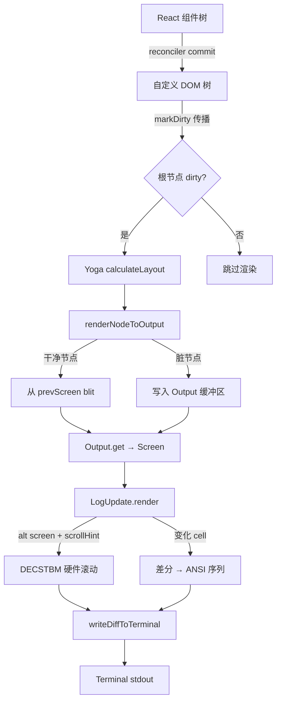

# 第五章：使用 Ink 构建终端 UI

## 目录

1. [引言](#引言)
2. [Ink 的自定义渲染管线](#ink-的自定义渲染管线)
3. [DOM 模型](#dom-模型)
4. [布局引擎](#布局引擎)
5. [渲染管线](#渲染管线)
6. [事件系统](#事件系统)
7. [核心组件](#核心组件)
8. [REPL 屏幕](#repl-屏幕)
9. [消息渲染](#消息渲染)
10. [动手实践：用 Ink 构建终端 UI](#动手实践用-ink-构建终端-ui)
11. [关键要点与下一步](#关键要点与下一步)

---

## 引言

构建一个像 Claude Code 界面那样响应迅速、功能丰富的终端 UI 并非易事。基于 `readline` 或 `ncurses` 的传统方案随着复杂度增长很快变得难以维护。Claude Code 的解决方案是使用 **Ink** —— 一个允许用 React 构建终端界面的框架。

核心思路颇具说服力：React 的声明式组件模型、差分算法和状态管理已经在构建复杂 UI 方面经过了验证。为什么不把它们应用到终端上呢？Ink 并非更新浏览器 DOM，而是将自定义虚拟 DOM 协调结果转换为 ANSI 转义序列。

Claude Code 在 `ink` npm 包的基础上走得更远。团队做了大量定制，构建出一套生产级的终端渲染系统，具备以下特性：

- **双缓冲渲染**与 blit 优化
- 通过 DECSTBM（DEC 设置顶/底边距）实现的**硬件滚动**
- 样式、字符和超链接的**池化内存管理**
- 镜像浏览器捕获/冒泡语义的**两阶段事件分发**
- 高效渲染数千条消息的**虚拟消息列表**

本章从底层剖析自定义 Ink 渲染管线的每个细节。

---

## Ink 的自定义渲染管线

原版 Ink 库提供了坚实的基础：一个以自定义 DOM 为目标的 React reconciler，配合 Yoga 实现 flexbox 布局。Claude Code 的 fork 在几个关键领域做了显著改造。

### 与原版 Ink 的对比

| 特性 | 原版 Ink | Claude Code 的 Fork |
|---|---|---|
| 屏幕缓冲区 | 单一字符串输出 | 双缓冲 `Screen` 对象，含类型化 cell 数组 |
| 布局引擎 | 直接绑定 Yoga | `LayoutNode` 抽象接口（`src/ink/layout/node.ts`） |
| 内存管理 | 每帧分配 | `CharPool` / `StylePool` / `HyperlinkPool` 三级池化 |
| 渲染优化 | 每帧全量重绘 | 通过 `nodeCache` 实现 blit 优化（跳过干净节点） |
| 硬件滚动 | 不支持 | `log-update.ts:166-185` 中的 DECSTBM 滚动区域 |
| 事件系统 | 基础 stdin 解析 | 两阶段捕获/冒泡分发（`src/ink/events/dispatcher.ts`） |
| 鼠标支持 | 极少 | alt-screen 模式下完整的 SGR 鼠标追踪与 hit-test |
| 文本选择 | 不支持 | 完整的选择状态与剪贴板集成 |

### LayoutNode 抽象

相比直接耦合到 Yoga 的原生绑定，Claude Code 引入了 `LayoutNode` 接口（`src/ink/layout/node.ts:93-152`）。这个抽象层定义了渲染系统所需的全部布局操作——树的增删、计算值查询和样式设置——无需暴露 Yoga 的实现细节。

```typescript
// src/ink/layout/node.ts:93
export type LayoutNode = {
  insertChild(child: LayoutNode, index: number): void
  removeChild(child: LayoutNode): void
  calculateLayout(width?: number, height?: number): void
  setMeasureFunc(fn: LayoutMeasureFunc): void
  getComputedLeft(): number
  getComputedTop(): number
  getComputedWidth(): number
  getComputedHeight(): number
  // ... 样式设置方法
}
```

`src/ink/layout/engine.ts:4` 中的工厂函数 `createLayoutNode()` 返回具体的 Yoga 实现。如果想替换布局引擎，只需修改这一个文件。

### 三级池化系统

逐帧分配内存对于需要以 60fps 产出输出的渲染系统来说是性能杀手。Claude Code 使用三个对象池：

- **`StylePool`**：内嵌 ANSI 样式码。每种颜色、粗体、斜体等的唯一组合只存储一次，以数字 ID 引用。每个 `Cell` 上的 `styleId` 只是一个整数。
- **`CharPool`**：缓存经过 tokenize 和字素簇分割的字符。计算 `stringWidth` 和拆分字素簇是昂贵操作——`output.ts` 中的 `charCache` 意味着未变化的文本行不会被重复处理。
- **`HyperlinkPool`**：内嵌 OSC 8 超链接 URL。每 5 分钟重置一次（分代重置），防止无限增长。

这些池在 Ink 实例的 `frontFrame` 和 `backFrame` 之间共享（`src/ink/ink.tsx:193-195`）。

### Blit 优化

最具影响力的渲染优化是 **blit**（像素块传输）。当某个 DOM 节点的内容未发生变化时，渲染器可以直接将其之前渲染的像素从 `prevScreen`（前帧）复制到 `backScreen`（后帧），跳过该子树的昂贵重渲染。

`nodeCache`（`src/ink/node-cache.ts`）为每个渲染过的元素存储一个 `CachedNode`，包含其边界矩形和对上一帧 screen 的引用。如果 `node.dirty === false` 且布局未发生移动，`renderNodeToOutput` 就 blit 缓存的像素并提前返回——复杂度从 O(总像素数) 降至 O(变化像素数)。

---

## DOM 模型

自定义 DOM 位于 `src/ink/dom.ts`。它定义了一个与浏览器 DOM 并行的结构，专为终端渲染而设计。

### 节点类型

定义了七种元素类型（`src/ink/dom.ts:18-27`）：

```typescript
export type ElementNames =
  | 'ink-root'         // 文档根节点——持有 focusManager
  | 'ink-box'          // 布局容器（类似 <div>）
  | 'ink-text'         // 带 Yoga measure 函数的文本叶节点
  | 'ink-virtual-text' // 无独立 Yoga 节点的文本
  | 'ink-link'         // OSC 8 超链接（无 Yoga 节点）
  | 'ink-progress'     // 进度指示（无 Yoga 节点）
  | 'ink-raw-ansi'     // 已知尺寸的预渲染 ANSI
```

文本节点（`#text`）不持有 Yoga 节点——只有 `ink-text` 和 `ink-raw-ansi` 参与布局测量。

### DOMElement 结构

`DOMElement` 是核心节点类型（`src/ink/dom.ts:31-91`）：

```typescript
export type DOMElement = {
  nodeName: ElementNames
  attributes: Record<string, DOMNodeAttribute>
  childNodes: DOMNode[]
  yogaNode?: LayoutNode      // 布局句柄
  dirty: boolean             // 需要重渲染？
  isHidden?: boolean         // Reconciler 隐藏/显示
  _eventHandlers?: Record<string, unknown>  // 与 attributes 分离，避免触发 dirty 标记

  // 滚动状态
  scrollTop?: number
  pendingScrollDelta?: number
  scrollClampMin?: number
  scrollClampMax?: number
  stickyScroll?: boolean
  scrollAnchor?: { el: DOMElement; offset: number }

  focusManager?: FocusManager  // 仅 ink-root 持有
  // ...
} & InkNode
```

`_eventHandlers` 字段与 `attributes` 分开存储——这是一个有意为之的设计决策（`src/ink/dom.ts:49-51`）。事件处理函数的引用在每次 React 渲染时都会创建新对象。如果存储在 `attributes` 中，`setAttribute` 会在每次渲染时调用 `markDirty`，彻底破坏 blit 优化。Reconciler 将它们存储在 `_eventHandlers` 中，变化不会触发 dirty 标记。

### 脏标记传播

任何 DOM 变更发生时——文本修改、属性更新、样式变化——`markDirty` 都会向上传播到根节点（`src/ink/dom.ts:393-413`）：

```typescript
export const markDirty = (node?: DOMNode): void => {
  let current: DOMNode | undefined = node
  let markedYoga = false

  while (current) {
    if (current.nodeName !== '#text') {
      (current as DOMElement).dirty = true
      // 在叶节点上标记 yoga dirty 以触发重新测量
      if (!markedYoga && (current.nodeName === 'ink-text' || 
          current.nodeName === 'ink-raw-ansi') && current.yogaNode) {
        current.yogaNode.markDirty()
        markedYoga = true
      }
    }
    current = current.parentNode
  }
}
```

这种向上传播意味着渲染器只需检查 `rootNode.dirty` 就能知道是否有任何变更。在稳态 spinner 滴答时，只有 spinner 文本节点是 dirty 的——树的其余部分都被 blit 不变地复制。

### scheduleRenderFrom

对于绕过 React 的命令式 DOM 变更（如来自滚动事件的 `scrollTop` 修改），`scheduleRenderFrom` 向上遍历到根节点并调用 `onRender`——节流的渲染调度器——无需经过 React reconciler（`src/ink/dom.ts:419-423`）。

---

## 布局引擎

### Yoga 集成

Claude Code 使用 Facebook 的 Yoga 布局引擎——与 React Native 相同的 flexbox 实现。Yoga 在给定 flex 容器约束的条件下计算盒子尺寸和位置，实现了 CSS flexbox 的相当大一个子集。

集成点是 `src/ink/layout/engine.ts:4` 中 `createLayoutNode()` 返回的 `LayoutNode`。每个 `DOMElement`（除 `ink-virtual-text`、`ink-link` 和 `ink-progress` 外）在创建时都会获得自己的 Yoga 节点（`src/ink/dom.ts:111-122`）：

```typescript
export const createNode = (nodeName: ElementNames): DOMElement => {
  const needsYogaNode =
    nodeName !== 'ink-virtual-text' &&
    nodeName !== 'ink-link' &&
    nodeName !== 'ink-progress'
  const node: DOMElement = {
    // ...
    yogaNode: needsYogaNode ? createLayoutNode() : undefined,
    dirty: false,
  }

  if (nodeName === 'ink-text') {
    node.yogaNode?.setMeasureFunc(measureTextNode.bind(null, node))
  } else if (nodeName === 'ink-raw-ansi') {
    node.yogaNode?.setMeasureFunc(measureRawAnsiNode.bind(null, node))
  }
  return node
}
```

### 文本测量

文本节点需要特殊处理，因为 Yoga 不知道终端 cell 中文本有多宽。`measureTextNode` 函数（`src/ink/dom.ts:332-374`）被注册为 `ink-text` 节点的 Yoga measure 回调：

1. `squashTextNodes` 从所有子 `#text` 节点收集文本内容
2. `expandTabs` 将制表符转换为空格（最坏情况为 8 个空格）
3. `measureText` 调用 `stringWidth` 获取终端 cell 宽度
4. 如果文本宽于容器，`wrapText` 按配置的 `textWrap` 策略进行换行

来自 Yoga 的 `widthMode` 参数告诉 measure 函数如何解释 `width` 约束——`Undefined` 表示 Yoga 在询问固有尺寸，`Exactly` 或 `AtMost` 表示有实际约束需要遵守。

### calculateLayout 流程

布局在 `src/ink/ink.tsx:246-249` 中计算，由 reconciler 的 `commitMount` 阶段触发：

```typescript
this.rootNode.yogaNode.setWidth(this.terminalColumns)
this.rootNode.yogaNode.calculateLayout(this.terminalColumns)
```

这一次调用在一趟中完成整棵树的布局计算。调用结束后，每个 `yogaNode` 都有有效的 `getComputedTop()`、`getComputedLeft()`、`getComputedWidth()` 和 `getComputedHeight()` 值。

---

## 渲染管线

从 React 组件树到终端输出，完整的渲染管线是一个多阶段流程：



### 第一阶段：Reconciler Commit

React reconciler（`src/ink/reconciler.ts`）实现了 React 管理自定义 DOM 所需的 host config 接口。关键方法包括：
- `createInstance` — 通过 `dom.createNode()` 分配 `DOMElement`
- `appendChild` / `removeChild` — 调用 `dom.appendChildNode()` / `dom.removeChildNode()`
- `commitUpdate` — 对变更的 props 调用 `dom.setAttribute()` 和 `dom.setStyle()`
- `resetAfterCommit` — 每次 commit 后调用 `scheduleRender` 将渲染加入队列

### 第二阶段：Renderer

`src/ink/renderer.ts` 中的 `createRenderer` 返回一个捕获根 `DOMElement` 和 `StylePool` 的闭包。每次渲染调用时（`src/ink/renderer.ts:38-177`）：

1. 验证 Yoga 尺寸（防止在创建数组前出现 NaN）
2. 复用或创建 `Output` 实例
3. 重置滚动和布局移动状态
4. 用 `prevScreen` 调用 `renderNodeToOutput`（如果被污染则传 `undefined`）
5. 调用 `output.get()` 将缓冲区刷新到 `Screen`
6. 返回包含 screen、viewport 信息和光标位置的 `Frame`

### 第三阶段：renderNodeToOutput

`render-node-to-output.ts` 是核心 DFS 树遍历。对每个节点：

1. 检查 `nodeCache`——如果节点干净且布局未发生移动，从 `prevScreen` blit 后返回
2. 否则从 Yoga 计算节点矩形（`getComputedTop`、`getComputedLeft` 等）
3. 对于 `ink-box`：应用裁剪区域后递归子节点
4. 对于 `ink-text`：调用 `squashTextNodesToSegments`，应用文本样式，调用 `output.write()`
5. 对于 `ink-raw-ansi`：直接用预渲染的 ANSI 字符串调用 `output.write()`
6. 对于滚动盒子：应用 `scrollTop` 偏移并裁剪可见视口
7. 将结果存入 `nodeCache`，清除 `node.dirty`

### 第四阶段：Output 缓冲区

`Output`（`src/ink/output.ts`）收集操作——`write`、`blit`、`clip`、`unclip`、`clear`、`shift`——并在 `get()` 时将它们应用到 `Screen`。`Output` 中的 `charCache` 是关键优化：每行唯一文本只被 tokenize 和字素簇分割一次，之后跨帧复用。

### 第五阶段：LogUpdate 差分

`src/ink/log-update.ts` 中的 `LogUpdate.render` 将新 `Screen` 与上一帧进行比较：

- 如果 viewport 尺寸变化，输出全量重置
- 如果有 `scrollHint`（仅 alt-screen）且 DECSTBM 安全，先输出硬件滚动命令，再只差分变化的行（`src/ink/log-update.ts:166-185`）
- 遍历新 screen 的每个 cell；当与上一帧不同时，输出光标移动 + 样式变化 + 字符输出

### 第六阶段：writeDiffToTerminal

`Diff`（stdout 字符串、光标显示/隐藏、回车等操作的数组）被序列化后以一次 `writeSync` 调用写入 `process.stdout`。当终端支持 DEC 2026 时，BSU/ESU（开始同步更新/结束同步更新）括号使清除和绘制序列成为原子操作，防止可见的撕裂。

---

## 事件系统

### 两阶段分发

事件系统（`src/ink/events/dispatcher.ts`）镜像了浏览器的 W3C 事件模型，包含捕获和冒泡阶段。

`collectListeners` 从目标到根节点遍历树，构建一个扁平的监听器数组（`src/ink/events/dispatcher.ts:46-78`）：
- 捕获处理器被**前置**（根节点优先）
- 冒泡处理器被**追加**（目标优先）

结果为：`[根-捕获, ..., 父-捕获, 目标-捕获, 目标-冒泡, 父-冒泡, ..., 根-冒泡]`

`processDispatchQueue` 遍历此数组，调用每个处理器并在调用间检查 `stopImmediatePropagation()` 和 `stopPropagation()`（`src/ink/events/dispatcher.ts:87-114`）。

### 事件优先级

事件映射到 React 调度优先级（`src/ink/events/dispatcher.ts:122-138`）：

```typescript
function getEventPriority(eventType: string): number {
  switch (eventType) {
    case 'keydown': case 'click': case 'focus':
      return DiscreteEventPriority   // 同步，立即刷新
    case 'resize': case 'scroll': case 'mousemove':
      return ContinuousEventPriority  // 批量处理
    default:
      return DefaultEventPriority
  }
}
```

`dispatchDiscrete` 将分发包装在 React 的 `discreteUpdates` 中，确保键盘和点击事件触发同步状态更新——用户立即看到反馈。

### 鼠标 Hit-Test

alt-screen 模式下的鼠标事件通过 `src/ink/hit-test.ts` 中的 `dispatchClick` 和 `dispatchHover` 处理。这些函数遍历 DOM 树，使用 Yoga 计算出的位置找到鼠标光标所在的 `DOMElement`。Hit-test 使用与渲染屏幕相同的坐标系——每个字符 cell 是一个单位。

### DOM 节点上的事件处理器

来自 React props 的事件处理器由 reconciler 存储在 `node._eventHandlers` 中（而非 `node.attributes`）。`src/ink/events/event-handlers.ts` 中的 `HANDLER_FOR_EVENT` 映射将事件类型字符串转换为 prop 名称——例如 `keydown` → `{ bubble: 'onKeyDown', capture: 'onKeyDownCapture' }`。

---

## 核心组件

### Box

`Box`（`src/ink/components/Box.tsx`）是基本布局容器——类比浏览器中的 `<div style="display: flex">`。它映射到 `ink-box` DOM 节点，支持所有 Yoga flexbox 属性作为 React props。

超出标准布局之外的额外 props（`src/ink/components/Box.tsx:11-46`）：
- `tabIndex` / `autoFocus` — 参与 Tab/Shift+Tab 焦点循环
- `onClick` — 在 alt-screen 模式下点击左键触发，会冒泡
- `onKeyDown` / `onKeyDownCapture` — 支持捕获的键盘事件
- `onMouseEnter` / `onMouseLeave` — 不冒泡的悬停事件（mode-1003）

Box 使用 React Compiler 的记忆化（顶部的 `_c(42)`），在 props 未变化时避免不必要的重渲染。

### Text

`Text`（`src/ink/components/Text.tsx`）将样式化文本内容渲染到 `ink-text` 节点。样式 props 包括 `color`、`backgroundColor`、`bold`、`italic`、`underline`、`strikethrough`、`inverse` 和 `wrap`。

`bold` 和 `dim` props 互斥——通过 TypeScript 判别联合类型强制约束（`src/ink/components/Text.tsx:49-58`）：

```typescript
type WeightProps = { bold?: never; dim?: never }
  | { bold: boolean; dim?: never }
  | { dim: boolean; bold?: never }
```

文本换行模式（`src/ink/components/Text.tsx:60-100`）：`wrap`、`wrap-trim`、`end`、`middle`、`start`、`truncate`——每种都有预计算的记忆化样式对象，避免内存分配。

### ScrollBox

`ScrollBox`（`src/ink/components/ScrollBox.tsx`）是最复杂的组件。它以 `overflow: scroll` 包装 `Box`，并通过 `ref`（`ScrollBoxHandle`）暴露命令式 API（`src/ink/components/ScrollBox.tsx:10-62`）：

```typescript
export type ScrollBoxHandle = {
  scrollTo: (y: number) => void
  scrollBy: (dy: number) => void
  scrollToElement: (el: DOMElement, offset?: number) => void  // 延迟到绘制时执行
  scrollToBottom: () => void
  getScrollTop: () => number
  getScrollHeight: () => number
  getViewportHeight: () => number
  isSticky: () => boolean
  setClampBounds: (min: number | undefined, max: number | undefined) => void
}
```

`scrollToElement` 方法尤其巧妙——它不在调用时读取 `yogaNode.getComputedTop()`（可能已过时），而是将 `{ el, offset }` 引用存储在 DOM 节点的 `scrollAnchor` 字段上。`renderNodeToOutput` 在绘制时读取这个引用，与计算 `scrollHeight` 在同一次 Yoga 遍历中，确保位置始终是最新的。

`stickyScroll` 模式在内容增长时自动固定到底部。渲染器检测到 `scrollTop === maxScroll` 且有新内容添加时，在绘制阶段更新 `scrollTop`。

### AlternateScreen

`AlternateScreen`（`src/ink/components/AlternateScreen.tsx`）在挂载时进入终端的备用屏幕缓冲区（DEC 1049），在卸载时退出。它使用 `useInsertionEffect`（而非 `useLayoutEffect`）——有一个微妙的时序要求（`src/ink/components/AlternateScreen.tsx:33-79`）。Reconciler 在变更和布局阶段之间调用 `resetAfterCommit`（触发 `onRender`）。如果用 `useLayoutEffect`，第一次渲染会在备用屏幕进入序列之前触发，向主屏幕写入一帧，在退出时变成"保留内容"。`useInsertionEffect` 在变更阶段触发，在 `resetAfterCommit` 之前，确保备用屏幕在第一帧到来之前已经进入。

### RawAnsi

`RawAnsi`（`src/ink/components/RawAnsi.tsx`）渲染已知尺寸的预构建 ANSI 字符串。与 `ink-text` 不同，无需重新 tokenize、无需 `stringWidth`、无需换行——生产者（如语法高亮器）已知确切尺寸且已按目标宽度换行。`rawWidth` 和 `rawHeight` 属性被 `measureRawAnsiNode` 直接使用（`src/ink/dom.ts:379-387`）。

---

## REPL 屏幕

`src/screens/REPL.tsx` 是 Claude Code 交互会话的顶层屏幕组件。这是一个大型组件（约 2000 行），协调一切工作。

### 组件结构

```
REPL
└── AlternateScreen（进入备用缓冲区，启用鼠标追踪）
    └── FullscreenLayout（height=terminalRows 的 Box，flexDirection=column）
        ├── VirtualMessageList（ScrollBox + 虚拟化）
        │   └── Message[]（渲染的消息）
        ├── StatusBar（spinner、token 计数、费用）
        └── PromptInput（文本输入区域）
```

### FullscreenLayout

最外层的 `Box` 被约束为恰好 `terminalRows` 高度。这是使 alt-screen 渲染可预测的不变量——内容精确填满屏幕，无滚动回溯，无溢出。

### VirtualMessageList

长会话的消息数量可能达到数千条。每帧渲染所有消息会让人望而却步。虚拟消息列表（`src/components/VirtualMessageList.tsx`）只挂载 Yoga 计算位置与可见视口（加上上下缓冲区以实现平滑滚动）相交的 `Message` 组件。

`useVirtualScroll` 追踪滚动位置，计算哪些消息索引在视图内，并在 `ScrollBoxHandle` 上调用 `setClampBounds` 将滚动范围约束到已挂载的内容。

### PromptInput

`PromptInput`（`src/components/PromptInput/PromptInput.tsx`）是屏幕底部的文本输入区域。它使用 `useDeclaredCursor` 向 Ink 实例报告插入符位置，实现正确的 CJK 输入法显示和屏幕阅读器追踪。

---

## 消息渲染

`src/components/Message.tsx` 是所有消息类型的分发器。它接收 `NormalizedUserMessage | AssistantMessage | ...`，根据消息类型选择适当的渲染组件。

### 消息类型分发

`MessageImpl` 函数（React 编译输出）根据消息类型和内容块类型切换到不同的渲染器（`src/components/Message.tsx:58-`）：

| 消息内容 | 组件 |
|---|---|
| 用户文本 | `UserTextMessage` |
| 助手文本 | `AssistantTextMessage` |
| 助手思考 | `AssistantThinkingMessage` |
| 工具使用 | `AssistantToolUseMessage` |
| 工具结果 | `UserToolResultMessage` |
| 系统文本 | `SystemTextMessage` |
| 附件 | `AttachmentMessage` |
| 顾问消息 | `AdvisorMessage` |
| 分组工具使用 | `GroupedToolUseContent` |

### OffscreenFreeze

静态消息（已完成，非进行中）被包裹在 `OffscreenFreeze` 中。这个组件使用深比较的 `React.memo` 防止消息数据未变化时的重渲染。与渲染器中的 blit 优化结合，静态消息的帧渲染成本几乎为零。

### 宽度处理

`Message` 上的 `containerWidth` prop 允许调用者传入绝对列宽，省去虚拟列表中的一层包装 `Box`。包含代码块或差分的消息需要知道终端宽度以预先为 `RawAnsi` 渲染换行内容——这个宽度通过 `useTerminalSize` 流经组件树。

---

## Ink Hooks

Claude Code 的 Ink fork 提供了一套 hooks，将 React 组件模型与命令式终端操作桥接起来。这些 hooks 是需要键盘输入、光标定位或终端元数据的组件的主要接口。

### useInput

`useInput`（`src/ink/hooks/use-input.ts`）是主要的键盘事件 hook。它注册一个回调，对每次按键事件接收 `(input: string, key: Key)` 参数。

```typescript
// src/ink/hooks/use-input.ts:42
const useInput = (inputHandler: Handler, options: Options = {}) => {
  const { setRawMode, internal_exitOnCtrlC, internal_eventEmitter } = useStdin()

  // 使用 useLayoutEffect 而非 useEffect，以便在 React 的 commit 阶段
  // 同步启用 raw 模式。useEffect 会延迟到下一个事件循环，
  // 让终端在挂载时短暂保持 cooked 模式（回显按键）。
  useLayoutEffect(() => {
    if (options.isActive === false) return
    setRawMode(true)
    return () => setRawMode(false)
  }, [options.isActive, setRawMode])
  // ...
}
```

`isActive` 选项用于控制多个 `useInput` 实例——只有激活的 hooks 才处理按键。这让 Claude Code 可以选择性地为有焦点的对话框激活键盘处理器，同时不卸载后台处理器。

监听器在挂载时通过 `useEventCallback` 注册一次，保持其在 `EventEmitter` 监听器数组中的位置稳定。如果 `isActive` 是导致重新注册的依赖项，监听器会移到队列末尾，破坏 `stopImmediatePropagation()` 的顺序。

### useDeclaredCursor

`useDeclaredCursor`（`src/ink/hooks/use-declared-cursor.ts`）让组件声明每帧渲染后终端光标应该停留在哪里。这对以下场景至关重要：
- **CJK 输入法**：终端模拟器在物理光标位置渲染预编辑文本
- **屏幕阅读器**：辅助技术追踪原生光标

```typescript
// src/ink/hooks/use-declared-cursor.ts:25
export function useDeclaredCursor({ line, column, active }): (element: DOMElement | null) => void {
  const setCursorDeclaration = useContext(CursorDeclarationContext)
  // ...
  useLayoutEffect(() => {
    const node = nodeRef.current
    if (active && node) {
      setCursorDeclaration({ relativeX: column, relativeY: line, node })
    } else {
      setCursorDeclaration(null, node)
    }
  })
}
```

位置是相对于包含 `Box` 的渲染矩形的，`renderNodeToOutput` 将其存储在 `nodeCache` 中。Ink 实例在帧末读取这个声明并输出光标定位序列。时序方面——`useLayoutEffect` 在 `resetAfterCommit` 通过 `queueMicrotask` 调用 `scheduleRender` 之后触发——意味着第一帧就能采用该声明，没有一个按键的延迟。

`setCursorDeclaration` 中的节点身份检查处理了一个微妙的竞争条件：当焦点在兄弟节点间移动时，刚变为非活跃的兄弟节点的清理 effect 可能在刚变为活跃节点的声明之后运行，可能覆盖后者。节点引用防止了这种情况。

### useStdin

`useStdin`（`src/ink/hooks/use-stdin.ts`）暴露 stdin 流和 raw 模式控制。组件用它获取输入事件的 `EventEmitter`、`setRawMode` 和 `internal_exitOnCtrlC`。大多数组件直接使用 `useInput` 而非消费 `useStdin`。

### useTerminalViewport

`useTerminalViewport`（`src/ink/hooks/use-terminal-viewport.ts`）订阅终端 resize 事件，返回当前的 `{ columns, rows }`。整个 UI 都使用它基于可用终端空间做出布局决策。`TerminalSizeContext`（由 `App` 组件提供）将这个值广播给所有后代组件。

### useAnimationFrame

`useAnimationFrame`（`src/ink/hooks/use-animation-frame.ts`）为终端动画提供类似 `requestAnimationFrame` 的原语。Spinner 和进度组件使用它以 `FRAME_INTERVAL_MS`（约 16ms）的频率滴答，无需直接耦合到 `setInterval`。

### useSearchHighlight

`useSearchHighlight`（`src/ink/hooks/use-search-highlight.ts`）将当前搜索查询传递给 Ink 实例的 `applySearchHighlight` 叠加层。当搜索查询激活时，渲染器在渲染的 `Screen` 中反转所有匹配 cell 的颜色——这是一个后渲染遍历，无需 React 重渲染。

---

## Screen 和 Pool 架构

### Screen 缓冲区

`src/ink/screen.ts` 中的 `Screen` 类型是核心数据结构：一个固定大小的 `Cell` 网格。每个 `Cell` 存储：
- `char`：Unicode 字素簇
- `styleId`：`StylePool` 中的索引（整数，不是 ANSI 字符串）
- `hyperlink`：可选的 OSC 8 URL（由 `HyperlinkPool` 内嵌）
- `width`：`Normal`、`Wide`、`SpacerHead` 或 `SpacerTail`（用于 CJK 宽字符）

Screen 由类型化数组（typed arrays）支撑，缓存效率高。`setCellAt` 和 `cellAt` 是底层读写操作。`noSelect` 位图标记应排除在文本选择之外的区域（行号、填充等）。

双缓冲在 `src/ink/ink.tsx` 的 `Frame` 层面实现。Ink 实例维护 `frontFrame` 和 `backFrame`：
- `frontFrame`：终端当前显示的内容
- `backFrame`：本帧正在渲染的内容

`LogUpdate.render` 产生差分序列后，`frontFrame` 和 `backFrame` 互换。旧的 `frontFrame` 成为下一次渲染的 `backFrame`，复用其内存。

### Pool 分代重置

`StylePool` 和 `HyperlinkPool` 需要不同的重置策略：
- `StylePool` 是**会话级别存活**的——样式在整个会话中累积，因为 `charCache` 中缓存的 `ClusteredChar` 的 `styleId` 值必须保持有效。`StylePool` 重置会使所有缓存字符失效。
- `HyperlinkPool` 每 5 分钟**分代重置**一次。URL 在下次绘制时重新内嵌，代价很低——`Map.get` 远比为未变化 cell 的 OSC 8 URL 字符串分配内存便宜。

### CharCache 与行缓存

`Output.charCache`（`Map<string, ClusteredChar[]>`）缓存对一行文本进行 tokenize 和字素簇分割的结果。键是原始 ANSI 字符串；值是 `ClusteredChar` 数组——每个包含预计算的 `value`、`width`、`styleId` 和 `hyperlink`。

当 `renderNodeToOutput` 调用 `output.write(text, x, y)` 时，如果 `charCache` 命中，内层循环变成纯属性读取 + `setCellAt` 调用。没有 `stringWidth`，没有 `ansi-tokenize`，没有每字符的 `HyperlinkPool.intern`。这是稳态文本流式传输快速的主要原因。

### prevScreen 污染

`src/ink/renderer.ts:23-26` 中的 `prevFrameContaminated` 追踪上一帧的 screen 缓冲区是否可用于 blit。以下情况会将其设为 `true`：
1. 选择叠加层变更返回的 screen cell（反转它们）
2. `resetFramesForAltScreen()` 在 resize 时用空白替换缓冲区
3. `forceRedraw()` 将其重置为 0×0

当被污染时，渲染器向 `renderNodeToOutput` 传递 `undefined` 作为 `prevScreen`，禁用该帧的 blit，强制全量重绘。标志随后被清除，O(变化 cell) 的快速路径恢复。

---

## 滚动架构深度解析

### pendingScrollDelta

滚动事件（鼠标滚轮、触控板）作为原始像素差量从终端到达。Claude Code 将这些差量累积在 `node.pendingScrollDelta` 中，而不是立即更新 `scrollTop`。渲染器每帧以受控速率消耗这个累积量：

- **xterm.js**（VS Code 终端）：自适应消耗——慢速点击立即跳转（`abs <= 5` 全部消耗），更快的滑动使用小的固定步长实现平滑动画（`src/ink/render-node-to-output.ts:117-156`）
- **原生终端**（iTerm2、Ghostty）：比例消耗——每帧消耗剩余差量的 3/4，上限为 `innerHeight - 1`

方向反转用这个累积量方案是"免费"的——部分向上滚动后再向下滚动只是减少正累积值。无需追踪动画目标，无需取消操作。

### scrollAnchor 与 scrollTo 的对比

`scrollAnchor` 机制（见 ScrollBox 章节）解决了一个根本性的竞争条件：当命令式调用 `scrollTo(N)` 时，`N` 值是从 Yoga 数据计算的，但在节流渲染器 16ms 后触发时，这个数据可能已经过时了。如果期间有内容添加，存储的 `N` 就不再指向正确位置。

`scrollAnchor: { el, offset }` 将位置读取延迟到绘制时——渲染器在**与计算 `scrollHeight` 相同的 Yoga 遍历中**读取 `el.yogaNode.getComputedTop()`。这个值始终与正在绘制的布局一致。

### DECSTBM 滚动优化

当只有 `scrollTop` 变化而其他内容未移动时，`render-node-to-output.ts` 记录一个 `ScrollHint`（`src/ink/render-node-to-output.ts:49-65`）：

```typescript
export type ScrollHint = { top: number; bottom: number; delta: number }
```

`LogUpdate.render` 读取这个提示，如果 DECSTBM 安全（终端支持 DEC 2026 原子更新），则输出：
1. `CSI top;bottom r` — 设置滚动区域
2. `CSI n S`（向上滚动）或 `CSI n T`（向下滚动）
3. `CSI r` — 重置滚动区域
4. `CSI H` — 光标归位

然后差分循环只找到**滚动进入**的行（在顶部或底部新显示的内容）。中间的行由硬件位移——无需为它们发送任何字节。在有 80 行聊天内容的终端上，这将每次滚动的差分从约 80 行更新减少到通常 1-3 行。

`LogUpdate.render` 中的 `shiftRows(prev.screen, ...)`（`src/ink/log-update.ts:174`）对上一帧 screen 缓冲区应用等效位移，使后续差分循环能相对于硬件位移后的状态正确计算。

---

## 动手实践：用 Ink 构建终端 UI

理解渲染管线最好的方法是亲手构建。本章的示例展示了核心模式。

### 环境搭建

```bash
mkdir my-ink-app && cd my-ink-app
npm init -y
npm install ink react
npm install --save-dev @types/react typescript tsx
```

创建 `tsconfig.json`：

```json
{
  "compilerOptions": {
    "target": "ES2022",
    "module": "ESNext",
    "moduleResolution": "bundler",
    "jsx": "react",
    "strict": true
  }
}
```

运行示例：

```bash
npx tsx examples/05-ink-rendering/hello-ink.tsx
npx tsx examples/05-ink-rendering/interactive-ui.tsx
```

### 示例一：hello-ink.tsx

这个示例展示基础 Ink 渲染：用 `Box` 进行布局，用 `Text` 显示样式化内容，以及类似 Claude Code 使用的消息列表模式。见 `examples/05-ink-rendering/hello-ink.tsx`。

展示的关键概念：
- 用 `Box` 和 `flexDirection` 实现 flexbox 布局
- 用 `color`、`bold`、`dimColor` 设置文本样式
- 用 `borderStyle` 渲染边框
- 通过 React 状态实现动态更新

### 示例二：interactive-ui.tsx

这个示例构建简化版 REPL 界面：可滚动的消息列表、文本输入区域和键盘事件处理。见 `examples/05-ink-rendering/interactive-ui.tsx`。

展示的关键概念：
- 用 `useInput` 处理键盘事件
- 状态驱动的消息列表渲染
- 固定底部输入区域的 Box 布局
- 用 `flexGrow` 和 `flexShrink` 实现响应式布局

---

## 关键要点与下一步

### 关键要点

1. **React 用于终端是可行的**——声明式组件模型、状态管理和 reconciler 差分算法可以清晰地转换为终端输出。Ink 证明了这一论点。

2. **`dirty` 标志是性能杠杆**——`markDirty` 在每次变更时向树上传播；渲染器在做任何工作前先检查这个标志。干净的子树以 O(1) blit。这就是为什么稳态帧（spinner 滴答）几乎零成本。

3. **双缓冲实现安全差分**——`frontFrame`（终端当前显示的内容）和 `backFrame`（正在渲染的内容）每帧交换。对它们的差分产生最小 ANSI 序列，将终端带到新状态。

4. **事件处理器绕过 dirty 标记**——将它们存储在 `_eventHandlers` 而非 `attributes` 中是关键优化。没有这个设计，每次 React 渲染（哪怕是空操作）都会标记每个可交互节点为 dirty。

5. **DECSTBM 硬件滚动**——当只有 `scrollTop` 变化时，终端的硬件滚动比重写数百行便宜得多。`scrollHint` 机制将这个优化从 `renderNodeToOutput` 传递给 `LogUpdate`。

6. **抽象布局引擎**——`LayoutNode` 接口将渲染从 Yoga 解耦。如果有更快的布局引擎，只需修改 `src/ink/layout/engine.ts` 和 `src/ink/layout/yoga.ts`。

### 渲染性能概览

```
帧类型               | 成本模型
---------------------|----------------------------
静态内容滴答          | O(1) — 全部 blit 不变
Spinner 更新         | O(spinner cells) — 其余 blit
新消息流式传输        | O(新行) — 旧行 blit
完整 resize          | O(rows × cols) — 全量重置
滚动（DECSTBM）      | O(变化行) — 硬件位移
```

### 下一步

**第六章：服务层** 将研究 Claude Code 如何组织其业务逻辑——API 客户端、对话管理、工具执行和流式响应处理。在了解了 UI 如何渲染状态之后，我们将看到这些状态是如何产生和更新的。

---

## 动手构建：独立工具模块

> **本节是 demo 的又一次重要升级。** 我们将三个内联工具定义拆分为独立目录模块，使架构更贴近真实 Claude Code 的 40+ 工具组织方式。

### 12.1 项目结构更新

```
demo/
├── tools/
│   ├── BashTool/
│   │   └── index.ts       # ← 新增：增强版 Shell 执行
│   ├── FileReadTool/
│   │   └── index.ts       # ← 新增：增强版文件读取
│   └── GrepTool/
│       └── index.ts       # ← 新增：增强版代码搜索
├── tools.ts               # 更新：从独立模块导入
├── query.ts               # 第 4 章
├── main.ts
├── Tool.ts
├── context.ts
├── services/api/
├── utils/
│   └── messages.ts
└── types/
```

### 12.2 为什么要拆分为独立模块？

在前几章中，所有工具定义都内联在 `tools.ts` 里。这对入门来说足够了，但随着工具数量增长，问题逐渐暴露：

- **每个工具是自包含单元** —— 实现逻辑、描述文本、参数 Schema 全部收敛在一个目录下，职责清晰
- **真实 Claude Code 的组织方式** —— 40+ 工具全部采用独立目录（`src/tools/BashTool/`、`src/tools/FileReadTool/` 等），不是偶然选择
- **便于独立开发、测试、维护** —— 修改一个工具不会影响其他工具的代码
- **新增工具只需创建新目录 + 在 tools.ts 中注册** —— 遵循开闭原则

### 12.3 三个工具的增强点

| 工具 | 原始版（Ch2） | 增强版（Ch5） |
|------|-------------|-------------|
| BashTool | 基本 Shell 执行 | +超时控制 +输出截断 +环境变量传递 |
| FileReadTool | 全文读取 | +行号显示 +offset/limit 分段读取 +文件存在检测 |
| GrepTool | 基本文本搜索 | +文件类型过滤 +结果数量限制 |

每个增强都对应真实 Claude Code 中的实际能力。例如 FileReadTool 的 offset/limit 机制与真实 `Read` 工具完全一致——当文件过大时，模型可以分段读取而非一次加载全部内容。

### 12.4 自包含工具模式

新增工具只需 3 步：

```typescript
// 1. 创建 tools/MyTool/index.ts
// 2. 使用 buildTool() 定义工具
import { buildTool } from '../Tool.js'

export const myTool = buildTool({
  name: 'MyTool',
  description: '工具描述',
  schema: { /* Zod schema */ },
  isReadOnly: () => true,
  async execute(input) {
    // 实现逻辑
    return { output: '结果' }
  },
})

// 3. 在 tools.ts 中注册
import { myTool } from './tools/MyTool/index.js'
export const tools = [bashTool, fileReadTool, grepTool, myTool]
```

这个模式与真实 Claude Code 中 `src/tools/` 下每个工具的组织方式完全对应。

### 12.5 运行验证

```bash
cd demo && bun run main.ts
```

工具注册表输出应显示三个独立模块导入的工具，功能与之前相同，但代码组织更加清晰。

### 12.6 与真实 Claude Code 的对应关系

| Demo 文件 | 真实文件 | 简化了什么 |
|-----------|---------|-----------|
| `tools/BashTool/index.ts` | `src/tools/BashTool/` | 无沙箱、无权限检查、无 pty |
| `tools/FileReadTool/index.ts` | `src/tools/FileReadTool/` | 无图片/PDF 支持、无 token 估算 |
| `tools/GrepTool/index.ts` | `src/tools/GrepTool/` | 无 ripgrep 集成、无上下文行 |
| `tools.ts`（导入注册） | `src/tools.ts` | 无懒加载、无功能标志过滤 |

### 下一章预告

第 6 章将添加 FileWriteTool、FileEditTool、GlobTool，让 mini-claude 拥有完整的文件操作能力。

---

*本章中的源码引用指向 `anthhub-claude-code`（带注释的 fork）。行号引用 `src/` 中的编译输出。*
