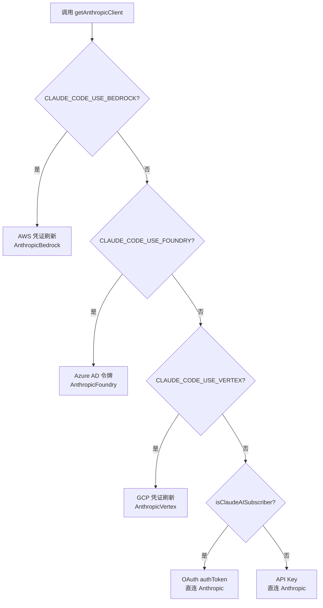
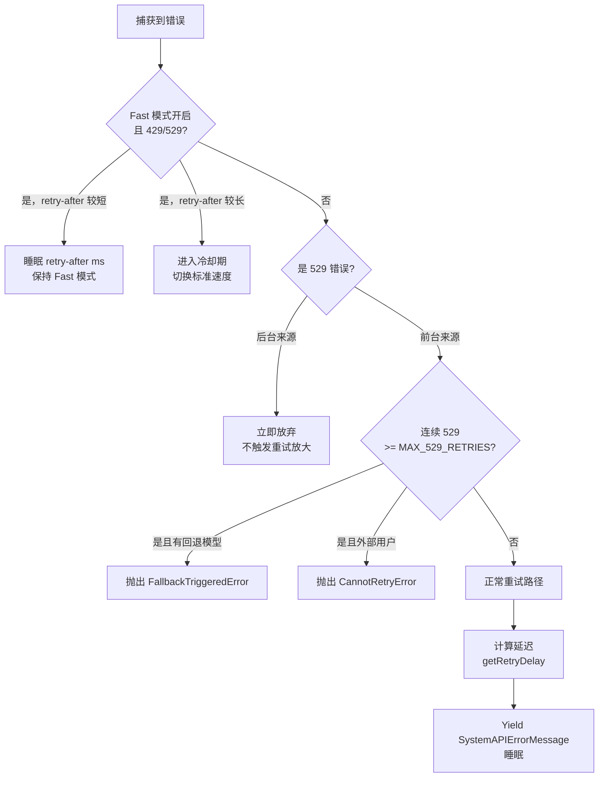
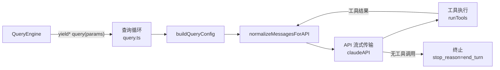
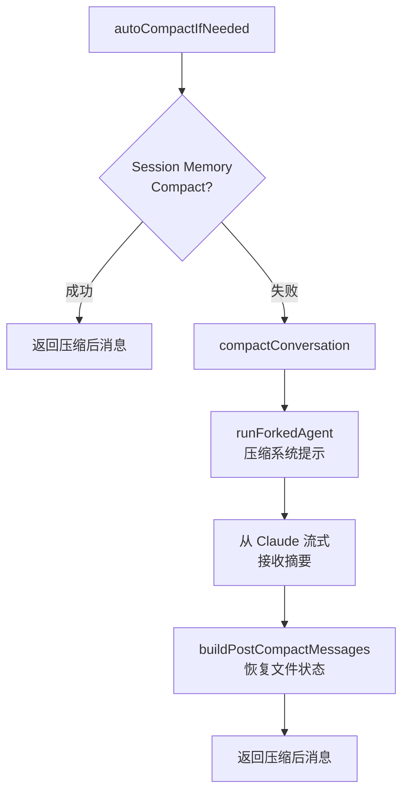

# 第六章：服务层与 API 通信

## 目录

1. [简介](#简介)
2. [多 Provider API 客户端](#多-provider-api-客户端)
3. [重试系统](#重试系统)
4. [QueryEngine 与查询循环](#queryengine-与查询循环)
5. [上下文压缩](#上下文压缩)
6. [Token 估算与成本追踪](#token-估算与成本追踪)
7. [分析服务](#分析服务)
8. [实战：流式 API 客户端](#实战流式-api-客户端)
9. [核心要点与后续内容](#核心要点与后续内容)

---

## 简介

服务层是 Claude Code 与外部世界通信的骨架。每一次模型生成响应、每一次工具结果被发送、每一次上下文窗口增长——所有这些都通过一组精心设计的服务流转。

与简单的 HTTP 客户端封装不同，Claude Code 的服务层处理真实世界的复杂性：多云 Provider（AWS Bedrock、Google Vertex、Azure Foundry）、带有可观察中间状态的指数退避重试、实时流式响应、会话增长时的上下文压缩，以及在类型层面保护用户隐私的分析管道。

本章深入剖析每一层。

```
┌─────────────────────────────────────────────────────────────────┐
│                           服务层                                │
│                                                                 │
│  ┌──────────────┐  ┌──────────────┐  ┌──────────────────────┐  │
│  │  API 客户端  │  │   重试系统   │  │     查询引擎          │  │
│  │  (client.ts) │  │(withRetry.ts)│  │ (QueryEngine.ts /    │  │
│  │              │  │              │  │     query.ts)         │  │
│  └──────┬───────┘  └──────┬───────┘  └──────────┬───────────┘  │
│         │                 │                      │              │
│  ┌──────▼───────────────────────────────────────▼───────────┐  │
│  │          上下文压缩 (compact.ts)                          │  │
│  └──────────────────────────────────────────────────────────┘  │
│                                                                 │
│  ┌────────────────────┐  ┌────────────────────────────────────┐ │
│  │    Token 估算      │  │  分析服务 (analytics/index.ts)     │ │
│  │(tokenEstimation.ts)│  │  + 成本追踪 (cost-tracker.ts)      │ │
│  └────────────────────┘  └────────────────────────────────────┘ │
└─────────────────────────────────────────────────────────────────┘
```

---

## 多 Provider API 客户端

### 工厂函数

所有 API 通信的入口点是 `src/services/api/client.ts` 中的 `getAnthropicClient()`。它是一个异步工厂函数，通过检查环境变量来决定创建哪种后端：

```
src/services/api/client.ts:88
export async function getAnthropicClient({
  apiKey, maxRetries, model, fetchOverride, source
}): Promise<Anthropic>
```

该函数即使对非 Anthropic Provider 也返回 `Anthropic` 类型的对象。注释中的"谎言"（`// we have always been lying about the return type`，第 188 行）是刻意为之：四种 SDK 共享相同的消息 API 接口，调用方永远不需要知道使用的是哪个 Provider。

### Provider 选择逻辑

Provider 选择完全由环境变量驱动：

```
client.ts:153-315

CLAUDE_CODE_USE_BEDROCK=true  → AnthropicBedrock (AWS)
CLAUDE_CODE_USE_FOUNDRY=true  → AnthropicFoundry (Azure)
CLAUDE_CODE_USE_VERTEX=true   → AnthropicVertex (GCP)
(均未设置)                     → Anthropic (直连 API)
```



### 共享 ARGS 配置

四个 Provider 分支共享同一个基础配置对象（`ARGS`，第 141 行）：

```typescript
// client.ts:141-152
const ARGS = {
  defaultHeaders,         // session ID、user-agent、容器 ID
  maxRetries,             // 由调用方传入
  timeout: parseInt(process.env.API_TIMEOUT_MS || String(600 * 1000), 10),
  dangerouslyAllowBrowser: true,
  fetchOptions: getProxyFetchOptions({ forAnthropicAPI: true }),
}
```

600 秒（10 分钟）的默认超时是刻意设计的——执行长时间 shell 命令的智能体任务可能合法地需要几分钟。

### 自定义请求头与请求 ID 注入

`buildFetch()` 函数（第 358 行）包装原生 `fetch`，为每个请求注入一个 UUID 到 `x-client-request-id` 请求头。这个请求头让 Anthropic API 团队能够将服务器日志与超时请求（从未收到服务器请求 ID）关联起来。

```typescript
// client.ts:374-376
if (injectClientRequestId && !headers.has(CLIENT_REQUEST_ID_HEADER)) {
  headers.set(CLIENT_REQUEST_ID_HEADER, randomUUID())
}
```

注意其中的条件判断：只有第一方 Anthropic API 调用才会带上这个请求头。Bedrock、Vertex 和 Foundry 不需要它，而未知请求头可能被严格的代理服务器拒绝。

### AWS Bedrock：小模型的 Region 覆盖

Bedrock 分支有一个细微的优化（第 157-160 行）：如果请求的模型是"小快速模型"（Haiku），它会检查 `ANTHROPIC_SMALL_FAST_MODEL_AWS_REGION`。这让运营人员可以将廉价模型放在不同的 Region——在企业部署中非常有用，主模型在合规敏感的 Region，而快速工具模型可以放在别处。

### Vertex：防止元数据服务器超时

Vertex 分支包含一段值得仔细阅读的注释（第 241-288 行）。`google-auth-library` 按以下顺序发现 GCP 项目 ID：

1. 环境变量（`GCLOUD_PROJECT`、`GOOGLE_CLOUD_PROJECT`）
2. 凭证文件（服务账号 JSON、ADC）
3. `gcloud` 配置
4. GCE 元数据服务器——在 GCP 环境外会导致 **12 秒超时**

代码在用户已配置其他发现方法时刻意避免设置 `projectId` 作为回退值，以防止干扰用户现有的 Auth 设置。

---

## 重试系统

`withRetry.ts` 可以说是服务层中最复杂的文件。它的 `withRetry()` 函数是一个 `AsyncGenerator`——这个设计选择有重要影响。

### AsyncGenerator 模式：可观察的中间状态

```typescript
// withRetry.ts:170-178
export async function* withRetry<T>(
  getClient: () => Promise<Anthropic>,
  operation: (client: Anthropic, attempt: number, context: RetryContext) => Promise<T>,
  options: RetryOptions,
): AsyncGenerator<SystemAPIErrorMessage, T>
```

返回类型是 `AsyncGenerator<SystemAPIErrorMessage, T>`。这意味着：
- 生成器在重试等待期间 **yield** `SystemAPIErrorMessage` 对象
- 成功时 **return** `T`
- 每个 yield 的消息通过 `QueryEngine` 以 `{type:'system', subtype:'api_retry'}` 事件形式出现在 stdout 上

这个设计很巧妙：UI 层可以展示实时的"8 秒后重试..."提示，而 `withRetry` 完全不需要了解 UI 的存在。信息通过生成器协议向上游流动。

### 重试决策树



### 529 "过载" 错误

HTTP 529 是 Anthropic 自定义的"服务器过载"状态码。代码中有一个有趣的注释（第 618-619 行）：

```typescript
// SDK 有时在流式传输时无法正确传递 529 状态码
(error.message?.includes('"type":"overloaded_error"') ?? false)
```

在流式传输期间，SDK 可能收到了 529 响应体但未能将 `error.status` 设置为 529。代码防御性地将错误消息文本作为回退检查。

### 前台 vs 后台 529 重试

`FOREGROUND_529_RETRY_SOURCES`（第 62-82 行）是用户正在等待结果的查询来源集合。这些来源在 529 时重试。其他所有来源（标题生成、建议、分类器）立即放弃：

```typescript
// withRetry.ts:56-61
// 前台查询来源（用户在等待结果）在 529 时重试。
// 其他来源（摘要、标题、建议、分类器）立即放弃：
// 在容量级联期间，每次重试会带来 3-10x 的网关放大，
// 而用户根本看不到这些失败。
const FOREGROUND_529_RETRY_SOURCES = new Set<QuerySource>([
  'repl_main_thread', 'sdk', 'agent:custom', 'agent:default', ...
])
```

原因是明确的：在容量级联期间，重试后台请求会将负载放大 3-10 倍，而这些失败用户根本看不到。

### Fast 模式重试策略

Fast 模式（通过提示缓存实现的快速响应）有自己的重试逻辑。当 429/529 到达时：

1. 如果 `retry-after` < 20 秒：等待后重试，**保持 Fast 模式激活**（保留提示缓存一致性）
2. 如果 `retry-after` >= 20 秒：进入"冷却期"至少 10 分钟，切换到标准速度

```typescript
// withRetry.ts:284-303
const retryAfterMs = getRetryAfterMs(error)
if (retryAfterMs !== null && retryAfterMs < SHORT_RETRY_THRESHOLD_MS) {
  // 短重试：等待后在 Fast 模式下重试
  await sleep(retryAfterMs, options.signal, { abortError })
  continue
}
// 长重试：进入冷却期（切换到标准速度模型）
const cooldownMs = Math.max(
  retryAfterMs ?? DEFAULT_FAST_MODE_FALLBACK_HOLD_MS,
  MIN_COOLDOWN_MS,
)
triggerFastModeCooldown(Date.now() + cooldownMs, cooldownReason)
```

"保留提示缓存"的顾虑是真实的：在 Fast 模式会话期间切换模型会使已缓存的前缀失效。

### 退避算法

`getRetryDelay()` 函数（第 530-548 行）实现了经典的带抖动指数退避：

```typescript
export function getRetryDelay(
  attempt: number,
  retryAfterHeader?: string | null,
  maxDelayMs = 32000,
): number {
  if (retryAfterHeader) {
    const seconds = parseInt(retryAfterHeader, 10)
    if (!isNaN(seconds)) return seconds * 1000
  }

  // BASE_DELAY_MS = 500ms
  const baseDelay = Math.min(BASE_DELAY_MS * Math.pow(2, attempt - 1), maxDelayMs)
  const jitter = Math.random() * 0.25 * baseDelay  // 最多 25% 抖动
  return baseDelay + jitter
}
```

使用 `BASE_DELAY_MS = 500` 时的延迟进展：
- 第 1 次：500ms + 抖动
- 第 2 次：1000ms + 抖动
- 第 3 次：2000ms + 抖动
- 第 4 次：4000ms + 抖动
- ...上限 32000ms（32 秒）

### 401 时的 OAuth Token 刷新

主重试循环对认证错误有特殊处理（第 239-251 行）。遇到 401"令牌过期"或 403"令牌已撤销"时，它会调用 `handleOAuth401Error()` 强制刷新令牌，然后用新凭证重新创建客户端。这就是 `client` 可为 null 的原因——它以 `null` 开始，懒惰地初始化。

### 持久重试模式（无人值守会话）

`CLAUDE_CODE_UNATTENDED_RETRY` 为 CI/无人值守会话启用一种特殊模式。在此模式下：
- 429/529 错误无限期重试
- 最大退避时间为 5 分钟（普通模式为 32 秒）
- 长时间等待被分块为 30 秒心跳（`HEARTBEAT_INTERVAL_MS = 30_000`）
- 每个分块都 yield 一个 `SystemAPIErrorMessage`，防止主机将会话标记为空闲

```typescript
// withRetry.ts:488-503
let remaining = delayMs
while (remaining > 0) {
  if (error instanceof APIError) {
    yield createSystemAPIErrorMessage(error, remaining, reportedAttempt, maxRetries)
  }
  const chunk = Math.min(remaining, HEARTBEAT_INTERVAL_MS)
  await sleep(chunk, options.signal, { abortError })
  remaining -= chunk
}
```

---

## QueryEngine 与查询循环

### 架构概述

`QueryEngine.ts` 是高级编排器。它封装了 `query.ts` 中的核心 `query()` 函数，添加了会话管理、内存加载、工具设置和消息后处理。

`query.ts` 包含内循环：构建 API 请求、流式接收响应、执行工具、持续循环直到满足终止条件的紧密循环。



### 查询循环状态

查询循环在迭代间维护可变状态（query.ts:204-217）：

```typescript
type State = {
  messages: Message[]
  toolUseContext: ToolUseContext
  autoCompactTracking: AutoCompactTrackingState | undefined
  maxOutputTokensRecoveryCount: number
  hasAttemptedReactiveCompact: boolean
  maxOutputTokensOverride: number | undefined
  pendingToolUseSummary: Promise<ToolUseSummaryMessage | null> | undefined
  stopHookActive: boolean | undefined
  turnCount: number
  transition: Continue | undefined
}
```

`transition` 字段记录了上一次迭代继续的原因（例如"tool_use"、"max_output_tokens_recovery"、"auto_compact"）。这让测试无需检查消息内容就能断言特定的恢复路径被触发了。

### QueryParams

```typescript
// query.ts:181-198
export type QueryParams = {
  messages: Message[]
  systemPrompt: SystemPrompt
  userContext: { [k: string]: string }
  systemContext: { [k: string]: string }
  canUseTool: CanUseToolFn
  toolUseContext: ToolUseContext
  fallbackModel?: string
  querySource: QuerySource       // "谁在问" 标签
  maxOutputTokensOverride?: number
  maxTurns?: number
  skipCacheWrite?: boolean
  taskBudget?: { total: number }
  deps?: QueryDeps
}
```

`querySource` 字段是"谁在问"的标签——它贯穿 `withRetry` 用于控制 529 重试行为、分析归因和 Fast 模式处理。

### 入口时的配置快照

```typescript
// query.ts:295
const config = buildQueryConfig()
```

`buildQueryConfig()` 在循环入口处一次性快照所有环境/statsig/会话状态。注释解释了为什么 `feature()` 门控被排除在 `QueryConfig` 外：循环每次迭代都懒惰地读取它们，这样标志位翻转可以立即生效而无需重启会话。

### 流式循环

核心内循环调用 `withRetry()`，后者调用 `queryModelWithStreaming()`。每个流式块通过 `AsyncGenerator` 链向上游 yield：

```
withRetry<T> → yield SystemAPIErrorMessage（重试时）
             → return T（成功时）

queryModelWithStreaming → yield StreamEvent tokens
                       → return AssistantMessage（最终）
```

工具调用由 `runTools()`（来自 `toolOrchestration.ts`）处理，它尽可能并行执行工具调用，并返回 `ToolResultBlockParam[]` 追加到下一条消息中。

---

## 上下文压缩

上下文压缩是 Claude Code 中最精密的子系统之一。它处理一个根本性约束：每次 API 调用必须适合模型的上下文窗口。

### 阈值体系

`autoCompact.ts` 定义了一个分层阈值系统（第 62-65 行）：

```typescript
export const AUTOCOMPACT_BUFFER_TOKENS = 13_000
export const WARNING_THRESHOLD_BUFFER_TOKENS = 20_000
export const ERROR_THRESHOLD_BUFFER_TOKENS = 20_000
export const MANUAL_COMPACT_BUFFER_TOKENS = 3_000
```

从有效上下文窗口（模型最大值减去 20K 用于输出）开始，这些阈值触发逐渐升级的操作：

```
有效上下文窗口
│
├─ effectiveWindow - 20K  ← 警告阈值
├─ effectiveWindow - 20K  ← 错误阈值（相同值，两个独立信号）
├─ effectiveWindow - 13K  ← 自动压缩阈值（触发压缩）
└─ effectiveWindow - 3K   ← 阻塞限制（用户无法继续）
```

### Session Memory Compaction 优先策略

在运行完整的会话压缩之前，`autoCompactIfNeeded()`（第 241 行）首先尝试一种更轻量的方案：

```typescript
// autoCompact.ts:287-309
const sessionMemoryResult = await trySessionMemoryCompaction(
  messages,
  toolUseContext.agentId,
  recompactionInfo.autoCompactThreshold,
)
if (sessionMemoryResult) {
  // Session memory 压缩成功——跳过完整压缩
  return { wasCompacted: true, compactionResult: sessionMemoryResult }
}
```

Session Memory Compaction 通过更新会话外的持久"内存"文件来裁剪旧消息，同时保留最近的上下文。这比总结整个会话更快、更便宜。

### 电路熔断器

电路熔断器（第 258-265 行）防止用注定失败的压缩尝试轰炸 API：

```typescript
const MAX_CONSECUTIVE_AUTOCOMPACT_FAILURES = 3

if (
  tracking?.consecutiveFailures !== undefined &&
  tracking.consecutiveFailures >= MAX_CONSECUTIVE_AUTOCOMPACT_FAILURES
) {
  return { wasCompacted: false }
}
```

注释解释了动机：在此修复之前，上下文不可恢复地超过限制的会话每天全球范围内浪费约 250,000 次 API 调用。

### 通过 Forked Agent 进行完整压缩

当 Session Memory Compaction 失败时，`compact.ts` 中的 `compactConversation()` 运行一个**分叉 Agent** 来总结会话：



Forked Agent 使用 `cacheSafeParams` 运行，允许它共享父进程的提示缓存（compact.ts 第 53-54 行导入了 `runForkedAgent`）。这对成本很重要：Forked Agent 不需要重新为已缓存的前缀付费。

### 压缩前的图片剥离

`stripImagesFromMessages()`（compact.ts:145）在发送会话进行总结之前移除图片和文档块。图片：
1. 不帮助总结器（它在生成文本，而不是分析图片）
2. 可能导致压缩请求本身触发 prompt-too-long 限制

图片块被替换为 `[image]` 占位符，以便摘要中仍然注明有图片被分享。

### 递归守卫

`shouldAutoCompact()`（autoCompact.ts:160）检查 `querySource`：

```typescript
if (querySource === 'session_memory' || querySource === 'compact') {
  return false
}
```

如果没有这个守卫，压缩 Agent 本身可能触发压缩，导致无限递归。Forked Agent 被刻意排除在自动压缩之外。

---

## Token 估算与成本追踪

### 三级 Token 计数

Claude Code 使用三个层次的 Token 计数，各有不同的精度/速度权衡：

**第一级：基于 API 的计数**（`countMessagesTokensWithAPI`，tokenEstimation.ts:140）
- 调用 `anthropic.beta.messages.countTokens()`
- 精确，但需要一次 API 往返
- 用于关键决策（现在应该压缩吗？）

**第二级：基于 Haiku 的计数**（`countTokensViaHaikuFallback`，tokenEstimation.ts:251）
- 向 Haiku 发送一个 `max_tokens: 1` 的虚拟请求（廉价）
- 从响应中读取 `usage.input_tokens`
- 在直接计数 API 不可用时使用（某些 Vertex Region）

**第三级：粗略估算**（`roughTokenCountEstimation`，tokenEstimation.ts:203）
- `Math.round(content.length / bytesPerToken)`，`bytesPerToken` 默认为 4
- O(1)，无 API 调用，略有不精确
- 用于 UI 警告和快速决策

```typescript
// tokenEstimation.ts:203-208
export function roughTokenCountEstimation(
  content: string,
  bytesPerToken: number = 4,
): number {
  return Math.round(content.length / bytesPerToken)
}
```

### 文件类型感知的估算

`bytesPerTokenForFileType()`（tokenEstimation.ts:215）根据内容类型调整每 Token 字节数：

```typescript
case 'json':
case 'jsonl':
case 'jsonc':
  return 2  // 密集 JSON：大量单字符 Token（{, }, :, ,, "）
default:
  return 4
```

JSON 文件使用 `bytesPerToken = 2`，因为 `{`、`}`、`:`、`,`、`"` 各是 1 个字符但也是 1 个 Token。标准的 4 字节/Token 假设会低估 2 倍。

### 成本追踪架构

`cost-tracker.ts` 从 `bootstrap/state.ts` 汇总每个模型的使用情况。`addToTotalSessionCost()` 函数（第 278 行）在一次调用中完成多件事：

1. 累积模型级计数器（输入 Token、输出 Token、缓存读/写）
2. 向 OpenTelemetry 计数器报告（`getCostCounter()`、`getTokenCounter()`）
3. 处理"顾问"子使用量（调用辅助模型的工具）
4. 返回包含顾问成本的总成本

会话成本通过 `saveCurrentSessionCosts()`（第 143 行）持久化到 `~/.claude/projects/<hash>/config.json`，以会话 ID 为键，因此重启后仍然有效。

### 缓存 Token 核算

成本追踪器仔细区分：
- `cache_read_input_tokens`：从缓存提供的 Token（便宜）
- `cache_creation_input_tokens`：写入缓存的 Token（稍贵）
- `input_tokens`：常规输入（每 Token 最贵）

这个区分很重要，因为提示缓存对于长重复系统提示可以减少 80-90% 的成本。

---

## 分析服务

### 零依赖设计

`src/services/analytics/index.ts` 是分析事件的公共 API。其最重要的架构特性是第 7-9 行的注释：

```typescript
/**
 * 设计：此模块无任何依赖，以避免导入循环。
 * 事件被排队，直到应用初始化期间调用 attachAnalyticsSink()。
 */
```

由于 `index.ts` 没有从代码库其余部分导入任何内容，任何模块都可以导入它而不存在循环依赖的风险。实际的路由逻辑位于 `sink.ts`，只在应用启动时加载。

### 事件队列

在 Sink 附加之前（在模块初始化期间，`main()` 运行之前），事件被排队：

```typescript
// analytics/index.ts:81-84
const eventQueue: QueuedEvent[] = []
let sink: AnalyticsSink | null = null
```

调用 `attachAnalyticsSink()` 时，它通过 `queueMicrotask()` 异步清空队列——异步执行，以避免阻塞启动。

### 类型层面的 PII 保护

分析模块中最有创意的设计决策是这个类型：

```typescript
// analytics/index.ts:19
export type AnalyticsMetadata_I_VERIFIED_THIS_IS_NOT_CODE_OR_FILEPATHS = never
```

这是一个用作**标记**的 `never` 类型。当 `logEvent()` 接受元数据时，字符串必须被强制转换为这个类型：

```typescript
logEvent('tengu_api_retry', {
  error: (error as APIError).message as AnalyticsMetadata_I_VERIFIED_THIS_IS_NOT_CODE_OR_FILEPATHS,
})
```

这个转换是一个编译时信号，表明开发者已确认这个字符串值不包含 PII（代码片段、文件路径）。如果没有这个转换，TypeScript 会拒绝事件元数据中的字符串值。这在每个分析调用点强制进行了一次人工审查。

### Proto 标记的 PII 字段

对于确实包含 PII 但需要记录以供调试的字段：

```typescript
export type AnalyticsMetadata_I_VERIFIED_THIS_IS_PII_TAGGED = never
```

元数据键中带有 `_PROTO_` 前缀的字段由第一方事件导出器路由到有特权访问的 BigQuery 列。`stripProtoFields()` 函数（第 45 行）在发送到 Datadog 或其他通用访问存储之前删除它们。

### GrowthBook 功能标志

`growthbook.ts` 与 GrowthBook 集成用于动态功能标志。导出的 `getFeatureValue_CACHED_MAY_BE_STALE()` 函数（在整个代码库中被引用）在其名称中刻意表明：
1. 结果已缓存（快速，无网络调用）
2. 可能已过时（GrowthBook SDK 在后台刷新）

这对于重试循环等高频热路径来说是正确的权衡。

### Analytics Sink 路由

`sink.ts` 将事件路由到两个后端：
1. **Datadog** — 用于运营指标（由 `tengu_log_datadog_events` 功能标志控制）
2. **第一方事件记录** — Anthropic 的内部 BigQuery 管道

事件可以通过 `tengu_event_sampling_config` 进行采样。被采样时，`sample_rate` 字段会自动添加到元数据中，以便下游分析可以正确加权事件。

---

## 实战：流式 API 客户端

`examples/06-service-layer/streaming-api.ts` 中的示例代码构建了 Claude Code 流式 API 客户端的简化版本。它演示了：

1. **多 Provider 检测** — 环境变量路由
2. **AsyncGenerator 重试** — yield 中间状态
3. **带抖动的指数退避** — 匹配生产算法
4. **Token 计数** — 粗略估算逻辑

```
examples/06-service-layer/streaming-api.ts
```

示例中值得研究的关键模式：

### 模式一：AsyncGenerator 作为可观察对象

```typescript
async function* withRetry<T>(
  operation: () => Promise<T>,
  options: RetryOptions,
): AsyncGenerator<RetryEvent, T> {
  for (let attempt = 1; attempt <= options.maxRetries + 1; attempt++) {
    try {
      return await operation()
    } catch (error) {
      if (attempt > options.maxRetries) throw error
      const delay = getRetryDelay(attempt)
      yield { type: 'retry', attempt, delayMs: delay }
      await sleep(delay)
    }
  }
  throw new Error('unreachable')
}
```

调用方无需轮询即可观察重试事件：

```typescript
for await (const event of withRetry(operation, opts)) {
  if (event.type === 'retry') {
    console.log(`${event.delayMs}ms 后重试...`)
  }
}
```

### 模式二：退避公式

来自 `withRetry.ts:542-547` 的退避公式很直接：

```typescript
function getRetryDelay(attempt: number, maxDelayMs = 32000): number {
  const base = Math.min(500 * Math.pow(2, attempt - 1), maxDelayMs)
  const jitter = Math.random() * 0.25 * base
  return Math.round(base + jitter)
}
```

### 模式三：Token 估算级联

```typescript
async function countTokens(text: string): Promise<number> {
  try {
    // 第一级：基于 API（精确）
    return await countWithAPI(text)
  } catch {
    // 第三级：粗略估算（快速）
    return Math.round(text.length / 4)
  }
}
```

---

## 核心要点与后续内容

### 核心要点

1. **AsyncGenerator 作为重试原语** — `withRetry` 通过与常规 API 输出相同的通道 yield 中间重试消息。这保持了重试逻辑与 UI 的解耦，同时允许实时反馈。

2. **通过环境变量实现 Provider 抽象** — `client.ts` 中的工厂模式意味着代码库其余部分不需要 `if (bedrock)` 分支。所有四个 Provider 暴露相同的 `Anthropic` 接口。

3. **529 重试不是普遍的** — 后台任务（标题生成、建议）在 529 时立即放弃，以避免在容量级联期间放大负载。只有面向前台用户的请求才会重试。

4. **上下文压缩使用电路熔断器** — 三次连续失败触发熔断器，防止在上下文不可恢复地超过限制的会话中浪费数千次 API 调用。

5. **PII 保护在类型层面执行** — `AnalyticsMetadata_I_VERIFIED_THIS_IS_NOT_CODE_OR_FILEPATHS` 标记类型要求开发者进行显式转换，在每个分析调用点创建强制的审查时刻。

6. **Token 估算有三个层次** — 精确 API 计数、廉价 Haiku 计数和 O(1) 粗略估算。根据决策的重要性和可用性选择合适的层次。

7. **会话成本在重启后仍然存在** — 成本以会话 ID 为键持久化到项目配置，即使重新连接后用户也能看到准确的总计。

### 观察到的架构模式

| 模式 | 使用位置 | 目的 |
|------|---------|------|
| AsyncGenerator | `withRetry`、`query` | 可观察的中间状态 |
| 工厂函数 | `getAnthropicClient` | Provider 抽象 |
| 零依赖模块 | `analytics/index.ts` | 避免导入循环 |
| 标记类型 | `AnalyticsMetadata_*` | 编译时 PII 执行 |
| 电路熔断器 | `autoCompactIfNeeded` | 防止浪费 API 调用 |
| 三级回退 | Token 估算 | 精度与速度权衡 |

### 后续内容

第七章涵盖**权限系统** — Claude Code 如何决定是否允许工具调用、`CanUseTool` 接口，以及让用户在运行时授予或拒绝能力的同意流程。

---

*源码参考：`src/services/api/client.ts`、`src/services/api/withRetry.ts`、`src/QueryEngine.ts`、`src/query.ts`、`src/services/compact/compact.ts`、`src/services/compact/autoCompact.ts`、`src/services/tokenEstimation.ts`、`src/cost-tracker.ts`、`src/services/analytics/index.ts`、`src/services/analytics/growthbook.ts`*
