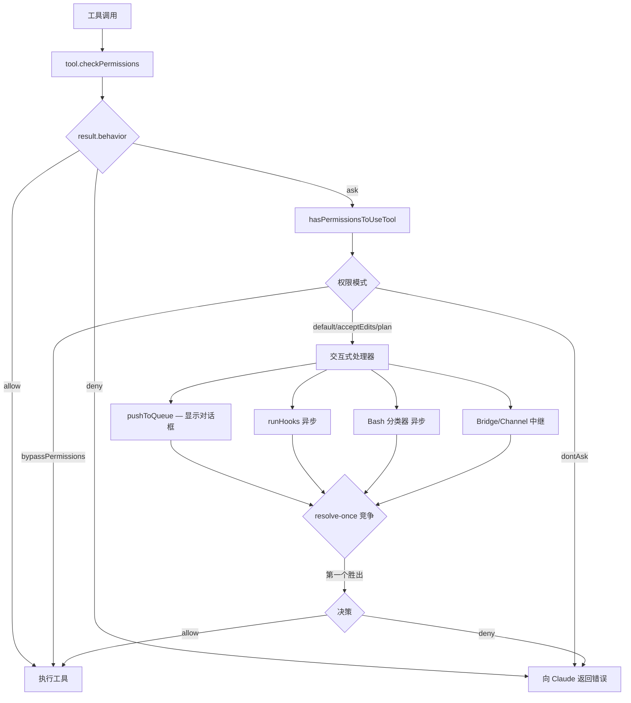

# 第 7 章：权限系统

> **难度：** 中级 | **阅读时间：** 约 55 分钟

---

## 目录

1. [简介](#1-简介)
2. [权限模式](#2-权限模式)
3. [权限规则系统](#3-权限规则系统)
4. [权限检查流程](#4-权限检查流程)
5. [Bash 安全：AST 解析与分类器](#5-bash-安全ast-解析与分类器)
6. [文件权限检查](#6-文件权限检查)
7. [权限 UI 组件](#7-权限-ui-组件)
8. [沙箱集成](#8-沙箱集成)
9. [动手实践：构建权限系统](#9-动手实践构建权限系统)
10. [核心要点与后续章节](#10-核心要点与后续章节)

---

## 1. 简介

Claude Code 代表 AI 模型执行真实的工具调用——Shell 命令、文件写入、网络请求。如果没有完善的权限系统，一条错误或恶意的指令就可能删除文件、泄露数据或破坏生产环境。

权限系统位于**工具调用**与**工具执行**之间。每当 Claude 想要运行一个工具时，运行时都会调用该工具的 `checkPermissions()`，然后将结果传入 `hasPermissionsToUseTool()`。最终决策只有三种行为：

| 行为 | 含义 |
|---|---|
| `allow` | 立即执行，无需用户提示 |
| `ask` | 暂停并向用户请求审批 |
| `deny` | 直接拒绝，向 Claude 返回错误 |

本章将逐层追踪这一决策过程——从 7 种全局模式，经过 8 个来源的分层规则，深入到 AST 级别的 Bash 分析和沙箱文件系统强制执行。

**涉及的源码文件：**

| 文件 | 职责 |
|---|---|
| `src/types/permissions.ts` | 类型定义（模式、规则、决策） |
| `src/utils/permissions/PermissionMode.ts` | 模式配置、显示名称、类型守卫 |
| `src/utils/permissions/permissions.ts` | 规则查找工具函数、`hasPermissionsToUseTool` |
| `src/utils/permissions/permissionRuleParser.ts` | 规则字符串的解析与序列化 |
| `src/utils/permissions/shellRuleMatching.ts` | 通配符/前缀规则匹配 |
| `src/utils/permissions/filesystem.ts` | 文件路径权限检查 |
| `src/utils/permissions/dangerousPatterns.ts` | 危险命令/解释器列表 |
| `src/utils/permissions/getNextPermissionMode.ts` | 模式循环逻辑（Shift+Tab） |
| `src/hooks/toolPermission/PermissionContext.ts` | `createResolveOnce`、`PermissionContext` |
| `src/hooks/toolPermission/handlers/interactiveHandler.ts` | 交互式权限流程 |
| `src/tools/BashTool/bashPermissions.ts` | `bashToolHasPermission`——tree-sitter 门控 |
| `src/utils/sandbox/sandbox-adapter.ts` | `SandboxManager` 集成 |

---

## 2. 权限模式

权限模式是会话级别的设置，决定了当没有明确规则匹配时的*默认姿态*。模式定义在 `src/types/permissions.ts`：

```typescript
// src/types/permissions.ts:16-29
export const EXTERNAL_PERMISSION_MODES = [
  'acceptEdits',
  'bypassPermissions',
  'default',
  'dontAsk',
  'plan',
] as const

export type ExternalPermissionMode = (typeof EXTERNAL_PERMISSION_MODES)[number]

// 内部模式新增 'auto'（ANT 专属）和 'bubble'（协调者模式）
export type InternalPermissionMode = ExternalPermissionMode | 'auto' | 'bubble'
export type PermissionMode = InternalPermissionMode
```

### 模式参考表

| 模式 | 符号 | 颜色 | 行为 |
|---|---|---|---|
| `default` | — | 中性色 | 对未知工具询问，遵循 allow 规则 |
| `acceptEdits` | ⏵⏵ | 绿色 | 自动批准工作目录内的文件编辑 |
| `plan` | ⏸ | 蓝色 | 只读规划模式，所有写操作需审批 |
| `bypassPermissions` | ⏵⏵ | 红色 | 跳过所有权限检查（危险） |
| `dontAsk` | ⏵⏵ | 红色 | 将所有 `ask` 决策转为 `deny` |
| `auto` | ⏵⏵ | 黄色 | ANT 专属：使用 AI 分类器代替用户提示 |
| `bubble` | — | — | 内部：协调者将决策委托给父代理 |

显示元数据在 `src/utils/permissions/PermissionMode.ts:44-91` 中通过 `PERMISSION_MODE_CONFIG` 映射表定义，每种模式关联 `title`、`shortTitle`、`symbol` 和 `color`。

### 模式循环（Shift+Tab）

用户可以通过 Shift+Tab 循环切换模式。循环逻辑在 `src/utils/permissions/getNextPermissionMode.ts` 中：

```
default → acceptEdits → plan → (bypassPermissions?) → (auto?) → default
```

`bypassPermissions` 和 `auto` 只有在对应功能标志或权限位启用时才可用（`isBypassPermissionsModeAvailable`、`isAutoModeAvailable`）。

### `dontAsk` 与 `bypassPermissions` 的区别

这两个模式常被混淆：

- **`bypassPermissions`**：完全跳过 `checkPermissions()`，工具无条件执行。
- **`dontAsk`**：仍然运行 `checkPermissions()`，但将任何 `ask` 结果转为 `deny`。它比 `default` *更严格*，而不是更宽松。

---

## 3. 权限规则系统

规则是精细控制特定工具调用允许或拒绝的机制。每条规则由三部分组成：

```typescript
// src/types/permissions.ts:75-79
type PermissionRule = {
  source: PermissionRuleSource     // 规则来源
  ruleBehavior: PermissionBehavior // 'allow' | 'deny' | 'ask'
  ruleValue: PermissionRuleValue   // { toolName, ruleContent? }
}
```

### 规则来源（优先级顺序）

规则从 8 个来源收集，越靠前的来源优先级越高：

| 优先级 | 来源 | 说明 |
|---|---|---|
| 1 | `policySettings` | 企业管理策略（只读） |
| 2 | `flagSettings` | 功能标志覆盖 |
| 3 | `userSettings` | `~/.claude/settings.json` |
| 4 | `projectSettings` | 项目根目录的 `.claude/settings.json` |
| 5 | `localSettings` | `.claude/settings.local.json` |
| 6 | `cliArg` | `--allowedTools` / `--disallowedTools` 命令行参数 |
| 7 | `command` | `/permissions add` 斜杠命令 |
| 8 | `session` | 本次会话中批准的（仅内存） |

完整来源列表在 `src/utils/permissions/permissions.ts:109-114` 组装：

```typescript
const PERMISSION_RULE_SOURCES = [
  ...SETTING_SOURCES,   // policySettings, flagSettings, userSettings, projectSettings, localSettings
  'cliArg',
  'command',
  'session',
] as const satisfies readonly PermissionRuleSource[]
```

### 规则格式

规则以字符串形式存储，由 `src/utils/permissions/permissionRuleParser.ts` 解析：

```
ToolName                → 整个工具的规则
ToolName(content)       → 按内容限定的规则
Bash(npm install)       → 精确匹配 bash 命令
Bash(git *)             → 通配符：任意 git 子命令
Read(~/*.ts)            → 读取 home 目录下任意 .ts 文件
WebFetch(https://api.example.com/*)  → 特定 URL 模式
```

解析器处理内容中的转义括号——`Bash(python -c "print\(1\)")` 会正确提取 `python -c "print(1)"` 作为规则内容（`permissionRuleParser.ts:55-79`）。

### 规则行为

| `ruleBehavior` | 效果 |
|---|---|
| `allow` | 绕过提示，立即执行 |
| `deny` | 阻止，向 Claude 返回错误 |
| `ask` | 强制提示，即使模式允许也会询问 |

`ask` 行为会覆盖宽松的模式——如果将 `Bash(rm *)` 设为 `ask` 规则，即使在 `acceptEdits` 模式下，用户在任何 `rm` 命令前都会被询问。

### 规则匹配

`src/utils/permissions/shellRuleMatching.ts` 实现了三种规则形态：

| 形态 | 示例 | 匹配逻辑 |
|---|---|---|
| `exact` | `git status` | 完全字符串匹配 |
| `prefix` | `npm:*`（旧语法） | 命令以指定前缀开头 |
| `wildcard` | `git *`、`npm run *` | 类 Glob 模式，`*` 作通配符 |

通配符引擎（`matchWildcardPattern`，第 90 行）将模式转换为正则表达式，处理 `\*` 作为字面星号、`\\` 作为字面反斜杠。末尾的 ` *` 使空格+参数变为可选，因此 `git *` 也能匹配裸 `git`。

---

## 4. 权限检查流程

### 整体流程



### 第一步：`tool.checkPermissions()`

每个工具实现自己的 `checkPermissions()`。示例：

- **BashTool**（`src/tools/BashTool/BashTool.tsx:539`）：委托给 `bashToolHasPermission`
- **FileEditTool**（`src/tools/FileEditTool/FileEditTool.ts:125`）：调用 `checkWritePermissionForTool`

结果是 `PermissionResult`——`allow`、`deny` 或带消息和建议的 `ask`。

### 第二步：`hasPermissionsToUseTool()`

定义在 `src/utils/permissions/permissions.ts:473`，此函数在内部检查之上应用模式级别的转换：

1. 若 `bypassPermissions` → 无条件返回 `allow`
2. 若 `dontAsk` 且结果为 `ask` → 转为 `deny`
3. 若 `auto` 模式 → 在显示对话框前先尝试 AI 分类器
4. 否则 → 委托给交互式或无头处理器

### 第三步：交互式权限处理器

`src/hooks/toolPermission/handlers/interactiveHandler.ts` 处理交互式情况。它为单个权限请求启动**四个并发竞争者**：

| 竞争者 | 来源 | 优先级 |
|---|---|---|
| 用户对话框 | 本地终端 UI | 第一次交互胜出 |
| PermissionRequest 钩子 | 外部脚本 | 后台异步 |
| Bash 分类器 | AI 安全分类器 | 后台异步 |
| Bridge/Channel 中继 | claude.ai 网页、Telegram、iMessage | 远程异步 |

**resolve-once 守卫**确保只有一个竞争者胜出：

```typescript
// src/hooks/toolPermission/PermissionContext.ts:75-93
function createResolveOnce<T>(resolve: (value: T) => void): ResolveOnce<T> {
  let claimed = false
  let delivered = false
  return {
    resolve(value: T) {
      if (delivered) return
      delivered = true
      claimed = true
      resolve(value)
    },
    claim() {         // 原子性的检查并标记
      if (claimed) return false
      claimed = true
      return true
    },
  }
}
```

每个竞争者在任何 `await` 之前都调用 `claim()`。若 `claim()` 返回 `false`，说明另一个竞争者已经胜出——调用者静默丢弃其结果。这即使在并发异步回调中也能防止双重解析。

### 第四步：权限上下文对象

`createPermissionContext`（`src/hooks/toolPermission/PermissionContext.ts:96`）创建一个上下文对象，包含：

- `pushToQueue` / `removeFromQueue` / `updateQueueItem`——React 状态桥接
- `runHooks`——执行 `settings.json` 中的 `PermissionRequest` 钩子
- `tryClassifier`——等待 Bash 分类器结果
- `handleUserAllow` / `handleHookAllow`——持久化并记录审批
- `cancelAndAbort`——中止信号 + 拒绝消息

这种设计使权限逻辑不直接依赖 React——React 状态通过 `PermissionQueueOps` 接口注入（`src/hooks/toolPermission/PermissionContext.ts:57-61`）。

---

## 5. Bash 安全：AST 解析与分类器

Bash 命令需要特殊处理，因为 Shell 语法通过命令替换、展开和管道允许任意代码执行。

### Tree-sitter AST 门控

`bashToolHasPermission`（`src/tools/BashTool/bashPermissions.ts:1663`）从 AST 解析开始：

```typescript
// src/tools/BashTool/bashPermissions.ts:1688-1695
let astRoot = injectionCheckDisabled
  ? null
  : feature('TREE_SITTER_BASH_SHADOW') && !shadowEnabled
    ? null
    : await parseCommandRaw(input.command)

let astResult: ParseForSecurityResult = astRoot
  ? parseForSecurityFromAst(input.command, astRoot)
  : { kind: 'parse-unavailable' }
```

AST 结果有三种形态：

| 类型 | 含义 | 处理 |
|---|---|---|
| `simple` | 干净解析，得到 `SimpleCommand[]` | 检查语义，应用规则 |
| `too-complex` | 检测到替换/展开 | 应用拒绝规则，然后 `ask` |
| `parse-unavailable` | WASM 未加载 | 回退到旧版正则路径 |

当 tree-sitter 检测到命令替换（`$(...)` 或反引号）、进程替换、heredoc 或控制流时，`too-complex` 结果触发。这些结构无法静态分析，因此命令始终需要用户批准，除非有精确的拒绝/允许规则匹配。

### 危险模式列表

`src/utils/permissions/dangerousPatterns.ts` 定义了进入 auto 模式时会被剥离的模式：

```typescript
// src/utils/permissions/dangerousPatterns.ts:44-50
export const DANGEROUS_BASH_PATTERNS: readonly string[] = [
  ...CROSS_PLATFORM_CODE_EXEC,  // python, node, deno, ruby, perl, bash, ssh...
  'zsh', 'fish', 'eval', 'exec', 'env', 'xargs', 'sudo',
]
```

像 `Bash(python:*)` 这样的允许规则会让 Claude 运行任意 Python 代码，绕过分类器。`permissionSetup.ts` 在切换到 auto 模式之前会剥离这些规则。

### 语义安全检查

即使对于 `simple` AST 结果，也会对命令列表运行语义级检查。这些检查捕获解析干净但按名称危险的构造——例如 `eval "rm -rf /"` 有干净的 AST，但会被语义检查阻止。

---

## 6. 文件权限检查

文件工具（Read、Edit、Write）使用 `src/utils/permissions/filesystem.ts` 中基于 gitignore 风格的模式引擎。

### 受保护的文件和目录

```typescript
// src/utils/permissions/filesystem.ts:57-79
export const DANGEROUS_FILES = [
  '.gitconfig', '.gitmodules', '.bashrc', '.bash_profile',
  '.zshrc', '.zprofile', '.profile', '.ripgreprc',
  '.mcp.json', '.claude.json',
]

export const DANGEROUS_DIRECTORIES = [
  '.git', '.vscode', '.idea', '.claude',
]
```

这些文件/目录永远不会被自动编辑——无论何种模式都需要用户明确批准。

### 路径匹配

`matchingRuleForInput` 使用 `ignore` 包（gitignore 语义）将文件路径与权限规则进行匹配，支持：

- 绝对路径
- `~/path` 模式（展开到 home 目录）
- `./path`（相对于项目根目录）
- 含 `**` 的 Glob 模式

路径遍历在 `src/utils/permissions/filesystem.ts` 中通过 `containsPathTraversal` 检测并阻止。

### 大小写不敏感的安全处理

macOS 和 Windows 文件系统是大小写不敏感的。第 90 行的检查在比较前将路径规范化为小写：

```typescript
// src/utils/permissions/filesystem.ts:90-92
export function normalizeCaseForComparison(path: string): string {
  return path.toLowerCase()
}
```

这防止通过访问 `.ClaUdE/Settings.JSON` 来绕过针对 `.claude/settings.json` 的拒绝规则。

### FileEditTool 的写权限

`src/tools/FileEditTool/FileEditTool.ts:125-131` 中的 `checkWritePermissionForTool` 会：

1. 检查文件路径是否在 `deny` 规则中
2. 检查文件是否是危险文件/目录
3. 在 `acceptEdits` 模式下：自动批准工作目录内的文件
4. 否则：返回 `ask` 并附带允许该路径的建议

---

## 7. 权限 UI 组件

`src/components/permissions/` 目录包含每个工具权限对话框的基于 Ink 的 React 组件。

### 组件注册表

| 组件 | 工具 | 备注 |
|---|---|---|
| `BashPermissionRequest` | Bash | 显示命令和子命令分解 |
| `FileEditPermissionRequest` | Edit | 显示差异预览 |
| `FileWritePermissionRequest` | Write | 显示新文件内容 |
| `FilesystemPermissionRequest` | Read | 显示文件路径 |
| `WebFetchPermissionRequest` | WebFetch | 显示 URL |
| `SedEditPermissionRequest` | SedEdit | 显示差异 |
| `FallbackPermissionRequest` | 任意 | 通用回退 |
| `SandboxPermissionRequest` | Sandbox | 沙箱覆盖 |

### PermissionDialog

`src/components/permissions/PermissionDialog.tsx` 是包裹所有工具特定组件的外壳。它：

1. 根据 `tool.name` 选择正确的组件
2. 渲染 `PermissionExplanation` 显示需要审批的原因
3. 提供允许/拒绝/始终允许按钮
4. 将 `onAllow` / `onReject` 回调传回 `handleInteractivePermission`

### 分类器指示器

当 Bash 分类器在后台运行时，对话框显示一个旋转器（`classifierCheckInProgress: true`）。当分类器批准时，绿色复选标记会短暂显示，然后对话框自动关闭（终端聚焦时 3 秒，未聚焦时 1 秒）——见 `interactiveHandler.ts:509-518`。

### PermissionRuleExplanation

`src/components/permissions/PermissionRuleExplanation.tsx` 解释*为什么*触发了规则：

- **规则来源**："来自用户设置"、"来自项目设置"
- **规则内容**：匹配的规则字符串
- **行为**：规则的作用

这种透明度帮助用户理解和调试权限配置。

---

## 8. 沙箱集成

沙箱是更深层的安全层，在操作系统级别独立于权限规则系统强制执行限制。

### 架构

```
权限规则（Claude Code 层）
        ↓
SandboxManager（适配器层）
        ↓
@anthropic-ai/sandbox-runtime（操作系统层）
```

`src/utils/sandbox/sandbox-adapter.ts` 将 Claude Code 的设置格式桥接到 `sandbox-runtime` 包的 `SandboxRuntimeConfig`。

### 路径模式解析

Claude Code 使用 `sandbox-runtime` 不了解的自定义路径前缀（`sandbox-adapter.ts:99-119`）：

| 模式 | 解析 |
|---|---|
| `//path` | 从根目录开始的绝对路径：`/path` |
| `/path` | 相对于设置文件目录 |
| `~/path` | 直接传递给 sandbox-runtime |
| `./path` | 直接传递给 sandbox-runtime |

### 文件系统限制

沙箱在操作系统级别强制执行读写限制。规则来自：

1. Read/Edit/Write 工具的 `permissions.alwaysAllow` / `permissions.alwaysDeny` 规则
2. 设置中的 `sandbox.filesystem.allowWrite` / `sandbox.filesystem.denyWrite`

```json
// settings.json 沙箱配置示例
{
  "sandbox": {
    "filesystem": {
      "allowWrite": ["~/projects/**", "./dist/**"],
      "denyWrite": ["~/.ssh/**", "~/.aws/**"]
    },
    "network": {
      "allowedDomains": ["api.github.com", "*.npmjs.com"]
    }
  }
}
```

### 网络限制

网络规则从 `WebFetch` 权限规则中提取，并与 `sandbox.network` 设置合并。`allowedDomains` 列表传递给沙箱运行时，在进程级别强制执行。

### `shouldAllowManagedSandboxDomainsOnly`

企业部署可以设置 `policySettings.sandbox.network.allowManagedDomainsOnly: true`，将 Claude Code 限制为只能访问管理策略中列出的域名，防止用户添加自己的网络允许规则。

---

## 9. 动手实践：构建权限系统

让我们构建一个简化但完整的权限系统，演示 Claude Code 实现中的关键模式。

参见配套文件：`examples/07-permission-system/permission-check.ts`

示例实现了：

1. **多来源规则加载**——来自用户、项目、会话和 CLI 来源的规则
2. **三种行为规则**——`allow`、`deny`、`ask`
3. **通配符模式匹配**——`git *`、`npm run *`
4. **resolve-once 并发守卫**——防止双重解析
5. **模式级别覆盖**——`bypassPermissions`、`dontAsk`

### 运行示例

```bash
cd examples/07-permission-system
npx ts-node permission-check.ts
```

### 关键模式解析

**模式 1：按来源的规则优先级**

来自 `policySettings` 的规则覆盖 `userSettings`，后者覆盖 `projectSettings`。示例中的 `getRulesForBehavior` 函数按优先级顺序遍历来源，返回第一个匹配项。

**模式 2：resolve-once 守卫**

```typescript
const guard = createResolveOnce(resolve)
// 钩子回调
hook().then(decision => {
  if (!guard.claim()) return  // 另一个竞争者已胜出
  guard.resolve(decision)
})
// 用户对话框回调
onUserApprove(decision => {
  if (!guard.claim()) return
  guard.resolve(decision)
})
```

`claim()` 调用是原子性的——它同时检查并标记。这关闭了检查 `isResolved()` 和调用 `resolve()` 之间的竞争窗口。

**模式 3：模式转换**

```typescript
if (mode === 'dontAsk' && result.behavior === 'ask') {
  return { behavior: 'deny', message: 'dontAsk 模式' }
}
if (mode === 'bypassPermissions') {
  return { behavior: 'allow', updatedInput: input }
}
```

模式转换在工具自己的 `checkPermissions` *之后*应用，而不是之前。这意味着对于某些工具类型，即使在 `bypassPermissions` 模式下，拒绝规则仍然生效。

---

## 10. 核心要点与后续章节

### 核心要点

**1. 三层防御**

Claude Code 的权限系统有三个独立的层次：
- **模式**：会话级别的姿态（`default`、`acceptEdits`、`bypassPermissions`）
- **规则**：来自 8 个来源的工具+内容特定的 `allow`/`deny`/`ask`
- **沙箱**：操作系统级别的文件系统和网络强制执行

**2. 工具特定逻辑**

`checkPermissions()` 按工具实现。Bash 使用 AST 分析，FileEdit 使用 gitignore 风格的路径匹配。这让每个工具能对其领域应用正确的安全语义。

**3. resolve-once 并发处理**

交互式权限处理器竞争四个异步来源（用户、钩子、分类器、bridge）。`createResolveOnce` 守卫使用原子性的 `claim()` 确保恰好一个竞争者胜出，关闭了检查-然后-设置的竞争窗口。

**4. 透明设计**

每个 `ask` 结果都携带一个 `decisionReason`，解释*为什么*工具需要批准。UI 在 `PermissionRuleExplanation` 中展示这一信息，使系统可审计。

**5. 企业锁定**

`policySettings` 是最高优先级来源且只读。结合 `allowManagedPermissionRulesOnly` 和 `allowManagedSandboxDomainsOnly`，企业管理员可以完全控制 Claude Code 能访问的内容。

### 后续章节

- **第 8 章：MCP 集成**——Claude Code 如何连接到模型上下文协议服务器，以及 MCP 工具权限如何与原生权限系统交互
- **第 9 章：代理协调**——`bubble` 权限模式在多代理层次结构中的工作原理，以及 swarm worker 如何处理无头权限请求

---

*源码引用已对照 `anthhub-claude-code` 提交树进行验证。*
