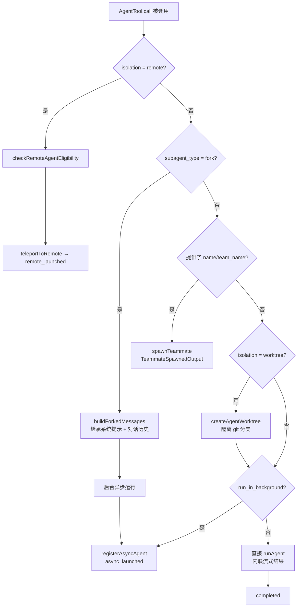
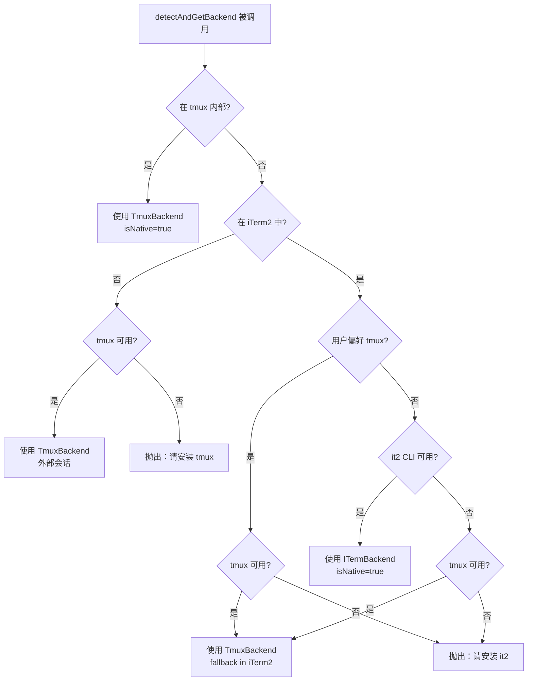
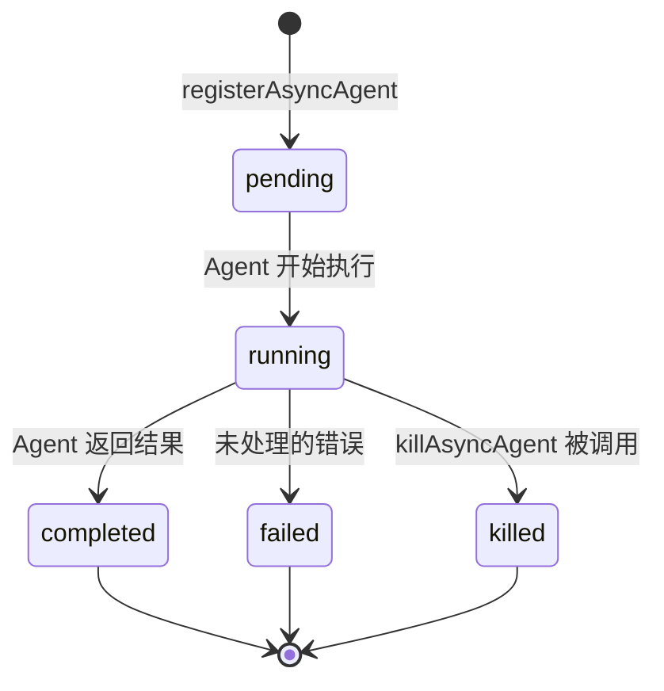

# 第 9 章：Agent 与多 Agent 协调

## 目录

1. [简介](#1-简介)
2. [Agent 定义格式](#2-agent-定义格式)
3. [AgentTool：派生子 Agent](#3-agenttool派生子-agent)
4. [五种 Agent 执行模式](#4-五种-agent-执行模式)
5. [Coordinator 协调器模式](#5-coordinator-协调器模式)
6. [Swarm Backend 架构](#6-swarm-backend-架构)
7. [任务系统](#7-任务系统)
8. [团队通信](#8-团队通信)
9. [InProcessTeammateTask 深度解析](#9-inprocessteammatetask-深度解析)
10. [实战：构建多 Agent 系统](#10-实战构建多-agent-系统)
11. [核心要点与后续学习](#11-核心要点与后续学习)

---

## 1. 简介

多 Agent 协调是 Claude Code 最强大的能力之一。通过并行编排多个专业化 Agent，Claude Code 能够处理单个 Agent 无法完成的任务——超大规模代码库、并行研究、持续验证循环，以及长时序的工程工作流。

Claude Code 的多 Agent 系统围绕几个互补的原语构建：

- **AgentTool** — 在会话中派生和管理子 Agent
- **Coordinator 模式** — 专门的系统提示，用于编排 worker
- **Swarm backends** — 在进程内或独立终端窗格（tmux/iTerm2）中运行 Agent 的基础设施
- **Task 系统** — 用类型化状态机追踪 Agent 生命周期
- **Mailbox 通信** — Agent 之间的异步消息传递

本章从 Agent 定义文件到运行时执行与通信系统，深入探索整个架构，并精确引用源码位置。

---

## 2. Agent 定义格式

Agent 使用带有 YAML frontmatter 的 Markdown 文件定义。Frontmatter 字段控制 Agent 的行为、能力和隔离策略。

### Frontmatter Schema

完整 schema 在 `src/tools/AgentTool/loadAgentsDir.ts:73-99` 中验证：

```typescript
// AgentJsonSchema (loadAgentsDir.ts:73)
const AgentJsonSchema = lazySchema(() =>
  z.object({
    description: z.string().min(1),
    tools: z.array(z.string()).optional(),
    disallowedTools: z.array(z.string()).optional(),
    prompt: z.string().min(1),
    model: z.string().optional(),           // 'sonnet' | 'opus' | 'haiku' | 'inherit'
    effort: z.union([z.enum(EFFORT_LEVELS), z.number().int()]).optional(),
    permissionMode: z.enum(PERMISSION_MODES).optional(),
    mcpServers: z.array(AgentMcpServerSpecSchema()).optional(),
    hooks: HooksSchema().optional(),
    maxTurns: z.number().int().positive().optional(),
    skills: z.array(z.string()).optional(),
    initialPrompt: z.string().optional(),
    memory: z.enum(['user', 'project', 'local']).optional(),
    background: z.boolean().optional(),
    isolation: z.enum(['worktree', 'remote']).optional(),
  })
)
```

### 字段说明

| 字段 | 类型 | 说明 |
|------|------|------|
| `description` | string | 必填。Agent 的功能描述（展示在工具列表中）。 |
| `tools` | string[] | 允许使用的工具。`['*']` 表示全部。 |
| `disallowedTools` | string[] | 明确禁止的工具。 |
| `model` | string | `'sonnet'`、`'opus'`、`'haiku'` 或 `'inherit'`（继承父 Agent 的模型）。 |
| `permissionMode` | string | `'default'`、`'plan'`、`'auto'`、`'acceptEdits'`、`'bypassPermissions'`、`'bubble'`。 |
| `mcpServers` | array | Agent 专属的 MCP 服务器（按名称引用或内联配置）。 |
| `maxTurns` | number | 停止前的最大轮次数。 |
| `background` | boolean | 派生时始终作为后台任务运行。 |
| `isolation` | string | `'worktree'`（git worktree 隔离）或 `'remote'`（CCR 云端）。 |
| `memory` | string | 持久记忆范围：`'user'`、`'project'` 或 `'local'`。 |
| `initialPrompt` | string | 插入到第一个用户轮次前（支持斜杠命令）。 |
| `hooks` | object | Agent 启动时注册的会话范围 hooks。 |

### Agent 定义示例

```markdown
---
description: 检查 PR 安全问题的代码审查员
tools:
  - Read
  - Bash
  - Grep
  - Glob
model: sonnet
permissionMode: default
maxTurns: 50
memory: project
---

你是一个专注安全的代码审查员。当收到 PR 或文件列表时：
1. 检查 OWASP Top 10 漏洞
2. 查找代码中的密钥或凭证
3. 以文件路径和行号报告发现

只关注安全问题。不要修改文件。
```

### BaseAgentDefinition 类型

运行时，加载的 Agent 遵循 `BaseAgentDefinition`（loadAgentsDir.ts:106-133）：

```typescript
export type BaseAgentDefinition = {
  agentType: string          // AgentTool 调用中使用的标识符
  whenToUse: string          // 展示给模型的描述
  tools?: string[]
  disallowedTools?: string[]
  model?: string
  permissionMode?: PermissionMode
  maxTurns?: number
  background?: boolean
  isolation?: 'worktree' | 'remote'
  memory?: AgentMemoryScope
  // ... 更多字段
}
```

三种 source 类型扩展了这个基类——`BuiltInAgentDefinition`、`CustomAgentDefinition` 和 `PluginAgentDefinition`，分别对应 `source` 值 `'built-in'`、`'user'`/`'project'`、`'plugin'`。

---

## 3. AgentTool：派生子 Agent

`AgentTool` 是派生子 Agent 的主要机制，定义在 `src/tools/AgentTool/AgentTool.tsx`，拥有丰富的 schema 和路由逻辑。

### 输入 Schema

```typescript
// AgentTool.tsx:82-102
const baseInputSchema = lazySchema(() => z.object({
  description: z.string(),        // 3-5 词的任务描述
  prompt: z.string(),             // Agent 要执行的任务
  subagent_type: z.string().optional(),  // 使用哪个 Agent 定义
  model: z.enum(['sonnet', 'opus', 'haiku']).optional(),
  run_in_background: z.boolean().optional(),
}));

// 完整 schema 还包括：
//   name, team_name, mode（多 Agent 字段）
//   isolation ('worktree' | 'remote')
//   cwd（工作目录覆盖）
```

### 输出 Schema

AgentTool 可以返回以下几种 status：

- **`completed`** — 同步执行完成
- **`async_launched`** — 后台任务已启动，包含 `outputFile` 路径
- **`teammate_spawned`** — 新的 tmux/iTerm2 窗格已派生
- **`remote_launched`** — CCR 云端执行已启动

### 调用流程（Mermaid）



关键决策发生在 `AgentTool.tsx` 约 200–500 行：

1. **远程检查** — `checkRemoteAgentEligibility()` 控制 CCR 执行权限
2. **Fork 路径** — `isForkSubagentEnabled()` 切换 fork 实验
3. **Teammate 路径** — `spawnTeammate()` 处理带 `team_name` 的命名 Agent
4. **Worktree** — `createAgentWorktree()` 创建隔离的 git 分支
5. **异步** — `registerAsyncAgent()` 注册后台生命周期

### runAgent()

核心执行函数是 `src/tools/AgentTool/runAgent.ts:248+` 中的 `runAgent()`。它：

1. 初始化 Agent 专属的 MCP 服务器（`initializeAgentMcpServers`，第 95–218 行）
2. 为 Agent 组装工具池
3. 调用 `query()`——主 LLM 循环——作为异步生成器
4. 通过 `recordSidechainTranscript()` 将对话记录写入磁盘
5. 将流事件传回父 Agent

```typescript
// runAgent.ts:248
export async function* runAgent({
  agentDefinition,
  promptMessages,
  // ... 更多参数
}) {
  // Agent 专属 MCP 设置
  const { clients, tools: mcpTools, cleanup } = 
    await initializeAgentMcpServers(agentDefinition, parentClients)
  
  // 运行 LLM 循环
  for await (const msg of query({ messages, systemPrompt, tools, ... })) {
    yield msg
    // 追踪进度、记录对话...
  }
  
  // 清理 MCP 服务器
  await cleanup()
}
```

---

## 4. 五种 Agent 执行模式

Claude Code 支持五种不同的 Agent 运行模式，每种模式针对不同场景优化。

### 模式一：同步子 Agent（默认）

最简单的模式——父 Agent 阻塞，直到子 Agent 完成。

```
AgentTool({ description: "修复空指针", prompt: "修复 src/auth/validate.ts:42" })
// 父 Agent 在此阻塞，直到子 Agent 返回
// 返回：{ status: 'completed', result: '...' }
```

**适用场景：** 父 Agent 需要结果才能继续的快速任务。运行时间短（< 30 秒）的 Agent。

### 模式二：异步后台 Agent（`run_in_background`）

子 Agent 作为后台任务运行；完成时，父 Agent 收到任务通知。

```
AgentTool({
  description: "长时间分析",
  prompt: "分析整个代码库...",
  run_in_background: true
})
// 立即返回：{ status: 'async_launched', agentId: '...', outputFile: '...' }
// 稍后以 <task-notification> XML 形式收到通知
```

后台任务通过 `registerAsyncAgent()`（LocalAgentTask.tsx）注册，并通过 `LocalAgentTaskState` 追踪状态。任务通知格式如下：

```xml
<task-notification>
  <task-id>agent-a1b2c3</task-id>
  <status>completed|failed|killed</status>
  <summary>人类可读的状态摘要</summary>
  <result>Agent 的最终文本响应</result>
  <usage>
    <total_tokens>12345</total_tokens>
    <tool_uses>42</tool_uses>
    <duration_ms>30000</duration_ms>
  </usage>
</task-notification>
```

**适用场景：** 长时间运行的任务。并行工作负载。研究任务（父 Agent 可以同时做其他工作）。

### 模式三：Fork 子 Agent

Fork 子 Agent 继承父 Agent 的完整系统提示和对话历史，实现 prompt cache 复用。

`FORK_AGENT` 定义（forkSubagent.ts:60-71）配置了这一点：
- `tools: ['*']` — 与父 Agent 完全相同的工具池（实现缓存相同的 API 前缀）
- `model: 'inherit'` — 使用父 Agent 的模型，确保上下文长度一致
- `permissionMode: 'bubble'` — 将权限提示传递到父 Agent 终端

```typescript
// 当 fork 实验启用且省略 subagent_type 时触发
AgentTool({
  description: "并行实现",
  prompt: "在 src/features/ 中实现功能 X",
  // 没有 subagent_type → 走 fork 路径
})
```

`buildForkedMessages()` 通过在对话中注入 fork 指令构建子 Agent 的消息历史，充分利用 prompt cache 提高效率。

**适用场景：** 子 Agent 需要完整对话上下文的任务。并行化共享父 Agent 上下文的工作。在 fork 启用的会话中，Coordinator 派生的 worker。

### 模式四：Teammate（tmux/iTerm2 独立进程）

Teammate 作为独立 OS 进程运行在专用终端窗格中，用户可见。

```typescript
AgentTool({
  description: "长期驻留的研究员",
  prompt: "监控并研究...",
  name: "researcher",           // 通过 SendMessage 可寻址
  team_name: "my-team",
})
// 返回：{ status: 'teammate_spawned', tmux_session_name: '...', ... }
```

Teammate 路径调用 `spawnTeammate()`，它：
1. 调用 Swarm Backend Registry（`registry.ts`）检测环境
2. 通过 `TmuxBackend` 或 `ITermBackend` 派生进程
3. 在团队文件中注册 teammate，供发现使用

**适用场景：** 长期运行的持久 Agent。需要在终端可见的 Agent。应在会话重启后存活的团队。

### 模式五：Remote Agent（CCR 云端）

云远程 Agent 在 Anthropic 的 CCR（Claude Code Remote）基础设施中运行。

```typescript
AgentTool({
  description: "云端分析",
  prompt: "运行大规模分析...",
  isolation: "remote"
})
// 返回：{ status: 'remote_launched', taskId: '...', sessionUrl: '...' }
```

远程执行受 `checkRemoteAgentEligibility()` 控制，`teleportToRemote()` 函数处理远程进程的环境设置。

**适用场景：** 需要云端隔离的任务。不应影响本地机器的工作负载。Ant 内部工作负载（需要 `USER_TYPE=ant`）。

---

## 5. Coordinator 协调器模式

Coordinator 模式是一种专门的系统提示设计，将 Claude 转变为编排者。它通过 `CLAUDE_CODE_COORDINATOR_MODE` 环境变量激活，实现在 `src/coordinator/coordinatorMode.ts`。

### 激活方式

```typescript
// coordinatorMode.ts:36-41
export function isCoordinatorMode(): boolean {
  if (feature('COORDINATOR_MODE')) {
    return isEnvTruthy(process.env.CLAUDE_CODE_COORDINATOR_MODE)
  }
  return false
}
```

### Coordinator 系统提示设计

系统提示（第 111–369 行）编码了结构化的编排哲学：

**角色定义（第 116–127 行）：**
Coordinator 的职责与 worker 明确分离：
- **Coordinator**：编排、综合、与用户沟通
- **Workers**：通过 AgentTool 进行研究、实现、验证

**四阶段工作流（第 200–215 行）：**

| 阶段 | 谁 | 目的 |
|------|-----|------|
| 研究 | Workers（并行） | 调查代码库、找到文件、理解问题 |
| 综合 | Coordinator | 阅读发现、理解问题、制定实现规范 |
| 实现 | Workers | 按规范进行针对性修改，提交 |
| 验证 | Workers | 测试修改有效性 |

**并发策略（第 212–219 行）：**
```
并行是你的超能力。Workers 是异步的。尽可能并发启动独立 workers——
不要序列化可以同时运行的工作。在做研究时，覆盖多个角度。
要并行启动 workers，在一条消息中进行多次工具调用。
```

**Worker 继续 vs. 派生逻辑（第 280–293 行）：**

| 情况 | 机制 | 原因 |
|------|------|------|
| 研究恰好探索了需要编辑的文件 | **继续**（SendMessage）| Worker 已有上下文且有清晰计划 |
| 研究宽泛，实现聚焦 | **派生新**（AgentTool）| 避免携带探索噪音 |
| 修正失败 | **继续** | Worker 有错误上下文 |
| 验证另一 worker 编写的代码 | **派生新** | 验证者应以新鲜视角看代码 |

**综合要求（第 252–268 行）：**

Coordinator 在委派之前必须综合研究结果：
```
// 反模式——懒惰委派（错误）
AgentTool({ prompt: "根据你的发现，修复 auth bug", ... })

// 正确——综合后的规范（包含具体细节）
AgentTool({ prompt: "修复 src/auth/validate.ts:42 的空指针。
  当会话过期但 token 仍然缓存时，Session 上的 user 字段是 undefined。
  在 user.id 访问前添加空检查——如果为 null，返回带'Session expired'的 401。
  提交并报告哈希值。", ... })
```

### Worker 上下文

Coordinator 还通过 `getCoordinatorUserContext()`（第 80–109 行）获得关于 worker 能力的用户上下文：

```typescript
// coordinatorMode.ts:97
let content = `通过 ${AGENT_TOOL_NAME} 工具派生的 Workers 可以访问这些工具：${workerTools}`

if (mcpClients.length > 0) {
  content += `\n\nWorkers 还可以访问 MCP 工具：${serverNames}`
}

if (scratchpadDir && isScratchpadGateEnabled()) {
  content += `\n\n草稿目录：${scratchpadDir}\nWorkers 无需权限提示即可在此读写。`
}
```

---

## 6. Swarm Backend 架构

Swarm 系统提供可插拔的 Backend，用于派生 teammate 进程。三层架构实现在 `src/utils/swarm/backends/` 中。

### Backend 类型

```typescript
// types.ts
type PaneBackendType = 'tmux' | 'iterm2'

interface PaneBackend {
  type: PaneBackendType
  spawnPane(params: SpawnParams): Promise<SpawnResult>
  killPane(paneId: string): Promise<void>
  // ...
}
```

- **InProcessBackend** — 在同一 Node.js 进程中作为异步任务运行 Agent
- **TmuxBackend** — 在 tmux 窗格中派生 Agent（外部会话或分割窗格）
- **ITermBackend** — 通过 `it2` CLI 在 iTerm2 原生分割窗格中派生 Agent

### 检测优先级

Registry（`registry.ts:136-253`）使用以下检测顺序：



**优先级规则（registry.ts:158–250）：**
1. 在 tmux 内部 → 始终使用 tmux（即使在 iTerm2 中）
2. 在 iTerm2 且有 `it2` CLI → 使用 ITermBackend（原生窗格）
3. 在 iTerm2 且没有 `it2`，但有 tmux → 使用 TmuxBackend（建议设置）
4. 不在 iTerm2，有 tmux → 使用 TmuxBackend（外部会话）
5. 无 Backend → 抛出带平台特定安装说明的错误

### isInProcessEnabled

Registry 还控制 Agent 是在进程内运行还是在窗格中运行（第 351–389 行）：

```typescript
export function isInProcessEnabled(): boolean {
  // 非交互式会话始终在进程内
  if (getIsNonInteractiveSession()) return true
  
  const mode = getTeammateMode()  // 'auto' | 'tmux' | 'in-process'
  
  if (mode === 'in-process') return true
  if (mode === 'tmux') return false
  
  // 'auto' 模式：如果 tmux 或 iTerm2 可用，使用窗格 backend
  const insideTmux = isInsideTmuxSync()
  const inITerm2 = isInITerm2()
  return !insideTmux && !inITerm2
}
```

进程内模式是没有 tmux 或 iTerm2 的环境的回退方案。它使用基于 `AsyncLocalStorage` 的隔离，在同一进程内保持 teammate 上下文分离。

---

## 7. 任务系统

任务系统是追踪所有后台工作生命周期的类型化状态机。它定义在 `src/tasks/types.ts`，并在几个特定任务模块中实现。

### TaskState 联合类型

```typescript
// tasks/types.ts:12-19
export type TaskState =
  | LocalShellTaskState         // Shell 命令（Bash 工具）
  | LocalAgentTaskState         // 后台子 Agent
  | RemoteAgentTaskState        // CCR 云端 Agent
  | InProcessTeammateTaskState  // 进程内 teammate
  | LocalWorkflowTaskState      // 多步骤工作流
  | MonitorMcpTaskState         // MCP 服务器监控
  | DreamTaskState              // Dream/主动任务
```

### LocalAgentTaskState

追踪后台 Agent 执行（通过 `registerAsyncAgent` 注册）：

```typescript
// LocalAgentTaskState 的关键字段
{
  type: 'local_agent'
  status: 'pending' | 'running' | 'completed' | 'failed' | 'killed'
  agentId: string
  description: string
  prompt: string
  outputFile: string        // 磁盘上输出文件的路径
  isBackgrounded: boolean   // 是否显示在后台指示器中
  progress?: AgentProgress  // 当前轮次数、token 数等
}
```

### isBackgroundTask

如果任务正在运行/等待，且未明确置于前台，则认为是"后台"任务（tasks/types.ts:37-46）：

```typescript
export function isBackgroundTask(task: TaskState): task is BackgroundTaskState {
  if (task.status !== 'running' && task.status !== 'pending') return false
  if ('isBackgrounded' in task && task.isBackgrounded === false) return false
  return true
}
```

### 任务生命周期



关键函数：
- `registerAsyncAgent()` — 在 AppState 中创建 `LocalAgentTaskState`
- `updateAsyncAgentProgress()` — 更新 token/轮次计数
- `completeAsyncAgent()` — 转换到 `completed`，将通知加入队列
- `failAsyncAgent()` — 转换到 `failed`，将错误通知加入队列
- `killAsyncAgent()` — 终止运行中的 Agent，转换到 `killed`

---

## 8. 团队通信

团队通信使用 Mailbox 系统——通过文件系统（或进程内模式的内存）进行异步消息传递。

### SendMessageTool

定义在 `src/tools/SendMessageTool/SendMessageTool.ts`，该工具支持：

**纯文本消息：**
```typescript
SendMessage({
  to: "researcher",          // teammate 名称
  summary: "任务完成",        // 5-10 词的预览
  message: "我在 src/auth/validate.ts:42 找到了 bug..."
})
```

**广播：**
```typescript
SendMessage({
  to: "*",                   // 所有 teammate
  summary: "新需求",
  message: "请停下来，先处理安全问题。"
})
```

**结构化消息**（第 47-65 行）：
```typescript
// 关闭协议
SendMessage({
  to: "researcher",
  message: { type: 'shutdown_request', reason: "任务完成" }
})

// 计划审批
SendMessage({
  to: "implementer",
  message: { type: 'plan_approval_response', request_id: '...', approve: true }
})
```

### 消息路由（SendMessageTool.ts:800-874）

工具通过几条路径路由消息：

1. **Bridge/UDS** — 跨会话远程消息（Remote Control 功能）
2. **命名 Agent 恢复** — 如果命名 Agent 已停止，用消息自动恢复它
3. **为运行中的 Agent 排队** — 如果 Agent 正在运行，将消息排队到下一轮
4. **Mailbox 写入** — 为进程内/tmux teammate 写入文件系统 mailbox

```typescript
// 简化的路由逻辑
const agentId = appState.agentNameRegistry.get(input.to)
if (agentId) {
  const task = appState.tasks[agentId]
  if (isLocalAgentTask(task) && task.status === 'running') {
    // 排队等待下一轮交付
    queuePendingMessage(agentId, input.message, setAppState)
  } else {
    // 用消息自动恢复已停止的 Agent
    resumeAgentBackground({ agentId, prompt: input.message, ... })
  }
}
```

### Mailbox 机制

Mailbox 系统（`src/utils/teammateMailbox.ts`）提供：

- `writeToMailbox(recipientName, message, teamName)` — 将消息追加到收件人收件箱
- `readMailbox(agentName, teamName)` — 读取所有未读消息
- `markMessageAsReadByIndex(...)` — 将特定消息标记为已读
- `createIdleNotification(...)` — 向 leader 发出 Agent 完成信号

消息以 JSON 文件形式存储在团队目录中，支持跨进程重启的持久化。

---

## 9. InProcessTeammateTask 深度解析

进程内 teammate 使用 `AsyncLocalStorage` 在同一 Node.js 进程中运行，提供隔离。当 tmux/iTerm2 不可用时，这是默认模式。

### 状态结构

`InProcessTeammateTaskState`（tasks/InProcessTeammateTask/types.ts:22-76）：

```typescript
export type InProcessTeammateTaskState = TaskStateBase & {
  type: 'in_process_teammate'
  
  // 身份标识
  identity: TeammateIdentity    // agentId, agentName, teamName, color, parentSessionId
  
  // 执行
  prompt: string
  model?: string
  selectedAgent?: AgentDefinition
  abortController?: AbortController      // 终止整个 teammate
  currentWorkAbortController?: AbortController  // 仅终止当前轮次
  
  // 计划模式
  awaitingPlanApproval: boolean
  permissionMode: PermissionMode
  
  // 状态
  error?: string
  result?: AgentToolResult
  progress?: AgentProgress
  messages?: Message[]          // 上限为 TEAMMATE_MESSAGES_UI_CAP（50条）
  
  // 生命周期
  isIdle: boolean
  shutdownRequested: boolean
  onIdleCallbacks?: Array<() => void>  // 高效等待，无需轮询
}
```

### 消息上限

防止长时间运行会话中的内存问题（types.ts:89-101）：

```typescript
// 内存分析：500+ 轮次会话中每个 Agent 约 20MB RSS
// 鲸鱼会话 2 分钟内启动了 292 个 Agent → 36.8GB
export const TEAMMATE_MESSAGES_UI_CAP = 50

export function appendCappedMessage<T>(prev: readonly T[], item: T): T[] {
  if (prev.length >= TEAMMATE_MESSAGES_UI_CAP) {
    const next = prev.slice(-(TEAMMATE_MESSAGES_UI_CAP - 1))
    next.push(item)
    return next
  }
  return [...prev, item]
}
```

### AsyncLocalStorage 隔离

进程内 runner（`src/utils/swarm/inProcessRunner.ts`）将每个 teammate 的执行包裹在 `runWithTeammateContext()` 调用中，该调用设置携带 teammate 身份的 `AsyncLocalStorage`：

```typescript
// inProcessRunner.ts（简化版）
await runWithTeammateContext(
  { agentId, agentName, teamName, color, planModeRequired, parentSessionId },
  async () => {
    // 此处所有代码都在 teammate 上下文中运行
    // getAgentId()、getAgentName() 等返回正确值
    for await (const msg of runAgent({ agentDefinition, ... })) {
      // 处理消息...
    }
  }
)
```

### 空闲通知

当 teammate 完成一轮时，它通过 mailbox 使用 `createIdleNotification()` 通知 leader。Leader 使用 `onIdleCallbacks` 实现高效等待，无需轮询。

### 计划模式流程

当 teammate 以 `plan` 模式运行时：
1. Teammate 生成计划并通过 `SendMessage` 发送计划内容
2. Leader 收到计划，设置 `awaitingPlanApproval: true`
3. 用户通过 UI 审查计划
4. Leader 通过 `SendMessage` 发送 `plan_approval_response`
5. Teammate 收到审批，开始实现

此流程由 `permissionSync.ts` 和 `leaderPermissionBridge.ts` 协调。

---

## 10. 实战：构建多 Agent 系统

`examples/09-agent-coordination/multi-agent.ts` 中的示例演示了一个完整的多 Agent 系统，包含：

1. 使用 frontmatter 风格配置的 **Agent 定义**
2. 带类型化状态机的 **Task 状态管理**
3. Agent 之间的 **Mailbox 通信**
4. **Coordinator 分发** 模式

### 运行示例

```bash
cd examples/09-agent-coordination
npx ts-node multi-agent.ts
```

### 演示的关键模式

**模式一：Agent 注册表**
```typescript
const agentRegistry = new Map<string, AgentDefinition>()
agentRegistry.set('researcher', {
  agentType: 'researcher',
  model: 'sonnet',
  tools: ['Read', 'Grep', 'Glob'],
  permissionMode: 'default',
  // ...
})
```

**模式二：Task 生命周期**
```typescript
type TaskStatus = 'pending' | 'running' | 'completed' | 'failed'
interface AgentTask {
  id: string
  agentType: string
  status: TaskStatus
  prompt: string
  result?: string
  startedAt?: Date
  completedAt?: Date
}
```

**模式三：Mailbox 通信**
```typescript
class MailboxSystem {
  private mailboxes = new Map<string, Message[]>()
  
  send(to: string, from: string, content: string) {
    // 写入收件人的 mailbox
  }
  
  read(agentName: string): Message[] {
    // 返回未读消息
  }
}
```

**模式四：Coordinator 分发**
```typescript
class Coordinator {
  async dispatch(task: string) {
    // 阶段一：研究（并行）
    const [codeFindings, testFindings] = await Promise.all([
      this.runAgent('researcher', `研究: ${task}`),
      this.runAgent('researcher', `找到测试: ${task}`),
    ])
    
    // 阶段二：综合
    const spec = this.synthesize(codeFindings, testFindings)
    
    // 阶段三：实现
    await this.runAgent('implementer', spec)
    
    // 阶段四：验证
    await this.runAgent('verifier', `验证实现: ${task}`)
  }
}
```

---

## 11. 核心要点与后续学习

### 核心要点

**架构原则：**
- Agent 定义使用 Markdown frontmatter，拥有丰富的工具、模型、权限和隔离 schema
- `AgentTool` 是单一入口点，根据参数路由到五种不同的执行模式
- Coordinator 模式将编排（综合、规划）与执行（worker）分离

**执行模式：**
- 同步模式适用于快速任务，异步后台模式适用于长时间运行的工作
- Fork Agent 继承父上下文和 prompt cache，实现高效并行
- Teammate 作为终端窗格中可见的真实进程运行
- Remote Agent（CCR）提供云端隔离

**基础设施：**
- Swarm backend（InProcess/Tmux/iTerm2）根据环境自动检测
- Task 系统为所有后台工作提供类型化状态机
- Mailbox 通信实现 Agent 之间的异步消息传递

**设计模式：**
- 委派前先综合：Coordinator 必须理解研究结果，再指导实现
- 继续 vs. 派生：根据上下文重叠程度决定
- 并行读取，序列化写入：扇出读操作，序列化对同一文件集的写操作
- 消息上限防止长时间运行的 swarm 会话中的内存膨胀

### 后续学习

在**第 10 章：插件与 Skill 系统**中，我们将探索 Claude Code 如何通过插件和 skill 扩展——用户编写的 Markdown 文件，无需修改核心代码库即可添加新命令和行为。

涵盖主题：
- 插件加载和插件 Agent 系统
- Skill frontmatter 格式和解析
- `initialPrompt` 和 skill 链式调用
- `cli-hub` 生态系统和 skill 分享

---

*本章源码参考：*
- `src/tools/AgentTool/AgentTool.tsx` — AgentTool 主要实现
- `src/tools/AgentTool/runAgent.ts` — Agent 执行循环
- `src/tools/AgentTool/loadAgentsDir.ts` — Agent 定义加载和验证
- `src/tools/AgentTool/forkSubagent.ts` — Fork 子 Agent 实验
- `src/coordinator/coordinatorMode.ts` — Coordinator 系统提示和逻辑
- `src/tasks/types.ts` — TaskState 联合类型
- `src/tasks/InProcessTeammateTask/types.ts` — 进程内 teammate 状态
- `src/utils/swarm/backends/registry.ts` — Backend 检测和选择
- `src/utils/swarm/inProcessRunner.ts` — 带 AsyncLocalStorage 的进程内 runner
- `src/tools/SendMessageTool/SendMessageTool.ts` — Agent 通信
- `src/tools/TeamCreateTool/TeamCreateTool.ts` — 团队创建
