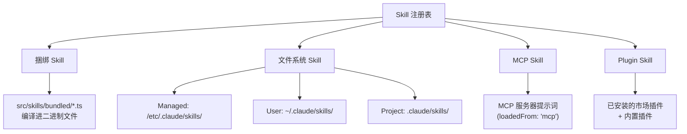
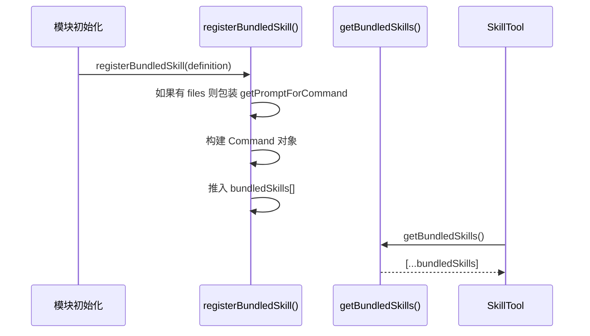
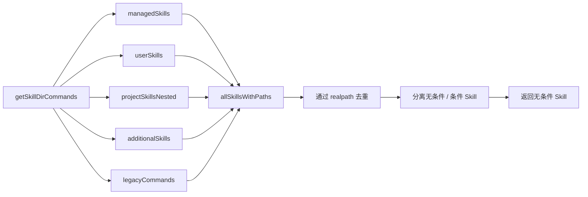
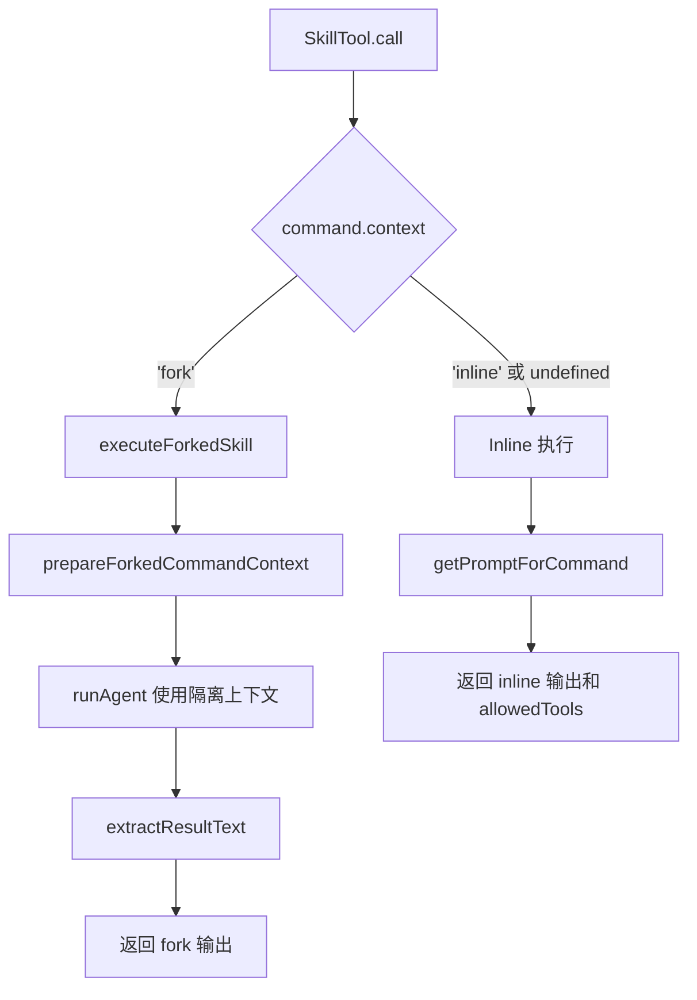
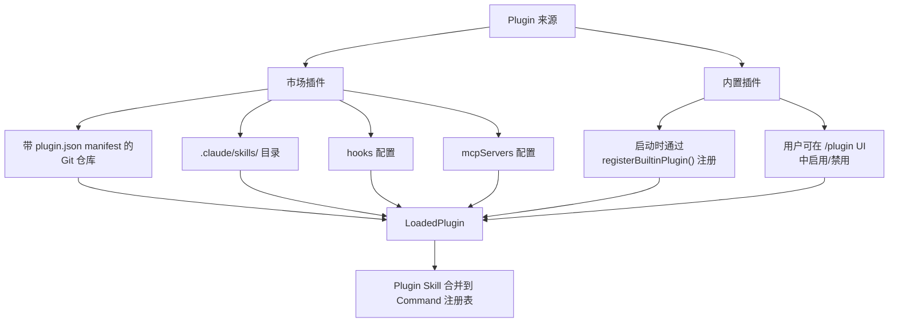
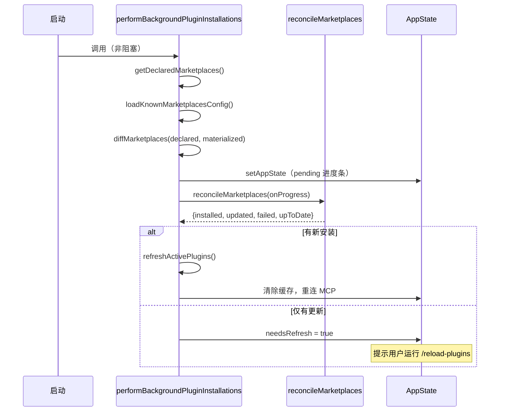

# 第 10 章：插件与 Skill 系统

> **难度：** 中级 | **阅读时间：** 约 55 分钟

---

## 目录

1. [概述](#1-概述)
2. [Skill 系统架构](#2-skill-系统架构)
3. [BundledSkill 定义](#3-bundledskill-定义)
4. [文件系统 Skill](#4-文件系统-skill)
5. [Skill 加载与注册](#5-skill-加载与注册)
6. [SkillTool 执行机制](#6-skilltool-执行机制)
7. [Plugin 系统](#7-plugin-系统)
8. [内置插件](#8-内置插件)
9. [安全模型](#9-安全模型)
10. [实践：创建自定义 Skill](#10-实践创建自定义-skill)
11. [核心要点与后续章节](#11-核心要点与后续章节)

---

## 1. 概述

Claude Code 的扩展能力建立在两个层次的抽象上：**Skill（技能）**和 **Plugin（插件）**。

- **Skill** 是基于提示词的命令，Claude 可以自主调用，也可由用户通过 `/skill-name` 手动触发。它们是带有 YAML frontmatter 的 Markdown 文件，定义了行为、允许的工具和执行上下文。
- **Plugin** 是 Skill、Hook 和 MCP 服务器配置的集合包，可从市场仓库安装，也可作为内置组件随 CLI 一起发布。

两者共同构成了一套两层扩展机制：

```
用户调用 /commit  →  SkillTool 解析命令  →  执行 skill 提示词
                                               （inline 或 fork 模式）
安装 Plugin       →  提供 skills + hooks + MCPs  →  合并到注册表
```

这套架构让生态系统得以有机生长：Anthropic 内置捆绑 Skill，团队发布市场插件，个人创建项目级自定义 Skill——所有这些共享同一个执行引擎。

---

## 2. Skill 系统架构

Skill 来自四个不同的来源。理解这个层次结构，是搞清楚冲突如何解决、以及如何正确放置自己 Skill 的基础。



### 四种 Skill 来源

| 来源 | `loadedFrom` 值 | 位置 | 优先级 |
|---|---|---|---|
| 捆绑（Bundled） | `'bundled'` | 编译进二进制 | 最高 |
| 策略管理（Managed） | `'skills'` | `/etc/.claude/skills/`（策略） | 高 |
| 用户级（User） | `'skills'` | `~/.claude/skills/` | 中 |
| 项目级（Project） | `'skills'` | `.claude/skills/` | 低 |
| 插件（Plugin） | `'plugin'` | 已安装的市场包 | 不定 |
| MCP | `'mcp'` | MCP 服务器提示词 | 不定 |

来源：`src/skills/loadSkillsDir.ts:67-73` — `LoadedFrom` 类型联合。

### Command 类型

所有 Skill 最终都变成 `type: 'prompt'` 的 `Command` 对象。`source` 字段区分来源：`'bundled'`、`'userSettings'`、`'projectSettings'` 或 `'policySettings'`。`loadedFrom` 字段提供更细的粒度，包含 `'mcp'` 和 `'plugin'`。

---

## 3. BundledSkill 定义

捆绑 Skill 是 TypeScript 对象，随 CLI 二进制文件一起发布。它们在启动时通过 `registerBundledSkill()` 以编程方式注册。

### `BundledSkillDefinition` 接口

来源：`src/skills/bundledSkills.ts:15-41`

```typescript
export type BundledSkillDefinition = {
  name: string                          // 斜杠命令名称（如 "commit"）
  description: string                   // 显示在 /skill 列表中
  aliases?: string[]                    // 别名
  whenToUse?: string                    // 提示 Claude 何时自动调用
  argumentHint?: string                 // UI 中显示的参数提示
  allowedTools?: string[]               // 该 Skill 允许使用的工具
  model?: string                        // 覆盖该 Skill 使用的模型
  disableModelInvocation?: boolean      // 禁止通过 SkillTool 调用
  userInvocable?: boolean               // 显示在 /skill 列表中（默认 true）
  isEnabled?: () => boolean             // 动态可用性检查
  hooks?: HooksSettings                 // 生命周期钩子
  context?: 'inline' | 'fork'          // 执行上下文
  agent?: string                        // fork 执行时的 Agent 类型
  files?: Record<string, string>        // 按需提取到磁盘的参考文件
  getPromptForCommand: (               // 返回提示词内容块
    args: string,
    context: ToolUseContext,
  ) => Promise<ContentBlockParam[]>
}
```

### 关键字段详解

**`context: 'inline' | 'fork'`**

这是最关键的字段，决定了 Skill 是在当前对话上下文中运行，还是在隔离的子 Agent 中运行：

- `'inline'`（默认）：Skill 提示词注入到正在进行的对话中。Claude 在相同的 token 预算内处理。更简单，开销更低。
- `'fork'`：生成一个具有独立 token 预算和消息历史的子 Agent。结果以文本摘要形式返回。适用于长期运行或自包含的任务。

**`files?: Record<string, string>`**

设置后，捆绑 Skill 会在首次调用时将参考文件延迟提取到磁盘。这允许模型按需 `Read` 或 `Grep` 结构化的参考资料，而无需将其嵌入到提示词中。提取目录基于每个进程的 nonce（见安全章节）。来源：`src/skills/bundledSkills.ts:59-73`。

**`whenToUse`**

这个字符串被包含在 SkillTool 的系统提示词中，让 Claude 知道何时主动调用该 Skill。没有这个字段，Claude 可能会错过自动使用的机会。

### 注册流程



来源：`src/skills/bundledSkills.ts:53-100`

---

## 4. 文件系统 Skill

用户和团队可以将自定义 Skill 创建为磁盘上的 Markdown 文件。无论是用户级（`~/.claude/skills/`）还是项目级（`.claude/skills/`），文件格式完全相同。

### 目录结构

`/skills/` 目录使用严格的**每个 Skill 一个目录**的格式：

```
.claude/
└── skills/
    ├── my-skill/
    │   └── SKILL.md          ← 必须的文件名
    ├── code-review/
    │   ├── SKILL.md
    │   └── checklist.md      ← 额外的参考文件
    └── deploy/
        └── SKILL.md
```

在 `/skills/` 中，只支持目录格式。直接放在 `/skills/` 下的单个 `.md` 文件会被**忽略**。来源：`src/skills/loadSkillsDir.ts:425`。

### SKILL.md Frontmatter 格式

```markdown
---
description: 检查代码的安全漏洞和最佳实践
argument-hint: "[文件或 PR 编号]"
allowed-tools: Read, Grep, Bash
model: claude-opus-4-5
context: fork
when_to_use: 在合并前审查代码变更时使用
user-invocable: true
paths:
  - src/**
  - "*.ts"
hooks:
  PostToolUse:
    - matcher: "Bash"
      hooks:
        - type: command
          command: echo "工具已使用"
---

你是一个专注于安全的代码审查员。分析提供的代码是否存在：

1. SQL 注入漏洞
2. XSS 风险
3. 身份验证绕过
4. ...
```

### 支持的 Frontmatter 字段

| 字段 | 类型 | 说明 |
|---|---|---|
| `description` | string | 人类可读的描述 |
| `argument-hint` | string | 参数的 UI 提示 |
| `allowed-tools` | string[] | 允许使用的工具 |
| `model` | string | 模型覆盖（或 `"inherit"`） |
| `context` | `"fork"` | 强制 fork 执行 |
| `when_to_use` | string | Claude 自动调用的提示 |
| `user-invocable` | boolean | 显示在 `/skill` 列表中（默认 true） |
| `paths` | string[] | 激活该 Skill 的路径模式 |
| `hooks` | HooksSettings | 生命周期钩子 |
| `agent` | string | fork 上下文的 Agent 类型 |
| `effort` | string/int | 努力程度覆盖 |
| `arguments` | string[] | 命名参数占位符 |
| `disable-model-invocation` | boolean | 阻止 SkillTool 调用 |
| `version` | string | Skill 版本 |

来源：`src/skills/loadSkillsDir.ts:185-264`

### 路径条件 Skill

`paths` frontmatter 字段启用**条件 Skill**——只有当用户正在处理匹配特定模式的文件时，这些 Skill 才会出现在 Claude 的上下文中：

```yaml
paths:
  - src/database/**
  - "*.sql"
```

只有当对话涉及数据库或 SQL 文件时，该 Skill 才可用。条件 Skill 单独存储，按需激活。来源：`src/skills/loadSkillsDir.ts:771-796`。

### 变量替换

在 Skill 内容中，有几个特殊变量会在调用时被替换：

- `$ARGUMENTS` — 传递给 Skill 的参数字符串
- `${CLAUDE_SKILL_DIR}` — 包含该 Skill 的目录（用于引用同级文件）
- `${CLAUDE_SESSION_ID}` — 当前会话 ID

来源：`src/skills/loadSkillsDir.ts:344-370`

### 内联 Shell 执行

Skill 内容可以使用反引号语法嵌入 Shell 命令：

```markdown
当前 git 状态：
!`git status --short`
```

这些命令在 Skill 加载时执行，在发送给 Claude 之前完成替换。MCP Skill **免于** Shell 执行，出于安全考虑。来源：`src/skills/loadSkillsDir.ts:373-396`。

---

## 5. Skill 加载与注册

加载管道比表面看起来复杂得多。让我们一步步追踪。

### 加载优先级顺序



来源：`src/skills/loadSkillsDir.ts:638-800`

### 通过 `realpath` 去重

加载器使用文件系统的 `realpath()` 将符号链接解析到它们的规范路径，然后基于解析后的路径去重。这防止了同一个 Skill 文件通过不同路径（如重叠的父目录、符号链接）出现两次。

```typescript
// src/skills/loadSkillsDir.ts:118-124
async function getFileIdentity(filePath: string): Promise<string | null> {
  try {
    return await realpath(filePath)  // 解析所有符号链接
  } catch {
    return null
  }
}
```

为什么用 `realpath` 而不是 inode？inode 号在某些文件系统（NFS、ExFAT、一些容器挂载报告 inode 0）上不可靠。`realpath` 与文件系统无关。参见第 113-117 行的注释。

### `.skillsignore`

项目可以在 `.claude/skills/` 中放置 `.skillsignore` 文件，使用与 `.gitignore` 相同的忽略语法来排除特定的 Skill 加载。加载器使用 `ignore` npm 包进行模式匹配。

### 记忆化（Memoization）

`getSkillDirCommands` 被 `lodash-es/memoize` 包装。记忆化键是 `cwd`。这意味着每个工作目录在进程生命周期内只加载一次 Skill。如果磁盘上的 Skill 发生变化，需要 `/reload-plugins` 命令（或进程重启）才能生效。

来源：`src/skills/loadSkillsDir.ts:638`

### Bare 模式

当 Claude Code 以 `--bare` 启动时，跳过 Skill 自动发现。只扫描显式提供的 `--add-dir` 路径。这对于隔离或受策略约束的环境很有用。

---

## 6. SkillTool 执行机制

`SkillTool` 是 Claude 以编程方式调用 Skill 的方式。它作为标准工具注册，在工具列表中显示为 `Skill`。

### 输入 Schema

```typescript
// src/tools/SkillTool/SkillTool.ts:291-298
z.object({
  skill: z.string().describe('技能名称，如 "commit"、"review-pr"'),
  args: z.string().optional().describe('可选的参数'),
})
```

### 验证

执行前，该工具验证：

1. Skill 名称非空
2. Skill 在命令注册表中存在（包括 MCP Skill）
3. Skill 的 `type === 'prompt'`（不是内置命令）
4. Skill 没有设置 `disableModelInvocation: true`

来源：`src/tools/SkillTool/SkillTool.ts:354-429`

### 执行：Inline vs Fork



**Inline 执行**返回展开的提示词内容和允许的工具列表。调用 Agent 然后在当前对话轮次中直接使用这些工具。

**Fork 执行**通过 `runAgent()` 生成一个子 Agent，收集其所有消息，提取最终结果文本，并以摘要形式返回。子 Agent 的消息历史被丢弃——只有结果传回。

### 输出 Schema

```typescript
// Inline Skill
{
  success: boolean,
  commandName: string,
  allowedTools?: string[],
  model?: string,
  status?: 'inline'
}

// Fork Skill
{
  success: boolean,
  commandName: string,
  status: 'forked',
  agentId: string,
  result: string          // 从子 Agent 提取的文本
}
```

来源：`src/tools/SkillTool/SkillTool.ts:301-329`

### 分析遥测

每次 Skill 调用都会发出 `tengu_skill_tool_invocation` 事件，字段包括：
- `command_name`（第三方会脱敏）
- `execution_context`（`'fork'` 或 `'inline'`）
- `invocation_trigger`（`'claude-proactive'` 或 `'nested-skill'`）
- `query_depth`（嵌套层级）

来源：`src/tools/SkillTool/SkillTool.ts:152-203`

### 权限检查

Skill 可以在 Claude Code 设置中被允许列表或拒绝列表。权限检查支持精确匹配和前缀通配符：

```
"review-pr"    → 精确匹配
"review:*"     → 前缀通配符（匹配以 "review:" 开头的任何 Skill）
```

来源：`src/tools/SkillTool/SkillTool.ts:451-466`

---

## 7. Plugin 系统

Skill 是单个提示词命令，而 Plugin 是可以一起发布多个 Skill、Hook 和 MCP 服务器配置的捆绑包。

### Plugin 架构



### Plugin 标识符格式

Plugin 使用 `{name}@{marketplace}` 格式：

- `"commit@official"` — 官方市场插件
- `"my-plugin@github.com/user/repo"` — 第三方市场
- `"my-tool@builtin"` — 内置插件

来源：`src/utils/plugins/pluginIdentifier.ts`

### `PluginInstallationManager`

后台安装流程处理市场插件安装，不阻塞 Claude Code 启动：



来源：`src/services/plugins/PluginInstallationManager.ts:60-184`

### 协调逻辑

协调器计算声明的市场（来自设置）和已安装的市场（来自磁盘缓存）之间的差异：

- **缺失** — 安装（git clone）
- **来源已变更** — 重新安装（来源 URL 已更改）
- **最新** — 跳过

新安装完成后，自动调用 `refreshActivePlugins()` 以清除缓存并重建 MCP 连接。仅有更新时，通知用户手动重新加载。

---

## 8. 内置插件

内置插件（`@builtin`）随 Claude Code 一起发布，但用户可以通过 `/plugin` UI 切换它们。它们与捆绑 Skill 的区别：

| | 捆绑 Skill | 内置插件 |
|---|---|---|
| 可见性 | 始终存在 | 显示在 `/plugin` UI 中 |
| 可切换 | 否 | 是，持久化到用户设置 |
| 组成 | 仅 Skill | Skill + hooks + MCPs |
| 注册方式 | `registerBundledSkill()` | `registerBuiltinPlugin()` |
| ID 格式 | `name` | `name@builtin` |

来源：`src/plugins/builtinPlugins.ts:1-14`

### `BuiltinPluginDefinition`

```typescript
type BuiltinPluginDefinition = {
  name: string
  description: string
  version?: string
  defaultEnabled?: boolean              // 默认：true
  isAvailable?: () => boolean           // 动态可用性检查
  skills?: BundledSkillDefinition[]     // 提供的 Skill
  hooks?: HooksSettings                 // Hook 配置
  mcpServers?: MCPServerConfig[]        // 要连接的 MCP 服务器
}
```

### 启用/禁用流程

```typescript
// src/plugins/builtinPlugins.ts:71-73
const userSetting = settings?.enabledPlugins?.[pluginId]
const isEnabled = userSetting !== undefined
  ? userSetting === true
  : (definition.defaultEnabled ?? true)
```

`~/.claude/settings.json` 中 `enabledPlugins` 下的用户偏好会覆盖插件默认值。如果没有设置偏好，则应用 `defaultEnabled`（默认：`true`）。

### Skill 命令转换

当内置插件的 Skill 被添加到命令注册表时，会经过 `skillDefinitionToCommand()`。值得注意的是，`source` 字段被设置为 `'bundled'`（而非 `'builtin'`）：

```typescript
// src/plugins/builtinPlugins.ts:149
// 'bundled' 不是 'builtin' — Command.source 中的 'builtin' 表示硬编码的
// 斜杠命令（/help, /clear）。
source: 'bundled',
loadedFrom: 'bundled',
```

这保持了插件 Skill 在 SkillTool 列表中的可发现性，并免于提示词截断。

---

## 9. 安全模型

Skill 和 Plugin 系统采取了几项值得了解的安全措施。

### 捆绑 Skill 的安全文件写入

当捆绑 Skill 将参考文件提取到磁盘时，使用了加固的文件创建标志：

```typescript
// src/skills/bundledSkills.ts:176-193
const SAFE_WRITE_FLAGS =
  process.platform === 'win32'
    ? 'wx'                              // Windows：存在则失败
    : fsConstants.O_WRONLY |
      fsConstants.O_CREAT |
      fsConstants.O_EXCL |             // 文件存在则失败（无竞争条件）
      O_NOFOLLOW                        // 最终组件是符号链接则失败

async function safeWriteFile(p: string, content: string): Promise<void> {
  const fh = await open(p, SAFE_WRITE_FLAGS, 0o600)  // 仅所有者可读写
  try {
    await fh.writeFile(content, 'utf8')
  } finally {
    await fh.close()
  }
}
```

这可以防止：
- **TOCTOU 竞争**：`O_EXCL` 确保原子性创建或失败
- **符号链接攻击**：`O_NOFOLLOW` 拒绝最终路径组件中的符号链接
- **权限过宽的文件**：`0o600`（仅所有者读/写）

### 基于 Nonce 的提取目录

提取目录根包含每个进程的 nonce（来自 `getBundledSkillsRoot()`）。即使攻击者通过 `inotify` 监听可预测的父目录学到了 nonce，`0o700` 目录模式也能阻止其他用户写入。

### 路径遍历防护

在写入任何捆绑 Skill 文件之前，相对路径会被验证以防止遍历：

```typescript
// src/skills/bundledSkills.ts:196-205
function resolveSkillFilePath(baseDir: string, relPath: string): string {
  const normalized = normalize(relPath)
  if (
    isAbsolute(normalized) ||
    normalized.split(pathSep).includes('..') ||
    normalized.split('/').includes('..')
  ) {
    throw new Error(`bundled skill file path escapes skill dir: ${relPath}`)
  }
  return join(baseDir, normalized)
}
```

### MCP Skill Shell 执行被阻断

来自 MCP 服务器的 Skill 不能执行内联 Shell 命令（`` !`...` ``）。保护在 `createSkillCommand()` 中：

```typescript
// src/skills/loadSkillsDir.ts:373-374
if (loadedFrom !== 'mcp') {
  finalContent = await executeShellCommandsInPrompt(...)
}
```

MCP Skill 是远程且不可信的——它们可以定义提示词，但不能在用户的机器上运行任意 Shell 代码。

---

## 10. 实践：创建自定义 Skill

让我们创建一个完整的自定义 Skill。我们将构建一个"智能提交"Skill，分析暂存的变更并编写规范的提交消息。

### 第一步：创建 Skill 目录

```bash
mkdir -p .claude/skills/smart-commit
```

### 第二步：编写 SKILL.md

```markdown
---
description: 从暂存变更生成规范的提交消息
argument-hint: "[可选：范围或类型覆盖]"
allowed-tools: Bash, Read
when_to_use: 当用户想用格式良好的消息提交暂存变更时使用
context: fork
---

分析暂存的 git 变更并生成规范的提交消息。

## 操作步骤

1. 运行 `!`git diff --cached --stat`` 查看哪些文件发生了变更
2. 运行 `!`git diff --cached`` 查看实际的差异
3. 分析变更的性质：
   - Bug 修复 → `fix:`
   - 新功能 → `feat:`
   - 重构 → `refactor:`
   - 测试 → `test:`
   - 文档 → `docs:`
   - 构建/工具 → `chore:`
4. 按以下格式编写提交消息：
   ```
   类型(范围): 简短描述
   
   如需要，可添加更详细的解释（可选）
   ```
5. 执行提交：`git commit -m "..."`

$ARGUMENTS
```

### 第三步：验证加载

```bash
# 重启 Claude Code 并检查 Skill 是否已加载
/skills
# 应该显示：smart-commit — 从暂存变更生成规范的提交消息...
```

### 第四步：调用 Skill

作为用户：
```
/smart-commit
```

或者，当你说"提交我的变更"时，Claude 会自动调用它。

### 第五步：进阶——TypeScript 中的捆绑 Skill

对于需要编程逻辑的 Skill，创建捆绑 Skill：

完整示例见 [`examples/10-plugin-skill-system/custom-skill.ts`](../../examples/10-plugin-skill-system/custom-skill.ts)。

```typescript
import { registerBundledSkill } from '../skills/bundledSkills.js'

registerBundledSkill({
  name: 'smart-commit',
  description: '从暂存变更生成规范的提交消息',
  context: 'fork',
  allowedTools: ['Bash', 'Read'],
  whenToUse: '当用户想提交暂存变更时使用',
  async getPromptForCommand(args, context) {
    const scope = args.trim() || '自动'
    return [{
      type: 'text',
      text: `分析暂存变更并写一个 ${scope} 规范提交。
      
运行 git diff --cached 查看变更，然后用合适的消息提交。`
    }]
  }
})
```

### 第六步：内置插件模式

将多个 Skill 打包并支持用户切换：

```typescript
import { registerBuiltinPlugin } from '../plugins/builtinPlugins.js'

registerBuiltinPlugin({
  name: 'git-workflow',
  description: 'Git 工作流自动化工具',
  version: '1.0.0',
  defaultEnabled: true,
  skills: [
    smartCommitSkill,
    branchCleanupSkill,
    prDraftSkill,
  ],
  hooks: {
    PostToolUse: [{
      matcher: 'Bash',
      hooks: [{ type: 'command', command: 'git status --short' }]
    }]
  }
})
```

---

## 11. 核心要点与后续章节

### 核心要点

1. **四种 Skill 来源**，具有不同的 `loadedFrom` 值：`bundled`、`skills`、`mcp`、`plugin`。优先级：策略管理 > 用户 > 项目。

2. **`BundledSkillDefinition`** 是编程 API（`src/skills/bundledSkills.ts:15`）。`context` 字段（`'inline'` vs `'fork'`）是最重要的选择——fork 提供隔离，inline 共享上下文。

3. **文件系统 Skill** 位于 `skill-name/SKILL.md`——目录格式在 `/skills/` 中是强制的。YAML frontmatter 控制所有行为；Markdown 正文是提示词。

4. **去重使用 `realpath`**（`src/skills/loadSkillsDir.ts:118`），以在不同文件系统中正确处理符号链接。

5. **SkillTool 根据 `command.context`** 分派到 `executeForkedSkill()` 或内联执行。Fork Skill 获得隔离的子 Agent；Inline Skill 注入到当前对话中。

6. **插件后台安装是非阻塞的**（`PluginInstallationManager.ts:60`）。新安装触发自动刷新；更新设置 `needsRefresh` 以便用户主动重载。

7. **安全机制**：`O_EXCL | O_NOFOLLOW | 0o600` 用于捆绑文件提取，路径遍历验证，MCP Shell 执行被阻断。

8. **内置插件**（`@builtin`）可由用户通过 `/plugin` UI 切换，但其 Skill 在注册表中以 `source: 'bundled'` 出现——保持 SkillTool 的可发现性。

### 架构总结

```
用户输入 /smart-commit
        ↓
CommandSystem 解析为 PromptCommand
        ↓
SkillTool.validateInput() — 命令存在且是 prompt 类型
        ↓
SkillTool.checkPermissions() — 允许/拒绝规则
        ↓
command.context === 'fork'?
    是 → executeForkedSkill() → runAgent() → extractResultText()
    否 → getPromptForCommand() → 注入到对话中
```

### 后续章节

**第 11 章：状态与上下文管理** — `AppState` 如何在应用程序中流转，会话状态如何跨工具调用维护，以及上下文窗口如何管理。

**第 12 章：高级特性** — 努力程度等级、参数替换、提示词中的 Shell 执行，以及实验性的 Skill 搜索系统。

---

*本章引用的源文件：*
- `src/skills/bundledSkills.ts` — BundledSkillDefinition, registerBundledSkill
- `src/skills/loadSkillsDir.ts` — 文件系统加载、去重、路径条件 Skill
- `src/tools/SkillTool/SkillTool.ts` — Skill 执行（inline/fork）
- `src/plugins/builtinPlugins.ts` — 内置插件注册表
- `src/services/plugins/PluginInstallationManager.ts` — 后台市场安装
