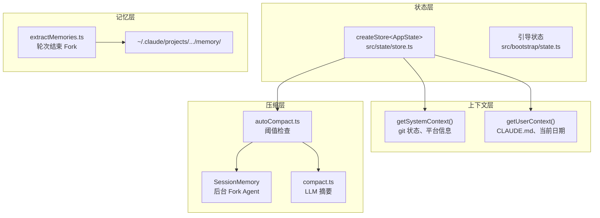
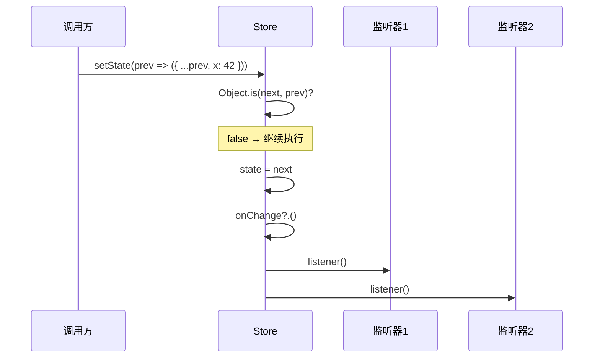
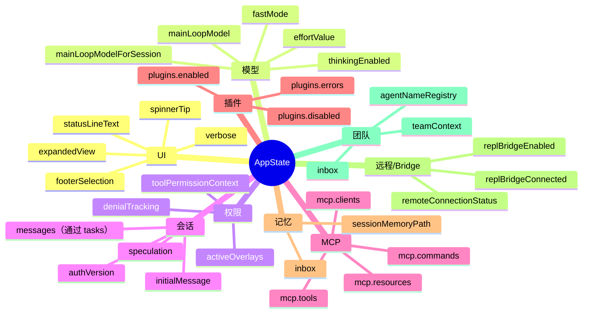
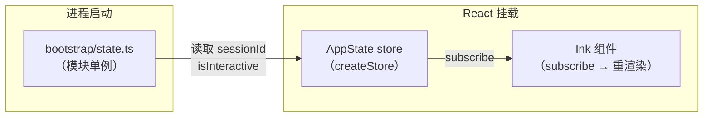
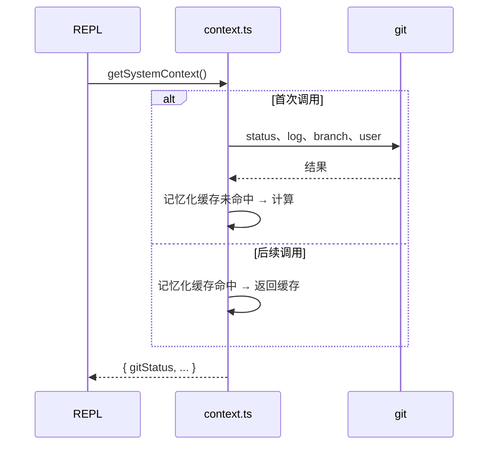
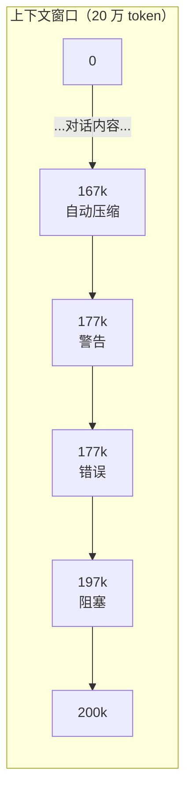
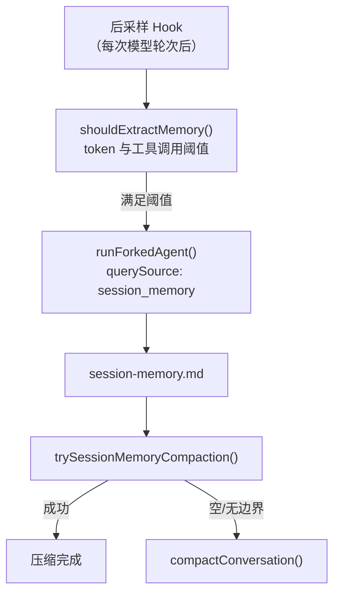
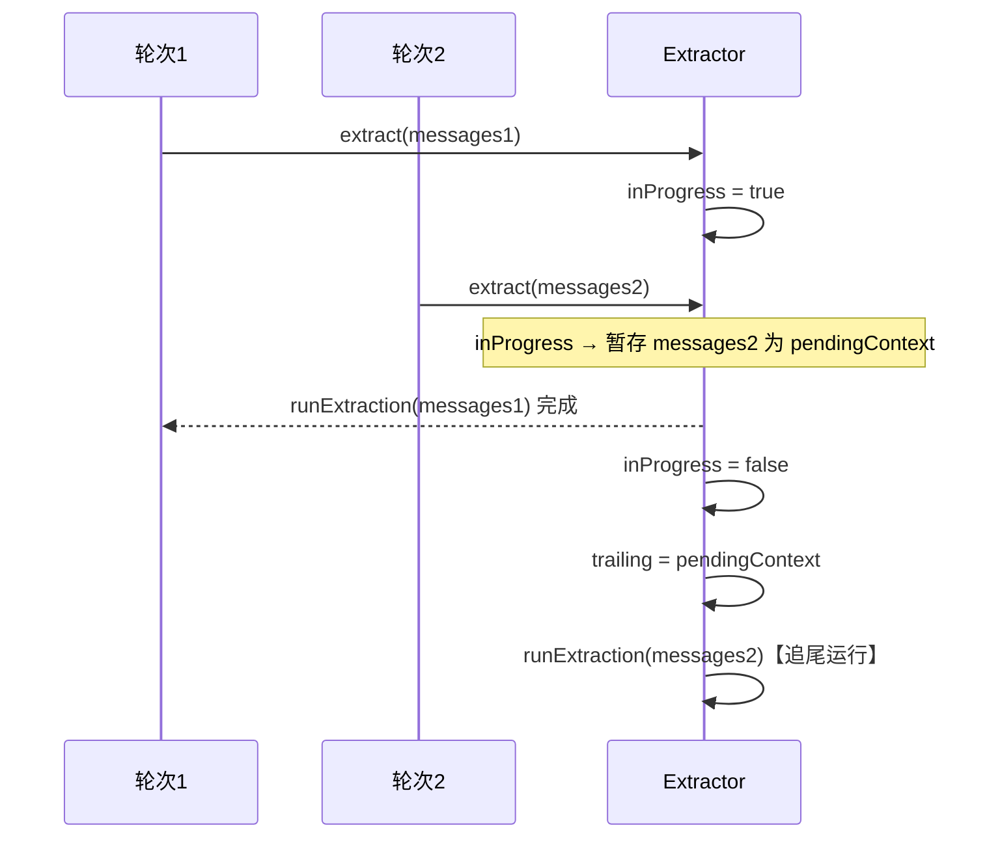

# 第 11 章：状态管理与上下文

## 目录

1. [概述](#1-概述)
2. [极简 Store](#2-极简-store)
3. [AppState 结构](#3-appstate-结构)
4. [引导状态——全局单例](#4-引导状态全局单例)
5. [上下文系统](#5-上下文系统)
6. [上下文压缩](#6-上下文压缩)
7. [会话记忆](#7-会话记忆)
8. [自动记忆提取](#8-自动记忆提取)
9. [记忆类型](#9-记忆类型)
10. [动手实践：构建上下文管理器](#10-动手实践构建上下文管理器)
11. [关键要点与下一步](#11-关键要点与下一步)

---

## 1. 概述

AI Agent 会话并非无状态。从第一条用户消息到最终响应，Claude Code 维护着一张丰富的状态网络：当前对话消息、权限设置、MCP 服务器连接、任务进度、UI 标志，以及一个不断增长的上下文窗口——它最终会触碰模型的硬性 token 上限。

良好的状态管理，是 Agent 在漫长编码会话中保持连贯性，而非每隔几轮就"遗忘"上下文的关键所在。

本章从头到尾剖析 Claude Code 的状态管理层：

- 一个驱动整个 UI 的**极简响应式 Store**（34 行 TypeScript）
- 一个整合所有运行时数据的**扁平 AppState 类型**（约 360 行）
- 一个向每次对话注入环境信息与用户指令的**双层上下文系统**
- 一套将 token 用量控制在限额内的**多阈值压缩流水线**
- 一个维护对话滚动 Markdown 日志的 **Session Memory 服务**
- 一个在每次查询循环结束时提炼持久事实的**自动记忆提取 Agent**



---

## 2. 极简 Store

### 源码：`src/state/store.ts`（34 行）

整个 UI 响应系统建立在一个 34 行的文件之上。没有 Redux，没有 MobX，没有 Zustand——只有闭包。

```typescript
// src/state/store.ts:1-34
type Listener = () => void
type OnChange<T> = (args: { newState: T; oldState: T }) => void

export type Store<T> = {
  getState: () => T
  setState: (updater: (prev: T) => T) => void
  subscribe: (listener: Listener) => () => void
}

export function createStore<T>(
  initialState: T,
  onChange?: OnChange<T>,
): Store<T> {
  let state = initialState
  const listeners = new Set<Listener>()

  return {
    getState: () => state,

    setState: (updater: (prev: T) => T) => {
      const prev = state
      const next = updater(prev)
      if (Object.is(next, prev)) return       // ← 浅比较，提前退出
      state = next
      onChange?.({ newState: next, oldState: prev })
      for (const listener of listeners) listener()
    },

    subscribe: (listener: Listener) => {
      listeners.add(listener)
      return () => listeners.delete(listener)  // ← 返回取消订阅函数
    },
  }
}
```

### 设计决策

**函数式更新器 `(prev => next)`** — 每次 `setState` 调用都会接收当前状态作为参数。这避免了调用方捕获旧状态快照时的"过期闭包"问题。

**`Object.is` 变更检测** — JavaScript 的 `===` 有两个反直觉行为：`NaN !== NaN` 且 `-0 === +0`。`Object.is` 修正了这两点：同一对象引用时直接短路，避免不必要的监听器通知和 React 重渲染。

**`Set<Listener>` 去重** — 若组件意外注册了同一监听器两次，`Set` 会静默去重。取消订阅函数调用 `listeners.delete(listener)`，无论 Set 大小均为 O(1)。

**`onChange` 回调处理副作用** — 可选的 `onChange` 在监听器之前触发，让外部观察者（分析、持久化）在 UI 重渲染前同时看到新旧状态。



---

## 3. AppState 结构

### 源码：`src/state/AppStateStore.ts:89-452`

`AppState` 是会话期间所有变化数据的单一真相来源。它对大部分字段使用 `DeepImmutable<{}>` 强制不可变性，同时将含有函数类型的 `tasks` 和 `agentNameRegistry` 排除在该包装器之外。

约 360 个字段按逻辑分组如下：



### 字段分类详解

**UI 与显示**（`src/state/AppStateStore.ts:94-108`）：
```typescript
statusLineText: string | undefined
expandedView: 'none' | 'tasks' | 'teammates'
isBriefOnly: boolean
footerSelection: FooterItem | null
spinnerTip?: string
```

**模型配置**（`src/state/AppStateStore.ts:93`）：
```typescript
mainLoopModel: ModelSetting        // null = 默认，string = 覆盖
mainLoopModelForSession: ModelSetting
thinkingEnabled: boolean | undefined
effortValue?: EffortValue
fastMode?: boolean
```

**权限上下文**（`src/state/AppStateStore.ts:109`）：
```typescript
toolPermissionContext: ToolPermissionContext
denialTracking?: DenialTrackingState
activeOverlays: ReadonlySet<string>
```

**团队与收件箱**（`src/state/AppStateStore.ts:323-361`）：
```typescript
teamContext?: {
  teamName: string
  teammates: { [id: string]: TeammateInfo }
  isLeader?: boolean
}
inbox: { messages: InboxMessage[] }
agentNameRegistry: Map<string, AgentId>  // name → ID，供 SendMessage 路由
```

**推测执行（预计算）**（`src/state/AppStateStore.ts:52-79`）：
```typescript
speculation: SpeculationState   // idle | active（预运行可能的下一个工具调用）
speculationSessionTimeSavedMs: number
```

### `getDefaultAppState()`

`src/state/AppStateStore.ts:456-569` 构造初始状态。有一个值得注意的细节：它在函数体内使用 `require()` 来避免 `AppStateStore` 与 `teammate.ts` 之间的循环导入：

```typescript
// src/state/AppStateStore.ts:459-465
const teammateUtils =
  require('../utils/teammate.js') as typeof import('../utils/teammate.js')
const initialMode: PermissionMode =
  teammateUtils.isTeammate() && teammateUtils.isPlanModeRequired()
    ? 'plan'
    : 'default'
```

---

## 4. 引导状态——全局单例

### 源码：`src/bootstrap/state.ts`

`AppState` 持有 UI 和对话状态，而 `bootstrap/state.ts` 持有**进程级单例**，这些单例必须在 React 挂载之前就存在：遥测计量器、会话 ID、成本计数器、API 凭据、`originalCwd`。

```typescript
// src/bootstrap/state.ts:45-100（简化版）
type State = {
  originalCwd: string
  projectRoot: string          // 稳定——启动时设置一次，会话中不再更新
  totalCostUSD: number
  sessionId: SessionId
  isInteractive: boolean
  modelUsage: { [modelName: string]: ModelUsage }
  // ... 遥测计数器、OAuth token、SDK betas ...
}
```

文件顶部的注释非常明确：**"DO NOT ADD MORE STATE HERE — BE JUDICIOUS WITH GLOBAL STATE"**（`src/bootstrap/state.ts:31`）。该模块刻意保持精简，因为其中的状态对 React 不可见，也难以测试。

### 隔离原则

引导状态与 AppState 保持分离是有原因的：

| | `bootstrap/state.ts` | 通过 `createStore` 的 `AppState` |
|---|---|---|
| 生命周期 | 进程生命周期 | 会话/React 渲染生命周期 |
| 可见性 | React 不可见 | 通过 `subscribe` 触发 React 响应 |
| 可测试性 | 难以重置 | 用 `getDefaultAppState()` 获取新状态 |
| 内容 | 凭据、遥测 | UI 标志、消息、权限 |



---

## 5. 上下文系统

### 源码：`src/context.ts`

在第一次 API 调用之前，Claude Code 组装两个上下文映射，将其添加到系统提示词前面，并在会话期间缓存。

```typescript
// src/context.ts:116-150
export const getSystemContext = memoize(
  async (): Promise<{ [k: string]: string }> => {
    const gitStatus =
      isEnvTruthy(process.env.CLAUDE_CODE_REMOTE) ||
      !shouldIncludeGitInstructions()
        ? null
        : await getGitStatus()

    return {
      ...(gitStatus && { gitStatus }),
    }
  },
)

// src/context.ts:155-189
export const getUserContext = memoize(
  async (): Promise<{ [k: string]: string }> => {
    const claudeMd = shouldDisableClaudeMd
      ? null
      : getClaudeMds(filterInjectedMemoryFiles(await getMemoryFiles()))
    setCachedClaudeMdContent(claudeMd || null)

    return {
      ...(claudeMd && { claudeMd }),
      currentDate: `Today's date is ${getLocalISODate()}.`,
    }
  },
)
```

### `getGitStatus()` 收集的信息

```typescript
// src/context.ts:61-104
const [branch, mainBranch, status, log, userName] = await Promise.all([
  getBranch(),
  getDefaultBranch(),
  execFileNoThrow(gitExe(), ['--no-optional-locks', 'status', '--short'], ...),
  execFileNoThrow(gitExe(), ['--no-optional-locks', 'log', '--oneline', '-n', '5'], ...),
  execFileNoThrow(gitExe(), ['config', 'user.name'], ...),
])
```

结果上限为 2000 个字符（`MAX_STATUS_CHARS = 2000`，第 20 行），超出时附加截断提示。

### 记忆化与缓存失效

两个函数都使用 `lodash-es/memoize`。会话期间缓存不会被主动失效（上下文在会话启动时固定），除非调用 `setSystemPromptInjection()` 进行缓存破坏实验：

```typescript
// src/context.ts:29-34
export function setSystemPromptInjection(value: string | null): void {
  systemPromptInjection = value
  getUserContext.cache.clear?.()
  getSystemContext.cache.clear?.()
}
```



---

## 6. 上下文压缩

### 源码：`src/services/compact/autoCompact.ts`

上下文窗口是有限的。Claude Code 用四阈值系统管理它，随着 token 用量增长，逐步触发更强的干预措施。

### 四个阈值

```typescript
// src/services/compact/autoCompact.ts:62-65
export const AUTOCOMPACT_BUFFER_TOKENS       = 13_000
export const WARNING_THRESHOLD_BUFFER_TOKENS = 20_000
export const ERROR_THRESHOLD_BUFFER_TOKENS   = 20_000
export const MANUAL_COMPACT_BUFFER_TOKENS    = 3_000
```

设有效上下文窗口为 `W`（模型上下文窗口减去 2 万个输出保留 token）：

| 阈值 | 公式 | 动作 |
|---|---|---|
| Warning（警告） | `W - WARNING_THRESHOLD_BUFFER_TOKENS` | UI 显示黄色指示器 |
| Error（错误） | `W - ERROR_THRESHOLD_BUFFER_TOKENS` | 显示红色警告 |
| AutoCompact（自动压缩） | `W - AUTOCOMPACT_BUFFER_TOKENS` | 触发后台压缩 |
| Blocking（阻塞） | `W - MANUAL_COMPACT_BUFFER_TOKENS` | 拒绝新提示词 |



### 自动压缩决策流

```typescript
// src/services/compact/autoCompact.ts:241-351
export async function autoCompactIfNeeded(...): Promise<{
  wasCompacted: boolean
  consecutiveFailures?: number
}> {
  // 1. 电路熔断器——连续失败 3 次后停止
  if (tracking?.consecutiveFailures >= MAX_CONSECUTIVE_AUTOCOMPACT_FAILURES) {
    return { wasCompacted: false }
  }

  // 2. 检查阈值
  if (!(await shouldAutoCompact(messages, model, querySource))) {
    return { wasCompacted: false }
  }

  // 3. 优先尝试 Session Memory 压缩（更廉价——无需 LLM 调用）
  const sessionMemoryResult = await trySessionMemoryCompaction(
    messages, agentId, autoCompactThreshold,
  )
  if (sessionMemoryResult) {
    return { wasCompacted: true, compactionResult: sessionMemoryResult }
  }

  // 4. 回退到传统 LLM 摘要压缩
  try {
    const result = await compactConversation(messages, toolUseContext, ...)
    return { wasCompacted: true, compactionResult: result, consecutiveFailures: 0 }
  } catch (error) {
    return { wasCompacted: false, consecutiveFailures: prevFailures + 1 }
  }
}
```

### 电路熔断器

`consecutiveFailures` 计数器（`MAX_CONSECUTIVE_AUTOCOMPACT_FAILURES = 3`）防止当上下文无法恢复时无限重试 API 调用。如果没有它，连续 50+ 次失败的会话每天会浪费约 25 万次 API 调用（`autoCompact.ts:68-70` 中的注释）。

### 递归守卫

压缩本身会运行一个 Fork Agent。`shouldAutoCompact()` 明确防范嵌套压缩：

```typescript
// src/services/compact/autoCompact.ts:170-172
if (querySource === 'session_memory' || querySource === 'compact') {
  return false
}
```

---

## 7. 会话记忆

### 源码：`src/services/SessionMemory/sessionMemory.ts`

Session Memory 维护一个 Markdown 文件（`.claude/tmp/<sessionId>/session-memory.md`），用于汇总当前对话。当该文件可用时，它是**首选的压缩来源**——使用它可以避免昂贵的 LLM 摘要调用。

### 架构



### 提取阈值

```typescript
// src/services/SessionMemory/sessionMemoryUtils.ts（DEFAULT_SESSION_MEMORY_CONFIG）
{
  minimumMessageTokensToInit: 10_000,   // 首次提取前的 token 数
  minimumTokensBetweenUpdate: 5_000,    // 两次更新之间的 token 增量
  toolCallsBetweenUpdates: 10,          // 两次更新之间的工具调用次数
}
```

`shouldExtractMemory()`（`sessionMemory.ts:134-181`）要求：

1. **初始化阈值** — 上下文 token 总数超过 `minimumMessageTokensToInit`
2. **Token 增量** — 自上次提取以来上下文增长了至少 `minimumTokensBetweenUpdate`
3. **触发条件**（满足其一）：
   - Token 增量 **且** 工具调用次数都超过阈值
   - Token 增量阈值满足 **且** 最后一轮助手消息没有工具调用（自然断点）

Token 阈值是**始终必须满足的**。仅靠工具调用次数无法触发提取。

### 串行写保护

```typescript
// src/services/SessionMemory/sessionMemory.ts:272
const extractSessionMemory = sequential(async function (context) { ... })
```

`sequential()`（`src/utils/sequential.ts`）包装一个异步函数，使并发调用排队而非并行执行。这防止了两个 Fork Agent 同时写入同一个 Session Memory 文件。

### Fork Agent 的工具权限

提取 Agent 使用严格的权限集（`createMemoryFileCanUseTool`，第 460-481 行）：

```typescript
// 只允许对特定记忆文件路径执行 FileEdit
if (tool.name === FILE_EDIT_TOOL_NAME && filePath === memoryPath) {
  return { behavior: 'allow', updatedInput: input }
}
return { behavior: 'deny', message: `only ${FILE_EDIT_TOOL_NAME} on ${memoryPath} is allowed` }
```

---

## 8. 自动记忆提取

### 源码：`src/services/extractMemories/extractMemories.ts`

Session Memory 汇总*当前对话*，而 Auto Memory 提取的是*跨会话持久存在*的事实。它在每次完整查询循环结束时运行（即模型产生无工具调用的最终响应后）。

### 闭包作用域的状态模式

所有状态都存在于由 `initExtractMemories()` 创建的闭包中，而非模块级变量：

```typescript
// src/services/extractMemories/extractMemories.ts:296-320
export function initExtractMemories(): void {
  const inFlightExtractions = new Set<Promise<void>>()
  let lastMemoryMessageUuid: string | undefined
  let inProgress = false
  let turnsSinceLastExtraction = 0
  let pendingContext: { context; appendSystemMessage? } | undefined

  // ... runExtraction, executeExtractMemoriesImpl ...
}
```

这种模式（`confidenceRating.ts` 也使用了它）让单元测试极为简单：在 `beforeEach` 中调用 `initExtractMemories()` 即可获得完全空白的闭包状态。

### 追尾运行（Trailing Run）模式

如果一次新的提取请求在上一次进行中到达，最新的上下文会被暂存为 `pendingContext`。当前运行完成后，会处理这个追尾上下文：



只有**最新**暂存的上下文会被处理。若三次轮次在同一次运行中到达，只保留第三次——它包含了前两次会看到的所有消息。

### 与主 Agent 的互斥机制

主 Agent 的系统提示词也有记忆保存指令。为避免重复写入：

```typescript
// src/services/extractMemories/extractMemories.ts:348-359
if (hasMemoryWritesSince(messages, lastMemoryMessageUuid)) {
  // 推进游标，跳过 Fork Agent
  logEvent('tengu_extract_memories_skipped_direct_write', ...)
  return
}
```

`hasMemoryWritesSince()` 扫描助手消息中的 FileEdit/FileWrite `tool_use` 块，查找指向 `isAutoMemPath()` 内路径的操作。

### Fork Agent 的约束

提取 Agent 获得 `createAutoMemCanUseTool(memoryDir)` 权限集（`extractMemories.ts:171-222`）：

| 工具 | 权限 |
|---|---|
| FileRead、Grep、Glob | 无限制 |
| Bash | 只读命令（`isReadOnly` 检查） |
| FileEdit / FileWrite | 仅限自动记忆目录内的路径 |
| 其他所有工具 | 拒绝 |

Agent 还被限制为最多 **5 轮**（`maxTurns: 5`），因为行为良好的提取通常在 2-4 轮内完成。

---

## 9. 记忆类型

### 源码：`src/memdir/memoryTypes.ts:14-21`

Claude Code 定义了恰好四种记忆类型。这个分类刻意保持精简——早期版本拥有更多类型，但在评估中造成了更多混乱而非帮助。

```typescript
export const MEMORY_TYPES = [
  'user',
  'feedback',
  'project',
  'reference',
] as const
```

每条记忆存储为带有 YAML 前置元数据的 Markdown 文件：

```markdown
---
name: user_role
description: 用户是专注于 AI 工具的 TypeScript 工程师
type: user
---

用户是构建 AI Agent 工具的 TypeScript 工程师。
```

### 类型语义

| 类型 | 内容 | 何时保存 |
|---|---|---|
| `user` | 角色、目标、专业水平 | 了解用户是谁时 |
| `feedback` | 工作方式指导——纠正和验证 | 纠正（"别这样"）和已验证的选择 |
| `project` | git 中不体现的进行中工作、决策、事件 | 了解谁在做什么及原因时 |
| `reference` | 外部系统的指针（Linear、Grafana、Slack） | 了解信息存储位置时 |

### 不应保存的内容

来自 `src/memdir/memoryTypes.ts:183-195`：

- 代码模式、架构、文件路径——可从当前项目状态推导
- Git 历史、谁改了什么——`git log` 是权威来源
- 调试配方——修复在代码中；上下文在提交信息里
- CLAUDE.md 文件中已有的内容
- 临时的进行中工作或对话状态

### 记忆目录结构

```
~/.claude/
  projects/
    <sanitized-git-root>/
      memory/
        MEMORY.md          ← 索引文件（指向主题文件的指针）
        user_role.md
        feedback_terse.md
        project_auth_rewrite.md
      logs/
        2026/04/2026-04-01.md   ← 助手模式每日日志
  tmp/
    <sessionId>/
      session-memory.md   ← 会话作用域（退出时删除）
```

`getAutoMemPath()`（`src/memdir/paths.ts:223-235`）按优先级顺序解析记忆目录：

1. `CLAUDE_COWORK_MEMORY_PATH_OVERRIDE` 环境变量（Cowork 空间作用域挂载）
2. `settings.json` 中的 `autoMemoryDirectory`（受信任来源：policy/local/user——不含项目设置）
3. `~/.claude/projects/<sanitized-git-root>/memory/`

---

## 10. 动手实践：构建上下文管理器

示例文件 `examples/11-state-context/context-manager.ts` 用约 350 行带有详细注释的 TypeScript 实现了本章的所有模式。

### 运行示例

```bash
cd examples/11-state-context
npx ts-node context-manager.ts
# 或
bun run context-manager.ts
```

### 示例内容概览

**1. 带 Object.is 的极简 Store**

```typescript
const store = createStore<AppState>(defaultState)
const unsubscribe = store.subscribe(() => console.log('state changed'))

// 函数式更新器避免过期闭包
store.setState(prev => ({ ...prev, tokenCount: prev.tokenCount + 100 }))

// 同一引用 → Object.is → 不触发监听器
const s = store.getState()
store.setState(() => s)  // 静默——不发出通知
```

**2. 上下文收集**

```typescript
const [system, user] = await Promise.all([
  getSystemContext(),  // git 状态、平台信息
  getUserContext(),    // CLAUDE.md、当前日期
])
// 两者均已记忆化——后续调用立即返回
```

**3. 阈值计算**

```typescript
const state = calculateTokenWarningState(
  185_000,   // 当前 token 用量
  200_000,   // 上下文窗口
  true,      // 启用自动压缩
)
// { isAboveWarningThreshold: true, isAboveAutoCompactThreshold: true, ... }
```

**4. Session Memory 服务**

```typescript
const sm = new SessionMemoryService({ minimumMessageTokensToInit: 10_000 })
const shouldExtract = sm.shouldExtract(messages, currentTokens)
if (shouldExtract) {
  await sm.enqueueExtraction(messages, currentTokens, memoryPath)
}
```

**5. 带追尾运行的 Auto Memory**

```typescript
const extractor = initAutoMemoryExtractor()
// 轮次 1：开始提取
await extractor.extract(messages1)  // inProgress = true

// 轮次 2（在轮次 1 进行中到达）：暂存为 pendingContext
await extractor.extract(messages2)  // 将作为追尾提取运行

await extractor.drain()  // 退出前等待所有进行中的提取
```

**6. 类型化记忆记录**

```typescript
saveMemory({
  name: 'feedback_terse',
  description: '用户偏好简洁响应',
  type: 'feedback',
  body: '保持响应简洁。\n\n**Why:** 用户说"我能读 diff"\n\n**How to apply:** 工具使用后跳过总结段落。',
})
```

---

## 11. 关键要点与下一步

### 关键要点

**Store 层的极简性** — `createStore` 只有 34 行。其威力来自与 React 渲染模型的组合，而非 Store 本身。当你需要为 Agent 循环管理状态时，从这里开始：一个闭包、一个 `Set<Listener>`、加上 `Object.is`。

**两个状态层的关注点分离** — Bootstrap State（`bootstrap/state.ts`）持有进程级单例（凭据、遥测、会话 ID）。AppState（`AppStateStore.ts`）持有会话级响应式数据。混用两者会导致循环导入和可测试性问题。

**记忆化上下文优于重复收集** — `getSystemContext()` 和 `getUserContext()` 被记忆化，因为它们的来源（git、文件系统）读取代价高昂。权衡是上下文是会话启动时的快照。这是明确且有意的设计。

**四个阈值，两条回退路径** — 压缩系统是分层的。Session Memory 压缩（无需 LLM 调用，使用现有笔记）优先尝试。传统 LLM 摘要是回退。电路熔断器防止结构上不可能的压缩浪费 API 调用。

**闭包作用域状态提升可测试性** — `initExtractMemories()` 创建新闭包而非使用模块级变量。这种模式让 `beforeEach(() => initExtractMemories())` 就足以重置测试间的所有状态。

**四种记忆类型，严格排除** — 分类体系（user / feedback / project / reference）刻意保持精简。排除列表（不保存代码模式、不保存 git 历史、不保存临时状态）与包含标准同样重要。

### 下一步

第 12 章涵盖高级特性：推测执行（预运行可能的工具调用）、ultraplan 模式、计算机使用，以及在上下文达到窗口 90% 时取代自动压缩的上下文折叠系统。

---

*本章引用的源文件：*
- `src/state/store.ts` — 极简 Store，34 行
- `src/state/AppStateStore.ts` — 完整 AppState 类型与 `getDefaultAppState()`
- `src/bootstrap/state.ts` — 进程级单例状态
- `src/context.ts` — `getSystemContext()`、`getUserContext()`、`getGitStatus()`
- `src/services/compact/autoCompact.ts` — Token 阈值与 `autoCompactIfNeeded()`
- `src/services/SessionMemory/sessionMemory.ts` — Session Memory 提取与压缩
- `src/services/compact/sessionMemoryCompact.ts` — `trySessionMemoryCompaction()`
- `src/services/extractMemories/extractMemories.ts` — 自动记忆提取
- `src/memdir/memoryTypes.ts` — 记忆类型分类体系
- `src/memdir/paths.ts` — `getAutoMemPath()`、`isAutoMemoryEnabled()`
